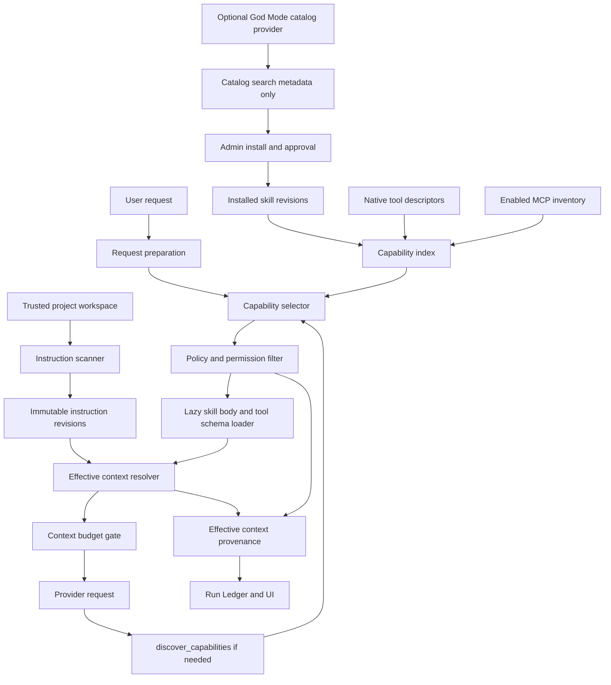

# Skills and Project Instructions Implementation Plan

> **For Hermes:** Use `subagent-driven-development` to implement this plan task-by-task only after Luis approves the open decisions. Planning only: do not implement other Deferred capabilities.

**Goal:** Turn Archon's current in-memory keyword skills into a durable, scoped, versioned, progressively disclosed Skills + Project Instructions system with deterministic assembly, supply-chain controls, capability discovery across native tools/MCP, and observable provenance.

**Architecture:** Introduce four separate contracts: trusted project workspace/instruction sources, durable versioned skill packages, a deterministic effective-context resolver, and a metadata-first capability index. Project instructions remain durable project context; skills remain task-specific guidance; native tools and MCP remain executable capabilities governed by the existing policy/approval layer. Large catalogs are searched, not injected.

**Tech stack:** FastAPI, Pydantic, SQLAlchemy/PostgreSQL, Alembic, existing `SecureToolRegistry`, existing MCP inventory/runtime, SvelteKit, pytest, Playwright, existing context/deadline/budget/evidence infrastructure.

---

## 1. Scope decision

This plan covers only:

1. Project/workspace instructions.
2. Durable, versioned, scoped skills.
3. Metadata-first discovery and progressive disclosure.
4. A unified searchable capability index over installed skills, native tools, and enabled MCP tools.
5. Effective-context provenance, permissions visibility, APIs, UI, tests, and interview evidence.

The other seven Deferred capabilities remain out of scope.

### Explicit non-goals

- No generic marketplace.
- No import of hundreds of skills into runtime context.
- No arbitrary GitHub URL elevated directly to `SYSTEM`.
- No automatic execution of scripts embedded in skills.
- No new distributed-agent system.
- No new model-serving, fine-tuning, Kubernetes/public deployment, anonymous sharing, or autonomous production optimization work.
- No arbitrary host filesystem access chosen by the model.
- No public MCP marketplace, arbitrary unreviewed servers, generic OAuth platform, sampling, elicitation, or Archon-as-MCP-server mode in this epic. The approved expansion is stdio plus remote Streamable HTTP with governed discovery, protected credential references, health/reconnect, lazy schema loading, permissions and provenance.
- No claim that textual contradiction detection is solved semantically. The runtime proves structural precedence and external policy enforcement, not perfect natural-language conflict understanding.

---

## 2. Verified current state

Repository inspected read-only:

```text
Repo: /Users/luisvalencia/Documents/archon
Branch: main
HEAD: 63215bfad588753d689e91d33eda815fb1cf208a
Worktree: clean
```

### Native tools actually wired live

Approximately eleven native capabilities are registered per request:

- `calculator`
- `datetime`
- `web_search`
- `read_file`
- `write_file`
- `image_gen`
- `memory` when encrypted scoped memory is available
- `session_search`
- `code_execute` when sandbox preflight succeeds
- `terminal` when sandbox preflight succeeds
- `background_task` for list/status

Enabled MCP tools are additionally converted to `mcp_<server>_<tool>` and registered into the same `SecureToolRegistry`.

`list_directory` exists in `backend/app/tools/builtin.py` but is not part of the live per-request registry. Two divergent native-tool registration paths currently exist.

### Skills actually wired live

Only three built-in skills exist:

- `research-assistant`
- `code-analysis`
- `data-extraction`

Current behavior:

1. Global in-memory singleton registry.
2. Lexical keyword search.
3. Global `top_k`, default 3.
4. Entire selected skill body concatenated into the system message.
5. Selected names stored in context provenance, but no source/revision/hash.
6. Remote import fetches a mutable GitHub branch/path and directly registers content.
7. Imported/custom skills disappear on restart.
8. No owner/project isolation.
9. UI top-k calls the wrong endpoint.

### MCP actual state

MCP is significantly more mature than skills:

- owner/project-scoped durable inventory;
- official stdio MCP SDK client;
- discovery and enable/disable;
- newly discovered tools disabled by default;
- schema hash and TOCTOU revalidation;
- risk classification and approval;
- shared execution through `SecureToolRegistry`.

But canonical deployment currently has no product loader for allowlisted `mcp_profiles`, so `/api/mcp/profiles` is empty outside tests. This plan includes only the minimum loader needed to make existing governed MCP inventory usable; it does not expand MCP transports.

### Project instructions actual state

No runtime implementation exists. There is no workspace registry, instruction revision model, hierarchical loader, precedence resolver, or instruction provenance.

---

## 3. Patterns to adopt selectively

| Source | Pattern to adopt | Do not copy blindly |
|---|---|---|
| Hermes | Skill index with on-demand `skill_view`; project-owned provenance; references loaded lazily; toolsets | Hundreds of installed skills or profile-specific local paths as a product dependency |
| Claude Code | Small `CLAUDE.md`; path-scoped rule files; permissions separate from prose; MCP tool search | Product-specific syntax or claims of identical precedence semantics |
| Codex | Root-to-leaf `AGENTS.md`; explicit override file; bounded instruction bytes; repo trust | Direct implementation/code without license review |
| OpenCode | Discover/select/authorize separation; `allow/ask/deny`; skill compatibility adapters; tool filtering | Enabling all MCP servers/schemas in every prompt |
| Agent God Mode | Large searchable catalog and metadata index | Hard dependency on Luis's `/home/luis/repos/agent-god-mode` path or importing the whole vault |

Archon writes its own contracts and content. External formats are compatibility adapters, not the internal canonical model.

---

## 4. Recommended product decisions

These are defaults pending Luis's explicit confirmation.

### D1. Workspace model: hybrid, trusted, snapshot-based

Use an explicit `ProjectWorkspace` record scoped by owner/project. A workspace references an administrator-configured mount key, not an arbitrary host path supplied by a user or model.

Supported sources for v1:

1. Manual/UI instruction documents.
2. Local read-only mounted workspace roots declared by deployment configuration.
3. GitHub repository files fetched only from an allowlisted repository at a pinned commit SHA.

Every resolved instruction becomes an immutable DB revision before use.

### D2. Internal canonical instruction format

Canonical Archon file:

```text
.archon/instructions.md
```

Compatibility readers:

- `AGENTS.override.md`
- `AGENTS.md`
- `CLAUDE.md`

At each directory, one configured format family wins. Do not silently concatenate equivalent root formats from multiple ecosystems.

### D3. Instruction traversal

Resolve from workspace root toward the target path:

1. root instruction;
2. intermediate directory instructions;
3. nearest target-directory instruction;
4. explicit override at the same level replaces the normal file for that level.

Apply limits to bytes, file count, import depth, cycle count, and resolved layers.

### D4. Precedence and permissions

Hard controls are never prose and cannot be granted by a skill or instruction:

```text
external security/policy engine
> stable system contract
> managed project instruction revisions, root to leaf
> project-pinned skills
> request-selected skills
> current user task
```

Interpretation:

- User text defines the immediate objective.
- Project instructions define durable project constraints and conventions.
- Skills provide procedures and cannot override project constraints.
- No text layer can grant file, network, execution, MCP, secret, deploy, commit, or messaging permission.
- If a user request conflicts with an explicit project constraint, the stable system contract requires reporting the conflict rather than silently choosing.
- Structural ordering is deterministic; semantic contradiction detection remains best-effort and must not be advertised as complete.

### D5. Trust and installation

- Admins approve/install external skill revisions and MCP profiles.
- Projects enable from the approved inventory.
- Users may search and request installation but cannot directly elevate arbitrary remote content.
- External skill source must be allowlisted and pinned to commit/version/digest.
- Content hash changes create a new disabled revision requiring review.

### D6. Progressive disclosure

Three levels:

1. Compact metadata index: name, description, triggers, negative triggers, required capabilities, risk, source, version.
2. Main skill manifest/body loaded only after selection.
3. References loaded only through a governed read operation when needed.

Skill scripts/assets are stored as inert metadata in v1. They are not executable merely because the skill references them.

### D7. Capability selection

- Small core descriptor set always available.
- Project-pinned capabilities preselected.
- Per-request selector retrieves relevant installed skills/tools/MCP descriptors.
- Permission filtering happens before schemas become visible.
- Only selected tool schemas are added to the provider request.
- A governed `discover_capabilities` meta-tool supports a second selection round when initial intent is insufficient.
- Discovery never implies authorization.

### D8. Agent God Mode integration

Implement a generic `SkillCatalogProvider` protocol with adapters:

- installed Archon catalog;
- allowlisted GitHub catalog/manifest;
- optional Agent God Mode index adapter.

The God Mode adapter is disabled unless explicitly configured and must return metadata/search results only. Installing a result still requires pinning, validation, review, and approval.

---

## 5. Initial curated inventory

Do not begin with hundreds of packages.

### Initial Archon-owned skills: 10

1. `technical-research`
2. `code-analysis`
3. `code-review`
4. `debugging`
5. `testing-tdd`
6. `secure-coding`
7. `architecture-design`
8. `rag-evaluation`
9. `deployment-readiness`
10. `technical-documentation`

Migrate or replace the current three defaults rather than retaining duplicated shallow content.

Each must include:

- positive triggers;
- negative triggers;
- prerequisites;
- main workflow;
- required capability IDs;
- side effects;
- references index;
- source/owner/version/hash;
- test queries that should and should not select it.

### Native tools

Do not add a broad new set. Consolidate the existing live inventory and decide explicitly whether `list_directory` joins it. Add only control-plane tools required by this epic:

- `discover_capabilities`
- `load_skill_reference`

These tools expose only authorized metadata/content and do not bypass normal policy.

### MCP

Extend the existing governed inventory without turning it into a marketplace. Add:

- deployment loader for allowlisted stdio and remote Streamable HTTP profiles;
- remote endpoint validation: HTTPS by default, explicit development exception for loopback only;
- credential references resolved from protected runtime configuration; never persist or return raw authorization headers;
- startup/connect/tool-call timeouts, health state and bounded reconnect/backoff;
- searchable compact descriptors;
- pre-context permission filtering;
- project pinning and per-request selection;
- lazy schema materialization;
- source/profile/schema-hash provenance and execution-time TOCTOU revalidation.

No generic public MCP marketplace, arbitrary package execution, generic OAuth platform, sampling, elicitation, resources/prompts support, or Archon-as-MCP-server mode in v1.

---

## 6. Target architecture



---

## 7. Data model

### `project_workspaces`

- `id`
- `owner_id`
- `project_id`
- `display_name`
- `source_type`: `manual | mounted_local | github_pinned`
- `mount_key` or repository identifier; never arbitrary unvalidated path
- `repository_url`
- `pinned_commit`
- `trust_state`: `untrusted | pending | trusted | revoked`
- `instruction_family`: `archon | agents | claude`
- timestamps

Unique: `(owner_id, project_id)`.

### `project_instruction_revisions`

- `id`
- `workspace_id`
- `relative_path`
- `scope_path`
- `source_kind`
- `revision`
- `content_hash`
- `content`
- `byte_count`
- `trust_state`
- `supersedes_id`
- timestamps

Unique: `(workspace_id, relative_path, revision)` and `(workspace_id, content_hash)` where appropriate.

### `skill_packages`

- stable `id`
- canonical `name`
- owner scope: `archon | managed | external`
- description/triggers/negative triggers/tags
- risk metadata
- lifecycle state

### `skill_revisions`

- `id`
- `skill_id`
- semantic or monotonic version
- source type, URL, repository, pinned commit/path
- content hash
- manifest/body
- reference manifest
- required capability IDs
- scan/review state
- timestamps

### `project_skill_bindings`

- owner/project
- skill revision
- state: `pinned | available | disabled`
- invocation mode: `always | auto | explicit_only`
- priority
- approval metadata

### `capability_descriptors`

A normalized read model, not a second execution registry:

- stable capability ID
- kind: `skill | native_tool | mcp_tool`
- name/description/domain/tags
- risk classes
- permission state
- source/version/schema hash
- compact estimated context cost
- project pin state

The execution sources of truth remain `SecureToolRegistry`, `MCPRepository`, and durable skill revisions.

### MCP persistence extension

Extend the existing MCP server/profile model with:

- `transport`: `stdio | streamable_http`;
- approved profile ID and non-secret endpoint origin metadata;
- protected `credential_ref`, never a raw token/header;
- TLS/redirect policy;
- connect, discovery and call timeouts;
- health/reconnect state;
- protocol/server version metadata where available;
- source/profile/config/schema hashes.

Public API responses expose stable IDs and health only; they do not expose commands, environment, full endpoints, headers or credential references.

### Provenance extension

Extend the effective-context manifest with:

- workspace ID/trust state;
- instruction revision IDs, paths, hashes, scope and order;
- skill revision IDs, hashes, selection reason and score;
- candidate/selected/rejected capability IDs;
- tool/MCP schema hashes exposed to the model;
- effective permission rule IDs;
- bytes/tokens consumed by each context layer;
- truncation/omission reasons.

Do not store secrets, raw tool arguments/results, or hidden chain-of-thought.

---

## 8. API surface

### Project workspace and instructions

- `POST /api/projects/{project_id}/workspace`
- `GET /api/projects/{project_id}/workspace`
- `POST /api/projects/{project_id}/workspace/scan`
- `GET /api/projects/{project_id}/instructions`
- `POST /api/projects/{project_id}/instructions`
- `GET /api/projects/{project_id}/instructions/revisions/{revision_id}`
- `POST /api/projects/{project_id}/instructions/resolve`
- `POST /api/projects/{project_id}/instructions/{revision_id}/approve`
- `POST /api/projects/{project_id}/instructions/{revision_id}/revoke`

### Skills

Refactor existing `/api/skills` into durable semantics:

- `GET /api/skills/catalog`
- `POST /api/skills/search`
- `POST /api/skills/install-request`
- `POST /api/skills/install/{candidate_id}/approve`
- `GET /api/skills/{skill_id}/revisions`
- `POST /api/projects/{project_id}/skills/{revision_id}/enable`
- `POST /api/projects/{project_id}/skills/{revision_id}/disable`
- `POST /api/projects/{project_id}/skills/{revision_id}/pin`
- `GET /api/projects/{project_id}/skills/effective`

Retain compatibility routes only with deprecation tests and no global mutable singleton.

### Capability discovery

- `POST /api/projects/{project_id}/capabilities/search`
- `GET /api/projects/{project_id}/capabilities/effective`
- `POST /api/projects/{project_id}/capabilities/{capability_id}/pin`
- `POST /api/projects/{project_id}/capabilities/{capability_id}/disable`
- `GET /api/runs/{run_id}/effective-context`

Every mutation requires auth, owner/project scope, CSRF where applicable, and rate limits.

---

## 9. UI surfaces

Extend Settings with project-scoped tabs or components:

1. **Workspace**
   - source type;
   - trust state;
   - pinned commit/mount key;
   - scan status;
   - no raw secrets or arbitrary command configuration.

2. **Project Instructions**
   - resolved root-to-leaf order;
   - scope paths;
   - revision/hash;
   - diff and approval/revocation;
   - warnings for size, cycle, unsupported format or conflict.

3. **Skills Catalog**
   - Installed, Available, Project Enabled;
   - source/provenance/version;
   - triggers and required capabilities;
   - enable/pin/explicit-only;
   - installation review workflow.

4. **Capabilities**
   - native tools, installed skills, MCP tools;
   - visible vs selected vs executable;
   - `allow/ask/deny` and approval requirement;
   - project pins.

5. **Run Ledger: Effective Context**
   - exact instruction/skill revisions;
   - selected/rejected capabilities and reasons;
   - schemas exposed;
   - context cost by layer;
   - no hidden reasoning.

Fix the existing skills top-k endpoint drift as part of replacing global top-k with project selection policy.

---

## 10. Implementation sequence

### Phase 0 — Freeze contracts and add RED characterization tests

#### Task 0.1: Document exact current runtime inventory

**Files:**
- Create: `docs/architecture/skills-project-instructions-contract.md`
- Test: `backend/tests/unit/test_live_capability_inventory.py`

Characterize the current native tool list and prove the divergent `register_builtin_tools` path. No behavior change.

#### Task 0.2: Characterize current skill injection and restart loss

**Files:**
- Test: `backend/tests/unit/test_skill_runtime_characterization.py`
- Test: `backend/tests/integration/test_skill_chat_wiring.py`

Prove sync/SSE selection, full-body injection, global scope, and loss on a new app instance.

#### Task 0.3: Add product-start MCP profile failure test

**Files:**
- Test: `backend/tests/integration/test_mcp_product_bootstrap.py`

Prove canonical `create_app()` currently exposes zero profiles and define the expected allowlisted loader contract.

### Phase 1 — Durable skill packages and supply-chain controls

#### Task 1.1: Add skill persistence schema

**Files:**
- Create: `backend/alembic/versions/<revision>_skill_packages.py`
- Create: `backend/app/skills/models.py`
- Create: `backend/app/skills/repository.py`
- Test: `backend/tests/unit/test_skill_repository.py`

Use owner/project-safe identifiers, immutable revisions and restart tests.

#### Task 1.2: Replace regex import with strict package parser

**Files:**
- Create: `backend/app/skills/package.py`
- Modify: `backend/app/skills/registry.py`
- Test: `backend/tests/unit/test_skill_packages.py`

Validate YAML frontmatter strictly; cap bytes/files/references; reject traversal, duplicate names, unknown mandatory fields and malformed content.

#### Task 1.3: Implement source trust and pinned imports

**Files:**
- Create: `backend/app/skills/sources.py`
- Create: `backend/app/skills/install_service.py`
- Test: `backend/tests/unit/test_skill_supply_chain.py`

Require allowlisted owner/repository plus commit SHA. Store source URL, commit, path, hash, license metadata and review state. Any hash change creates a disabled new revision.

#### Task 1.4: Migrate the initial ten Archon-owned skills

**Files:**
- Create: `backend/app/skills/bundled/<skill>/SKILL.md` for ten curated skills
- Create focused references only where required
- Test: `backend/tests/unit/test_bundled_skill_selection.py`

Test positive and negative activation queries. Do not copy third-party skill content verbatim.

### Phase 2 — Trusted project workspaces and instruction revisions

#### Task 2.1: Add workspace and instruction schema

**Files:**
- Create: `backend/alembic/versions/<revision>_project_instructions.py`
- Create: `backend/app/instructions/models.py`
- Create: `backend/app/instructions/repository.py`
- Test: `backend/tests/unit/test_instruction_repository.py`

#### Task 2.2: Add deployment-configured workspace roots

**Files:**
- Modify: `backend/app/config.py`
- Modify: `docker-compose.local.yml`
- Create: `backend/app/instructions/workspace.py`
- Test: `backend/tests/unit/test_trusted_workspace.py`

Use configured mount keys and canonical container paths. Reject arbitrary paths, symlinks, hardlinks where relevant, devices, sockets, FIFO, owner/project mismatch and mount escape.

#### Task 2.3: Implement instruction format adapters

**Files:**
- Create: `backend/app/instructions/loaders.py`
- Test: `backend/tests/unit/test_instruction_loaders.py`

Support canonical `.archon/instructions.md` and explicitly configured AGENTS/Claude compatibility. Enforce one family per directory, root-to-leaf traversal, overrides, byte/file/depth limits and cycle detection.

#### Task 2.4: Snapshot scanned content before runtime use

**Files:**
- Create: `backend/app/instructions/service.py`
- Test: `backend/tests/unit/test_instruction_snapshots.py`

Runtime uses approved immutable revisions, not mutable live files. A changed file becomes a pending revision and does not silently affect a run.

### Phase 3 — Deterministic effective-context resolver

#### Task 3.1: Create typed resolver

**Files:**
- Create: `backend/app/instructions/resolver.py`
- Create: `backend/app/runtime/effective_context.py`
- Test: `backend/tests/unit/test_instruction_precedence.py`

Return ordered typed blocks with source, scope, revision, hash, reason and context cost. Do not perform free-form semantic merging.

#### Task 3.2: Integrate once for both sync and SSE

**Files:**
- Modify: `backend/app/runtime/support.py`
- Modify: `backend/app/runtime/context.py`
- Refactor: `backend/app/routes/chat.py`
- Refactor: `backend/app/routes/stream.py`
- Test: `backend/tests/integration/test_effective_context_parity.py`

Move skill/instruction assembly out of route-local string concatenation. Sync and SSE call the same preparation service.

#### Task 3.3: Extend provenance snapshots

**Files:**
- Modify: `backend/app/runtime/context_provenance.py`
- Modify: `backend/app/services/context_snapshots.py`
- Add Alembic migration if normalized columns are required
- Test: `backend/tests/unit/test_context_provenance.py`

Store IDs/hashes/reasons/costs, never raw secrets or chain-of-thought.

### Phase 4 — Progressive skill and capability discovery

#### Task 4.1: Implement catalog provider protocol

**Files:**
- Create: `backend/app/skills/catalog.py`
- Create: `backend/app/skills/providers/installed.py`
- Create: `backend/app/skills/providers/github.py`
- Create: `backend/app/skills/providers/godmode.py`
- Test: `backend/tests/unit/test_skill_catalog_providers.py`

The God Mode provider is optional, config-gated and metadata-only. No fixed Luis-specific path in core code.

#### Task 4.2: Implement selector with budgets

**Files:**
- Create: `backend/app/capabilities/models.py`
- Create: `backend/app/capabilities/index.py`
- Create: `backend/app/capabilities/selector.py`
- Test: `backend/tests/unit/test_capability_selector.py`

Inputs: user intent, project pins, current path, allowed permissions and remaining context budget. Outputs: selected/rejected descriptors with stable reasons.

Start with deterministic metadata search and explicit scores. Semantic retrieval may be an adapter, not the only selector.

#### Task 4.3: Materialize only authorized schemas/content

**Files:**
- Modify: `backend/app/routes/chat.py::_create_tool_registry`
- Modify: `backend/app/mcp/runtime.py`
- Modify: `backend/app/runtime/factory.py`
- Test: `backend/tests/unit/test_capability_materialization.py`

Apply deny/disabled checks before schemas enter context. Keep execution-time TOCTOU revalidation.

#### Task 4.4: Add governed discovery tools

**Files:**
- Create: `backend/app/tools/capability_discovery.py`
- Modify live tool registry
- Test: `backend/tests/unit/test_capability_discovery_tools.py`

Implement:

- `discover_capabilities(query, kind?, limit?)`
- `load_skill_reference(skill_revision_id, reference_path)`

Results are scoped, bounded and metadata-safe. Discovery does not grant execution.

#### Task 4.5: Load governed MCP profiles from deployment configuration

**Files:**
- Modify: `backend/app/config.py`
- Create: `backend/app/mcp/profiles.py`
- Modify: `backend/app/main.py`
- Test: `backend/tests/integration/test_mcp_product_bootstrap.py`

Support allowlisted stdio and remote profile definitions with no commands, endpoints, headers or secrets exposed through public API responses. New tools remain disabled until discovery and project enablement.

#### Task 4.6: Add remote Streamable HTTP MCP client

**Files:**
- Modify: `backend/app/mcp/models.py`
- Create: `backend/app/mcp/http_client.py`
- Modify: `backend/app/mcp/inventory.py`
- Modify: `backend/app/mcp/runtime.py`
- Modify: `backend/app/mcp/repository.py`
- Add: Alembic migration for transport-safe endpoint/profile metadata
- Test: `backend/tests/unit/test_mcp_http_client.py`
- Test: `backend/tests/integration/test_mcp_http_runtime.py`

Implement official MCP Streamable HTTP initialization, paginated tool discovery and tool calls. Require HTTPS except explicit loopback development profiles. Resolve authorization through protected credential references, enforce connect/call/response limits, reject redirects to untrusted origins, redact stable errors, and implement bounded reconnect/backoff.

#### Task 4.7: Unify stdio and HTTP lifecycle/provenance

**Files:**
- Modify: `backend/app/mcp/client.py`
- Create: `backend/app/mcp/client_factory.py`
- Modify: `backend/app/mcp/runtime.py`
- Test: `backend/tests/unit/test_mcp_transport_policy.py`

Expose one runtime protocol for stdio and HTTP. Preserve transport/profile/source/schema hashes in provenance, keep newly discovered tools disabled, and revalidate the complete binding immediately before execution. Discovery remains separate from authorization.

### Phase 5 — APIs and UI

#### Task 5.1: Implement project workspace/instruction APIs

**Files:**
- Create: `backend/app/routes/project_instructions.py`
- Modify: `backend/app/main.py`
- Test: `backend/tests/integration/test_project_instructions_api.py`

#### Task 5.2: Refactor skill APIs to durable scoped semantics

**Files:**
- Modify: `backend/app/routes/skills.py`
- Remove global mutable `_registry` after compatibility window
- Test: `backend/tests/integration/test_skills_api.py`

Fix not-found/error response contracts and the top-k drift.

#### Task 5.3: Implement capability APIs

**Files:**
- Create: `backend/app/routes/capabilities.py`
- Test: `backend/tests/integration/test_capabilities_api.py`

#### Task 5.4: Build Settings surfaces

**Files:**
- Create/modify components under `frontend/src/lib/components/settings/`
- Modify: `frontend/src/routes/settings/+page.svelte`
- Create: `frontend/src/lib/project-instructions.ts`
- Create: `frontend/src/lib/capabilities.ts`
- Test: matching Vitest files
- Test: `frontend/tests/project-instructions.spec.ts`
- Test: `frontend/tests/capability-inventory.spec.ts`

Keep project scope visible. Do not create a generic marketplace UI.

#### Task 5.5: Add Run Ledger effective-context panel

**Files:**
- Modify Run Ledger components and typed client models
- Test with Vitest and Playwright

Show selected inputs and permissions without exposing hidden reasoning or secret values.

### Phase 6 — Adversarial, live and documentation gates

#### Task 6.1: Supply-chain and instruction adversarial suite

Test:

- mutable branch import rejected;
- commit mismatch;
- hash changed after approval;
- malicious YAML/frontmatter;
- oversized body/reference graph;
- traversal/import cycle;
- cross-owner/project access;
- symlink/hardlink/FIFO/device escape;
- project text attempting to grant denied tools;
- skill attempting to override project constraints;
- revoked revision mid-run;
- cancellation/deadline behavior;
- context-budget rejection before provider dispatch.

#### Task 6.2: Selection quality eval

Create a small versioned dataset:

- positive and negative query pairs per bundled skill;
- tool/MCP selection expectations;
- no-match cases;
- ambiguous cases;
- adversarial keyword stuffing.

Report precision/recall and false-positive budget. Do not claim universal semantic routing.

#### Task 6.3: Live Foundry acceptance

Against retained live deployment:

1. Register/authenticate test user.
2. Create trusted test project/workspace.
3. Approve one project instruction revision.
4. Pin one skill.
5. Run one query that must activate it.
6. Run one query that must not activate it.
7. Verify selected revision/hash in Run Ledger.
8. Verify denied capability is not exposed.
9. Verify one governed MCP tool if an allowlisted deterministic test profile is configured.
10. Prove provider/model remains Foundry/Claude Opus 4.6 and no mock fallback occurred.

#### Task 6.4: Documentation and generated evidence

Update canonical concept source, implementation evidence, capability acceptance, course coverage and Visual Learning generated manifest. Regenerate NotebookLM source packs from the final merged commit. Update the `archon-learning` handoff.

Only then change `skills-project-instructions` from `Deferred` to `Implemented`.

---

## 11. Required verification gates

Focused gates during implementation:

```bash
backend/.venv/bin/python -m pytest \
  backend/tests/unit/test_skill_repository.py \
  backend/tests/unit/test_skill_supply_chain.py \
  backend/tests/unit/test_instruction_repository.py \
  backend/tests/unit/test_instruction_precedence.py \
  backend/tests/unit/test_capability_selector.py -q
```

Integration gates:

```bash
backend/.venv/bin/python -m pytest \
  backend/tests/integration/test_skill_chat_wiring.py \
  backend/tests/integration/test_effective_context_parity.py \
  backend/tests/integration/test_project_instructions_api.py \
  backend/tests/integration/test_skills_api.py \
  backend/tests/integration/test_capabilities_api.py \
  backend/tests/integration/test_mcp_product_bootstrap.py \
  backend/tests/integration/test_mcp_http_runtime.py -q
```

Full release gates:

```bash
./scripts/verify.sh
```

Then GitHub CI on the exact PR head, live Foundry acceptance, NotebookLM regeneration, handoff update, adversarial review, and separate authorization for push/merge/deployment.

---

## 12. Criteria for `Deferred → Implemented`

All must be true:

- [ ] Durable owner/project-scoped skill packages and immutable revisions.
- [ ] External imports pinned, allowlisted, hashed, bounded and reviewed.
- [ ] Trusted workspace model with no arbitrary host paths.
- [ ] Project instructions resolved root-to-leaf from immutable approved snapshots.
- [ ] One typed assembly path shared by sync/SSE.
- [ ] Progressive skill/reference loading; large catalogs not injected wholesale.
- [ ] Native tools/MCP/skills searchable through compact descriptors.
- [ ] Governed stdio and remote Streamable HTTP MCP profiles load in the product deployment, keep credentials protected, reconnect within bounded policy, and execute only project-enabled tools.
- [ ] Permission filtering before schema/content visibility.
- [ ] Execution policy remains external to prose.
- [ ] Effective-context provenance records exact revisions/hashes/order/reasons/cost.
- [ ] UI allows project owners/admins to inspect and manage the effective set.
- [ ] Restart, isolation, supply-chain, path, context-budget and TOCTOU tests pass.
- [ ] Selection eval passes stated thresholds.
- [ ] Exact-head full gate and CI are green.
- [ ] Live Foundry query proves instruction + skill behavior and provenance.
- [ ] Documentation, Visual Learning, NotebookLM packs and profile handoff are current.

---

## 13. Risks and mitigations

| Risk | Mitigation |
|---|---|
| Remote prompt injection elevated to system | Pinned allowlisted source, immutable revision, review, strict parsing, no auto-enable |
| Catalog context explosion | Metadata-only index, selection budgets, lazy bodies/references/schemas |
| Tool discovery bypasses permissions | Filter before visibility; revalidate at execution; deny wins |
| Arbitrary host filesystem access | Deployment-configured mount keys only; read-only mount; canonical containment checks |
| Skill content grants tools | Required tools are declarations only; policy engine authorizes independently |
| Mutable project files change behavior silently | Snapshot first; changed hash creates pending revision |
| Global cross-tenant leakage | Owner/project-scoped repositories and API authorization tests |
| Sync/SSE drift | One request-preparation/effective-context service |
| Semantic conflicts are overstated | Prove ordering and structured rules; report text conflicts rather than claiming perfect NLP resolution |
| God Mode becomes product dependency | Optional provider protocol, metadata-only, disabled by default |
| MCP surface becomes another marketplace | Reuse governed inventory; no public catalog or new transport in v1 |
| Interview demo becomes feature-count theater | Demo exact provenance, permission denial, restart durability and context savings |

---

## 14. Interview artifact

Target demo narrative:

> Archon loads project instructions from a trusted, owner-scoped workspace, snapshots immutable revisions, resolves root-to-leaf context, selects versioned skills and governed tools through metadata-first discovery, filters capabilities before exposing schemas, and records the exact effective context and permissions in the Run Ledger. External catalogs such as Agent God Mode are searchable adapters, not bulk prompt content or implicit trust sources.

Demo sequence:

1. Open a project with a root instruction and a path-specific rule.
2. Show the approved immutable revisions.
3. Ask a testing task; `testing-tdd` is selected and one reference is loaded lazily.
4. Show that unrelated skills and MCP schemas were omitted.
5. Attempt a denied write/execute capability and show policy denial.
6. Inspect Run Ledger provenance: instruction paths/hashes/order, skill revision, selection reason, schema hashes, approvals and context cost.
7. Restart and prove the same project bindings/revisions remain.

---

## 15. Decisions from Luis

Confirmed on 2026-09-01:

1. **Workspace source for v1 — confirmed with the recommended design.**
   - Hybrid trusted workspace.
   - Manual/UI instructions and pinned GitHub imports are supported.
   - Local repositories are available only through administrator-configured read-only mount keys.
   - The user or model can never supply an arbitrary host path.
   - Every source is converted into an approved immutable DB snapshot before runtime use.

2. **Installation authority — confirmed.**
   - Users search/request.
   - Admins install/approve.
   - Projects enable/pin approved revisions.

3. **Instruction format compatibility — confirmed.**
   - Canonical `.archon/instructions.md`.
   - Explicitly configured AGENTS or Claude compatibility per project.
   - Equivalent formats are never merged automatically.

4. **Initial inventory — confirmed.**
   - Ten Archon-owned coding/reliability skills listed in this plan.

5. **Agent God Mode — confirmed.**
   - Optional metadata/search adapter.
   - No runtime dependency, bulk import or implicit trust.

6. **Selection UX — confirmed.**
   - Project pins + automatic per-request retrieval + explicit user invocation.

7. **Text conflict behavior — confirmed.**
   - Project constraints remain visible.
   - On material conflict, Archon stops and asks rather than silently overriding.
   - Permissions are always enforced externally regardless of instruction text.

8. **MCP scope — confirmed with practical expansion.**
   - Governed stdio plus remote Streamable HTTP.
   - Deployment profile bootstrap, protected credential references, health/reconnect, discovery, project enablement, lazy schema materialization, permissions, provenance and execution-time TOCTOU checks.
   - Public marketplace, arbitrary unreviewed servers, generic OAuth platform, sampling, elicitation, resources/prompts and Archon-as-MCP-server remain outside this epic.

All product decisions are confirmed. The plan is implementation-ready without expanding the other Deferred capabilities.

---

## 16. Future MCP scope — documented, not scheduled

Consider these only after the current Skills + Project Instructions + governed MCP release is deployed and measured:

1. **Archon as an MCP server**
   - Expose a small allowlisted subset of Archon capabilities to external agents.
   - Requires separate authentication, tenancy, rate limits and disclosure policy.

2. **OAuth and enterprise identity**
   - OAuth 2.1/OIDC flows, token refresh, delegated scopes, secret rotation and admin consent.
   - Build only for concrete design-partner servers.

3. **Verified MCP catalog**
   - Curated organization catalog with provenance, version/digest pinning, security review and deprecation.
   - Not a public install-anything marketplace.

4. **Additional MCP primitives**
   - Resources, prompts, sampling and elicitation only with separate threat models and budgets.
   - Sampling must never create an uncontrolled nested agent loop.

5. **Shared remote connection gateway**
   - Multi-tenant pooling, circuit breakers, quotas and regional routing if connection scale justifies it.

6. **Conformance and interoperability suite**
   - Versioned tests against representative official servers and protocol upgrades.

Reopening rule: a future item needs a real use case, owner, threat model, measurable acceptance criteria and explicit scope authorization. None is required to mark the current capability Implemented.
