# Hermes-Native Visual Learning Studio Implementation Plan

> **For Hermes:** Implement this plan only after Luis approves it. Use an isolated feature branch/worktree, TDD for each slice, and two-stage review (spec compliance, then code quality). Do not push, deploy, change providers, start the gateway, schedule cron jobs, or spend provider budget without Luis's explicit authorization.

**Goal:** Replace the NotebookLM-dependent `Present`, `Listen`, and `Study` recipes with an evidence-governed, entirely English, Hermes-generated learning library containing visual HTML presentations, diagrams, English podcasts, structured mind maps, interactive flashcards, scenario quizzes, study guides, and—after a feasibility gate—rendered explainer videos.

**Architecture:** Hermes runs as an offline, supervised publishing system, not as a hidden runtime dependency of Archon. It reads sanitized, allowlisted canonical sources, generates structured intermediate documents, invokes specialist renderers, validates the outputs, and publishes only accepted artifacts into an external local media library. Archon reads a deterministic catalog, serves approved media through authenticated endpoints, and renders it in the existing `/learn` views without treating generated content as canonical evidence.

**Tech Stack:** Existing Python 3.11 build scripts and pytest; SvelteKit 5, TypeScript, Tailwind v4, Vitest, Playwright; Hermes Agent `archon-learning` profile; Mermaid/SVG and deterministic HTML renderers; Hermes TTS provider selected by an English voice bake-off; FFmpeg/ffprobe; HyperFrames for optional HTML-to-video rendering.

---

## 1. Executive decision

Build this as a **publish-and-review pipeline**, not an on-demand “ask an LLM every time the page opens” feature.

The first release should generate one complete, reviewed learning pack for `request-lifecycle`, prove all artifact contracts, and then scale to the other four existing source packs. Do not generate all 40 planned artifacts first. That would create a large review queue before the pipeline itself is proven.

Recommended scope order:

1. HTML slide deck with many diagrams.
2. Structured mind map.
3. Interactive flashcards and quiz.
4. Study guide/report.
5. English single-narrator audio.
6. Two-voice podcast only after a voice/cost/licensing bake-off.
7. HyperFrames explainer video only after a rendering feasibility spike.
8. Scale accepted templates to all five source packs.

NotebookLM should remain available as a documented fallback during migration, then be removed from the primary UI only after Hermes-generated artifacts meet the same truth-boundary rubric.

## 2. Evidence from the current repository

The plan is grounded in the current source tree, not only in the visible tabs:

- `frontend/src/lib/components/learning/VisualLearningStudio.svelte:12-20` defines the seven views and the three media tabs.
- `frontend/src/lib/components/learning/MediaView.svelte:8-23` maps `Present`, `Listen`, and `Study` to eight NotebookLM artifact types.
- `frontend/src/lib/components/learning/MediaView.svelte:51-53` explicitly says the artifacts are prepared but not generated.
- `docs/visual-learning/notebooklm-sources.yaml:10-100` already defines five focused, allowlisted source packs.
- `scripts/build-visual-learning.py:249-319` validates those recipes and incorporates them into the deterministic Studio manifest.
- `backend/tests/unit/test_visual_learning_graph.py:144-170` locks the five recipes, eight types, and 40 planned artifacts into a deterministic contract.
- `frontend/tests/visual-learning.spec.ts:68-85` verifies only recipe exposure, not generated media playback or study interaction.
- `docs/visual-learning/notebooklm-promptbook.md:5-182` already contains strong source priority, honesty boundaries, prompts, and an acceptance rubric that should be retained and generalized.
- `backend/app/services/artifacts.py:29-131` is a conversation-scoped text artifact store; it is not a durable large-media library and should not be stretched into one.
- `backend/app/routes/images.py:18-38` provides a useful owner-authenticated, path-contained file-serving pattern, but supports images only and lacks byte-range streaming.
- `docker-compose.local.yml:4-20` exposes only the gateway and keeps it read-only; generated media therefore needs an explicit read-only volume and backend serving contract.
- `frontend/Dockerfile:1-17` bakes static assets at image-build time, so copying large generated audio/video into `frontend/static` would force frontend rebuilds and bloat the image.

## 3. Product principles and non-goals

### 3.1 Principles

1. **Canonical sources remain canonical.** Generated media is derivative learning material.
2. **Structured intermediate representation first.** Hermes generates JSON/Markdown contracts; deterministic renderers turn them into HTML, SVG, audio timelines, or video.
3. **Human acceptance before publication.** “Generated” is not “accepted,” and “accepted” is not “canonical evidence.”
4. **Visual-first learning.** Every deck, guide, and video should use progressive diagrams, labeled relationships, and one idea per scene.
5. **One source pack at a time.** Avoid mixing unrelated domains into a giant graph or presentation.
6. **No invisible coupling.** Archon must continue to run when Hermes, the TTS provider, and HyperFrames are unavailable.
7. **No secret leakage.** Only allowlisted public repository files enter generation prompts.
8. **Reproducibility over magic.** Record source checksums, prompt/template versions, generator identity, output checksums, and review status.
9. **Accessibility is part of correctness.** Captions, transcripts, keyboard operation, contrast, reduced-motion behavior, and screen-reader labels are required.
10. **No feature theater.** Each artifact type must be generated, rendered, reviewed, visible in `/learn`, and covered by its appropriate test level before being called available.

### 3.2 Non-goals for the first release

- No public/cloud deployment.
- No automatic nightly generation.
- No autonomous publication without Luis's approval.
- No provider change or paid-provider spending without authorization.
- No in-browser arbitrary HTML/JavaScript execution from model output.
- No replacement of canonical evidence documents with generated summaries.
- No claim that an English voice is suitable before listener acceptance for clarity, pacing, warmth, and technical pronunciation.
- No dynamic all-concepts force graph.
- No live Hermes invocation from a normal `/learn` page request.
- No attempt to ship all 40 artifacts before the pilot is accepted.

## 4. Current-state diagram

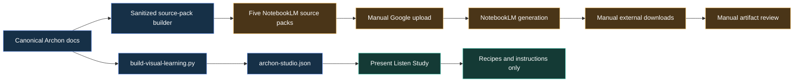

The current system is strong on source curation and honesty, but the application contains no generated learning assets and no native playback/study experience.

## 5. Target architecture

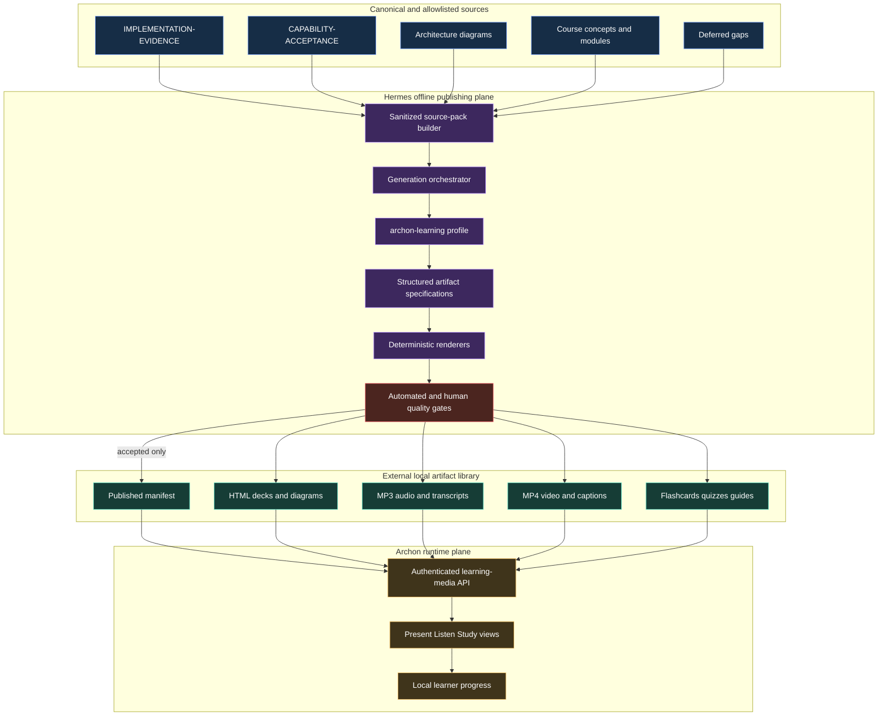

### Key boundary

Hermes is a **development-time publisher**. Archon runtime only consumes accepted files and metadata. If Hermes is stopped, the accepted learning library remains usable. If generation fails, the currently published catalog remains intact.

## 6. Artifact model

Replace the NotebookLM-specific vocabulary with a provider-neutral learning-artifact catalog.

### 6.1 Source packs

Retain the five current focused domains as `learning packs`:

- `system-overview`
- `request-lifecycle`
- `memory-rag-evaluation`
- `reliability-operations`
- `interview-demo`

Each pack keeps:

- title;
- purpose;
- ordered allowlisted sources;
- source priority;
- requested artifact types;
- learner level;
- language;
- visual density;
- acceptance thresholds.

### 6.2 Artifact types

| Family | Artifact | Canonical generated form | Browser form | Download form |
|---|---|---|---|---|
| Present | Slide deck | `deck.json` | Trusted Svelte deck renderer | Standalone HTML |
| Present | Diagram set | Mermaid/SVG specification | Inline SVG/HTML | SVG/PNG |
| Present | Infographic | Structured layout JSON + SVG | Zoomable image | SVG/PNG/PDF |
| Listen | Narrated lesson | Script + segment timeline | Audio player | MP3 + transcript |
| Listen | Two-voice podcast | Dialogue script + voice map | Audio player | MP3 + transcript |
| Study | Mind map | Tree/graph JSON with typed edges | Expandable structured map | HTML/SVG |
| Study | Flashcards | Typed question/answer JSON | Keyboard card player | JSON/CSV |
| Study | Quiz | Typed scenario/question JSON | Interactive quiz | JSON/Markdown |
| Study | Study guide | Structured Markdown | Rendered reading view | Markdown/PDF |
| Present | Explainer video | Storyboard + HTML composition | Video player | MP4 + VTT/SRT |

### 6.3 Why structured specifications come before HTML

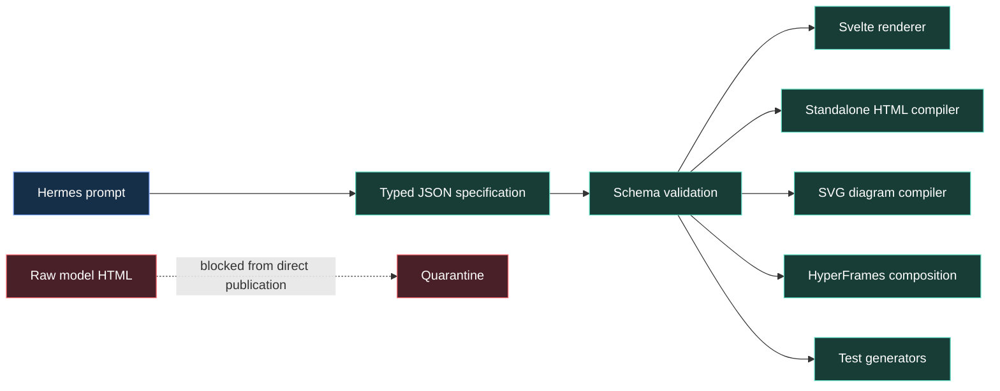

The structured form gives us schema validation, deterministic rendering, accessibility, reusable theming, and reliable tests. It also avoids weakening the current artifact iframe sandbox to execute arbitrary generated JavaScript.

### 6.4 Publication states

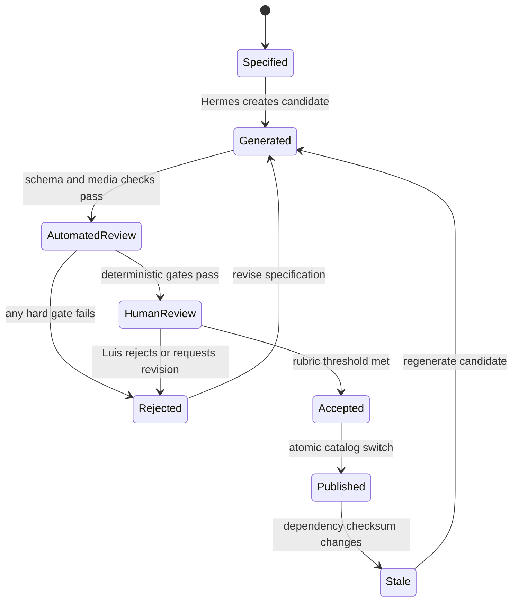

Only `Published` artifacts appear as ready in `/learn`. `Stale` artifacts may remain playable with a visible warning until a replacement is accepted; they must never silently appear current.

## 7. Proposed repository and external-library layout

### 7.1 Repository changes

```text
docs/visual-learning/
├── learning-artifacts.yaml                  # replaces provider-specific recipe metadata
├── hermes-generation-promptbook.md          # profile prompts and artifact contracts
├── hermes-generation-runbook.md             # supervised generation and review
├── artifact-review-template.json            # provider-neutral review record
└── README.md                                 # updated architecture and truth boundaries

schemas/visual-learning/
├── learning-library.schema.json
├── deck.schema.json
├── diagram.schema.json
├── audio-script.schema.json
├── mind-map.schema.json
├── flashcards.schema.json
├── quiz.schema.json
├── study-guide.schema.json
└── video-storyboard.schema.json

scripts/
├── build-learning-source-packs.py            # renamed/generalized from NotebookLM builder
├── generate-learning-artifact.py             # supervised Hermes invocation
├── render-learning-artifact.py               # deterministic renderer dispatcher
├── review-learning-artifact.py               # automated checks and review scaffold
└── publish-learning-artifact.py              # atomic acceptance/publish operation

backend/app/learning_media/
├── catalog.py                                # manifest loading and validation
├── paths.py                                  # strict containment and MIME allowlist
├── signatures.py                             # short-lived access URLs if selected
└── streaming.py                              # HTTP range responses

backend/app/routes/learning_media.py
backend/tests/unit/test_learning_artifact_builder.py
backend/tests/unit/test_learning_media_catalog.py
backend/tests/unit/test_learning_media_routes.py
backend/tests/security/test_learning_media_security.py

frontend/src/lib/learning-artifacts.ts
frontend/src/lib/components/learning/
├── LearningLibrary.svelte
├── PresentationPlayer.svelte
├── DiagramViewer.svelte
├── AudioLessonPlayer.svelte
├── MindMapViewer.svelte
├── FlashcardPlayer.svelte
├── QuizPlayer.svelte
├── StudyGuideViewer.svelte
└── VideoLessonPlayer.svelte

frontend/src/lib/learning-artifacts.test.ts
frontend/tests/visual-learning-artifacts.spec.ts
```

Exact names may change during implementation only if repository inspection reveals a stronger existing convention. Avoid adding dependencies until the feasibility spike proves they are necessary.

### 7.2 External generated library

Use a sibling directory, not Git and not the frontend image:

```text
../archon-learning-media/
├── .archon-learning-library
├── candidates/
│   └── <generation-id>/...
├── published/
│   └── <pack-id>/
│       └── <artifact-id>/
│           ├── artifact.json
│           ├── source-spec.json
│           ├── review.json
│           ├── transcript.md
│           └── media files
└── catalog.json
```

Properties:

- The owner marker prevents accidental deletion of unrelated directories.
- Candidate output is never served.
- Publication copies/moves a fully reviewed candidate into `published/` and atomically replaces `catalog.json`.
- The Docker backend receives only `published/` and `catalog.json` as a read-only mount.
- The repository commits schemas, prompts, renderers, and test fixtures—not large MP3/MP4 assets.
- `.gitignore` explicitly rejects generated media directories and common large formats under project-managed generation paths.

## 8. Generation data flow

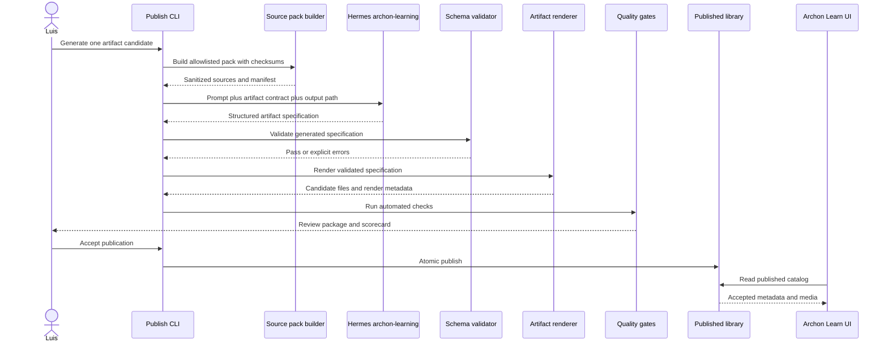

## 9. Content-generation contract

Every Hermes job must receive:

1. the pack manifest;
2. exact source priority;
3. only sanitized source text;
4. artifact schema;
5. language and audience;
6. visual identity contract;
7. truth-boundary rules;
8. expected output path;
9. acceptance rubric;
10. a prohibition against claiming evidence not present in the sources.

Every generated specification must include:

- `schema`, `version`, `artifact_id`, `artifact_type`;
- `pack_id`, title, language, learner level;
- `source_commit` and per-source SHA-256 checksums;
- `prompt_template_version` and prompt checksum;
- generator profile name;
- provider/model metadata when available, without credentials;
- skills declared by the job and actually reported as used;
- content sections/scenes/cards/questions;
- claim-level source references;
- known limitations;
- output files and checksums;
- creation timestamp;
- generation status and review status;
- token/cost metadata when available, otherwise explicit `unavailable`.

Do not embed secrets, profile memory, private course text, raw session transcripts, cookies, or `.env` values.

## 10. Visual identity and learning design

Create a project-level learning-media design contract before rendering the first deck or video. Reuse Archon's existing dark palette and typography rather than introducing a generic purple-gradient AI aesthetic.

Required principles:

- one concept or relationship per visual frame;
- progressive disclosure rather than a wall of nodes;
- arrows always labeled with the data, decision, or state transition;
- no more than eight active components in one scene;
- consistent semantic colors for frontend, backend, persistence, policy/security, and external systems;
- legends near the diagram, not detached from it;
- color plus text/icon/pattern, never color alone;
- 4.5:1 normal-text contrast;
- keyboard operation and visible focus;
- `prefers-reduced-motion` fallback;
- transcript/caption parity for audio/video;
- mobile layouts verified at 390px and desktop at 1440px;
- every artifact contains an explicit “What this does not prove” section where relevant.

## 11. Presentation pipeline

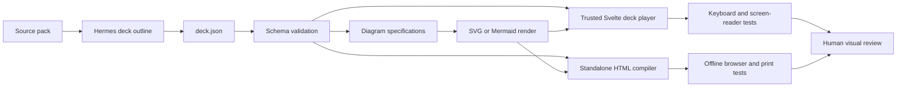

Deck acceptance:

- 12–15 slides for the existing engineering-walkthrough format;
- one message per slide;
- at least one visual on most technical slides;
- speaker notes and source references per slide;
- fullscreen and keyboard navigation;
- no generated scripts executed in the Archon origin;
- standalone HTML works offline;
- printable to PDF without clipped content;
- deck can resume at a slide using URL state.

## 12. Diagram and mind-map pipeline

Do not revive the rejected force-directed 66-node map. Generate focused, typed diagrams and hierarchical mind maps.

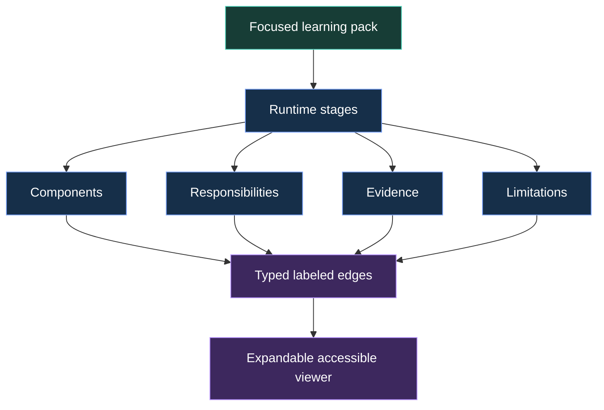

Mind-map acceptance:

- maximum six first-level branches;
- explicit relation labels;
- no file-name-based organization;
- no conflation of prerequisite order with runtime flow;
- zoom, pan, collapse/expand, reset, and keyboard access;
- textual outline fallback for screen readers and reduced-motion users;
- source and limitation panel for every selected node.

## 13. Audio and podcast pipeline

Hermes officially supports multiple TTS providers, but the active `text_to_speech` tool exposes only text and output path in this session. Therefore, English voice quality and multi-speaker quality must be treated as feasibility and acceptance gates, not as already-proven capabilities.

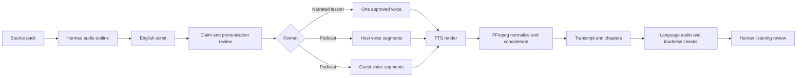

### 13.1 Voice bake-off before production

Generate the same 60–90 second script with a small approved shortlist:

- Edge TTS as the free baseline;
- one premium option already configured or separately authorized;
- optionally a local provider if quality and setup are acceptable.

Luis scores each sample on:

- clear, internationally understandable English pronunciation;
- natural rhythm;
- natural pronunciation of technical terms, model names, and code vocabulary;
- numbers, acronyms, and code identifiers;
- warmth and fatigue over several minutes;
- licensing and redistribution terms;
- cost per finished minute;
- deterministic repeatability.

Do not select the provider only from marketing labels. Record the exact accepted voice identifier and a pronunciation dictionary after the bake-off, without storing credentials.

### 13.2 Audio engineering acceptance

- English transcript exactly matches spoken content except documented pronunciation transformations.
- MP3 contains a valid audio stream and expected duration.
- Integrated loudness target is documented and checked consistently.
- No clipping, long silence, cut words, or duplicated segments.
- Chapters match the learning outline.
- Player provides speed control, 15-second seek, chapter navigation, and transcript highlighting.
- Podcast voices remain distinguishable; if not, ship a single-narrator lesson rather than a fake debate.

## 14. HyperFrames video pipeline

Yes, video is technically plausible through HyperFrames: HTML/CSS/GSAP compositions can be rendered frame-by-frame and encoded with FFmpeg. It is not yet proven for this repository, so video enters through a spike.

```mermaid
flowchart LR
    A[Accepted deck and script] --> B[Hermes storyboard JSON]
    B --> C[Scene hero frames]
    C --> D[HyperFrames HTML composition]
    D --> E[English narration]
    E --> F[Word-level transcript]
    F --> G[Captions and scene timing]
    D --> H[Lint validate inspect]
    G --> H
    H --> I[Draft MP4]
    I --> J[Representative-frame extraction]
    J --> K[OCR and human visual review]
    K --> L[High-quality MP4 plus VTT]
```

Video spike acceptance:

- one 60–90 second `request-lifecycle` explainer;
- 1920×1080, 30 fps;
- deterministic render from committed composition source and accepted media inputs;
- no jump cuts; scene transitions match the visual identity;
- captions in English and synchronized;
- `hyperframes lint --strict`, `validate`, and `inspect` pass or have documented, visually disproven false positives;
- FFprobe verifies duration, video stream, and audio stream;
- representative frames pass OCR/readability review;
- motion respects safe areas and does not obscure diagrams;
- estimated time and provider cost are recorded before scaling.

If the spike fails quality, reproducibility, or maintenance criteria, defer video without blocking presentations, audio, or study artifacts.

## 15. Study experience

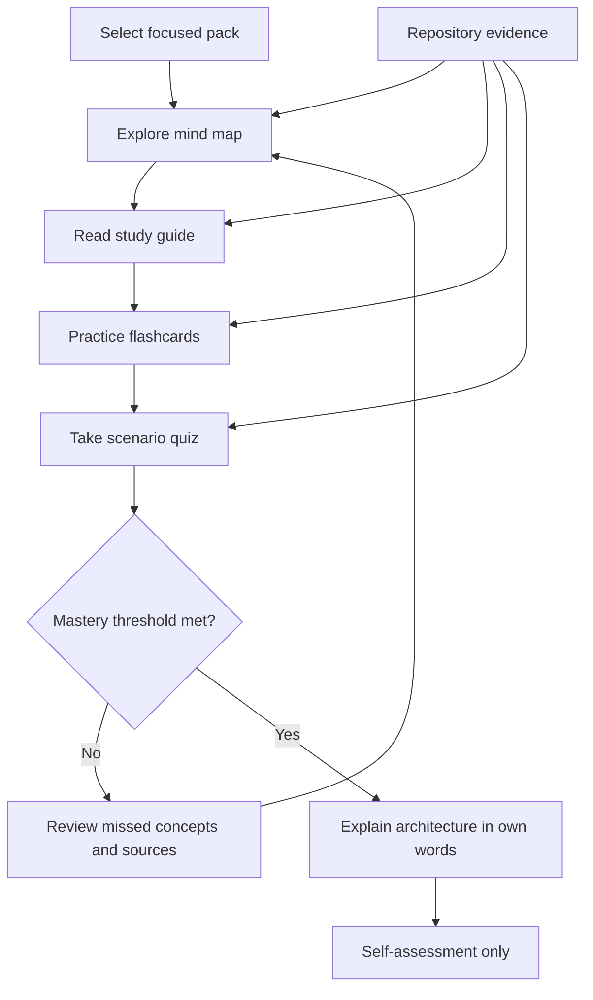

### 15.1 Flashcards

Each card must contain:

- question;
- concise answer;
- explanation of why;
- one common misconception;
- difficulty;
- concept IDs;
- source references;
- evidence/limitation marker;
- optional diagram reference.

Initial progress can remain client-local. It must be labeled “practice progress,” not course-completion evidence. Server-side progress should be a later, separately scoped capability.

### 15.2 Quizzes

Prefer senior-engineer scenarios over trivia. Each item includes:

- scenario;
- options or open response;
- best answer;
- explanation;
- distractor explanations;
- source grounding;
- concepts tested;
- difficulty;
- misconception tag.

Do not send a learner's answer to an LLM in the MVP. Score deterministic question types locally. Open-response coaching can be a future opt-in live-provider feature with its own budget and privacy gates.

### 15.3 Study guides

Render structured Markdown with:

- goals;
- vocabulary;
- architecture diagram;
- startup/request sequence when relevant;
- implementation evidence;
- limitations;
- common misconceptions;
- self-checks;
- interview explanation;
- links to canonical source files.

## 16. Runtime serving model

### Recommended model

1. Store accepted binary/media files outside Git.
2. Mount the published library read-only into the backend container.
3. Add an authenticated catalog endpoint.
4. Add owner/session-protected media delivery with path containment and a strict MIME allowlist.
5. Implement HTTP `Range` support for seekable audio/video.
6. Return immutable ETags based on the artifact checksum.
7. Never expose candidate or rejected directories.
8. Keep the gateway as the only host-published service.

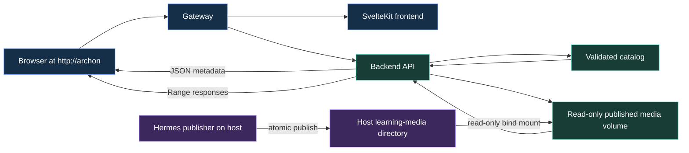

### Authentication caveat

Native `<audio>` and `<video>` elements cannot attach Archon's Bearer token header directly. Before implementation, choose and test one of these:

- short-lived, user-bound signed media URLs generated by an authenticated API call; or
- authenticated fetch to Blob URLs for small audio only.

Choose signed URLs for general audio/video because they preserve byte-range seeking and avoid loading an entire video into browser memory. Sign only artifact ID, owner/user ID, expiry, and checksum; never a filesystem path. Return `Cache-Control: private` and a short expiry.

## 17. UI redesign for the three views

### Present

- Pack selector on the left.
- Artifact gallery: Slides, Diagrams, Infographic, Video.
- Main viewer with fullscreen mode.
- Source/evidence drawer.
- Status badge: Published, Stale, Unavailable.
- Download actions only for accepted variants.

### Listen

- Pack and format selector.
- Audio player with speed, seek, chapters, elapsed/remaining time.
- Synchronized transcript.
- Voice/language metadata.
- Download transcript and MP3.
- “What this does not prove” summary.

### Study

- Subnavigation: Mind Map, Flashcards, Quiz, Guide.
- One pack at a time.
- Local practice progress.
- Source drawer for every card/question/node.
- Reset controls and clear labels that progress is not completion evidence.

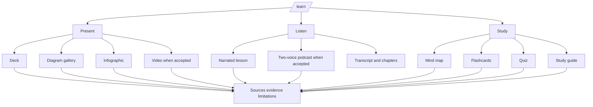

## 18. Quality gates

### 18.1 Gate taxonomy

| Gate | Proves | Does not prove |
|---|---|---|
| Schema/unit | Generated structure obeys contracts | Content is factually correct |
| Source/checksum | Artifact traces to allowlisted inputs | Interpretation is accurate |
| Renderer | Output can be built deterministically | It is pedagogically effective |
| Media probe | Streams/codecs/duration exist | Voice sounds natural |
| Accessibility | Keyboard/labels/contrast contracts | Luis learned the content |
| Visual/OCR | Representative frames are readable | Every frame is perfect |
| Human rubric | Artifact is understandable and useful | Canonical implementation status changed |
| Browser E2E | Published artifact works in `/learn` | Provider generation will work again later |
| Live-provider generation | A real model/provider produced a candidate | Future outputs are deterministic |
| Local deployment | Retained stack serves the accepted library | Public/cloud deployment exists |

### 18.2 Hard rejection conditions

Reject automatically if an artifact:

- invents deployment, provider, test, benchmark, or security evidence;
- contradicts `IMPLEMENTATION-EVIDENCE.md` or `CAPABILITY-ACCEPTANCE.yaml`;
- omits a relevant local-only/mock/deferred boundary;
- cites a source outside the allowlist;
- contains an unknown schema field where strict mode forbids it;
- includes active script where only inert HTML/SVG is allowed;
- fails path containment or checksum validation;
- contains secrets or credential-like values;
- lacks captions/transcript for audio/video;
- has unreadable/clipped representative frames;
- cannot be reproduced from the recorded source and template versions.

## 19. Detailed phased implementation plan

### Phase 0 — Approve the product contract and run feasibility spikes

#### Task 0.1: Confirm the offline-publisher boundary

**Objective:** Document that Hermes generates artifacts outside request handling and Archon consumes only accepted outputs.

**Files:**
- Create: `docs/visual-learning/hermes-native-learning-spec.md`
- Modify: `docs/visual-learning/README.md`

**Steps:**
1. Write the goals, non-goals, trust boundaries, and publication states.
2. Record that NotebookLM remains a temporary fallback.
3. Record that generation and publication are separate approvals.
4. Review the spec with Luis before implementation.

**Acceptance:** No architecture path requires Hermes to be online for `/learn` playback.

#### Task 0.2: Run the English voice bake-off

**Objective:** Prove an acceptable voice and provider before designing the podcast system around assumptions.

**Files:**
- Create: `spikes/learning-media-tts/README.md`
- Create: `spikes/learning-media-tts/script-en.txt`
- Create outside Git: `../archon-learning-media/spikes/tts/*`

**Steps:**
1. Use one technical script containing Archon, RAG, SQL, JSON, API, numbers, and English model names.
2. Render 60–90 seconds with the free baseline and any premium provider Luis authorizes.
3. Measure duration and inspect audio streams with FFprobe.
4. Record provider, exact voice ID, settings, cost, and redistribution terms.
5. Have Luis score accent, cadence, technical pronunciation, warmth, and fatigue.
6. Write a verdict: `VALIDATED`, `PARTIAL`, or `INVALIDATED`.

**Acceptance:** At least one English voice is explicitly accepted by Luis for clarity, pacing, warmth, and technical pronunciation. Otherwise audio remains deferred.

#### Task 0.3: Run the HyperFrames feasibility spike

**Objective:** Prove that one short Archon explainer can be rendered and verified on the current Mac toolchain.

**Files:**
- Create: `spikes/learning-media-video/DESIGN.md`
- Create: `spikes/learning-media-video/SCRIPT.md`
- Create: `spikes/learning-media-video/STORYBOARD.md`
- Create: `spikes/learning-media-video/index.html`
- Output outside Git: `../archon-learning-media/spikes/video/request-lifecycle.mp4`

**Steps:**
1. Use the accepted Archon visual identity.
2. Build static hero frames before animations.
3. Add deterministic GSAP timelines and transitions.
4. Add English narration and captions.
5. Run HyperFrames lint, validate, inspect, draft render, and high render.
6. Verify streams/duration using FFprobe.
7. Extract representative frames and inspect/OCR them.
8. Record rendering time, file size, quality, and maintenance cost.

**Acceptance:** A readable, synchronized 60–90 second MP4 passes technical checks and Luis's review. Otherwise videos are deferred without blocking the rest.

#### Task 0.4: Select the HTML presentation security model

**Objective:** Prove the structured deck renderer and standalone export without arbitrary script execution.

**Files:**
- Create: `spikes/learning-media-deck/deck.json`
- Create: `spikes/learning-media-deck/request-lifecycle.html`

**Steps:**
1. Define a minimal deck JSON with three slides and one diagram.
2. Render it in a trusted Svelte prototype.
3. Compile it to self-contained offline HTML.
4. Verify keyboard navigation, print layout, CSP behavior, and no network requests.
5. Reject any design that requires `allow-scripts` on generated model HTML.

**Acceptance:** Both in-app and standalone deck forms work from the same validated source specification.

### Phase 1 — Generalize NotebookLM configuration into a provider-neutral artifact contract

#### Task 1.1: Add strict JSON schemas

**Objective:** Make every artifact machine-validatable before rendering.

**Files:**
- Create: all files under `schemas/visual-learning/` listed in section 7.1.
- Test: `backend/tests/unit/test_learning_artifact_schemas.py`

**TDD steps:**
1. Write failing tests for valid minimal artifacts.
2. Add failing cases for unknown types, missing provenance, invalid source paths, and unsupported language tags.
3. Implement schemas with strict required fields and bounded collection sizes.
4. Run focused tests and confirm all valid/invalid fixtures behave as expected.

**Acceptance:** Every planned artifact type has a strict schema and negative tests.

#### Task 1.2: Introduce `learning-artifacts.yaml`

**Objective:** Preserve the five existing packs while removing NotebookLM as the domain model.

**Files:**
- Create: `docs/visual-learning/learning-artifacts.yaml`
- Modify: `scripts/build-visual-learning.py`
- Modify: `frontend/src/lib/visual-learning.ts`
- Test: `backend/tests/unit/test_visual_learning_graph.py`
- Test: `frontend/src/lib/visual-learning.test.ts`

**TDD steps:**
1. Change tests to expect `learning_library` or similarly provider-neutral metadata in schema version 3.
2. Preserve pack IDs and allowlisted source ordering.
3. Add artifact status and publication metadata.
4. Add a temporary migration field or compatibility adapter for the old NotebookLM key.
5. Regenerate the deterministic browser manifest.

**Acceptance:** Existing Roadmap, Stories, Architecture, and Evidence data remain unchanged while media metadata becomes provider-neutral.

#### Task 1.3: Generalize source-pack generation

**Objective:** Reuse the existing security properties without NotebookLM naming.

**Files:**
- Rename/generalize: `scripts/build-notebooklm-source-packs.py` to `scripts/build-learning-source-packs.py`
- Modify tests currently in: `backend/tests/unit/test_notebooklm_source_packs.py`

**TDD steps:**
1. Preserve clean-repository, allowlist, symlink, containment, credential-pattern, checksum, and owner-marker tests.
2. Rename output metadata to learning-pack terminology.
3. Include source dependency checksums suitable for stale detection.
4. Keep output outside the repository.
5. Maintain a compatibility wrapper for one migration release if useful.

**Acceptance:** Security guarantees are equal to or stronger than the current source-pack builder.

### Phase 2 — Build the supervised Hermes publisher

#### Task 2.1: Define versioned prompt templates

**Objective:** Convert the existing promptbook into output-contract prompts for Hermes.

**Files:**
- Create: `docs/visual-learning/hermes-generation-promptbook.md`
- Modify: `docs/visual-learning/notebooklm-promptbook.md` only to mark migration status.

**Steps:**
1. Preserve source priority and hard honesty boundaries.
2. Add schema-specific instructions for each artifact type.
3. Require claim-level citations to source paths.
4. Require English `en` for all learner-facing presentations, diagrams, audio, video, transcripts, captions, mind maps, flashcards, quizzes, and study guides.
5. Require visual-first layouts and explicit limitations.
6. Version each prompt and compute its checksum during generation.

**Acceptance:** Each artifact type maps to exactly one versioned prompt contract.

#### Task 2.2: Implement one-artifact generation CLI

**Objective:** Make generation explicit, bounded, resumable, and auditable.

**Files:**
- Create: `scripts/generate-learning-artifact.py`
- Test: `backend/tests/unit/test_generate_learning_artifact.py`

**Expected interface:**

```text
python scripts/generate-learning-artifact.py \
  --pack request-lifecycle \
  --type deck \
  --profile archon-learning \
  --output ../archon-learning-media/candidates/<generation-id>
```

**TDD steps:**
1. Test argument validation and safe output containment.
2. Test dry-run prompt assembly without invoking a provider.
3. Test timeout, nonzero exit, malformed JSON, missing output, and interrupted generation.
4. Record exact command, profile, model/provider metadata when available, prompt checksum, and tool/skill declarations.
5. Never read or serialize Hermes credential files.
6. Require an explicit `--live` or equivalent flag before provider invocation.

**Acceptance:** Dry-run is deterministic; live generation is explicit and never conflated with publication.

#### Task 2.3: Implement candidate validation

**Objective:** Reject malformed or ungrounded candidates before rendering.

**Files:**
- Create: `scripts/review-learning-artifact.py`
- Create: `backend/tests/unit/test_learning_artifact_review.py`

**Checks:**
- JSON Schema validity;
- source path membership;
- source checksum match;
- claim citation presence;
- forbidden overclaims and secret-like values;
- maximum scene/card/question counts;
- required limitations;
- language metadata;
- output path containment.

**Acceptance:** Deliberately malicious, stale, uncited, and overclaiming fixtures fail closed.

### Phase 3 — Ship the visual-first Present MVP

#### Task 3.1: Implement the trusted deck renderer

**Objective:** Render validated deck JSON as an accessible Svelte presentation.

**Files:**
- Create: `frontend/src/lib/components/learning/PresentationPlayer.svelte`
- Create: `frontend/src/lib/components/learning/PresentationPlayer.test.ts`

**TDD steps:**
1. Test title, slide count, notes, sources, and diagram slots.
2. Test ArrowLeft/ArrowRight, Home/End, fullscreen trigger, and URL slide state.
3. Test reduced-motion behavior and focus visibility.
4. Test long English technical text without clipping.
5. Implement the minimum renderer needed to pass.

**Acceptance:** Keyboard-only use covers the complete deck and sources.

#### Task 3.2: Implement deterministic standalone HTML export

**Objective:** Produce downloadable HTML presentations from the same deck JSON.

**Files:**
- Create: renderer module under `scripts/learning_renderers/`
- Test: `backend/tests/unit/test_learning_deck_renderer.py`

**TDD steps:**
1. Snapshot key HTML structure, not the entire generated file.
2. Verify no external scripts or remote assets.
3. Verify print stylesheet, slide anchors, and source notes.
4. Open the output in a headless browser with network disabled.

**Acceptance:** The HTML presentation works offline and prints without overflow.

#### Task 3.3: Implement diagram and infographic rendering

**Objective:** Generate polished SVG/HTML visuals with typed relationships.

**Files:**
- Create: `scripts/learning_renderers/diagram.py`
- Create: `frontend/src/lib/components/learning/DiagramViewer.svelte`
- Test: backend renderer tests and frontend component tests.

**Steps:**
1. Reuse Archon's semantic palette.
2. Render arrows before boxes so connections stay behind components.
3. Include an accessible text description and relation list.
4. Add pan/zoom only if it can be keyboard accessible; otherwise provide fit/reset controls.
5. Verify legends do not overlap diagram boundaries.

**Acceptance:** The request-lifecycle diagram is readable at desktop and mobile widths and has a text fallback.

### Phase 4 — Build the Listen experience

#### Task 4.1: Define audio script and timeline schemas

**Objective:** Represent narration, speakers, chapters, pronunciations, and citations before synthesis.

**Files:**
- Create/update: `schemas/visual-learning/audio-script.schema.json`
- Test: `backend/tests/unit/test_learning_audio_schema.py`

**Acceptance:** A script can represent both single narrator and alternating speakers without embedding provider secrets.

#### Task 4.2: Build the TTS/FFmpeg renderer

**Objective:** Turn accepted scripts into normalized MP3 plus transcript and chapters.

**Files:**
- Create: `scripts/learning_renderers/audio.py`
- Test: `backend/tests/unit/test_learning_audio_renderer.py`

**TDD steps:**
1. Test segment ordering and safe filenames using fake audio fixtures.
2. Test failed segment synthesis leaves no publishable candidate.
3. Test FFmpeg concatenation command construction.
4. Test FFprobe metadata parsing.
5. Add live TTS as an explicitly marked acceptance path.

**Acceptance:** Deterministic tests prove orchestration; a separately authorized live run proves real English audio.

#### Task 4.3: Implement the audio player

**Objective:** Provide a high-quality learning experience in `Listen`.

**Files:**
- Create: `frontend/src/lib/components/learning/AudioLessonPlayer.svelte`
- Test: component test and `frontend/tests/visual-learning-artifacts.spec.ts`

**TDD steps:**
1. Test loading, unavailable, stale, and playback states.
2. Test speed control, seek, chapters, and transcript navigation.
3. Test keyboard labels and focus.
4. Test signed URL expiry recovery without losing the chapter position.

**Acceptance:** A published pilot audio plays, seeks, and exposes the complete transcript at `http://archon/learn?view=listen` after deployment verification.

### Phase 5 — Build Study artifacts

#### Task 5.1: Implement structured mind maps

**Objective:** Provide a visual concept map without recreating the rejected force graph.

**Files:**
- Create: `frontend/src/lib/components/learning/MindMapViewer.svelte`
- Test: `frontend/src/lib/components/learning/MindMapViewer.test.ts`

**Acceptance:** Six-or-fewer top branches, typed edges, keyboard expansion, and textual outline fallback.

#### Task 5.2: Implement flashcards

**Objective:** Support focused retrieval practice with evidence links.

**Files:**
- Create: `frontend/src/lib/components/learning/FlashcardPlayer.svelte`
- Test: colocated component test.

**Acceptance:** Flip/reveal, previous/next, keyboard shortcuts, difficulty marking, reset, and source panel work; progress is labeled as practice only.

#### Task 5.3: Implement deterministic quizzes

**Objective:** Provide scenario-based assessment without runtime model dependence.

**Files:**
- Create: `frontend/src/lib/components/learning/QuizPlayer.svelte`
- Test: colocated component test.

**Acceptance:** Scoring, explanations, distractor feedback, retry, and source grounding are deterministic and tested.

#### Task 5.4: Implement study-guide rendering

**Objective:** Present the generated guide with diagrams, limitations, and self-checks.

**Files:**
- Create: `frontend/src/lib/components/learning/StudyGuideViewer.svelte`
- Test: colocated component test.

**Acceptance:** No unsafe HTML is accepted; links target only known canonical source URLs.

### Phase 6 — Build the learning-media catalog and secure serving

#### Task 6.1: Implement the catalog loader

**Objective:** Load only valid, accepted, published artifact records.

**Files:**
- Create: `backend/app/learning_media/catalog.py`
- Create: `backend/tests/unit/test_learning_media_catalog.py`

**TDD steps:**
1. Test valid catalog loading.
2. Test missing files, checksum mismatch, duplicate IDs, unknown MIME, candidate paths, and stale schema versions.
3. Keep the previous in-memory catalog if an atomic reload sees an invalid replacement.

**Acceptance:** Invalid catalog changes cannot take down currently published learning media.

#### Task 6.2: Implement path containment and signed access

**Objective:** Serve approved assets without path traversal or Bearer-token limitations in media elements.

**Files:**
- Create: `backend/app/learning_media/paths.py`
- Create: `backend/app/learning_media/signatures.py`
- Test: `backend/tests/security/test_learning_media_security.py`

**TDD steps:**
1. Reject `..`, URL-encoded traversal, symlinks, absolute paths, unknown artifact IDs, and non-published states.
2. Test signature tampering, expiry, wrong user, and checksum mismatch.
3. Use constant-time signature comparison.
4. Do not sign filesystem paths.

**Acceptance:** All negative security probes fail closed with no path disclosure.

#### Task 6.3: Implement byte-range streaming

**Objective:** Enable audio/video seeking and bounded memory use.

**Files:**
- Create: `backend/app/learning_media/streaming.py`
- Create: `backend/app/routes/learning_media.py`
- Modify: `backend/app/main.py` to register the route.
- Test: `backend/tests/unit/test_learning_media_routes.py`

**TDD steps:**
1. Test catalog endpoint auth.
2. Test full-file response.
3. Test valid prefix, suffix, and bounded ranges.
4. Test unsatisfiable/malformed ranges.
5. Test MIME, ETag, `Accept-Ranges`, `Content-Range`, and private cache headers.

**Acceptance:** Browser media seeking works without loading the full file.

#### Task 6.4: Add the read-only local deployment mount

**Objective:** Expose only accepted media to the backend container.

**Files:**
- Modify: `docker-compose.local.yml`
- Modify: `scripts/local-stack.sh`
- Modify: relevant deployment/config documentation.
- Test: compose config and local-stack verification tests.

**Steps:**
1. Add a host path setting with a safe documented default outside Git.
2. Mount published media read-only.
3. Fail readiness clearly if the feature is enabled but the catalog is invalid.
4. Keep the feature disabled or empty-library-safe by default during migration.
5. Verify no extra host port is published.

**Acceptance:** The canonical seven-service topology is unchanged; only a read-only backend mount and config are added.

### Phase 7 — Replace recipe-only UI with the published library

#### Task 7.1: Add the frontend catalog client

**Objective:** Fetch and type the authenticated learning library.

**Files:**
- Create: `frontend/src/lib/learning-artifacts.ts`
- Create: `frontend/src/lib/learning-artifacts.test.ts`

**Acceptance:** Invalid schema, expired links, unavailable artifacts, and stale states have explicit UI behavior.

#### Task 7.2: Replace `MediaView.svelte`

**Objective:** Turn the three recipe tabs into actual viewers while preserving focused pack selection.

**Files:**
- Modify: `frontend/src/lib/components/learning/MediaView.svelte`
- Create: `frontend/src/lib/components/learning/LearningLibrary.svelte`
- Modify: `frontend/src/lib/components/learning/VisualLearningStudio.svelte`

**Steps:**
1. Keep `Present`, `Listen`, and `Study` URL states stable.
2. Replace “Prepared, not yet generated” with catalog-driven availability.
3. Show provenance, review date, source version, stale status, and limitations.
4. Preserve a temporary “NotebookLM fallback” link during migration.
5. Add empty/loading/error states.

**Acceptance:** The three views expose only accepted artifacts and never imply unavailable types exist.

#### Task 7.3: Add end-to-end browser coverage

**Objective:** Prove the actual learning workflow, not only cards and labels.

**Files:**
- Create: `frontend/tests/visual-learning-artifacts.spec.ts`
- Modify: `frontend/tests/visual-learning.spec.ts`

**Scenarios:**
- open a deck and navigate slides;
- open a diagram and sources;
- play/seek audio using a deterministic fixture;
- expand a mind map;
- complete flashcards;
- score a quiz;
- open a study guide;
- verify stale and unavailable states;
- verify mobile no-overflow and keyboard use;
- verify no console errors.

**Acceptance:** Browser tests cover one complete pilot pack in every accepted artifact family.

### Phase 8 — Integrate HyperFrames video if the spike passes

#### Task 8.1: Define video storyboard contract

**Objective:** Represent scenes, timing, visual references, narration, captions, and source grounding.

**Files:**
- Finalize: `schemas/visual-learning/video-storyboard.schema.json`
- Create: `backend/tests/unit/test_learning_video_schema.py`

#### Task 8.2: Add the HyperFrames renderer adapter

**Objective:** Render accepted storyboard data without coupling the Archon runtime to Node/Chrome/FFmpeg.

**Files:**
- Create: `scripts/learning_renderers/hyperframes.py`
- Create: `backend/tests/unit/test_hyperframes_adapter.py`

**Acceptance:** Command construction, timeout, failure cleanup, output metadata, and dry-run are deterministic; real render remains a separate acceptance gate.

#### Task 8.3: Add video playback

**Objective:** Expose accepted MP4 and captions in `Present`.

**Files:**
- Create: `frontend/src/lib/components/learning/VideoLessonPlayer.svelte`
- Extend: `frontend/tests/visual-learning-artifacts.spec.ts`

**Acceptance:** Caption toggle, keyboard controls, seek, transcript, poster image, and reduced-motion fallback work.

### Phase 9 — Pilot publication and scale-out

#### Task 9.1: Publish the `request-lifecycle` pilot

**Objective:** Prove the complete chain using the most visual, interview-relevant pack.

**Required pilot artifacts:**

- one 12–15 slide HTML deck;
- one diagram set;
- one infographic;
- one mind map;
- one flashcard set;
- one scenario quiz;
- one study guide;
- one English narrated lesson;
- one video only if Phase 0.3 passed;
- two-voice podcast only if Phase 0.2 proves two acceptable voices.

**Acceptance:** Each artifact is generated, validated, human-reviewed, accepted, published, rendered in `/learn`, and traceable to sources.

#### Task 9.2: Measure learning value before scaling

**Objective:** Ensure this improves mastery rather than merely producing media.

**Method:**
1. Luis explains the request lifecycle before using the pack.
2. Luis uses the deck/audio/study flow.
3. Luis answers scenario questions and explains the lifecycle again.
4. Record which artifact types helped and which added noise.
5. Revise templates before generating four more packs.

**Acceptance:** Luis identifies measurable comprehension or recall value; otherwise simplify the artifact mix.

#### Task 9.3: Scale to remaining packs

**Objective:** Generate only artifact families that passed the pilot.

**Order:**
1. `system-overview`
2. `memory-rag-evaluation`
3. `reliability-operations`
4. `interview-demo`

Do not assume every pack needs every artifact type. For example, the interview pack may benefit more from decks, audio drills, flashcards, and quizzes than from a long video.

### Phase 10 — Retire NotebookLM as the primary lane

#### Task 10.1: Update documentation and naming

**Files:**
- Modify: `README.md`
- Modify: `docs/visual-learning/README.md`
- Modify: `docs/IMPLEMENTATION-EVIDENCE.md`
- Modify: `docs/implementation/CAPABILITY-ACCEPTANCE.yaml` only if the implementation evidence genuinely changes.
- Deprecate, do not immediately delete: NotebookLM promptbook/runbook/source config.

**Acceptance:** Documentation distinguishes source generation, accepted local artifacts, live-provider generation evidence, and deployment scope.

#### Task 10.2: Remove fallback after one stable release

**Objective:** Remove NotebookLM UI references only after all accepted pilot workflows remain green.

**Acceptance:** No user-visible path depends on Google/NotebookLM, and the old files are either archived with migration notes or removed in a separate reviewable change.

## 20. Test and verification matrix

### Deterministic repository gates

```text
backend/.venv/bin/python scripts/build-visual-learning.py --check
backend/.venv/bin/pytest -q \
  backend/tests/unit/test_visual_learning_graph.py \
  backend/tests/unit/test_learning_artifact_schemas.py \
  backend/tests/unit/test_learning_artifact_builder.py \
  backend/tests/unit/test_learning_media_catalog.py \
  backend/tests/unit/test_learning_media_routes.py \
  backend/tests/security/test_learning_media_security.py
cd frontend && npm run check
cd frontend && npx vitest run
cd frontend && npx playwright test tests/visual-learning.spec.ts tests/visual-learning-artifacts.spec.ts
make lint
make test
```

Expected outcomes must be recorded from real execution during implementation; this plan does not predict test counts.

### Media-specific gates

```text
ffprobe -v error -show_entries format=duration -show_streams <artifact>
ffmpeg -v error -i <artifact> -f null -
```

For HyperFrames candidates:

```text
npx hyperframes lint --strict
npx hyperframes validate
npx hyperframes inspect
npx hyperframes render --quality draft --output draft.mp4
npx hyperframes render --quality high --output final.mp4
```

### Local deployment gate

Only after Luis authorizes deployment:

1. Use the canonical local-stack runbook.
2. Verify `./scripts/local-stack.sh status`.
3. Verify HTTP readiness.
4. Authenticate and test `/learn?view=present`, `/learn?view=listen`, and `/learn?view=study` in the browser.
5. Verify range requests through `http://archon`.
6. Verify the backend mount is read-only.
7. Verify no extra host ports were introduced.
8. Verify stopped Hermes does not break playback.

Do not claim the app is running or deployed from build/test success alone.

## 21. Security and privacy threat model

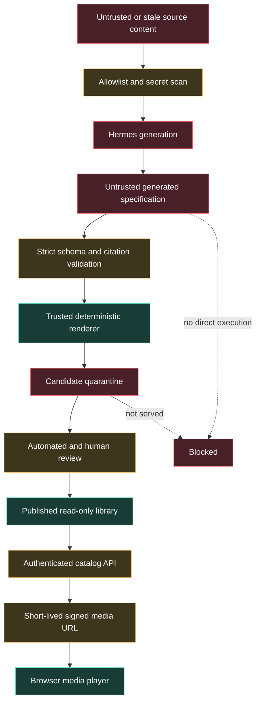

Primary threats and mitigations:

| Threat | Mitigation |
|---|---|
| Prompt injection in source docs | Sources are data; fixed system contract; allowlist; no action instructions from source text |
| Secret leakage | Existing source scanner retained; no `.env`, profile memory, credentials, or private course data |
| Generated XSS | Structured JSON; trusted renderers; no raw model scripts; restrictive CSP |
| Path traversal | Artifact IDs map through validated catalog; resolved containment; symlink rejection |
| Unauthorized media access | Authenticated catalog plus short-lived user-bound signed URLs |
| Candidate exposure | Separate candidate and published roots; backend mounts only published root |
| Stale false claims | Dependency checksums and visible stale state |
| Cost runaway | One-artifact jobs, explicit live flag, budget preflight, no cron initially |
| Supply-chain drift | Pin/record renderer versions; validate before each generation batch |
| Large binary repository growth | External media library; Git ignore; checksums in manifest |

## 22. Observability and provenance

Each generation record should capture:

- generation ID;
- pack and artifact IDs;
- start/end timestamps;
- source dependency checksums;
- source commit;
- prompt/template checksum;
- generator profile;
- reported model/provider;
- tool/skill usage when available;
- token and cost values when available;
- renderer versions;
- output checksums and sizes;
- automated gate results;
- reviewer and rubric scores;
- publication timestamp;
- stale reason when applicable.

Do not put raw prompts containing full source packs into normal application logs. Store only hashes and bounded diagnostics unless a secure candidate bundle explicitly requires the full prompt for reproduction.

## 23. Review rubric

Retain the existing 1–5 dimensions and add media-specific checks.

Core dimensions:

- comprehension;
- structure;
- relationships;
- factual accuracy;
- honesty of boundaries;
- interview value.

Additional dimensions:

- visual clarity;
- accessibility;
- English naturalness and intelligibility;
- technical pronunciation;
- pacing;
- source traceability;
- replay/reproducibility.

Publication rule:

- no hard rejection condition;
- accuracy and boundaries must score 5;
- source traceability must score 5;
- accessibility must meet all binary gates;
- other dimensions must meet the threshold agreed in the spec;
- Luis gives final acceptance for voice and learning usefulness.

## 24. Risks and trade-offs

| Risk/trade-off | Decision |
|---|---|
| Hermes output varies by model | Generate structured specs, validate strictly, record model/prompt versions, require review |
| TTS accent quality varies | Bake-off and Luis acceptance before scale |
| Two-speaker podcast increases complexity | Single narrator first; two voices only after proof |
| Video is expensive to author and review | Spike first; optional track; do not block MVP |
| Large media files do not belong in Git | External read-only library with checksummed catalog |
| Runtime generation would feel magical | Reject it for MVP because it couples availability, cost, and safety to page loads |
| Signed URLs add backend complexity | Worth it for secure range-seekable media; validate with a spike |
| Generated HTML can execute code | Use structured deck JSON and trusted renderers; standalone HTML remains inert/self-contained |
| Source commit can change for unrelated files | Compute dependency checksums, not only repository HEAD |
| Forty artifacts may become maintenance debt | Pilot one pack and keep only high-value artifact families |
| Practice progress can look like course completion | Label as self-practice and keep separate from verified course progress |

## 25. Open decisions requiring Luis's approval

These do not block writing the implementation spec, but they must be resolved before the corresponding phase:

1. Which TTS providers may be used in the bake-off, and what test budget is authorized?
2. Should accepted large media live only on this Mac, or also in a later private object store?
3. Does Luis want one narrator first, or is two-voice podcast mandatory for the pilot?
4. Is the first deck aimed primarily at personal mastery, interview presentation, or both via two variants?
5. Should standalone HTML downloads be public derivative artifacts or authenticated-only local files?
6. Should practice progress stay browser-local in v1, as recommended?
7. If HyperFrames passes, what target duration is acceptable: 2–3 minutes or 6–8 minutes per pack?
8. Which exact source pack should pilot first? This plan recommends `request-lifecycle`.

## 26. Definition of done

The NotebookLM replacement is complete only when:

- the provider-neutral source-pack and artifact schemas are committed and tested;
- Hermes can generate a real candidate through the `archon-learning` profile under explicit authorization;
- one complete pilot pack is accepted and published;
- `Present` displays a real deck and visual artifact;
- `Listen` plays real accepted English audio with transcript and chapters;
- `Study` provides a real mind map, flashcards, quiz, and guide;
- video is either live-proven and published or explicitly deferred after a documented spike;
- all published artifacts carry provenance, checksums, review status, and limitations;
- candidate/rejected outputs are not served;
- deterministic, security, frontend, browser, and media checks pass;
- the retained local stack passes canonical status and HTTP readiness checks after authorized deployment;
- documentation no longer presents NotebookLM as the primary generation lane;
- no claim exceeds the evidence level actually demonstrated.

## 27. Recommended first implementation milestone

The first implementation milestone should be deliberately narrow:

**“Request Lifecycle Visual Pack v1”**

Deliver:

1. validated `deck.json`;
2. a 12–15 slide in-app presentation;
3. standalone HTML export;
4. three focused diagrams;
5. one hierarchical mind map;
6. 20–30 flashcards;
7. 10–15 scenario questions;
8. one study guide;
9. one 8–12 minute accepted English narrated lesson;
10. video only if the spike has already passed.

This milestone proves the architecture end to end without creating a 40-artifact review backlog.

## 28. Implementation order summary

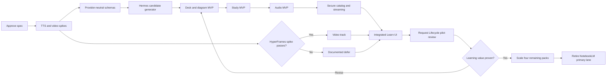

This sequence intentionally validates uncertain media capabilities early, builds the highest-value visual/study experience before expensive video, and preserves Archon's evidence-first posture throughout.
