# Visual Learning Presentation, Graphs, Infographic, and Sources Improvement Plan

> **For Hermes:** Use subagent-driven development and TDD to implement this plan task-by-task only after Luis approves it.

**Goal:** Turn the review-ready request-lifecycle pilot into a genuinely teachable visual experience for a newcomer: narrated slides, real source links, understandable process diagrams, a designed infographic, and an actual connected mind map.

**Architecture:** Keep the current provider-neutral artifact catalog and offline Hermes publishing boundary. Upgrade artifact contracts from thin strings and box lists to semantic teaching content. Render diagrams and mind maps with one reusable Svelte 5 graph layer, while rendering the infographic as a purpose-built responsive HTML/SVG composition. Resolve every repository source into a commit-pinned GitHub URL in one trusted frontend utility.

**Recommended graph engine:** `@xyflow/svelte`, subject to an isolated compatibility spike. Do not adopt `svelte-mindmap` as the production dependency without that spike: its current npm package is version 1.0.4, was last modified in 2022, and its README targets Svelte 3, while Archon uses Svelte 5.56.1. `@xyflow/svelte` 1.6.6 declares Svelte `^5.25.0`, provides labeled edges, custom nodes, controls, minimap, pan/zoom, and keyboard-friendly selection.

**Infographic recommendation:** Build the primary technical infographic with deterministic HTML/CSS/inline SVG. Use GPT Image 2 only as an optional decorative illustration layer after a separate cost approval. Never ask an image model to render authoritative labels, source citations, architecture arrows, or technical claims.

**Content language:** English only, matching the established Visual Learning Studio requirement.

---

## 1. Feedback converted into acceptance criteria

| Current problem | Required outcome |
|---|---|
| Slides have only a title and one sentence | Every slide includes a newcomer-oriented presenter script, key terms, a transition to the next slide, and source links |
| Presenter sources are plain code text | Every source is an actual commit-pinned GitHub hyperlink, optionally to exact lines |
| Diagrams appear as disconnected boxes | Nodes are spatially arranged and connected by visible directional arrows with labels |
| Diagram relationships require reading a separate list | Hover, keyboard focus, or click on a node/edge reveals its explanation and sources |
| Infographic is another box grid | A purpose-built visual narrative communicates hierarchy, sequence, and evidence level at a glance |
| Mind map is a grid of cards | One central node connects radially to branches and sub-branches with visible curves |
| Flashcard sources are plain text | Flashcards, quiz explanations, study guide, audio, video, diagrams, mind map, and slides all use the same real source-link component |
| Hover-only interactions would exclude touch/keyboard users | Every hover behavior also works through focus and click, with a persistent details panel |
| Generated visuals could overstate evidence | Every explanatory element preserves limitations and links to canonical evidence |

## 2. Target learner experience

### 2.1 Slide anatomy

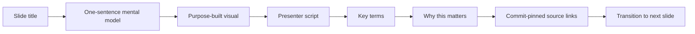

Each slide should work in two modes:

1. **Presentation mode:** title, concise message, visual, and navigation.
2. **Teach mode:** expanded script below the visual, written as words Luis can actually say to a newcomer, followed by explanatory source links.

The script must not merely repeat the slide. It should answer:

- What is this?
- Why does Archon need it?
- What happens before and after it?
- What common misconception should the learner avoid?
- What evidence supports the explanation?

### 2.2 Diagram interaction model

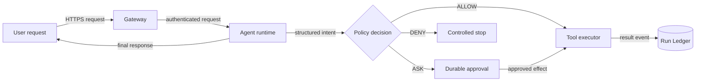

Interaction contract:

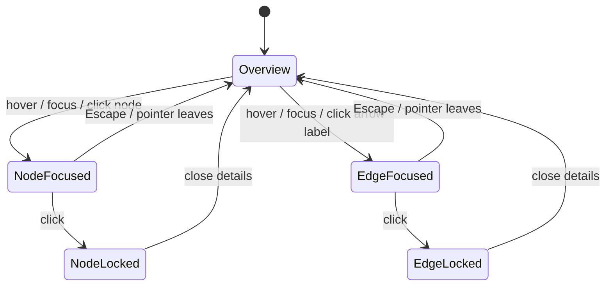

A selected node explains responsibility, inputs, outputs, failure behavior, and sources. A selected edge explains what crosses the boundary, why the direction matters, and what happens when that transition fails.

### 2.3 Mind-map interaction model

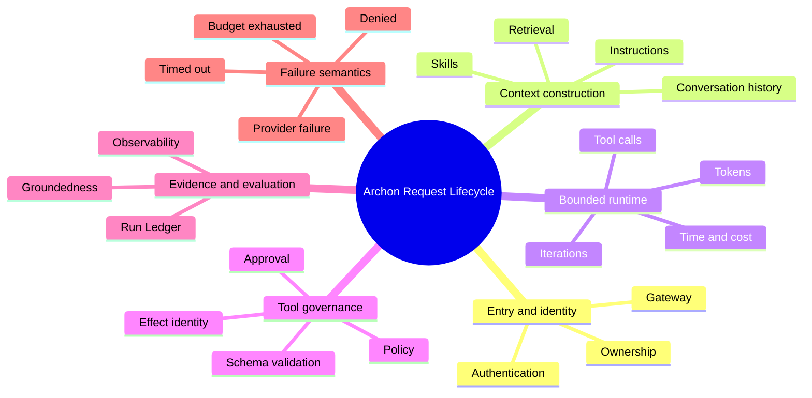

The production view should visually resemble this topology, not a card list.

### 2.4 Infographic information hierarchy

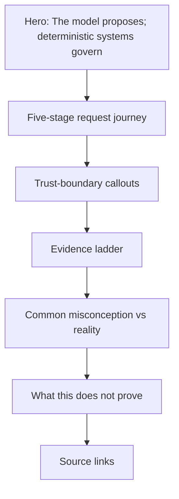

The infographic should be scannable in ten seconds and teachable in two minutes.

---

## 3. Library decision

### Option A — `svelte-mindmap`

Useful ideas:

- Native mind-map vocabulary.
- Nodes, connections, subnodes, hover notes, and URLs.
- MIT license.

Risks:

- npm 1.0.4 was last modified in 2022.
- README explicitly targets Svelte 3.
- Archon uses Svelte 5.56.1.
- Its data model uses node text as connection identity, which is weaker than stable IDs.
- It is specialized for mind maps and would not solve the process-diagram renderer.
- Accessibility, SSR, and keyboard behavior need independent proof.

### Option B — `@xyflow/svelte` — recommended

Advantages:

- Current package line supports Svelte 5.
- One renderer can power process diagrams and radial mind maps.
- Custom nodes and edges allow explanatory content and semantic styling.
- Built-in pan, zoom, fit-view, controls, and minimap.
- Stable node IDs and explicit source/target edges.
- Edge labels can become focusable/clickable explanation controls.

Tradeoff:

- Larger dependency and more implementation work than a fixed SVG.
- Accessibility must be added deliberately; the graph cannot be the only representation.

### Decision gate

Before full implementation, build a disposable compatibility spike with one five-node graph. Require:

- Svelte 5 build succeeds.
- SSR does not access `window` during server rendering.
- Pan, zoom, fit-view, custom node, and labeled edge work.
- Node and edge selection work by pointer and keyboard.
- The production bundle increase is recorded.
- `npm audit --omit=dev` introduces no high or critical reachable issue.

If the spike fails, use a first-party inline SVG renderer with deterministic coordinates. Do not fall back to the current card-grid representation.

---

## 4. Data-contract redesign

### 4.1 Shared source references

Replace raw source strings with a typed source object:

```ts
type SourceReference = {
  path: string;
  label: string;
  section?: string;
  line_start?: number;
  line_end?: number;
  why_relevant: string;
};
```

Generate hyperlinks rather than accepting arbitrary URLs:

```text
https://github.com/levalencia/archon/blob/{source_commit}/{encoded_path}#L{start}-L{end}
```

Security constraints:

- `path` must be repository-relative.
- Reject `..`, absolute paths, URL schemes, null bytes, and non-allowlisted files.
- `source_commit` must remain a 40-character lowercase Git SHA.
- The frontend constructs URLs from trusted base + validated commit + validated path.
- Links use `target="_blank"` and `rel="noopener noreferrer"`.

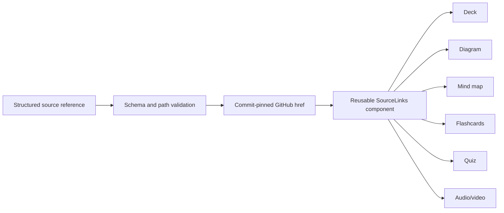

### 4.2 Deck v2

Each slide gains:

```json
{
  "id": "trust-boundaries",
  "title": "One Request, Many Trust Boundaries",
  "message": "One concise idea.",
  "presenter_script": "A 90–150 word newcomer-oriented explanation.",
  "key_terms": [
    {"term": "trust boundary", "definition": "..."}
  ],
  "common_misconception": "...",
  "transition": "Next, we will see how identity is established.",
  "visual": {"kind": "diagram", "artifact_id": "request-diagram-1"},
  "sources": ["structured source references"]
}
```

### 4.3 Diagram v2

Each node gains:

- Stable ID and kind.
- Short visible label.
- One-line summary for tooltip.
- Detailed explanation for the side panel.
- Inputs, outputs, and failure behavior.
- Structured source references.
- Optional deterministic position hint.

Each edge gains:

- Stable ID.
- Source and target IDs.
- Visible verb phrase such as “submits authenticated request”.
- Detailed explanation.
- Semantic style: data, control, approval, denial, or evidence.
- Structured source references.

Validation requires every edge endpoint to exist and every non-terminal node to participate in at least one edge.

### 4.4 Mind-map v2

Each node gains:

- Stable ID.
- Summary and detailed explanation.
- Color/category.
- Structured sources.
- Recursive children validated to a bounded depth.

The renderer computes deterministic radial coordinates. Coordinates are presentation data, not authored truth.

### 4.5 Infographic v1 as a distinct contract

Do not reuse the diagram schema. Define:

- Hero thesis.
- Ordered stages.
- Trust-boundary callouts.
- Evidence-level ladder.
- Misconception/reality pairs.
- Limitations.
- Structured sources per claim.
- Optional decorative image metadata, never technical text embedded in an AI-generated bitmap.

---

## 5. Component architecture

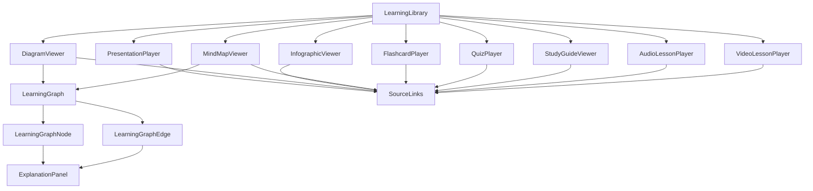

New reusable components:

- `frontend/src/lib/components/learning/SourceLinks.svelte`
- `frontend/src/lib/components/learning/LearningGraph.svelte`
- `frontend/src/lib/components/learning/LearningGraphNode.svelte`
- `frontend/src/lib/components/learning/ExplanationPanel.svelte`
- `frontend/src/lib/components/learning/InfographicViewer.svelte`
- `frontend/src/lib/source-links.ts`

The graph must always provide a linear accessible explanation list below it. Visual position cannot be the only carrier of meaning.

---

## 6. Detailed implementation phases

### Phase 0 — Preserve the reviewed baseline

1. Record the current branch and dirty-tree inventory.
2. Keep the existing generated media and catalog outside Git.
3. Capture baseline screenshots of Present, each diagram, infographic, and mind map.
4. Run the current focused tests to establish a comparison point.
5. Do not change audio, video, flashcard logic, or runtime infrastructure unless required by the source-link contract.

Verification:

```bash
cd frontend
npm run check
npx vitest run src/lib/visual-learning.test.ts src/lib/learning-artifacts.test.ts
npx playwright test tests/visual-learning-artifacts.spec.ts
```

### Phase 1 — Spike the graph engine

**Files:**

- Create: `frontend/src/lib/components/learning/spikes/GraphEngineSpike.svelte`
- Create: `frontend/src/lib/components/learning/spikes/graph-engine-spike.test.ts`
- Modify only after the spike passes: `frontend/package.json`, `frontend/package-lock.json`

Steps:

1. Add `@xyflow/svelte` in the isolated spike.
2. Render one central node, four process nodes, five labeled arrows, zoom controls, and fit-view.
3. Add custom hover/focus/click behavior that updates a details panel.
4. Verify SSR and Svelte 5 compatibility.
5. Record bundle impact and dependency audit.
6. Delete the spike component after extracting the reusable implementation.

Explicit comparison outcome:

- `svelte-mindmap` is inspiration only unless it unexpectedly passes Svelte 5, SSR, accessibility, and maintenance gates better than Svelte Flow.
- Do not install both libraries in production.

### Phase 2 — Introduce source-link contracts first

**Files:**

- Create: `schemas/visual-learning/source-reference.schema.json`
- Modify: `schemas/visual-learning/deck.schema.json`
- Modify: `schemas/visual-learning/diagram.schema.json`
- Modify: `schemas/visual-learning/mind-map.schema.json`
- Modify: `schemas/visual-learning/flashcards.schema.json`
- Modify: `schemas/visual-learning/quiz.schema.json`
- Modify: `schemas/visual-learning/study-guide.schema.json`
- Modify: `schemas/visual-learning/audio-script.schema.json`
- Modify: `schemas/visual-learning/video-storyboard.schema.json`
- Test: `backend/tests/unit/test_learning_pilot.py`

Steps:

1. Write failing schema tests for structured source references.
2. Reject arbitrary URLs and path traversal.
3. Add optional exact line ranges and section names.
4. Bump affected artifact contracts to version 2.
5. Migrate the pilot JSON.
6. Validate every source path and line range against repository files during generation.

### Phase 3 — Make sources real links everywhere

**Files:**

- Create: `frontend/src/lib/source-links.ts`
- Create: `frontend/src/lib/source-links.test.ts`
- Create: `frontend/src/lib/components/learning/SourceLinks.svelte`
- Modify every learning player/viewer component.
- Modify: `frontend/src/lib/learning-artifacts.ts`
- Test: `frontend/tests/visual-learning-artifacts.spec.ts`

Steps:

1. Write URL-builder tests for README, nested docs, sections, and line ranges.
2. Construct URLs pinned to each artifact's `source_commit`, not mutable `main`.
3. Render human labels such as “Policy and Approvals — approval binding”.
4. Show “Why this source” text.
5. Use proper external-link icon, focus state, `noopener`, and `noreferrer`.
6. Verify no viewer still renders source paths inside `<code>` without a link.

### Phase 4 — Rewrite the slide experience for newcomers

**Files:**

- Modify: `docs/visual-learning/pilot/request-lifecycle.json`
- Modify: `schemas/visual-learning/deck.schema.json`
- Modify: `scripts/build-learning-pilot.py`
- Modify: `frontend/src/lib/components/learning/PresentationPlayer.svelte`
- Test: `backend/tests/unit/test_learning_pilot.py`
- Test: `frontend/tests/visual-learning-artifacts.spec.ts`

Per-slide output:

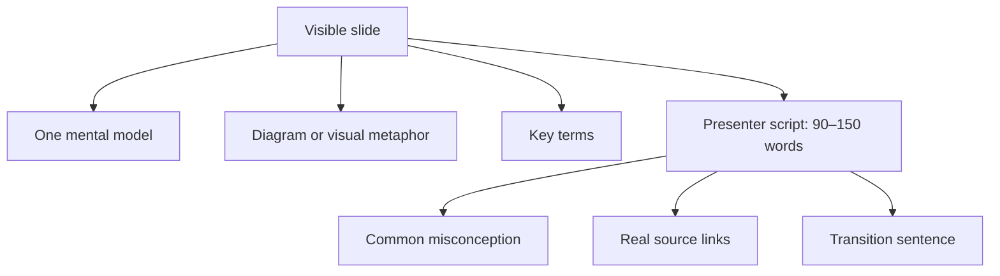

UI behavior:

- Rename “Presenter notes and sources” to “Teach this slide”.
- Keep it collapsed during presentation mode.
- When expanded, show Script, Key terms, Common misconception, Next transition, and Sources as distinct blocks.
- Preserve notes state per slide or deliberately reset it on slide change; test the chosen behavior.
- Make source links reachable by keyboard.
- Update the standalone HTML deck to contain the same script and links.
- Ensure a learner can understand each slide without reading the repository first.

Content review gate:

- Luis reviews three representative slides: introduction, tool governance, and evidence boundary.
- Only after those pass should all 14 scripts be finalized.

### Phase 5 — Replace box diagrams with interactive process diagrams

**Files:**

- Modify: `docs/visual-learning/pilot/request-lifecycle.json`
- Modify: `schemas/visual-learning/diagram.schema.json`
- Create: `frontend/src/lib/components/learning/LearningGraph.svelte`
- Create: `frontend/src/lib/components/learning/LearningGraphNode.svelte`
- Create: `frontend/src/lib/components/learning/ExplanationPanel.svelte`
- Rewrite: `frontend/src/lib/components/learning/DiagramViewer.svelte`
- Modify: `scripts/build-learning-pilot.py`

Visual requirements:

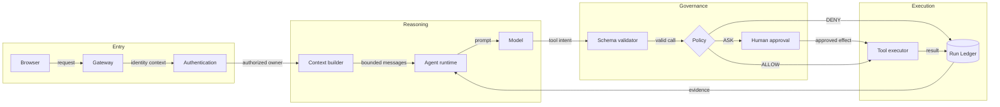

Implementation rules:

- Use arrowheads and visible edge labels.
- Group nodes into trust-boundary regions.
- Semantic colors represent frontend, backend, security, database/evidence, and external systems.
- Hover/focus shows a concise tooltip.
- Click locks a full explanation panel.
- Edge details explain payload, direction, gate, failure, and source.
- Add Fit, Zoom in, Zoom out, Reset, and optional minimap controls.
- Provide a “Read diagram as steps” fallback list.
- Do not use free dragging by default; learners should see a stable authored layout.

### Phase 6 — Build a real infographic

**Files:**

- Create: `schemas/visual-learning/infographic.schema.json`
- Create: `frontend/src/lib/components/learning/InfographicViewer.svelte`
- Modify: `docs/visual-learning/pilot/request-lifecycle.json`
- Modify: `scripts/build-learning-pilot.py`
- Test: `backend/tests/unit/test_learning_pilot.py`
- Test: `frontend/tests/visual-learning-artifacts.spec.ts`

Recommended composition:

1. Hero thesis: “The model proposes; deterministic systems govern.”
2. Horizontal request journey with numbered stages and arrows.
3. Three trust-boundary callouts.
4. Evidence ladder: source → test → local observation → live-provider evidence → public deployment.
5. “Misconception / Reality” cards.
6. Explicit limitations.
7. Commit-pinned source links.

Use iconography from `lucide-svelte`, CSS gradients, inline SVG arrows, and restrained motion. The infographic must not be a general graph or a collection of equal boxes.

#### Optional GPT Image 2 experiment

Only after separate explicit budget authorization:

- Generate one decorative background or conceptual illustration.
- Require no words, code, labels, logos, or technical arrows in the generated bitmap.
- Overlay every factual label and hyperlink in HTML/SVG.
- Compare the generated-art version against the deterministic no-image version.
- Reject it if it reduces readability, accessibility, editability, or technical credibility.

### Phase 7 — Replace the card grid with a radial mind map

**Files:**

- Modify: `schemas/visual-learning/mind-map.schema.json`
- Modify: `docs/visual-learning/pilot/request-lifecycle.json`
- Rewrite: `frontend/src/lib/components/learning/MindMapViewer.svelte`
- Reuse: `LearningGraph.svelte`, `ExplanationPanel.svelte`, `SourceLinks.svelte`

Layout:

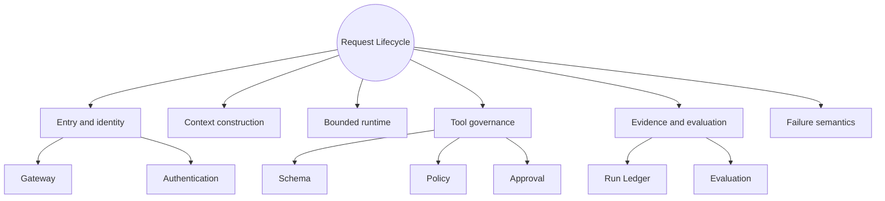

Interaction requirements:

- Central node visually dominant.
- First-level nodes arranged radially.
- Children branch outward from parents.
- Curved visible connections.
- Hover/focus preview; click selects and locks details.
- Collapse/expand branches.
- Fit-to-screen and reset controls.
- Selected path highlighted from root to node.
- Source links in the details panel.
- Accessible outline/tree below the visual map.
- Touch interactions work without hover.

### Phase 8 — Apply source links to every learning format

Update:

- Flashcards: sources below the revealed answer.
- Quiz: sources appear only after answer submission to avoid leaking answers.
- Study guide: sources per section.
- Audio: sources per chapter.
- Video: sources per chapter/scene and in transcript.
- Diagram: sources per node and edge.
- Infographic: sources per factual block.
- Deck: sources per slide.

No artifact should show a dead repository path as plain text.

### Phase 9 — Automated acceptance

Backend tests:

```bash
cd backend
uv run pytest -q \
  tests/unit/test_learning_pilot.py \
  tests/unit/test_learning_media.py \
  tests/unit/test_learning_media_routes.py
```

Frontend tests:

```bash
cd frontend
npm run check
npx vitest run
npx playwright test tests/visual-learning-artifacts.spec.ts tests/visual-learning.spec.ts
npm run build
```

Required assertions:

- Every slide has 90–150 words of presenter script.
- Every content unit has at least one valid source reference.
- Every generated GitHub URL is pinned to a 40-character source commit.
- Every diagram has visible directed edges and no orphan nodes.
- Every edge has a label and explanation.
- The mind map is connected and has exactly one root.
- Node and edge details work through pointer, keyboard, and touch-equivalent click.
- Quiz sources remain hidden until submission.
- No horizontal page overflow at desktop or mobile widths.
- Browser console has zero errors and warnings.
- The fallback linear explanation remains usable without graph rendering.

### Phase 10 — Visual and newcomer review

Create an explicit review matrix:

| Artifact | Newcomer can explain it afterward | Connections are obvious | Sources useful | Visual quality | Accepted |
|---|---:|---:|---:|---:|---:|
| Slide deck |  |  |  |  |  |
| Governed request diagram |  |  |  |  |  |
| Policy decision diagram |  |  |  |  |  |
| Evidence infographic |  |  |  |  |  |
| Mind map |  |  |  |  |  |

Luis should review before changing any artifact from `review-ready` to `published`.

Suggested review questions:

1. Can a newcomer explain the difference between model intent and runtime execution?
2. Can they follow every arrow without reading a separate document first?
3. Do the presenter notes sound like a useful teaching script rather than metadata?
4. Can they open a source and find the supporting evidence quickly?
5. Does the infographic communicate one coherent story in under two minutes?
6. Does the mind map look and behave like a connected concept map?

### Phase 11 — Scale only after acceptance

After the request-lifecycle pilot passes human review:

1. Extract reusable templates from the accepted visual language.
2. Generate the remaining four packs one at a time.
3. Review one representative deck, diagram, infographic, and mind map from each pack.
4. Keep NotebookLM as fallback until at least two Hermes-native packs are accepted.
5. Remove NotebookLM-specific UI and documentation only after parity is evidenced.

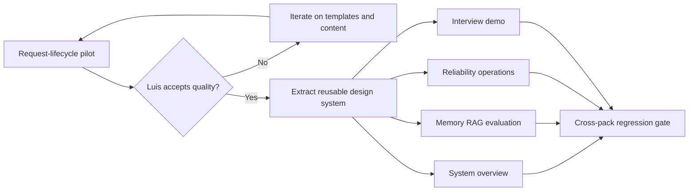

---

## 7. Risks and mitigations

| Risk | Mitigation |
|---|---|
| `svelte-mindmap` breaks under Svelte 5 | Do not adopt by default; isolated spike first |
| Svelte Flow increases bundle size | Record delta and lazy-load only Present/Study graph views |
| Hover-only content is inaccessible | Mirror hover with focus/click and persistent explanation panel |
| AI image contains incorrect labels | Keep all factual text and arrows in deterministic HTML/SVG |
| Generated links drift with `main` | Pin links to artifact `source_commit` |
| Exact GitHub line ranges drift | Line ranges are tied to the pinned commit; validate at build time |
| Graph becomes visually noisy | Limit visible nodes, progressive disclosure, authored fixed layout |
| Rich scripts overwhelm presentation mode | Keep scripts collapsed under “Teach this slide” |
| Graph library fails SSR | Lazy client-only rendering plus accessible list fallback |
| Current good video/flashcards regress | Freeze behavior with regression tests before visual refactor |

---

## 8. Definition of done

The improvement is complete only when:

- The 14 slides each have a useful newcomer script and clickable exact sources.
- All source paths in every artifact render as real commit-pinned hyperlinks.
- Both process diagrams visibly communicate direction through arrows and labels.
- Node and arrow explanations work with hover, focus, and click.
- The infographic is a designed visual narrative, not a graph of generic boxes.
- The mind map has a central node, connected radial branches, visible hierarchy, and interactive details.
- Flashcard and quiz source links work at the appropriate disclosure moment.
- Svelte 5 compatibility, SSR, keyboard access, responsive behavior, and bundle impact are measured.
- Unit, schema, Playwright, build, and local-stack/browser checks pass.
- Luis explicitly accepts the learning quality before status changes from `review-ready` to `published`.

---

## 9. Recommendation summary

1. **Yes to your interaction idea:** explanations on nodes and arrows will materially improve comprehension.
2. **Do not rely on hover alone:** use hover + keyboard focus + click-to-lock details.
3. **Do not use `svelte-mindmap` directly yet:** it is an older Svelte 3-era package. Use it as design inspiration, not the default dependency.
4. **Use `@xyflow/svelte` for diagrams and the mind map:** one modern Svelte 5-compatible graph engine, with deterministic authored layouts.
5. **Use custom HTML/SVG for the infographic:** it gives accurate text, real links, responsive layout, accessibility, and maintainability.
6. **Use GPT Image 2 only optionally:** decorative art only, after explicit budget approval, never for authoritative text or architecture relationships.
7. **Fix hyperlinks centrally:** one source-link contract and component shared by every learning artifact.
