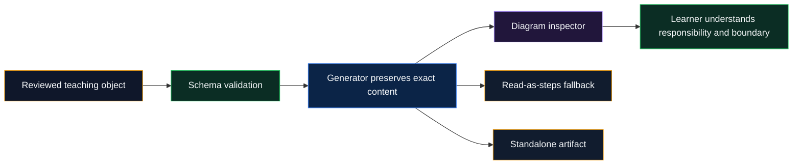
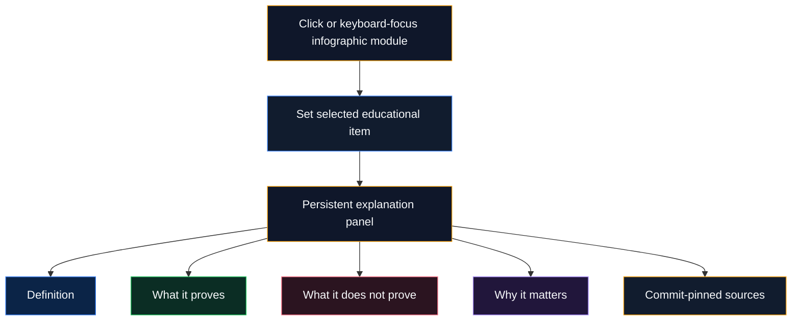
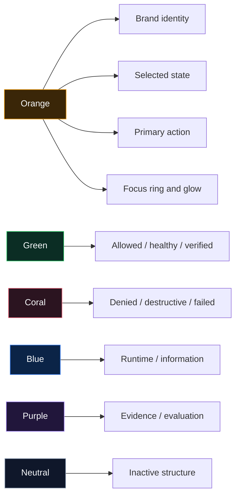
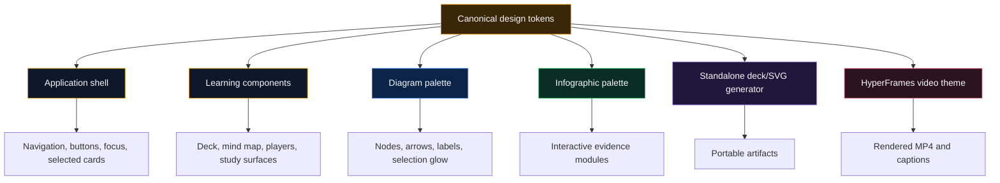
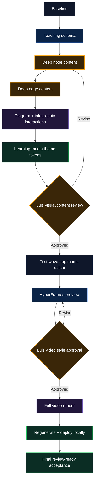

# Learning Explanations and Archon Evidence Dark Theme Implementation Plan

> **For Hermes:** Execute only after Luis explicitly approves this plan. Use small vertical slices, preserve `review-ready`, and do not commit, push, merge, publish, or spend provider budget without authorization.

**Goal:** Make every non-obvious diagram node and transition genuinely educational, make selected infographic modules explain themselves, and unify the learning experience, HyperFrames video, and selected application surfaces under the infographic’s dark palette with orange as Archon’s primary brand accent.

**Architecture:** Educational meaning will live in structured source data, not hardcoded Svelte prose. A shared semantic design-token layer will define the palette once and feed app components, learning diagrams, infographic interactions, generated standalone assets, and HyperFrames. The migration will be staged: establish contracts and tokens, enrich one complete request-lifecycle path, adopt the theme in learning media, then roll it into the wider app without confusing brand color with success, warning, or danger semantics.

**Tech stack:** SvelteKit 5, TypeScript, CSS custom properties/Tailwind v4, deterministic inline SVG, `@xyflow/svelte`, JSON Schema, Python artifact generator, Vitest, Playwright, pytest/jsonschema, HyperFrames/GSAP, ffmpeg/ffprobe.

---

## Decision digest

### Recommendation

Adopt the infographic palette as a real design system named **Archon Evidence Dark**, not as scattered copied hex values.

- Black/navy remains the canvas.
- Orange becomes the primary Archon identity, selected-state, focus, and emphasis color.
- Green remains success/verified/allowed.
- Coral remains danger/denied/destructive.
- Blue remains runtime/information.
- Purple remains evidence/evaluation.
- Neutral gray remains inactive structure.

This lets orange appear much more prominently across Archon while preserving operational meaning. Making every state orange would look attractive initially but would erase the distinction between “selected,” “successful,” “warning,” and “denied.”

### Root cause of the shallow explanations

The renderer is not the main problem. `scripts/build-learning-pilot.py:200-220` currently generates generic prose:

- node details: “owns one explicit responsibility…”
- edge details: “identifies which component initiates…”

The source file, `docs/visual-learning/pilot/request-lifecycle.json:298-495`, stores nodes and edges as short three-item arrays, so the generator has no deep educational explanation to preserve. The fix must start with the content contract and source data.

### Scope

This plan covers four coordinated workstreams:

1. Deep explanations for diagram boxes and arrows.
2. Clickable explanatory modules inside the infographic.
3. Shared palette across diagrams, infographic, deck, mind map, video, and selected app surfaces.
4. A controlled app-wide rollout of orange identity and glow.

### Explicit non-goals

- No redesign of flashcards, quiz, or study guide.
- No public deployment.
- No automatic publication; artifacts remain `review-ready`.
- No replacement of semantic success/error colors with orange.
- No generated-image dependency for factual diagrams.
- No autoplay or inaccessible hover-only explanations.

### Decisions requiring Luis’s approval

1. Approve orange as the app’s primary brand/selection accent while retaining semantic green/red/blue/purple.
2. Approve the first app-wide rollout surfaces: navigation selection, primary buttons, focus rings, selected cards, and key callouts—not every component at once.
3. Approve a HyperFrames re-render of the existing video after its palette is updated.

---

## Review map

| Luis’s feedback | Plan section |
|---|---|
| Explanations are too short | “Educational explanation contract” and Phases 1–3 |
| Policy, context, Run Ledger, result event, run evidence need depth | “Required concept coverage” |
| Infographic boxes should explain themselves | “Infographic interaction model” and Phase 4 |
| Use infographic colors everywhere | “Archon Evidence Dark palette” and Phases 5–6 |
| Orange glow should become an app motif | “Orange usage rules” and Phase 6 |
| Video and diagrams should share the theme | Phases 5 and 7 |
| Preserve what is already good | “Non-goals” and regression gates |

### Minimum reading path

Read only these sections for product approval:

1. Decision digest
2. Educational explanation contract
3. Required concept coverage
4. Infographic interaction model
5. Archon Evidence Dark palette
6. Phased delivery and approval gates

You may skip exact file lists, test commands, migration mechanics, and risk tables unless you want engineering detail.

---

## Current-state model


## Target-state model



---

## Educational explanation contract

### Node explanation contract

Every non-obvious node must answer six questions:

1. **What is it?** A precise plain-language definition.
2. **What does it receive?** Inputs or state entering the component.
3. **What responsibility does it own?** The decision/transformation it performs.
4. **What does it produce?** Output passed to the next component.
5. **What control or guarantee does it add?** Authorization, boundedness, traceability, isolation, or evaluation.
6. **Why does it matter?** The consequence for the request lifecycle and the failure if it is absent.

Proposed backward-compatible source shape:

```json
{
  "id": "policy",
  "label": "Policy",
  "kind": "security",
  "summary": "Deterministically decides whether a proposed effect is allowed, requires approval, or is denied.",
  "teaching": {
    "definition": "Policy is the deterministic authorization boundary between model-generated intent and side-effecting execution.",
    "receives": ["Validated tool name", "Normalized arguments", "Caller and project scope", "Declared risk classes"],
    "responsibility": "Evaluate matching rules and return ALLOW, ASK, or DENY without delegating the decision to the model.",
    "produces": ["A typed policy decision", "Matched-rule identity", "Reason suitable for audit"],
    "controls": ["Prevents model self-authorization", "Requires durable approval when policy returns ASK"],
    "failure_behavior": "Malformed or unclassified requests fail closed rather than reaching execution.",
    "why_it_matters": "A probabilistic model may propose an action, but only deterministic policy can grant authority to perform it."
  },
  "sources": ["..."]
}
```

### Edge explanation contract

Every non-obvious arrow must answer five questions:

1. **What crosses the boundary?** Concrete payload, event, decision, or capability.
2. **What changed before crossing?** Validation, authorization, normalization, execution, or persistence.
3. **Why can the next component trust it?** The guarantee or precondition established upstream.
4. **What happens if this transition fails?** Stop, deny, retry, record an error, or remain unproven.
5. **Why does the transition exist?** The architectural separation of responsibilities.

Proposed source shape:

```json
{
  "id": "tool-ledger-result-event",
  "source": "tool",
  "target": "run-ledger",
  "label": "result event",
  "teaching": {
    "payload": "A structured tool outcome containing status, normalized output or error information, timing, and correlation metadata.",
    "transformation": "Raw executor output is converted into a typed runtime event instead of being appended as unstructured text.",
    "trust_boundary": "The event crosses from effect execution into durable run history.",
    "precondition": "The effect was authorized and executed through the governed runtime path.",
    "failure_behavior": "Execution failures are recorded as explicit error outcomes; they are not rewritten into successful evidence.",
    "why_it_matters": "Evaluation and debugging need a reconstructable record of what actually happened, not only the assistant’s final wording."
  },
  "sources": ["..."]
}
```

### Display rules

- Keep the node label short inside the diagram.
- Use a one-sentence summary in the initial panel state.
- On click/focus, show structured headings: “Receives,” “Responsibility,” “Produces,” “Controls,” “Failure behavior,” and “Why it matters.”
- For arrows, show: “Carries,” “Crosses,” “Precondition,” “On failure,” and “Why this handoff exists.”
- Render sources after the explanation, pinned to `source_commit`.
- Keep the linear “Read the diagram as steps” fallback, but include the expanded transition explanation under each step.
- Avoid repeating the same generic sentence across nodes.

### Depth targets

| Concept class | Target depth |
|---|---:|
| Obvious entry concept: Browser, HTTP request | 35–70 words |
| Routing/identity: Gateway, Authentication | 70–110 words |
| Core agent concepts: Context, Runtime, Model, Policy, Tool | 110–180 words |
| Evidence concepts: Result event, Run Ledger, Run evidence, Evaluation | 120–190 words |
| Simple visible label | 1–4 words |

Word count is a regression guard, not a quality substitute. Tests must also assert required semantic fields and concept-specific vocabulary.

---

## Required concept coverage

### Context

Must explain:

- It is assembled explicitly; it is not magical model memory.
- Inputs: system instructions, project instructions, selected skills, bounded conversation history, retrieved evidence, identity/scope, and budget metadata.
- Provenance and ordering matter because contradictory instructions and stale retrieval can change behavior.
- Context-window and budget limits require selection/truncation.
- Output is a bounded model request, not durable memory.
- Failure modes: missing instructions, cross-project leakage, irrelevant retrieval, or context overflow.

### Runtime

Must explain:

- It is the orchestrator/bounded interpreter around the model.
- It owns typed state transitions, deadlines, iteration/tool-call/token/cost limits, and stop reasons.
- It invokes the provider but does not delegate control flow authority to the provider.
- It validates and routes model outputs.
- It records observable lifecycle events.
- Failure modes terminate explicitly rather than silently continuing.

### Model

Must explain:

- The model generates text or structured intent.
- It does not possess execution authority.
- It receives only the context assembled by the runtime.
- Its output is untrusted until parsed and validated.
- Provider errors, malformed output, or budget exhaustion remain runtime events.

### Policy

Must explain:

- Deterministic authorization happens after schema validation and before effects.
- Inputs include normalized tool identity, arguments, caller/project scope, and risk classes.
- Outcomes are ALLOW, ASK, or DENY.
- ASK creates an approval boundary; it does not mean “execute and ask later.”
- DENY fails closed.
- The matched rule and reason are evidence.
- The model cannot override policy.

### Tool intent

Must explain:

- This is a proposal, not an effect.
- It contains a tool name and structured arguments.
- Schema validation narrows syntactic validity.
- Policy separately determines authority.
- Invalid intent returns a governed failure and never reaches execution.

### Authorized effect

Must explain:

- This is the transition from policy/approval to execution.
- It carries the exact normalized operation that was authorized.
- Approval binding prevents argument substitution.
- Execution must not broaden scope after authorization.
- If approval is stale, missing, or mismatched, the effect must not run.

### Result event

Must explain:

- It is a typed record of the executor outcome.
- Includes success/error status, normalized output, timing, correlation/run identity, and relevant metadata.
- It is not equivalent to a successful result.
- Errors and timeouts remain first-class outcomes.
- It crosses from execution into durable history.

### Run Ledger

Must explain:

- It is an append-oriented chronology of run events.
- It captures requests, model/tool events, approvals, results, stop reasons, usage, and correlation metadata within documented limits.
- It enables reconstruction and debugging.
- It is not the model’s memory and not a claim that every external side effect is reversible.
- It should not mutate failed events into successful ones.

### Run evidence

Must explain:

- It is the relevant, inspectable subset of ledger records supplied to evaluation/review.
- It must retain provenance, ordering, status, and limitations.
- It is evidence of observed execution—not automatic proof of quality or deployment.
- Missing evidence must produce an “unproven/insufficient” judgment rather than a fabricated pass.

### Evaluation

Must explain:

- Evaluation is a post-run judgment separate from execution.
- It compares evidence against explicit criteria such as groundedness, task success, safety, or expected outcomes.
- It must not rewrite the ledger.
- Deterministic, model-graded, local, and live-provider evaluations have different evidence strength.
- A timeout or absent trace is not PASS.

---

## Infographic interaction model

The infographic already has the approved composition and colors. We will not redesign it again. We will add explanation behavior to selected high-value modules.



### Interactive targets

Make these elements real `<button>` controls:

- Core principles: all three principle rows.
- Evidence architecture: Capability claim, Code, Tests, Observation, Qualified verdict.
- Confidence journey: retain all five existing buttons.
- Why this matters: Credibility, Debuggability, Safer iteration, Interview clarity.
- Claim checklist: each question may select an explanation, but this is lower priority than the modules above.

### Interaction behavior

- Click, Enter, or Space selects an item.
- Selected item receives an orange border/glow plus an icon/text state; color is not the sole indicator.
- One persistent detail panel appears below the infographic journey, not in a modal.
- `aria-pressed` identifies the selected item.
- `aria-live="polite"` announces detail changes.
- Focus remains on the activated button.
- No hover-only content.
- Existing five-level selection remains intact.

### Content ownership

Move educational module descriptions out of hardcoded Svelte arrays and into the infographic artifact data generated from `request-lifecycle.json`. The component should render data; it should not become the canonical author of evidence claims.

---

## Archon Evidence Dark palette

### Canonical token proposal

```css
:root {
  --archon-canvas: #050b16;
  --archon-surface: #0f172a;
  --archon-surface-raised: #111c2e;
  --archon-border: #334155;
  --archon-text: #f8fafc;
  --archon-text-secondary: #cbd5e1;
  --archon-text-muted: #94a3b8;

  --archon-orange: #f59e0b;
  --archon-orange-strong: #d97706;
  --archon-orange-glow: rgba(245, 158, 11, 0.22);
  --archon-orange-glow-strong: rgba(245, 158, 11, 0.34);

  --archon-green: #22c55e;
  --archon-blue: #3b82f6;
  --archon-purple: #a78bfa;
  --archon-coral: #fb7185;
}
```

Exact values remain subject to WCAG contrast checks against the final surfaces.

### Semantic mapping



### Orange usage rules

Use orange for:

- active navigation item;
- selected learning artifact;
- selected diagram node/edge;
- primary call-to-action;
- focus-visible ring;
- important evidence callout;
- current step/progress marker;
- subtle hover/focus glow.

Do not use orange for:

- every border;
- success or ALLOW;
- errors or DENY;
- warnings when a dedicated warning state is required;
- long body text;
- large full-screen gradients.

### Glow specification

The approved orange box glow becomes a reusable elevation/state token:

```css
box-shadow:
  0 0 0 1px rgba(245, 158, 11, 0.42),
  0 0 24px var(--archon-orange-glow),
  0 12px 30px rgba(0, 0, 0, 0.32);
```

Use only on focus, selection, or one primary focal object per region. Permanent glow everywhere would flatten hierarchy and reduce the effect you like.

---

## Theme propagation architecture



### Source-of-truth decision

- App runtime: CSS custom properties in `frontend/src/app.css`.
- TypeScript/Svelte consumers that need literal values: a small exported palette object in `frontend/src/lib/archon-theme.ts` with tests that match the CSS token values.
- Python generator: a corresponding immutable palette dictionary in `scripts/build-learning-pilot.py`, tested against the documented palette contract.
- HyperFrames: values in `spikes/learning-media-video/index.html` and documented in `DESIGN.md`.

A later improvement could generate all formats from one JSON file, but that adds build plumbing. For this feature branch, contract tests are lower-risk than introducing a new cross-language build dependency.

---

## Phased delivery

### Phase 0: Re-establish a trustworthy baseline

**Objective:** Separate existing branch/test failures from this work before changing contracts.

**Files:** none expected.

**Steps:**

1. Capture `git status --short` and current branch.
2. Run focused current tests with learning-media environment variables explicitly unset.
3. Record any existing backend failures as baseline, especially the previously observed chat/health/durable-budget failures.
4. Run current frontend check, Vitest, and Visual Learning Playwright suites.
5. Do not “fix” unrelated baseline failures inside this change.

**Acceptance criteria:**

- Existing failures are documented before implementation.
- No new failure is mislabeled as pre-existing.

---

### Phase 1: Define the structured teaching contract

**Objective:** Make explanation quality part of the artifact contract rather than optional prose.

**Files:**

- Modify: `schemas/visual-learning/diagram.schema.json`
- Modify: `docs/visual-learning/pilot/request-lifecycle.json`
- Modify: `backend/tests/unit/test_learning_pilot.py`

**Steps:**

1. Add a failing schema/test fixture requiring `teaching` fields for non-obvious nodes.
2. Add a failing schema/test fixture requiring structured transition teaching fields.
3. Add concept-specific assertions for `policy`, `context`, `run-ledger`, `result-event`, `run-evidence`, and `evaluation`.
4. Add minimum depth guards without relying on word count alone.
5. Add required source references per node/edge instead of attaching the same first two generic sources everywhere.
6. Keep `summary`, `details`, and string `explanation` as backward-compatible rendered fallbacks.

**Acceptance criteria:**

- Schema rejects a technical node with only generic filler text.
- Schema rejects a transition with no payload/failure/boundary semantics.
- Sources remain repository-relative and later resolve against `source_commit`.

---

### Phase 2: Author deep node explanations

**Objective:** Replace generic generator prose with reviewed, source-grounded teaching content.

**Files:**

- Modify: `docs/visual-learning/pilot/request-lifecycle.json:298-445`
- Reference only: canonical runtime, policy, ledger, evaluation, and architecture docs/source files.

**Steps:**

1. Author concise explanations for Browser and Gateway.
2. Author deeper explanations for Authentication, Runtime, Model, Policy, Tool, Run Ledger, and Evaluation.
3. Explain both policy diagrams consistently without copying text blindly.
4. Add specific failure behavior and limitations.
5. Attach the narrowest relevant source links to each concept.
6. Review every claim against source code/docs; remove anything not proven.

**Acceptance criteria:**

- All nine governed-request nodes answer the six node questions.
- Policy explicitly says the model cannot authorize itself.
- Run Ledger is distinguished from model memory and evaluation.
- Evaluation is distinguished from execution.

---

### Phase 3: Author deep edge explanations

**Objective:** Teach what every arrow carries and why each handoff exists.

**Files:**

- Modify: `docs/visual-learning/pilot/request-lifecycle.json:341-445`
- Modify: `scripts/build-learning-pilot.py:193-224`

**Steps:**

1. Expand `identity`, `context`, `tool intent`, `authorized effect`, `result event`, and `run evidence` first.
2. Keep `HTTP request` and `routes request` shorter but still state payload and trust boundary.
3. Expand policy-gate arrows: tool request, valid request, ALLOW, ASK, bound approval, DENY.
4. Change the generator to preserve source-authored objects instead of generating generic templates.
5. Fail generation when required structured teaching content is absent.
6. Produce a readable flattened `details`/`explanation` fallback for older renderers and standalone exports.

**Acceptance criteria:**

- “Result event” is not described as synonymous with success.
- “Run evidence” states that evidence supports evaluation but does not guarantee PASS.
- “Authorized effect” identifies exact-operation binding and fails closed on mismatch.
- No generated explanation contains the old generic phrases.

---

### Phase 4: Upgrade diagram and infographic inspectors

**Objective:** Render the new teaching structure without overcrowding the canvas.

**Files:**

- Modify: `frontend/src/lib/components/learning/OrderedProcessGraph.svelte`
- Modify: `frontend/src/lib/components/learning/LearningGraph.svelte`
- Modify: `frontend/src/lib/components/learning/DiagramViewer.svelte`
- Modify: `frontend/src/lib/components/learning/InfographicViewer.svelte`
- Modify: `frontend/src/lib/learning-artifacts.ts` or current artifact type declarations
- Test: `frontend/tests/visual-learning-artifacts.spec.ts`
- Test: relevant Vitest artifact/component tests

**Steps:**

1. Add TypeScript types for structured node and edge teaching data.
2. Render labeled sections instead of one paragraph in the diagram inspector.
3. Add an orange selected glow to nodes/edges using shared tokens.
4. Preserve keyboard activation and `aria-live` updates.
5. Convert approved infographic modules into semantic buttons.
6. Add one persistent infographic explanation panel.
7. Move infographic educational copy into artifact data.
8. Preserve the existing layout and colors exactly unless interaction requires a focus/selected treatment.
9. Test mouse, keyboard, and screen-reader semantics.

**Acceptance criteria:**

- Clicking Policy shows definition, inputs, responsibility, output, controls, failure, and importance.
- Clicking “result event” shows payload, boundary, precondition, failure, and purpose.
- Clicking Code/Tests/Observation in the infographic explains what each proves and does not prove.
- No tooltip or hover is required to understand content.

---

### Phase 5: Create shared Archon Evidence Dark tokens

**Objective:** Convert the approved infographic palette into reusable semantics.

**Files:**

- Modify: `frontend/src/app.css:38-98`
- Create: `frontend/src/lib/archon-theme.ts`
- Create: `frontend/src/lib/archon-theme.test.ts`
- Modify: learning component styles that currently hardcode palette values
- Modify: `scripts/build-learning-pilot.py:52-110`

**Steps:**

1. Add canonical black/surface/text/orange/green/blue/purple/coral tokens.
2. Introduce orange glow tokens for low and strong emphasis.
3. Map existing aliases to the new palette without deleting legacy variables immediately.
4. Replace learning-component raw hex values with semantic tokens.
5. Update generated standalone SVG/deck colors to match.
6. Add contrast assertions/documented measurements for text/background pairs.
7. Add a test that catches drift between TypeScript and CSS palette values.

**Acceptance criteria:**

- Infographic, diagrams, mind map, deck, and players use the same named palette.
- Selected/focus state is orange.
- Success, danger, runtime, and evidence retain distinct colors.
- Normal text meets WCAG AA contrast.

---

### Phase 6: Controlled app-wide orange rollout

**Objective:** Make the wider application feel like the approved infographic without repainting every component blindly.

**First-wave surfaces:**

- Primary navigation active item.
- Primary action buttons.
- Focus-visible rings.
- Selected cards/list rows.
- Important callout/icon containers.
- Progress/current-step indicators.
- Login/brand mark.

**Likely files:**

- Modify: `frontend/src/app.css`
- Modify: `frontend/src/routes/+layout.svelte` or the current navigation component
- Modify: `frontend/src/routes/login/+page.svelte`
- Modify: `frontend/src/routes/settings/+page.svelte`
- Modify: `frontend/src/routes/documents/+page.svelte`
- Modify: selected state styles in Chat, Dashboard, Eval, Memory, Learn, and Skills/Integrations components discovered during implementation
- Test: existing route/component tests and a new theme smoke spec

**Steps:**

1. Inventory uses of `--accent`, `--accent-glow`, cyan literals, and gradient accents.
2. Classify each use as brand, selection, information, success, warning, or danger.
3. Remap only brand/selection/focus uses to orange.
4. Keep green/red/blue/purple semantic uses intact.
5. Replace the current teal-to-purple brand gradients with restrained orange treatment where appropriate.
6. Apply glow only to focused/selected/focal elements.
7. Capture screenshots of every top-level route at desktop and mobile widths.
8. Stop and request Luis’s visual review before a second-wave migration.

**Acceptance criteria:**

- The app visibly belongs to the same family as the infographic.
- Orange is recognizable as Archon’s identity.
- Operational statuses remain unambiguous.
- No route becomes an orange monochrome interface.

---

### Phase 7: Re-theme diagrams, deck, and HyperFrames video

**Objective:** Make all learning media feel like one authored series.

**Files:**

- Modify: `frontend/src/lib/components/learning/OrderedProcessGraph.svelte`
- Modify: `frontend/src/lib/components/learning/LearningNodeCard.svelte`
- Modify: `frontend/src/lib/components/learning/LearningGraph.svelte`
- Modify: `frontend/src/lib/components/learning/PresentationPlayer.svelte`
- Modify: `spikes/learning-media-video/index.html`
- Modify: `spikes/learning-media-video/DESIGN.md`
- Modify: `spikes/learning-media-video/STORYBOARD.md` only if scene visuals change materially
- Regenerate external MP4 under `/Users/luisvalencia/Documents/archon-learning-media/`

**Visual mapping:**

- Canvas: `--archon-canvas`.
- Default node: dark surface + neutral border.
- Selected/current node: orange border and restrained orange glow.
- Runtime/context: blue.
- Policy/approval: orange for active governance, coral only for DENY/failure.
- ALLOW/verified: green.
- Evidence/ledger/evaluation: purple.
- Arrows: muted neutral by default, orange on active path.
- Labels: dark opaque masks with high-contrast text.

**HyperFrames steps:**

1. Update video CSS variables to the canonical palette.
2. Replace mint as the general brand accent with orange.
3. Preserve semantic ALLOW green and DENY coral.
4. Add restrained orange glow to the active node/gate in each scene.
5. Keep motion deterministic and measured.
6. Render a short preview first.
7. Review still frames at the six scene boundaries.
8. Render the full MP4 only after visual approval.
9. Validate duration, dimensions, frame rate, H.264/AAC streams, captions, and checksum.
10. Regenerate catalog metadata without storing the large MP4 in Git.

**Acceptance criteria:**

- Video, deck, diagrams, mind map, and infographic share the same canvas, surfaces, text, and accent roles.
- The video is not merely recolored; active-path emphasis follows the narrative.
- No semantic decision is communicated by color alone.

---

### Phase 8: Regenerate and validate the learning pack

**Objective:** Prove source data, generated artifacts, and runtime display agree.

**Files/artifacts:**

- Regenerate: `/Users/luisvalencia/Documents/archon-learning-media/catalog.json`
- Regenerate: diagram JSON/SVG artifacts
- Regenerate: deck HTML/JSON if palette is shared there
- Preserve/regenerate external audio and video as authorized

**Commands:**

```bash
cd /Users/luisvalencia/Documents/archon
uv run python scripts/build-learning-pilot.py \
  --output /Users/luisvalencia/Documents/archon-learning-media \
  --audio /Users/luisvalencia/Documents/archon-learning-media/published/request-lifecycle/request-audio/request-lifecycle.mp3 \
  --video /Users/luisvalencia/Documents/archon-learning-media/published/request-lifecycle/request-video/request-lifecycle.mp4
```

Then run:

```bash
cd backend
uv run pytest -q tests/unit/test_learning_pilot.py

cd ../frontend
npm run check
npx vitest run
npx playwright test tests/visual-learning.spec.ts tests/visual-learning-artifacts.spec.ts
npm run build
```

**Acceptance criteria:**

- All artifacts validate against schemas.
- No generic generated explanation remains.
- MP3/MP4 are preserved outside Git.
- Pack remains `review-ready`.

---

### Phase 9: Local deployment and visual acceptance

**Objective:** Verify the real retained runtime, not only mocks.

**Steps:**

1. Rebuild only affected frontend/backend services.
2. Reload gateway routing only if recreated service addresses require it.
3. Run `./scripts/local-stack.sh status`.
4. Verify `/healthz` and `/readyz` return HTTP 200.
5. Authenticate and inspect `http://archon/learn?view=present`.
6. Click every node and arrow in both diagrams.
7. Click every interactive infographic module.
8. Inspect mind map, deck, and video at desktop and mobile sizes.
9. Verify focus rings, keyboard activation, and no horizontal overflow.
10. Ask Luis for visual/content approval before changing status from `review-ready`.

**Acceptance criteria:**

- Runtime status and HTTP readiness pass.
- Deep explanations are readable without covering the diagram.
- Visual theme is consistent across all learning artifacts.
- App-wide orange rollout is visually coherent and semantically safe.

---

## Testing strategy

### Deterministic content tests

Add assertions that:

- every technical node has all teaching fields;
- every technical edge has payload, boundary/precondition, failure, and purpose;
- Policy includes ALLOW/ASK/DENY and model non-authority;
- Context includes instructions/history/skills/retrieval/bounds/provenance;
- Result event distinguishes success from failure;
- Run Ledger includes chronology and stop reasons;
- Run evidence includes provenance and does not imply PASS;
- Evaluation remains separate from execution;
- forbidden generic template phrases are absent.

### Component tests

Test:

- rendering each teaching subsection;
- selecting a node replaces edge details and vice versa;
- clicking infographic modules updates the persistent explanation panel;
- Enter/Space activation;
- selected states expose `aria-pressed` or equivalent;
- source links remain commit-pinned.

### Browser tests

Test:

- a learner can navigate Policy → authorized effect → Tool;
- the “Read as steps” fallback contains equivalent explanations;
- selected node/edge gets orange identity plus visible text state;
- infographic modules are reachable and explanatory;
- no mobile horizontal overflow;
- video controls/captions remain functional after replacement.

### Visual QA matrix

| Artifact | Desktop | Tablet | Mobile | Keyboard | Screenshot review |
|---|---:|---:|---:|---:|---:|
| Governed Request Path | Yes | Yes | Yes | Yes | Yes |
| Tool Governance Decision | Yes | Yes | Yes | Yes | Yes |
| Evidence Ladder infographic | Yes | Yes | Yes | Yes | Yes |
| Mind map | Yes | Yes | Yes | Yes | Yes |
| Deck | Yes | Yes | Yes | Yes | Yes |
| Video | 1920×1080 | N/A | Player | Controls | Six still frames |
| App shell/major routes | Yes | Yes | Yes | Yes | Yes |

---

## File impact map

### Content and contracts

- `docs/visual-learning/pilot/request-lifecycle.json`
- `schemas/visual-learning/diagram.schema.json`
- Optional new schema/section for infographic teaching data
- `backend/tests/unit/test_learning_pilot.py`

### Generation

- `scripts/build-learning-pilot.py`
- `docs/visual-learning/hermes-generation-runbook.md`
- `docs/visual-learning/hermes-generation-promptbook.md`

### Learning frontend

- `frontend/src/lib/components/learning/OrderedProcessGraph.svelte`
- `frontend/src/lib/components/learning/LearningGraph.svelte`
- `frontend/src/lib/components/learning/LearningNodeCard.svelte`
- `frontend/src/lib/components/learning/DiagramViewer.svelte`
- `frontend/src/lib/components/learning/InfographicViewer.svelte`
- `frontend/src/lib/components/learning/PresentationPlayer.svelte`
- `frontend/src/lib/components/learning/MindMapViewer.svelte`
- artifact TypeScript declarations
- `frontend/tests/visual-learning-artifacts.spec.ts`

### Theme/application

- `frontend/src/app.css`
- `frontend/src/lib/archon-theme.ts`
- selected route/components discovered in the token inventory
- theme/unit/browser tests

### HyperFrames

- `spikes/learning-media-video/index.html`
- `spikes/learning-media-video/DESIGN.md`
- `spikes/learning-media-video/STORYBOARD.md` if needed
- external rendered MP4 and updated catalog checksum/metadata

---

## Delivery sequence and approval gates



### Gate A: Educational content approval

Before app-wide theme work, Luis reviews:

- Policy node explanation.
- Context node explanation.
- Run Ledger node explanation.
- Result event arrow explanation.
- Run evidence arrow explanation.
- One interactive infographic module from each section.

### Gate B: Theme approval

Before wider rollout, Luis reviews:

- app navigation active state;
- primary button;
- selected card;
- focus ring;
- one orange-glow callout;
- diagram selected node/arrow;
- HyperFrames preview frame.

### Gate C: Publication approval

Technical PASS does not change `review-ready` to `published`. Luis approves educational quality separately.

---

## Risks and mitigations

| Risk | Impact | Mitigation |
|---|---|---|
| Long explanations overwhelm the canvas | High | Keep labels short; render depth only in a persistent inspector and textual fallback |
| Orange used everywhere loses impact | High | Restrict glow to focus/selection/focal elements; retain semantic palette |
| Content drifts from implementation | High | Require narrow source links and concept-specific tests |
| Generator reintroduces generic prose | High | Remove generic fallback and fail validation for missing teaching content |
| App-wide token change causes visual regressions | High | Staged route inventory, screenshots, and human review gate |
| Video palette differs after render | Medium | Shared documented palette, preview frames, ffprobe/checksum verification |
| Color alone communicates state | High | Preserve icons, labels, ALLOW/ASK/DENY text, focus outlines, and ARIA state |
| Existing dirty branch complicates review | Medium | Touch only scoped files; inspect diff by file; no drive-by formatting |
| Existing backend test failures obscure regressions | Medium | Re-establish baseline with environment variables unset; compare focused and full gates |

---

## Definition of done

This initiative is complete only when:

- [ ] Every diagram node has responsibility/input/output/control/failure/importance content appropriate to its complexity.
- [ ] Every diagram edge explains payload, transformation/boundary, precondition, failure, and purpose.
- [ ] Policy, Context, Runtime, Model, Tool intent, Authorized effect, Result event, Run Ledger, Run evidence, and Evaluation meet the deep-content acceptance criteria.
- [ ] No generic generated explanation remains.
- [ ] Selected infographic modules reveal persistent, keyboard-accessible explanations.
- [ ] The infographic composition and approved colors remain unchanged except for interaction states.
- [ ] Learning artifacts use Archon Evidence Dark tokens.
- [ ] App first-wave brand/selection/focus surfaces use orange consistently.
- [ ] Semantic green/red/blue/purple meanings remain intact.
- [ ] HyperFrames video is re-themed, rendered, probed, and visually reviewed.
- [ ] Frontend checks, tests, browser tests, and build pass.
- [ ] Backend artifact/schema tests pass; full-suite baseline differences are disclosed.
- [ ] Local stack status and HTTP readiness pass.
- [ ] Browser QA finds no clipping, overlap, low contrast, or inaccessible interaction.
- [ ] Catalog remains `review-ready` until Luis approves publication.
- [ ] No commit, push, merge, public deployment, or provider spend occurs without authorization.
