# Plan — Hybrid Multi-Agent Orchestration for Archon

**Status:** Phase-one pilot implemented, independently approved, hot-swapped into the retained local stack, and deterministically verified; live-provider Team quality acceptance remains separate
**Prepared with:** GPT-5.6
**Date:** 2026-09-05
**Target:** Archon local Agent Reliability Workbench
**Language policy:** implementation/docs in English; this planning explanation is in Spanish

> Implementation note: the bounded phase-one slice is documented in
> `docs/architecture/hybrid-agent-orchestration.md`. It intentionally implements
> sequential depth-one fixed + dynamic-template children before the broader
> parallel-planner and aggregate-budget phases described below.
> Current acceptance includes enforced child runtime budgets, one aggregate Team
> deadline, durable cancellation/lineage, reload reconstruction in the Agents
> inspector, 745 marked backend unit tests, 73 frontend unit tests, a production
> frontend build, and focused Playwright coverage. The retained stack is ready at
> `http://archon` with the feature enabled; no live-provider Team prompt was sent.

## 1. Executive decision

La dirección recomendada es un modelo híbrido con tres modos visibles:

- **Auto** — default. Archon decide entre single-agent y team execution usando un router limitado y auditable.
- **Single** — override explícito. Un solo `AgentRuntime` ReAct, sin herramientas de delegación.
- **Team** — override explícito. Fuerza planificación multi-agent, sujeto a política, presupuesto y límites.

El usuario **no debe tener que escoger para cada mensaje**. `Auto` debe funcionar como el camino normal. Sin embargo, el usuario sí debe poder forzar `Single` o `Team` para aprendizaje, comparación, demos, control de coste y debugging.

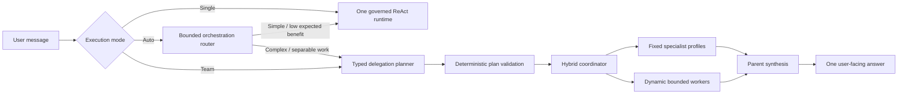

### Key architectural decision

Do **not** wire `backend/app/agents/multi_agent.py` directly into the default chat path. It is useful historical scaffolding, but it bypasses or weakens several controls now present in the canonical runtime:

- typed `ModelProvider` contract;
- durable monetary budget;
- effective-context preparation;
- scoped tools and MCP governance;
- policy and approvals;
- durable effect ledger;
- deadlines and cancellation;
- Run Ledger events and safe projections;
- sync/SSE parity;
- result persistence and current UI contracts.

The correct work is to **re-platform multi-agent orchestration on top of the current typed runtime**, not to redirect chat to the legacy four-call pipeline.

---

## 2. Current truth established from source

### Exists

- `backend/app/agents/multi_agent.py`
  - `AgentCoordinator`
  - `PlannerAgent`
  - `RetrieverAgent`
  - `ValidatorAgent`
  - `SynthesizerAgent`
- `backend/app/agents/resilient_coordinator.py`
  - retries, timeout, fallback, estimated token accounting, in-memory message list.
- `backend/app/routes/multi_agent.py`
  - authenticated `POST /api/chat/multi-agent` route using `ResilientCoordinator`.
- Unit tests for the classes and route.
- Modern bounded delegation already exists separately:
  - signed envelopes;
  - strict child contracts;
  - durable parent-child runs;
  - evidence-only verifier;
  - safe delegation events.

### Not wired to the product path

- `frontend/src/lib/components/Workbench.svelte` calls only `POST /api/chat/stream`.
- The normal sync path is `POST /api/chat`.
- Neither request contract exposes an execution mode.
- The Workbench has no specialist/delegation model.
- The Inspector has no agent graph or child-run view.
- The default chat path never invokes `ResilientCoordinator`.

### Important correction to the earlier summary

The statement “multi-agent is implemented and tested” is too broad. More precise:

> A sequential coordinator prototype and a separate bounded verifier-child architecture exist and have deterministic tests. The coordinator prototype is not integrated with the canonical chat runtime, effective context, tools, durable budgets, Run Ledger lifecycle or Workbench. The live product remains single-agent ReAct, except for the narrow verifier child used in the grounded-RAG workflow.

### Current versus desired path

```mermaid
flowchart TB
    subgraph CURRENT[Current product path]
      U1[User] --> SSE1[/api/chat/stream]
      SSE1 --> C1[Prepare effective context]
      C1 --> R1[AgentRuntime ReAct]
      R1 --> T1[Governed tools]
      R1 --> A1[Answer]
    end

    subgraph PROTOTYPE[Separate prototype path]
      U2[Direct API caller] --> MA[/api/chat/multi-agent]
      MA --> L1[Legacy LLMClient]
      L1 --> P1[Planner]
      P1 --> R2[Retriever]
      R2 --> V1[Validator]
      V1 --> S1[Synthesizer]
    end

    subgraph TARGET[Target unified path]
      U3[User] --> API[Same chat API]
      API --> OR[Mode + router]
      OR -->|single| R3[Canonical AgentRuntime]
      OR -->|team| HC[Governed HybridCoordinator]
      HC --> CR[Bounded child AgentRuntimes]
      CR --> R3
      R3 --> A3[Answer + lineage + evidence]
    end
```

---

## 3. Product behavior and frontend choice

## 3.1 Recommended control: Auto with explicit overrides

The composer receives a compact segmented control:

```text
Execution     [ Auto ▾ ]
              ├─ Auto       Recommended; route per task
              ├─ Single     Lowest coordination overhead
              └─ Team       Force bounded specialist planning
```

### Behavior

| Mode | User intent | Backend behavior | UI label |
|---|---|---|---|
| Auto | “Choose for me” | Router selects `single` or `team`; malformed/timeout routes to `single` | `Auto → Single` or `Auto → Team` |
| Single | “Do not delegate” | Delegation capabilities are absent; one parent runtime | `Single agent` |
| Team | “Use specialists” | Planner must produce a valid bounded plan; policy can still deny unsafe delegation | `Team requested` |

### Why not hide it completely?

Automatic-only orchestration is easy to demo but hard to understand, compare and debug. Manual-only orchestration adds friction and makes users guess architecture. The hybrid UI provides:

- a safe default;
- cost and latency control;
- reproducible evaluation (`Single` versus `Team`);
- transparent interview demos;
- a user escape hatch when automatic routing is wrong.

### What the user should not select

The user should not manually choose individual internal agents for normal chat. That exposes implementation details and encourages “agent theater.” A later advanced/debug view may allow profile pinning, but it is not part of the first release.

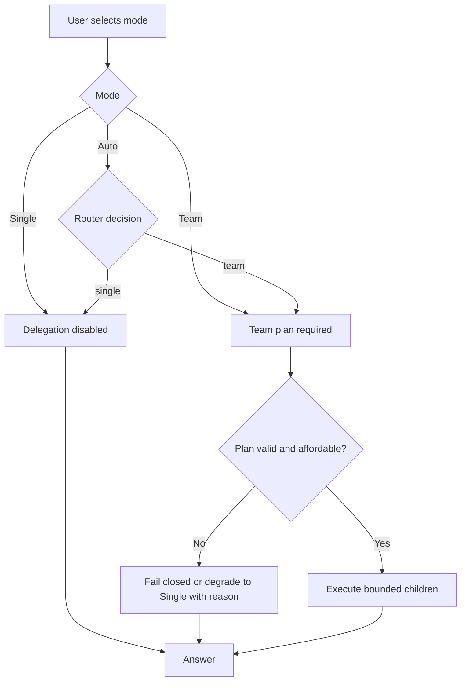

## 3.2 Frontend evidence, not chain-of-thought

The UI shows operational facts, never hidden reasoning:

- requested and resolved mode;
- router version and closed reason codes;
- specialist name/profile revision;
- child status: queued/running/completed/failed/timed out/cancelled;
- bounded goal summary or goal hash, not private prompt text;
- allowed capability IDs, not credentials or raw tool arguments;
- parent/child lineage;
- tokens, cost, latency and retry count;
- fallback/degraded state;
- citations/evidence references;
- approval status for any governed effect.

It must not expose:

- chain-of-thought;
- system prompts;
- raw delegated context;
- credentials;
- raw provider errors;
- unredacted tool arguments/results.

## 3.3 Proposed Workbench layout

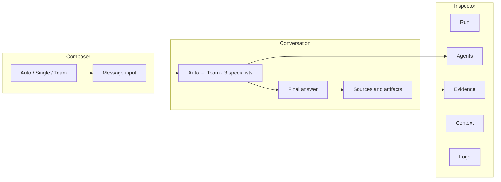

Recommended Inspector change:

- Add an **Agents** tab instead of burying delegation in generic logs.
- Render a hierarchical DAG on desktop and an ordered accessible list on mobile.
- Clicking a child opens its safe metadata, events, budget and evidence.
- Keyboard support must equal pointer support; no hover-only information.

---

## 4. Target architecture

## 4.1 Separate four concerns

1. **Routing** — should this request remain single-agent or use a team?
2. **Planning** — if team, what bounded DAG of tasks is allowed?
3. **Execution** — run fixed or dynamic children under inherited controls.
4. **Synthesis** — combine typed child outputs into one parent answer.

Do not let one prompt silently own all four concerns.

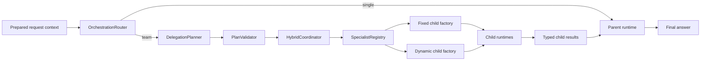

## 4.2 Fixed specialists

Fixed specialists are versioned code-defined profiles for common, quality-sensitive work. Initial profiles should be narrow:

| Profile | Purpose | Initial tools | Output contract |
|---|---|---|---|
| `researcher-v1` | Gather web/project/document evidence | approved read/search/RAG capabilities only | evidence bundle with source references |
| `code-analyst-v1` | Inspect project code and explain behavior | project-scoped read/list/search only | findings with file/symbol references |
| `reliability-reviewer-v1` | Review a proposal/result against reliability and security checks | no side-effect tools; optionally evidence reads | issue list with severity/reason codes |
| `evidence-verifier-v1` | Verify claims against delegated evidence | no tools | existing strict verdict contract |

Planner and synthesizer should be parent orchestration roles, not four mandatory child calls. The legacy names `PlannerAgent`, `RetrieverAgent`, `ValidatorAgent`, `SynthesizerAgent` should not force every query through four expensive sequential calls.

## 4.3 Dynamic workers

A dynamic worker is created on demand from:

- a server-owned generic child system template;
- a runtime task goal;
- a typed expected-output contract;
- an allowlisted subset of the parent’s capabilities;
- a finite budget/deadline;
- parent/child identity and signed scope.

This answers the original conceptual question: an on-the-fly agent **can still have a predefined system prompt**. The stable safety/behavior template is fixed in code; the task goal and permitted capability subset are supplied at runtime.

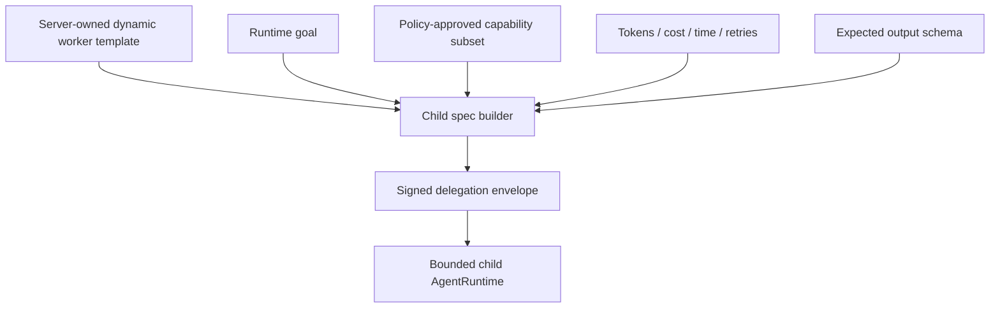

### Initial dynamic-worker boundary

- maximum depth: **1**;
- maximum children per parent: **3**;
- children cannot delegate;
- initial dynamic tools are **read-only**;
- no memory writes from children;
- no background jobs from children;
- no arbitrary MCP capability forwarding;
- no code execution or terminal in the first vertical slice;
- approvals remain parent/user bound;
- cancellation propagates from parent to all children;
- independent read-only tasks may run concurrently;
- any malformed plan or scope expansion fails before provider execution.

These limits can be reconsidered only with evidence. They are not arbitrary product restrictions; they keep cost, authority and failure analysis understandable.

## 4.4 Typed orchestration contracts

Proposed domain types:

```text
ExecutionMode = auto | single | team
ResolvedExecutionMode = single | team
SpecialistKind = fixed | dynamic
DelegationStatus = planned | running | completed | failed | timed_out | cancelled | denied

OrchestrationDecision
  requested_mode
  resolved_mode
  router_version
  reason_codes[]
  confidence?             # optional; not an authority signal
  plan_required

DelegationPlan
  plan_id
  parent_run_id
  tasks[]
  dependency_edges[]
  max_parallelism
  synthesis_contract

DelegationTask
  task_id / child_run_id
  kind
  fixed_profile_id + revision OR dynamic_goal_hash
  goal
  expected_output_schema
  capability_ids[]
  context_reference_ids[]
  dependency_ids[]
  token/cost/time/tool budgets

DelegationResult
  task_id / child_run_id
  status
  output (bounded, validated, transient)
  output_hash
  evidence_refs[]
  usage
  latency
  safe_reason_codes[]
```

Raw task/result text should not be copied into generic events. Parent synthesis may consume bounded result content in memory; durable evidence stores hashes, counts, identities and allowlisted references.

### Envelope compatibility decision

The current `DelegationEnvelope` schema v1 does not expose `goal_hash` or
`capability_ids` as top-level fields. It already signs a canonical
`context_hash`. The first implementation should bind the complete dynamic
child authorization transitively by computing that hash over a closed
canonical object containing:

- goal hash;
- fixed profile ID/revision or dynamic-worker template revision;
- sorted capability IDs plus their schema hashes;
- expected-output schema hash;
- bounded context-reference IDs/hashes;
- parent/child/owner/project scope already carried by the envelope.

Any change to goal, capabilities, schema or context must change
`context_hash` and fail verification before provider execution. This keeps the
existing evidence-verifier envelope compatible. Introduce envelope schema v2
only if direct signed-field introspection becomes a real requirement; if that
happens, v1 verifier envelopes and v2 general-worker envelopes must coexist
with explicit version tests rather than silently changing v1 semantics.

## 4.5 Router policy

`Auto` should use a two-stage policy:

1. **Deterministic eligibility gate** — cheap, reproducible and fail-closed.
2. **Optional bounded planner decision** — strict structured output, no tools, one retry maximum.

Example team-positive signals:

- explicit request for independent research plus verification;
- compare multiple alternatives/sources;
- task naturally decomposes into two or more independent domains;
- code inspection plus security/reliability review;
- broad research where parallel evidence gathering has measurable benefit.

Example single-positive signals:

- greeting, rewrite, translation, short explanation;
- one calculator/tool call;
- narrow lookup;
- task cannot be safely decomposed;
- remaining budget is insufficient;
- attachments/context cannot be safely delegated;
- planner timeout/malformed plan.

Router reason codes must be closed enums, for example:

```text
user_forced_single
user_forced_team
simple_single_step
parallel_research_benefit
cross_domain_review
insufficient_budget
unsafe_capability_scope
planner_timeout
planner_invalid_output
team_not_available
```

## 4.6 Budget model

The current `TokenBudgetManager` estimates output characters and is not sufficient. Team mode must integrate with provider-reported and durable budgets.

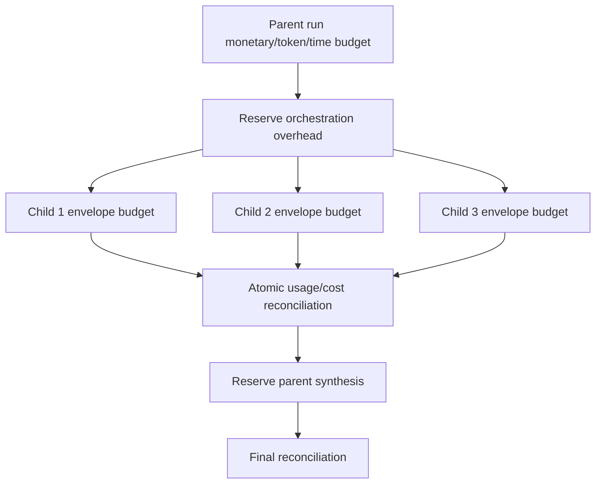

Required invariants:

- child reservation cannot exceed remaining parent/project budget;
- total children plus synthesis remain within parent deadline;
- retries consume the same durable budget boundary;
- unknown usage receives a conservative estimate;
- exact concurrency cannot overspend through races;
- cancellation reconciles or records indeterminate state honestly;
- `Team` request may be denied or degraded when budget is insufficient.

Aggregate multi-child reservation must be a durable database operation, not an
in-memory sum. Before child launch, the coordinator reserves the complete
approved child envelope plus synthesis allowance against the parent/project
budget using the repository's atomic PostgreSQL update/locking semantics. Each
child reconciles against that reservation; unused allowance is released, and
concurrent fan-out cannot make the parent/project invariant negative. The
exact repository method should follow the existing monetary-budget pattern
and must have real PostgreSQL contention tests.

## 4.7 Trust and authority model

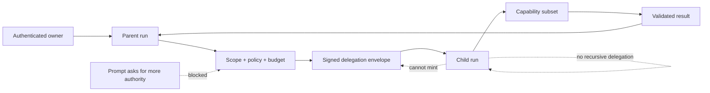

Mandatory properties:

- owner/project scope preserved at every hop;
- parent issues the envelope; child cannot self-authorize;
- exact task/context/budget/capability hashes are signed;
- nonce replay prevention remains durable;
- capability set is a strict subset of the parent’s authorized set;
- effectful tools remain unavailable to children in phase 1;
- system templates are server-owned and versioned;
- child output is untrusted until schema and provenance checks pass;
- parent synthesis cannot convert a child statement into evidence without references.

## 4.8 Failure semantics

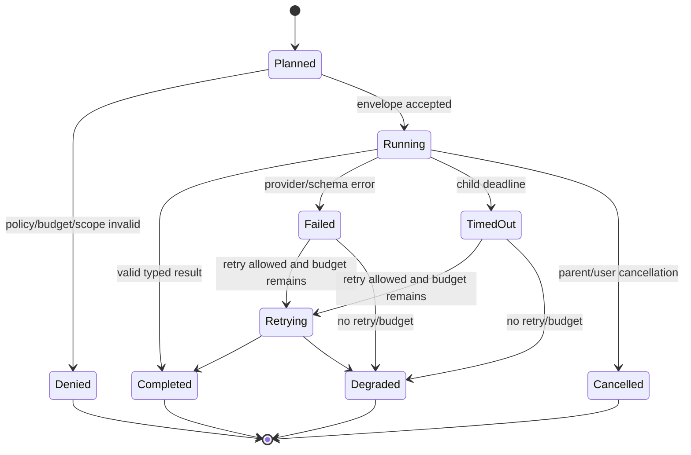

No fallback may claim validation happened when it was skipped. The current prototype fallback `{"approved": true, "reason": "validation skipped"}` must not survive. Correct behavior is `unknown`/`escalated`/`degraded`, visible to the parent and UI.

---

## 5. Unified API design

## 5.1 Request contracts

Add the same optional field to both live chat transports:

```text
execution_mode: auto | single | team = auto
```

Affected current contracts:

- `backend/app/routes/chat.py:ChatRequest`
- `backend/app/routes/stream.py:StreamRequest`

Do not create separate semantics for `/api/chat/multi-agent`.

## 5.2 Responses and SSE

Add safe events:

```text
orchestration_routed
orchestration_plan_created
child_run_started
child_run_progress       # closed status metadata only
child_run_completed
child_run_failed
orchestration_degraded
```

SSE projection examples:

```text
event: orchestration
data: {requested_mode, resolved_mode, reason_codes, plan_id, child_count}

event: agent_status
data: {child_run_id, profile_id, kind, status, elapsed_ms, safe_reason_code}

event: done
data: {...existing, requested_mode, resolved_mode, children_used, orchestration_degraded}
```

Sync `ChatResponse` must contain equivalent summary fields so sync and SSE remain semantically aligned.

## 5.3 Legacy route lifecycle

1. Keep `/api/chat/multi-agent` unchanged during characterization tests only.
2. Build the unified path behind `hybrid_orchestration_enabled=false`.
3. Once sync/SSE and UI acceptance pass, mark the old route deprecated in docs and response headers.
4. Remove it only in a later compatibility change, or return a documented migration response.
5. Remove/retire legacy coordinator code only after all useful tests are migrated to the new contracts.

---

## 6. Proposed source structure

### Backend new package

```text
backend/app/orchestration/
  __init__.py
  models.py                 # immutable enums/contracts
  routing.py                # deterministic eligibility + bounded decision
  planning.py               # structured plan generation
  validation.py             # DAG/scope/budget/schema validation
  profiles.py               # versioned fixed specialist registry
  child_factory.py          # fixed/dynamic child AgentRuntime construction
  coordinator.py            # execute DAG, cancellation, result collection
  synthesis.py              # compact typed child result projection
  events.py                 # safe orchestration projections/helpers
```

### Existing backend files expected to change

```text
backend/app/config.py
backend/app/main.py
backend/app/routes/chat.py
backend/app/routes/stream.py
backend/app/runtime/events.py
backend/app/runtime/factory.py
backend/app/services/run_ledger.py
backend/app/services/db_store.py         # only if durable metadata needs schema changes
backend/app/delegation/envelope.py
backend/app/delegation/models.py
backend/app/observability/runtime_events.py
```

### Frontend new components

```text
frontend/src/lib/components/ExecutionModeSelector.svelte
frontend/src/lib/components/AgentOrchestrationPanel.svelte
frontend/src/lib/components/AgentRunGraph.svelte
frontend/src/lib/components/AgentRunList.svelte
frontend/src/lib/orchestration.ts
frontend/src/lib/orchestration.test.ts
```

### Existing frontend files expected to change

```text
frontend/src/lib/types.ts
frontend/src/lib/components/Workbench.svelte
frontend/src/lib/components/ChatInput.svelte
frontend/src/lib/components/Inspector.svelte
frontend/src/lib/components/RunTimeline.svelte
frontend/src/lib/runs.ts
frontend/tests/workbench.spec.ts
```

The exact file list remains subject to source tracing during implementation. No file should be invented solely to satisfy this plan if neighboring conventions indicate a better home.

`RunRow.parent_run_id`, `RunRecord.parent_run_id`,
`RunRepository.ensure_child_run()` and the child-list API already exist. Do not
create a duplicate lineage column or migration. A new migration is justified
only if the accepted orchestration design requires additional durable metadata
that cannot be represented by existing parent/child runs plus safe events.

---

## 7. TDD strategy

This change must use characterization-first, contract-first TDD. “Tests pass” is not enough; tests must exercise the real unified path.

## 7.1 Test pyramid

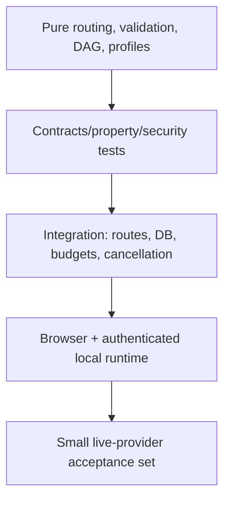

## 7.2 Phase A — Characterization tests before change

Add tests that prove today’s boundary:

- default sync route calls canonical `AgentRuntime`, not legacy coordinator;
- default SSE route calls canonical `AgentRuntime`;
- Workbench sends no execution mode today;
- `/api/chat/multi-agent` is separate and does not provide normal conversation/run semantics;
- existing grounded verifier child remains one bounded specialist, not generic team execution;
- current child lineage and signed envelope tests remain green.
- add a red regression contract proving that skipped/failed validation may not
  be represented as `approved: true`; the legacy coordinator currently violates
  this contract, and the new path must turn it into `unknown`, `escalated` or
  `degraded` rather than preserving the unsafe fallback.

These tests prevent accidental rewriting of history and create a red target for the new capability.

## 7.3 Phase B — Pure domain contracts

Tests for:

- `ExecutionMode` parsing/default/rejection;
- immutable fixed profile revisions;
- dynamic goals and schemas bounded by length/count;
- plan DAG rejects cycles, unknown dependencies and duplicate IDs;
- max depth and fanout;
- capability subset enforcement;
- per-child and aggregate budget validation;
- deterministic router reason codes;
- forced `Single` never delegates;
- forced `Team` cannot bypass policy/budget;
- `Auto` falls back to `Single` on malformed/timeout planner output.

Use property-based tests where practical for DAG cycles, fanout, duplicate identifiers, malformed schemas and budget sums.

## 7.4 Phase C — Security tests

Required adversarial cases:

- cross-owner/project child creation;
- altered task goal after envelope issuance;
- altered capability IDs or schema hash;
- altered token/cost/time budget;
- stale/future envelope;
- replayed nonce;
- dynamic task prompt injection requesting more tools;
- child attempts recursive delegation;
- effectful tool leaked into read-only child;
- raw prompt/tool/provider error entering Run Ledger;
- cancellation race with terminal persistence;
- concurrent children attempting budget overspend;
- child result cites foreign evidence;
- planner emits an unsupported fixed profile;
- child attempts memory write/background job/terminal.

## 7.5 Phase D — Integration tests

- sync `Single`, `Auto→Single`, `Auto→Team`, forced `Team`;
- SSE equivalent for each route;
- parent-child Run Ledger linkage survives reload;
- parent cancellation cancels children;
- one child failure yields honest degraded synthesis;
- all-child failure yields bounded failure, not fabricated answer;
- monetary reconciliation across parent and children;
- context snapshot on parent and bounded context on child;
- source/evidence propagation to synthesis;
- rate limit and compliance run once at the correct boundary;
- approvals cannot be reassigned to a child or foreign run;
- PostgreSQL concurrency for child creation, nonce and budgets;
- old route deprecation contract.
- feature-flag rollback: after a Team-capable configuration is disabled, the
  same request (even with `execution_mode=team`) follows the canonical Single
  runtime and creates no child runs.

## 7.6 Phase E — Frontend tests

Vitest/component tests:

- default mode is Auto;
- mode selection is included in request body;
- keyboard navigation and accessible names;
- routed event updates `Auto → Team` state;
- child statuses coalesce by child ID;
- no raw prompt/tool content rendered;
- degraded/timeout/denied states use correct semantics;
- responsive list fallback matches graph data.

Playwright:

- force Single and prove zero child nodes;
- force Team and inspect child DAG;
- Auto simple task resolves Single;
- Auto complex research resolves Team under deterministic fixture;
- cancel parent while children run;
- reload and recover parent/child lineage from Run Ledger;
- mobile keyboard/accessibility path;
- comparison of Single and Team runs.

## 7.7 Evaluation and live-provider acceptance

Create a versioned dataset with categories:

- simple tasks that should stay Single;
- separable research tasks;
- cross-domain code + reliability review;
- grounded evidence verification;
- adversarial prompts trying to expand child authority;
- tasks where coordination overhead should lose.

Measure separately:

- routing accuracy against reviewed labels;
- task completion;
- citation/grounding quality;
- unsupported claims;
- policy violations;
- total tokens and provider cost;
- p50/p95 latency;
- child failure/degrade rate;
- cancellation completion;
- Single-versus-Team quality delta.

No claim that hybrid is better should be made until a reviewed dataset shows a meaningful benefit within accepted cost/latency bounds.

Aggressive live probes should include real ambiguity, conflicting sources, one failing child and prompts that tempt unsafe delegation. A toy “What is AI?” run is not sufficient acceptance.

---

## 8. Implementation sequence and gates

## Phase 0 — Decision record and clean branch

Deliverables:

- architecture decision record;
- threat model;
- typed API draft;
- accepted boundaries and non-goals;
- dedicated feature branch from deployable `main` after current learning-media work is safely separated.

Gate:

- Luis approves the five decisions in section 14.
- No implementation in the current heavily modified tree until branch/worktree isolation is agreed.

## Phase 1 — Characterize and retire misleading claims

Deliverables:

- characterization tests;
- source map of legacy versus canonical runtime;
- documentation wording corrected from “multi-agent implemented” to dimensioned status.

Gate:

- existing suite green;
- red tests express the missing unified wiring.

## Phase 2 — Domain contracts and router

Deliverables:

- execution modes;
- routing decision contract;
- fixed profile registry contract;
- dynamic task contract;
- plan/DAG validator;
- config bounds and fail-fast validation.

Gate:

- pure unit/property tests green;
- no route changes yet.

## Phase 3 — Bounded child runtime

Deliverables:

- child factory built on typed `ModelProvider`/`AgentRuntime` controls;
- inherited owner/project context;
- signed task/capability/budget envelope;
- child Run Ledger lifecycle;
- depth 1, max 3, read-only tools.

Gate:

- security and budget tests green;
- no live UI claim yet.

## Phase 4 — Hybrid coordinator

Deliverables:

- validated plan execution;
- dependency-aware concurrency;
- cancellation propagation;
- fixed and dynamic child dispatch;
- typed result collection;
- honest degraded states;
- parent synthesis.

Gate:

- deterministic team integration tests green;
- failure matrix exercised.

## Phase 5 — Unified sync/SSE wiring

Deliverables:

- same `execution_mode` field on both routes;
- same semantic result summary;
- orchestration SSE events;
- safe Run Ledger event allowlists;
- feature flag default off until acceptance.

Gate:

- sync/SSE parity tests;
- existing Single behavior remains compatible.

## Phase 6 — Frontend

Deliverables:

- Auto/Single/Team selector;
- mode status next to active run;
- Agents Inspector tab;
- interactive DAG plus accessible ordered fallback;
- child budget/status/evidence details;
- mobile and keyboard behavior.

Gate:

- Svelte check, Vitest, Playwright and production build green;
- no chain-of-thought or secret-bearing field exposed.

## Phase 7 — Observability and operational hardening

Deliverables:

- parent/child trace spans;
- metrics for routing, child outcomes, cost and latency;
- bounded logs;
- cancellation and deadline evidence;
- operational configuration docs and rollback switch.

Gate:

- local PostgreSQL/runtime observation;
- restart/reload preserves lineage;
- flag-off rollback restores Single path.

## Phase 8 — Evaluation and live acceptance

Deliverables:

- versioned routing/effectiveness dataset;
- deterministic comparison reports;
- operator-authorized live-provider run;
- explicit limitations.

Gate:

- thresholds agreed before measurement;
- no timeout counted as pass;
- no mock result labeled live.

## Phase 9 — Canonical documentation and course

Deliverables listed in section 9.

Gate:

- links validated;
- capability dimensions updated only to observed level;
- stale claim sweep passes.

## Phase 10 — Visual Learning and media

Deliverables listed in section 10.

Gate:

- source commit frozen;
- artifacts validate and checksum;
- browser playback and accessibility pass;
- status remains `review-ready` until human educational review.

## Phase 11 — Local rollout

Deliverables:

- enable flag only in local verified target;
- canary with Auto default;
- direct checks of Single/Auto/Team;
- local runbook and rollback exercise.

Gate:

- `./scripts/local-stack.sh status` and HTTP readiness succeed;
- authenticated Workbench run succeeds;
- no public/deployed claim.

---

## 9. Documentation impact

### Canonical status/evidence

- `README.md`
- `docs/IMPLEMENTATION-EVIDENCE.md`
- `docs/implementation/CAPABILITY-ACCEPTANCE.yaml`
- `docs/REMAINING-DEFERRED-GAPS.md`
- `docs/ARCHITECTURE-DIAGRAMS.md`

Add a capability entry such as `hybrid-multi-agent-orchestration` with separate dimensions:

```text
exists / wired / tested / observed / ui / live_provider / deployed
```

Do not mark `wired=yes` until normal sync/SSE paths invoke it. Do not mark `ui=yes` until Workbench browser acceptance. Do not mark `live_provider=yes` from mocks. Keep `deployed=no` for local-only evidence.

### Architecture and decisions

New or updated:

- `docs/adr/ADR-hybrid-agent-orchestration.md`
- `docs/architecture/hybrid-agent-orchestration.md`
- `docs/security/hybrid-delegation-threat-model.md`
- `docs/operations/hybrid-orchestration-runbook.md`
- API map/reference for `execution_mode` and events.

### Course content

Update:

- Module 11 from “one bounded verifier” to distinguish:
  - existing verifier boundary;
  - new general bounded child runtime;
  - fixed versus dynamic profiles;
  - local in-process versus distributed network.
- Concepts:
  - orchestration routing;
  - fixed specialist profile;
  - dynamic bounded worker;
  - task DAG and fanout;
  - parent-child budgets;
  - delegation observability;
  - failure/degraded synthesis.
- `docs/course/reference/code-bookmarks.md`
- interview preparation track;
- demo script and answer bank.

### Stale-claim cleanup

Audit and correct documents that currently imply broad multi-agent operation, especially historical strategy/launch documents. Preserve historical context, but label it non-canonical and remove resume/demo claims not supported by the acceptance matrix.

---

## 10. Visual Learning and media plan

Because this changes Archon’s architecture materially, text documentation alone is insufficient.

## 10.1 Add a sixth learning pack

**Pack ID:** `hybrid-agent-orchestration`
**Display name:** `Hybrid Agent Orchestration`
**Artifact language:** English, consistent with current Visual Learning policy.

Ten artifacts:

1. standalone HTML presentation;
2. routing decision diagram;
3. parent-child execution/lineage diagram;
4. fixed-vs-dynamic infographic;
5. progressive mind map;
6. 20 flashcards;
7. 10 scenario questions;
8. evidence-grounded study guide;
9. chaptered audio/podcast with transcript;
10. HyperFrames explainer video with narration, captions and transcript.

## 10.2 Update existing packs

| Existing pack | Required update |
|---|---|
| System Overview | Add orchestration layer and distinguish parent runtime from children |
| Request Lifecycle | Add mode selection, routing, plan validation, fanout, synthesis and degradation |
| Memory, RAG, and Evaluation | Explain bounded context delegation, evidence propagation and Single-vs-Team evaluation |
| Reliability, Security, and Operations | Add signed scope, budgets, cancellation, replay protection, child failures and rollback flag |
| Interview and Demo Preparation | Add honest fixed/dynamic/hybrid explanation and live demo script |

## 10.3 Teaching diagrams

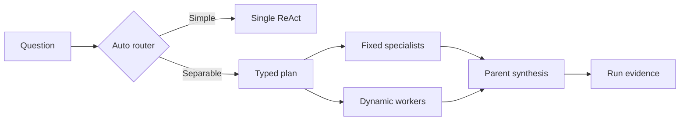

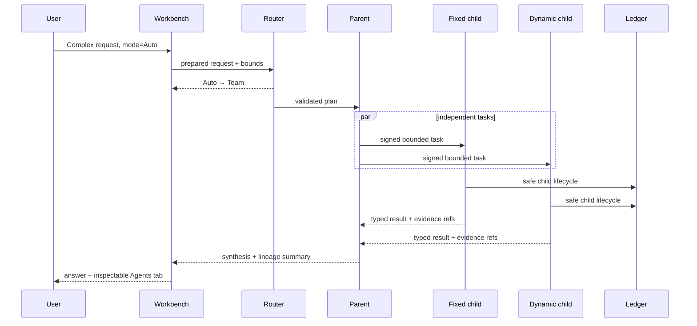

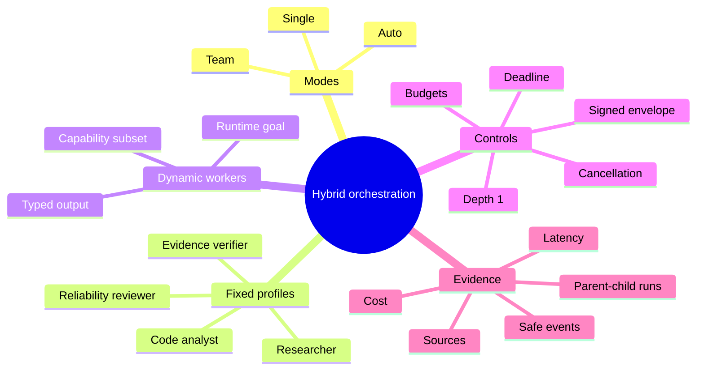

## 10.4 Media production order

1. Freeze implementation and canonical docs at a source commit.
2. Update source packs and teaching contracts.
3. Generate/validate structured artifacts.
4. Render HTML deck and interactive diagrams.
5. Generate English audio and transcript.
6. Build HyperFrames composition from the same teaching contract.
7. Render video only after scene snapshots pass.
8. Verify codecs, dimensions, duration, captions and transcript.
9. Regenerate external catalog and hashes.
10. Rebuild/hot-swap learning media without replacing PostgreSQL.
11. Browser-test all modes and pack switching.
12. Keep status `review-ready` until Luis reviews learning quality.

No media artifact should be generated from speculative architecture before the implementation contract stabilizes.

---

## 11. Observability design

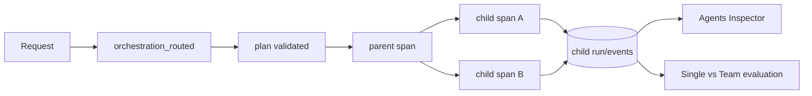

Metrics:

- requests by requested/resolved mode;
- Auto routing reason codes;
- number of children and fixed/dynamic split;
- per-profile completion/failure/timeout;
- parent and child tokens/cost;
- orchestration overhead;
- degraded answer count;
- cancellation latency;
- planner invalid-output rate;
- quality/evidence metrics by mode.

Cardinality controls:

- never use raw goal, user, project, run or prompt as metric labels;
- profile IDs and closed reason codes only;
- traces may carry safe run IDs according to existing policy;
- durable events remain allowlisted/redacted.

---

## 12. Rollout, compatibility and rollback

### Feature flags/config

Proposed bounded settings:

```text
hybrid_orchestration_enabled=false
hybrid_orchestration_default_mode=auto
hybrid_orchestration_max_children=3
hybrid_orchestration_max_depth=1
hybrid_orchestration_max_parallelism=3
hybrid_orchestration_child_tools=read_only
hybrid_orchestration_planner_timeout_seconds=<bounded>
hybrid_orchestration_child_timeout_seconds=<bounded>
```

Exact names should follow existing Pydantic naming conventions during implementation.

### Rollout

1. code present, flag off;
2. deterministic tests;
3. local mock observation;
4. authenticated local provider observation with forced modes;
5. Auto canary locally;
6. update evidence matrix;
7. no public rollout claim.

### Rollback

- set the orchestration feature flag off;
- chat returns to canonical Single runtime;
- child runs/events remain readable historical evidence;
- no destructive schema rollback required for normal rollback;
- old `/api/chat/multi-agent` is not the fallback path.

---

## 13. Risks and mitigations

| Risk | Mitigation |
|---|---|
| Cost/latency explosion | Auto defaults to Single, max 3 children, depth 1, durable aggregate reservation, synthesis reserve |
| Agent theater | Require measured benefit and visible reasons; do not always call four agents |
| Security scope expansion | Signed exact scope, strict capability subset, read-only first release, no recursive delegation |
| False validation | Validator returns typed supported/rejected/escalate; skipped validation is never “approved” |
| Context leakage | Reference-based bounded child context; no whole conversation by default; redacted events |
| Divergent sync/SSE behavior | One orchestration service called by both route adapters; parity tests |
| UI exposes hidden reasoning | Closed operational metadata only; schema and snapshot tests |
| Cancellation races | Parent-owned task group, absolute deadlines, first-terminal-wins persistence |
| Budget races | Durable atomic reservation/reconciliation under PostgreSQL tests |
| Legacy coordinator becomes second runtime | Deprecate separate route; migrate useful tests; one canonical runtime/factory |
| Learning assets become stale | Generate only after source commit freeze; embed provenance and checksums |
| “Multi-agent” overclaim | Capability matrix dimensions and explicit local/in-process limits |

---

## 14. Decisions Luis should approve before coding

Recommended defaults are shown in bold.

1. **Frontend model: Auto default + Single/Team overrides.**
2. **First release dynamic children are read-only, depth 1, maximum 3.**
3. **Do not wire the legacy four-stage coordinator directly; re-platform on canonical `AgentRuntime`.**
4. **Planner and synthesizer remain parent roles; fixed children begin with researcher, code analyst, reliability reviewer and the existing verifier.**
5. **Create a sixth Visual Learning pack and patch all five existing packs where affected.**

Optional later decisions, not required for the first vertical slice:

- allow effectful child tools with child-specific approvals;
- allow nested delegation;
- user pinning of individual profiles;
- remote/multi-host workers;
- Spanish-LATAM dubbed media variant.

---

## 15. Explicit non-goals for the first release

- distributed multi-node agent network;
- autonomous swarm;
- children creating children;
- unlimited parallelism;
- child write/execute/terminal authority;
- user-authored arbitrary system prompts;
- per-agent model/provider shopping without policy;
- automatic claim that Team is higher quality;
- public/cloud deployment;
- revealing chain-of-thought;
- replacing the existing bounded evidence verifier with a generic weak validator.

The existing deferred distributed-agent gap remains deferred. An in-process hybrid coordinator with bounded child runs is not a multi-node network.

---

## 16. Definition of done

The capability counts only when all applicable statements are true:

### Exists

- hybrid contracts, router, profiles, child factory and coordinator exist;
- fixed and dynamic paths both execute.

### Wired

- normal sync and SSE chat paths invoke the orchestration service;
- Workbench sends an execution mode;
- Auto/Single/Team are reachable without calling an undocumented route.

### Tested

- unit, property, security, integration, PostgreSQL, frontend and browser gates pass;
- sync/SSE parity and failure matrix pass.

### Observed

- authenticated local runs directly show:
  - forced Single with zero children;
  - forced Team with fixed and dynamic children;
  - Auto→Single;
  - Auto→Team;
  - child timeout/failure and honest degradation;
  - cancellation;
  - durable reload of lineage;
  - budget/cost evidence.

### UI

- mode control and Agents Inspector are accessible, responsive and browser-tested;
- no hidden reasoning or sensitive content appears.

### Documented

- canonical evidence, capability manifest, architecture, threat model, runbook, course and interview docs are updated;
- stale broad multi-agent claims are corrected.

### Learned

- the new hybrid orchestration pack and impacted existing packs are generated from the accepted source commit;
- deck, diagrams, infographic, mind map, flashcards, quiz, guide, audio and video validate and play;
- human educational review remains explicit.

### Limitations

- local in-process orchestration only;
- read-only dynamic children in v1;
- depth 1 and bounded fanout;
- quality benefit limited to measured datasets/live probes;
- public deployment remains `No`.

---

## 17. Interview-ready explanation after implementation

> Archon uses a hybrid orchestration model. The normal mode is Auto: a bounded router chooses the existing single-agent ReAct runtime for simple tasks and a validated team plan for work that benefits from decomposition. Common quality-sensitive tasks use versioned fixed specialist profiles; unusual tasks use dynamic workers built from a server-owned system template, a runtime goal, a strict output schema and a policy-approved capability subset. Every child has a signed scope, finite token/cost/time/tool budgets, durable parent-child lineage and explicit failure semantics. Users can force Single or Team for control and comparison, and the Workbench shows operational evidence rather than hidden reasoning. The implementation is local and bounded; it is not a distributed swarm.

---

## 18. Suggested first vertical slice

To reduce risk, the first implementation PR should prove only this path:

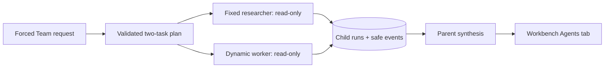

Acceptance for that slice:

- one fixed and one dynamic child;
- max depth 1;
- no child effects;
- parent cancellation;
- signed scope and durable lineage;
- sync/SSE parity;
- one accessible frontend DAG/list;
- deterministic tests plus one operator-authorized live-provider run;
- no update to broad capability claims until direct observation succeeds.

Only after this slice is green should Auto routing, additional profiles, richer evaluation and learning media be layered on top.
