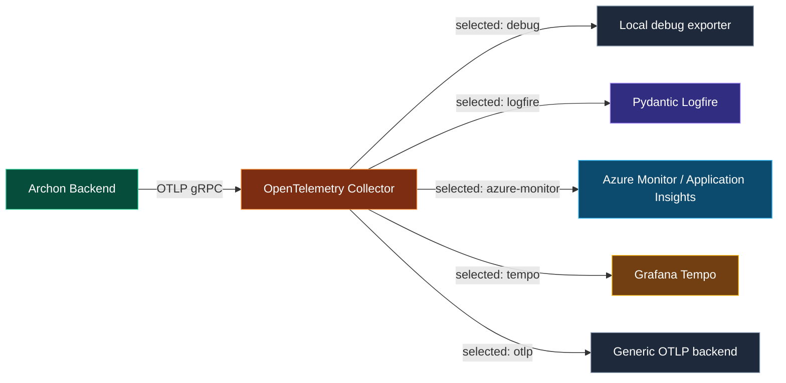
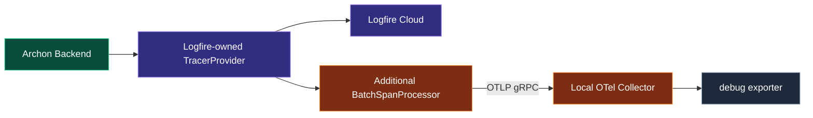
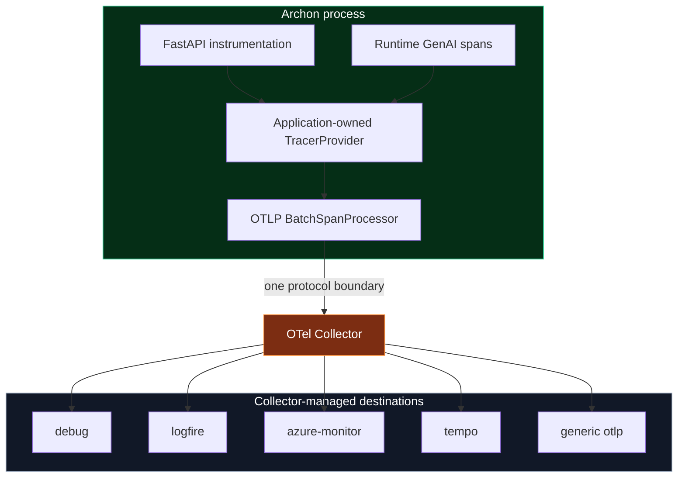
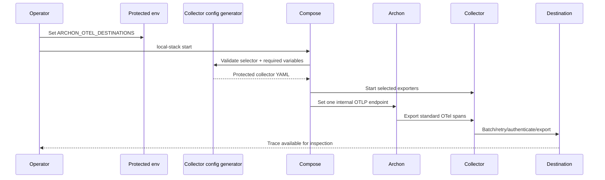
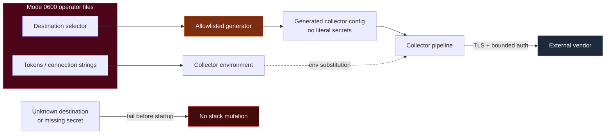
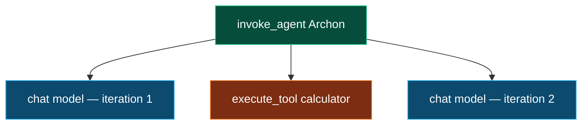
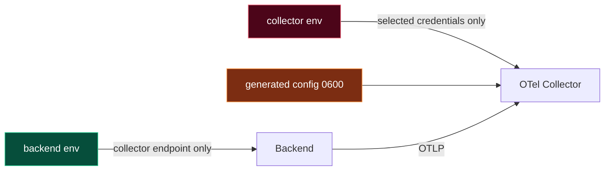
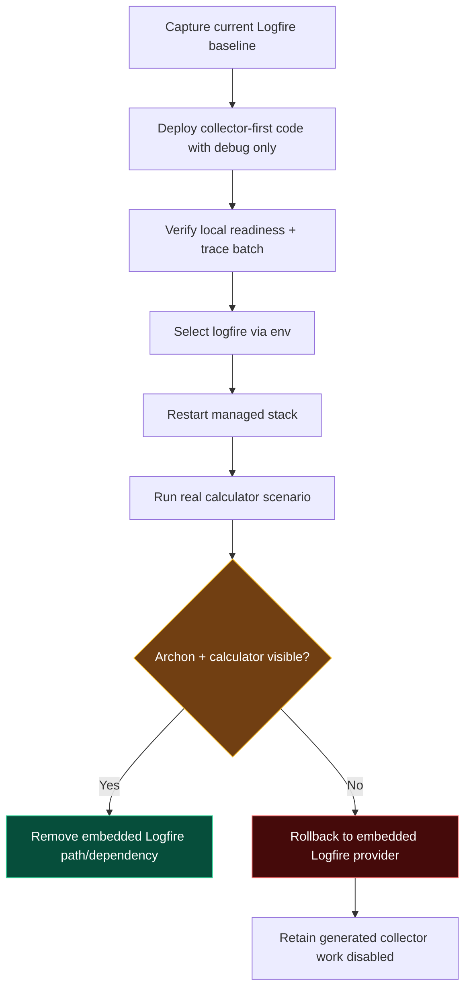
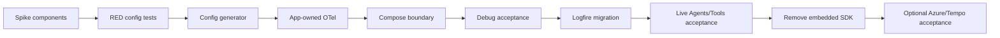

# Vendor-Neutral OpenTelemetry Destination Switching Implementation Plan

> **For Hermes:** Use subagent-driven-development skill to implement this plan task-by-task. Do not deploy, spend provider budget, push, or open a PR without Luis's explicit authorization.

**Goal:** Make Archon emit OpenTelemetry exactly once to its local Collector and allow operators to select one or more downstream destinations through environment configuration, without changing application code.

**Architecture:** Archon will own a standard OpenTelemetry `TracerProvider` and export OTLP/gRPC only to the local OpenTelemetry Collector. A validated, generated Collector configuration will implement destination selection and fan-out for `debug`, `logfire`, `azure-monitor`, `tempo`, and a bounded generic `otlp` destination. Logfire-specific display metadata may remain as optional span attributes, but the Logfire SDK will no longer own the provider or transport telemetry directly.

**Tech Stack:** Python 3.11, OpenTelemetry SDK 1.44, OTLP/gRPC, OpenTelemetry Collector Contrib, FastAPI instrumentation, Docker Compose, pytest, YAML, Logfire OTLP, Azure Monitor/Application Insights, Grafana Tempo.

---

## Decision digest

### Recommended operator contract

Use one selector variable:

```dotenv
ARCHON_OTEL_DESTINATIONS=logfire
```

It accepts a strict comma-separated allowlist:

```text
debug
logfire
azure-monitor
tempo
otlp
```

Examples:

```dotenv
# Local development
ARCHON_OTEL_DESTINATIONS=debug

# Current hosted trace destination
ARCHON_OTEL_DESTINATIONS=logfire

# Future Azure-only operation
ARCHON_OTEL_DESTINATIONS=azure-monitor

# Future Tempo-only operation
ARCHON_OTEL_DESTINATIONS=tempo

# Explicit fan-out
ARCHON_OTEL_DESTINATIONS=logfire,azure-monitor
```

Changing destination-specific credentials is separate from selecting a destination. Once those credentials are present in the protected environment, switching destinations requires changing only `ARCHON_OTEL_DESTINATIONS` and restarting the managed stack. No Python code or Compose edits are required.

### Final data path



### Important trade-off

A Collector configuration cannot safely turn arbitrary YAML exporters on and off from a raw comma-separated environment string. The plan therefore adds a small allowlisted generator that creates a protected Collector config before Compose starts. This prevents YAML injection, invalid empty exporters, accidental credential leakage, and startup failures caused by unconfigured destinations.

### What this plan does not claim

- It does not provision Azure resources.
- It does not deploy Tempo.
- It does not prove Azure or Tempo ingestion without real destination credentials and observation.
- It does not make Logfire's specialized Agents UI portable; the underlying OTel spans are portable, but each backend presents them differently.
- It does not export prompts, responses, chain-of-thought, RAG content, tool arguments, or tool results.

---

## Review map

| Luis's concern | Read this section |
|---|---|
| “One env variable should switch destinations” | Operator contract and Task 2 |
| “Do not couple Archon to Logfire” | Target ownership model and Task 3 |
| “Support Log Analytics” | Destination adapter matrix and Task 5 |
| “Support Jaeger/Tempo/other” | Destination adapter matrix and Task 5 |
| “Do not leak credentials” | Trust boundaries and Task 2 |
| “How do we prove it works?” | Acceptance matrix and Tasks 6–8 |
| “How do we roll back?” | Migration and rollback |

### Minimum reading path

1. Decision digest
2. Current versus target architecture
3. Environment contract
4. Destination adapter matrix
5. Acceptance matrix
6. Migration and rollback

You may skip the bite-sized implementation mechanics unless reviewing the engineering execution itself.

---

## Current state

### Current architecture



Observed implementation facts:

- `backend/app/observability/otel_exporter.py` calls `logfire.configure()` and obtains the provider from Logfire.
- The same class constructs an OTLP/gRPC processor using `ARCHON_OTEL_ENDPOINT`.
- Names and comments call that processor “Jaeger”, but the endpoint is `otel-collector:4317`.
- `deploy/otel-collector.local.yml` exports only to `debug`; no Jaeger backend exists in the seven-service local stack.
- `LOGFIRE_TOKEN` and `LOGFIRE_BASE_URL` currently enter the backend container.
- Archon emits standard GenAI spans plus optional Logfire rendering attributes.

### Naming debt to remove

| Current name/claim | Actual behavior | Target name |
|---|---|---|
| `OTLPExporter` described as Jaeger exporter | Application OTel runtime + OTLP client | `OpenTelemetryRuntime` or `OTelRuntime` |
| `jaeger_processor` | Processor sending to local Collector | `collector_processor` |
| `destination=jaeger` | Local Collector with debug exporter | `destination=otel-collector` |
| “Jaeger remains default” | Collector debug exporter is default | “Collector debug is default” |

---

## Target ownership model



Principles:

1. The application owns instrumentation and span semantics.
2. The Collector owns transport, retry, batching, authentication, and fan-out.
3. Destination changes never modify Python.
4. Unknown destinations fail before Compose starts.
5. Missing credentials for a selected destination fail closed.
6. Credentials remain in the protected mode-`0600` environment and never enter generated YAML or logs.
7. Destination-specific fields do not change the canonical span model.

---

## Environment contract

### Primary selector

```dotenv
ARCHON_OTEL_DESTINATIONS=debug
```

Rules:

- Comma-separated, lowercase values.
- Whitespace is trimmed.
- Duplicates are rejected rather than silently normalized.
- Unknown values are rejected.
- Empty value is rejected; use `debug` for local no-cloud operation.
- Output ordering is canonicalized for deterministic generated files.

### Application-to-Collector variables

```dotenv
ARCHON_OTEL_ENABLED=true
ARCHON_OTEL_SERVICE_NAME=archon-local
ARCHON_OTEL_COLLECTOR_ENDPOINT=http://otel-collector:4317
ARCHON_OTEL_COLLECTOR_INSECURE=true
```

These configure only the internal hop. They do not select cloud vendors.

### Logfire destination

```dotenv
ARCHON_OTEL_DESTINATIONS=logfire
LOGFIRE_OTLP_ENDPOINT=<official regional OTLP endpoint>
LOGFIRE_TOKEN=<protected write token>
```

Implementation prerequisite: confirm the exact official OTLP endpoint suffix and authorization header format against current Logfire documentation with a disposable Collector spike. Do not assume that `LOGFIRE_BASE_URL` is itself the OTLP traces endpoint.

### Azure Monitor destination

```dotenv
ARCHON_OTEL_DESTINATIONS=azure-monitor
APPLICATIONINSIGHTS_CONNECTION_STRING=<protected connection string>
```

Implementation prerequisite: run `otelcol-contrib components` against the repository's pinned image and prove the `azuremonitor` exporter exists and accepts the current connection-string form. If that component is absent or incompatible, evaluate Azure Monitor native OTLP ingestion as a separately documented preview path. Do not silently fall back to a deprecated instrumentation key.

### Tempo destination

```dotenv
ARCHON_OTEL_DESTINATIONS=tempo
TEMPO_OTLP_ENDPOINT=tempo:4317
TEMPO_OTLP_INSECURE=true
```

For a hosted Tempo endpoint, TLS must default to enabled and authentication must use a bounded credential mechanism documented for that deployment.

### Generic OTLP destination

```dotenv
ARCHON_OTEL_DESTINATIONS=otlp
ARCHON_OTEL_GENERIC_ENDPOINT=https://otel.example.com:4317
ARCHON_OTEL_GENERIC_PROTOCOL=grpc
ARCHON_OTEL_GENERIC_AUTHORIZATION=<protected complete authorization header>
ARCHON_OTEL_GENERIC_INSECURE=false
```

Security rules:

- HTTPS/TLS is required for non-container-local hosts.
- No arbitrary YAML fragments are accepted from environment variables.
- Header names are fixed; only the protected value is variable.
- The generator must never print secret values.

---

## Destination adapter matrix

| Destination | Collector exporter | Required configuration | Deterministic proof | Live proof |
|---|---|---|---|---|
| `debug` | `debug` | none | generated config + collector startup | new trace batch in logs |
| `logfire` | official OTLP HTTP/gRPC path | endpoint + write token | config validation with fake token, no network | Archon run and tool visible in Logfire Agents |
| `azure-monitor` | `azuremonitor` if supported by pinned contrib image | Application Insights connection string | component/config validation without transmission | trace visible in Application Insights/Log Analytics |
| `tempo` | `otlp/tempo` | endpoint, TLS, optional auth | config validation + local fake OTLP receiver | trace queryable in Tempo |
| `otlp` | `otlp/generic` or `otlphttp/generic` | endpoint, protocol, TLS, bounded auth | generated config + fake receiver | destination-specific observation |

---

## Runtime sequence



---

## Trust boundaries



Never place token values in:

- committed YAML;
- generated evidence artifacts;
- test snapshots;
- command output;
- README examples;
- logs;
- exception messages.

---

## Implementation tasks

### Task 0: Spike exporter compatibility before production changes

**Objective:** Prove the exact Collector components and configuration keys supported by the pinned image.

**Files:**
- Create temporary files only under `/tmp/archon-otel-spike/`
- Read: `deploy/otel-collector.local.yml`
- Read: `docker-compose.local.yml`

**Steps:**

1. Run the pinned Collector image with `components` and save a sanitized component inventory.
2. Confirm availability of `debug`, `otlp`, `otlphttp`, and `azuremonitor` exporters.
3. Validate a Tempo config against a local fake OTLP receiver.
4. Validate the official Logfire exporter endpoint/header contract with a fake token and configuration-only startup.
5. Validate Azure Monitor connection-string configuration without sending telemetry.
6. Record `VALIDATED`, `PARTIAL`, or `INVALIDATED` for each adapter.
7. Delete the temporary spike directory after incorporating findings into the plan implementation notes.

**Gate:** Do not implement a destination whose Collector component/configuration cannot be validated against the pinned image.

---

### Task 1: Define destination selection contracts with failing tests

**Objective:** Specify the one-variable switching behavior before writing the generator.

**Files:**
- Create: `backend/tests/unit/test_otel_collector_config_generator.py`
- Modify: `backend/tests/unit/test_local_env_generator.py`
- Modify: `backend/tests/unit/test_local_deployment.py`

**RED cases:**

1. `debug` generates only `debug` exporter.
2. `logfire` generates only `otlphttp/logfire` plus required processors.
3. `azure-monitor` generates only the validated Azure exporter.
4. `tempo` generates only `otlp/tempo`.
5. `logfire,azure-monitor` generates both exactly once.
6. Unknown destination fails with a bounded error.
7. Duplicate destination fails.
8. Selected destination with missing required credential fails.
9. Unselected destination may omit its credentials.
10. Generated YAML contains environment references but no secret values.
11. Non-local plaintext endpoints fail unless an explicit insecure flag is valid for that adapter.
12. The application container receives no Logfire/Azure/Tempo credentials.
13. The Collector receives only credentials required by selected destinations.

**Run:**

```bash
cd backend
uv run pytest -q \
  tests/unit/test_otel_collector_config_generator.py \
  tests/unit/test_local_env_generator.py \
  tests/unit/test_local_deployment.py
```

**Expected:** RED for the new destination contract only.

---

### Task 2: Build the allowlisted Collector config generator

**Objective:** Convert `ARCHON_OTEL_DESTINATIONS` into a deterministic, secret-free Collector YAML.

**Files:**
- Create: `scripts/generate-otel-collector-config.py`
- Create: `deploy/otel-collector.base.yml` if a composable base is clearer than an embedded template
- Modify: `scripts/generate-local-env.py`
- Modify: `scripts/local-deploy-smoke.sh`
- Modify: `scripts/local-stack.sh`

**Generator responsibilities:**

1. Parse and validate the selector.
2. Validate destination-specific required variables.
3. Generate receivers, memory limiter, batch processor, exporters, health extension, and traces pipeline.
4. Use `${env:VARIABLE}` references for credentials; never interpolate secret values into YAML.
5. Write atomically with mode `0600`.
6. Return only sanitized destination names and output path.
7. Store `ARCHON_OTEL_COLLECTOR_CONFIG_FILE` in the managed runtime state.
8. Remove the generated config during canonical `stop` cleanup.

**Recommended processor pipeline:**

```text
otlp receiver → memory_limiter → batch → selected exporters
```

**GREEN gate:** All Task 1 tests pass.

---

### Task 3: Make the application own standard OpenTelemetry

**Objective:** Remove Logfire from provider ownership and send one OTLP stream to the Collector.

**Files:**
- Rename or replace: `backend/app/observability/otel_exporter.py`
- Likely create: `backend/app/observability/otel_runtime.py`
- Modify: `backend/app/main.py`
- Modify: all imports/call sites found by repository search
- Modify: `backend/pyproject.toml`
- Modify: `backend/uv.lock`
- Rewrite: `backend/tests/unit/test_logfire_telemetry.py` into vendor-neutral telemetry tests, likely `test_otel_runtime.py`

**RED tests:**

1. Application creates its own `TracerProvider` with `service.name`.
2. Exactly one OTLP processor targets `ARCHON_OTEL_COLLECTOR_ENDPOINT`.
3. No application code imports `logfire`.
4. No application code reads `LOGFIRE_TOKEN`, Azure connection strings, or Tempo credentials.
5. Disabling OTel produces a safe in-memory/no-op fallback.
6. Flush and shutdown remain deterministic.
7. Agent/model/tool parentage and GenAI attributes remain unchanged.

**Implementation notes:**

- Replace Logfire FastAPI instrumentation with `opentelemetry-instrumentation-fastapi` at a version compatible with OTel SDK 1.44.
- Preserve `capture_headers=False` behavior through hooks/configuration.
- Do not capture ASGI send/receive payloads.
- Keep `logfire.msg` and `logfire.json_schema` only as optional rendering metadata; document that other backends ignore them.
- Rename `jaeger_processor` to `collector_processor`.
- Rename log output from `jaeger` to `otel-collector`.

**Dependency result:**

- Remove `logfire[fastapi]` from application dependencies after collector-to-Logfire acceptance succeeds.
- Keep only standard OTel API/SDK/exporter/instrumentation dependencies in the application.

---

### Task 4: Preserve GenAI semantics independently of destination

**Objective:** Ensure destination switching does not alter agent trace meaning.

**Files:**
- Modify: `backend/app/observability/runtime_events.py`
- Modify: `backend/tests/unit/test_otel_tracing_wire.py`
- Modify: `backend/tests/unit/test_runtime_observability.py`

**Required invariant tree:**



**Tests must assert:**

- Same trace ID.
- Tool/model parent span ID equals agent root span ID.
- Tool definitions appear on each `chat {model}` span.
- `gen_ai.operation.name` values remain canonical.
- No prompt, response, system instructions, tool arguments/results, or RAG content attributes are introduced.
- Unknown destinations cannot affect instrumentation behavior.

---

### Task 5: Implement destination adapters in the Collector

**Objective:** Generate correct exporter stanzas for each allowlisted destination.

**Files:**
- Modify: `scripts/generate-otel-collector-config.py`
- Modify: `docker-compose.local.yml`
- Modify: `backend/.env.example`
- Test: `backend/tests/unit/test_otel_collector_config_generator.py`

#### Debug

- Always available.
- No credentials.
- Basic verbosity by default.
- Detailed verbosity only under an explicit local debugging flag.

#### Logfire

- Use the officially verified OTLP protocol and regional endpoint.
- Pass write token to the Collector only.
- Preserve Logfire Agents acceptance for `Archon`, tool definitions, and real calls.
- Remove `LOGFIRE_TOKEN` and `LOGFIRE_BASE_URL` from backend service environment.

#### Azure Monitor

- Prefer the supported `azuremonitor` exporter if present in the pinned contrib image.
- Use `APPLICATIONINSIGHTS_CONNECTION_STRING`; never commit it.
- If the component is unavailable, leave the adapter disabled and document the native OTLP preview alternative rather than claiming support.

#### Tempo

- Use standard `otlp/tempo`.
- Default to TLS for non-local endpoints.
- Permit insecure transport only for an explicitly validated container-local endpoint.

#### Generic OTLP

- Support one bounded generic destination.
- No arbitrary exporter type, YAML, headers, or processors from user input.
- Validate protocol, endpoint, TLS and one fixed authorization header.

---

### Task 6: Update Compose and managed-environment lifecycle

**Objective:** Ensure startup, status, logs and stop reuse the exact generated Collector context.

**Files:**
- Modify: `docker-compose.local.yml`
- Modify: `scripts/local-deploy-smoke.sh`
- Modify: `scripts/local-stack.sh`
- Modify: `scripts/generate-local-env.py`
- Modify: `backend/tests/unit/test_local_deployment.py`
- Modify: `backend/tests/unit/test_local_env_generator.py`

**Expected Compose boundary:**



**Assertions:**

- Backend never receives Logfire/Azure/Tempo credentials.
- Collector config mount is read-only.
- Generated file is owner-only.
- Existing seven-service count remains unchanged unless a local Tempo service is explicitly added later.
- Status and stop work from persisted runtime state.
- Switching destination requires explicit stop/start because the protected context is immutable during a run.

---

### Task 7: Correct names and documentation

**Objective:** Remove false Jaeger claims and document the one-variable workflow.

**Files:**
- Modify: `README.md`
- Modify: `docs/IMPLEMENTATION-EVIDENCE.md`
- Modify: `docs/implementation/CAPABILITY-ACCEPTANCE.yaml`
- Modify: `docs/CI-PIPELINES-AND-LOCAL-RUN.md` if it mentions Jaeger/OTel topology
- Modify: any additional matches returned by searching `Jaeger`, `jaeger_processor`, `LOGFIRE_BASE_URL`, and `LOGFIRE_TOKEN`

**Required wording:**

- “Local OTel Collector with debug exporter” for current default.
- “Destination configured” is not “destination observed”.
- Logfire: live-observed only after Agents/Tools confirmation.
- Azure Monitor: configured/tested only until live workspace ingestion is observed.
- Tempo: configured/tested only until a real query confirms a trace.
- No public/cloud deployment claim.

---

### Task 8: Deterministic verification

**Objective:** Prove code, config, security, and trace invariants without external credentials.

**Commands:**

```bash
cd backend
uv run pytest -q \
  tests/unit/test_otel_runtime.py \
  tests/unit/test_otel_tracing_wire.py \
  tests/unit/test_runtime_observability.py \
  tests/unit/test_otel_collector_config_generator.py \
  tests/unit/test_local_env_generator.py \
  tests/unit/test_local_deployment.py
```

```bash
cd /Users/luisvalencia/Documents/archon
make test
make lint
git diff --check
```

```bash
cd frontend
npm run check
npm test -- --run
npm run build
```

**Collector validation matrix:**

For each selector, generate a temporary protected env and config, then run Collector configuration validation:

```text
debug
logfire
azure-monitor
tempo
otlp
logfire,azure-monitor
logfire,tempo
```

No test may contact a cloud endpoint unless marked and explicitly authorized.

---

### Task 9: Migration and live acceptance

**Objective:** Move Logfire from in-process export to Collector export without losing Agents/Tools evidence.



**Live Logfire acceptance:**

1. `./scripts/local-stack.sh status` reports ready.
2. Run a real prompt that must invoke `calculator`.
3. Confirm the run appears under Agents → Archon.
4. Confirm Tools shows the actual tool definition and one call.
5. Confirm Trace shows `invoke_agent` with sibling `chat` and `execute_tool` children.
6. Confirm prompts, responses, tool arguments/results and RAG content remain absent.
7. Confirm the backend container does not contain Logfire credentials.
8. Confirm Collector logs contain no credential values.

**Azure acceptance, only when explicitly authorized and provisioned:**

1. Select `azure-monitor`.
2. Start with a protected connection string or approved managed identity.
3. Emit a deterministic trace without provider spend.
4. Query Application Insights/Log Analytics for `service.name=archon-local`.
5. Record exact trace evidence and limitations.

**Tempo acceptance, only when explicitly authorized and available:**

1. Select `tempo`.
2. Emit a deterministic trace.
3. Query by trace ID in Tempo.
4. Verify GenAI attributes and hierarchy.

---

## Failure behavior

| Failure | Expected behavior |
|---|---|
| Unknown destination | Generator exits non-zero before Compose mutation |
| Missing selected credential | Generator exits non-zero without printing value |
| Unselected destination missing credentials | Startup proceeds |
| Collector unavailable | Backend readiness reports degraded/unavailable according to existing policy; application behavior remains explicit |
| One fan-out exporter fails | Collector retry/queue policy isolates the destination; document whether backpressure affects all exporters |
| Logfire unavailable | Other selected exporters continue if Collector pipeline supports independent queues |
| Invalid TLS configuration | Startup fails closed |
| Active root span at shutdown | Flush/end before provider shutdown |
| Destination switch without stop | Wrapper refuses and instructs explicit stop/start |

---

## Rollback

Rollback must not require database changes.

1. Keep the current embedded-Logfire implementation available on the feature branch until collector-to-Logfire live acceptance passes.
2. If acceptance fails, restore the prior backend image and static collector config.
3. Do not alter PostgreSQL or Redis volumes.
4. Verify `./scripts/local-stack.sh status` and HTTP readiness.
5. Generate one real calculator run and confirm the prior Logfire Agents/Tools behavior.
6. Record the collector adapter as `PARTIAL`, not implemented.

No schema migration is needed; this is telemetry transport/configuration only.

---

## Acceptance matrix

| Capability | Exists | Wired | Tested | Observed | Claim allowed |
|---|---:|---:|---:|---:|---|
| App emits one OTLP stream to Collector | required | required | deterministic | local | Yes after local smoke |
| Selector changes generated exporters | required | required | deterministic | local | Yes after config matrix |
| Debug destination | required | required | deterministic | local | Yes after trace batch |
| Logfire destination | required | required | deterministic | live cloud | Only after Agents + Tools confirmation |
| Azure Monitor destination | conditional | conditional | config test | optional live | No live claim without Azure evidence |
| Tempo destination | conditional | conditional | config test | optional live | No live claim without Tempo evidence |
| Generic OTLP destination | required | required | fake receiver | destination-specific | Only protocol-level claim by default |
| Credentials isolated to Collector | required | required | static/container inspection | local | Yes after inspection |
| Privacy-safe GenAI telemetry | required | required | deterministic | Logfire | Yes if content remains absent |

---

## Risks and mitigations

### Risk: Logfire Agents regress after removing the SDK

Mitigation:

- Treat current Agents/Tools behavior as a live baseline.
- Preserve exact GenAI attributes and `logfire.json_schema` metadata.
- Do not remove the SDK until Collector-to-Logfire acceptance passes.

### Risk: Azure exporter compatibility

Mitigation:

- Validate the exact pinned Collector image before implementation.
- Do not upgrade the Collector casually; pin a digest and rerun all local deployment tests.
- If Azure exporter support is insufficient, document the native OTLP preview path separately.

### Risk: One destination blocks all fan-out

Mitigation:

- Use Collector batch and sending queues per exporter where supported.
- Test a deliberately unavailable fake destination while `debug` remains active.
- Document backpressure and retry limits.

### Risk: Environment configuration becomes an injection surface

Mitigation:

- Allowlisted destination identifiers.
- Strict URL/protocol/TLS validation.
- No arbitrary YAML or processor fragments.
- Atomic mode-`0600` generated config.

### Risk: “Switch with one variable” hides credential prerequisites

Mitigation:

- Clearly distinguish selector from destination credentials.
- Validate prerequisites before changing containers.
- Return missing variable names, never values.

---

## Recommended implementation order



Do not implement Azure and Tempo live delivery before the collector-first Logfire migration is proven. Logfire is the current known-good destination and therefore the safest migration oracle.

---

## Approval decisions before implementation

1. **Selector format:** approve `ARCHON_OTEL_DESTINATIONS` as a comma-separated allowlist, supporting both one destination and fan-out.
2. **Default:** approve `debug` as the no-cloud default.
3. **Application decoupling:** approve removing the Logfire SDK from backend dependencies only after collector-to-Logfire live acceptance.
4. **Azure scope:** approve configuration support now, but defer actual Azure resource provisioning and live ingestion until credentials/resources are explicitly authorized.
5. **Privacy:** keep content capture disabled; only schemas, operation names, IDs, status, duration and usage metadata leave Archon.
6. **Restart semantics:** accept that changing the protected destination selector requires canonical stop/start, not live mutation.

---

## Definition of done

The change is complete only when:

- Archon application code depends on standard OTel, not a destination SDK, for provider ownership.
- The backend emits to exactly one internal Collector endpoint.
- `ARCHON_OTEL_DESTINATIONS` controls generated Collector exporters.
- Invalid selection and missing credentials fail before container mutation.
- Backend receives no destination credentials.
- Current Logfire Agents and Tools behavior still passes live.
- Debug path passes locally.
- Azure/Tempo are labeled configured versus observed honestly.
- All backend/frontend/config/build gates pass.
- Canonical docs no longer call the debug Collector “Jaeger”.
- No commit, push, PR, deployment, Azure provisioning, or paid live test occurs without explicit authorization.
