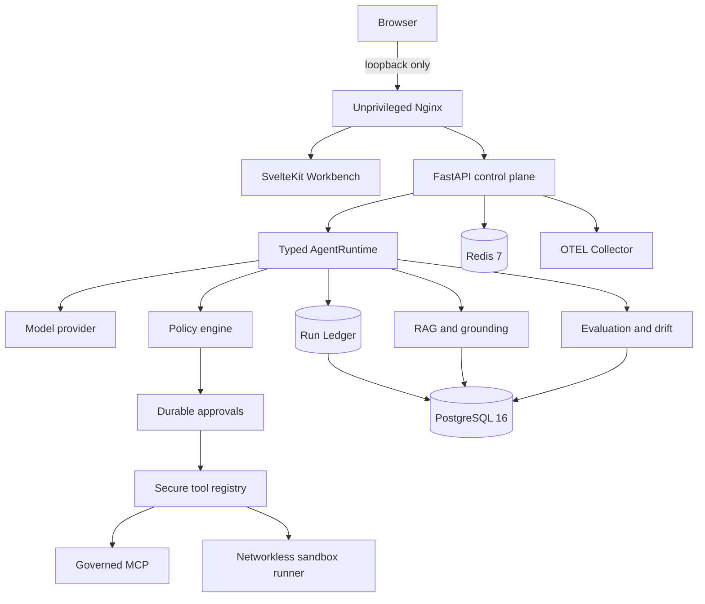

<div align="center">

# Archon

### Agent Reliability Workbench

A local-first system for building, governing, inspecting, and evaluating AI agent runs.

[Architecture](docs/ARCHITECTURE-DIAGRAMS.md) · [CI and local run](docs/CI-PIPELINES-AND-LOCAL-RUN.md) · [Implementation evidence](docs/IMPLEMENTATION-EVIDENCE.md) · [Course](docs/course/README.md) · [Visual learning](docs/visual-learning/README.md) · [Interview route](docs/course/tracks/interview-preparation.md) · [Demo](docs/DEMO-SCRIPT.md)

</div>

---

## What Archon is

Archon is a working agent control plane, not a chat UI wrapped around an LLM.

It demonstrates one auditable lifecycle:

```text
Policy → Run → Approval → Tool → Evidence → Evaluation
```

The runtime accepts native model tool calls, applies deterministic policy, pauses sensitive operations for exact-bound approval, executes authorized tools, and records ordered evidence. Runs can be inspected, replayed from stored events, forked, compared, grounded against documents, and evaluated later.

Archon is a serious local portfolio system. It is not a public production service.

## Verified status

The Skills + Project Instructions work is a **local candidate** on
`feature/spi-docscore` (based on `a642952`). It has not been pushed or deployed.
The deployed `main` revision remains `63215bf`. The candidate has focused,
real-provider, and temporary-PostgreSQL evidence; the integrated `verify.sh`
result is intentionally not reported here until that run has a final result.

| Evidence | Recorded result |
|---|---|
| Deployment target | Production-like local Docker Compose on macOS |
| Local services | 7 containers; only the loopback gateway publishes a host port |
| Backend | **1,415 passed, 2 expected skips, 87.23% coverage** |
| Frontend | Svelte **0 errors / 0 warnings**, **48 Vitest**, production build, **30 Playwright** |
| Capability manifest | **17 entries**, including the local Skills + Project Instructions candidate |
| Portfolio benchmark | **12 scenarios, 120/120 iterations passed**, zero external cost |
| Disaster recovery | **0 selected-record differences at snapshot**, observed **restore-to-ready 24.787 seconds** |
| Live provider evidence | Foundry Claude tool call, cache-metric transport, and multimodal probe passed |
| Public/cloud deployment | **No. Deliberately deferred.** |

The canonical details and limits live in [Implementation Evidence](docs/IMPLEMENTATION-EVIDENCE.md).

## Start here

Choose the route that matches your goal.

| Audience | Entry point |
|---|---|
| Recruiter or engineering manager | This README, then [Implementation Evidence](docs/IMPLEMENTATION-EVIDENCE.md) |
| Interviewer or candidate | [2/15/45-minute interview route](docs/course/tracks/interview-preparation.md) |
| Engineer reviewing the system | [Architecture Diagrams](docs/ARCHITECTURE-DIAGRAMS.md) and [Code Bookmarks](docs/course/reference/code-bookmarks.md) |
| Learner | [Visual Learning Studio](docs/visual-learning/README.md), then the [Archon Course](docs/course/README.md) |
| Operator | [Local Operations](docs/course/modules/14-local-operations/README.md) and [DR Runbook](docs/DR-RUNBOOK.md) |
| Demo presenter | [Demo Script](docs/DEMO-SCRIPT.md) |

## Architecture

The verified local target runs seven containers.



| Container | Responsibility |
|---|---|
| `gateway` | Unprivileged Nginx entry point |
| `frontend` | SvelteKit Workbench |
| `backend` | FastAPI APIs and agent control plane |
| `sandbox-runner` | Isolated code/tool execution over a private Unix socket |
| `postgres` | Durable application state |
| `redis` | Distributed rate-limit state |
| `otel-collector` | Local OTLP trace collection |

PostgreSQL, Redis, OTEL, backend, frontend, and sandbox expose no host ports. The sandbox is non-root, networkless, read-only, capability-free, seccomp-constrained, and has no Docker socket or project mount.

See [Architecture Diagrams](docs/ARCHITECTURE-DIAGRAMS.md) for request, approval, data, MCP, deployment, recovery, and trust-boundary views.

## How a request works

1. Nginx routes the request to SvelteKit or FastAPI.
2. FastAPI authenticates the caller and preserves owner/project scope.
3. `create_chat_runtime` injects provider, policy, approval, tool, event, and persistence ports.
4. `AgentRuntime.run` executes a bounded model/tool loop.
5. The policy engine evaluates every proposed tool call.
6. `ASK` creates a durable approval bound to the exact run, call, tool, and argument hash.
7. Authorized tools execute through the secure registry, governed MCP, or sandbox.
8. The Run Ledger stores ordered, redacted events.
9. REST/SSE sends inspectable progress and results to the Workbench.
10. Recorded runs can feed replay, comparison, grounding, evaluation, and drift analysis.

The model proposes actions. Deterministic code owns authority, limits, persistence, and execution.

## Main capabilities

### Runtime and providers

- typed provider, tool, authorizer, and event ports;
- Protocol-based dependency injection;
- native tool calling;
- explicit iteration, token, tool, cost, and wall-clock budgets;
- typed stop reasons;
- circuit breaker and fallback;
- validated structured output;
- bounded self-reflection;
- validated multimodal input.

### Policy and execution

- deterministic `ALLOW`, `ASK`, and `DENY` rules;
- immutable tool-call snapshots before authorization;
- single-use durable approvals;
- exact binding to user, run, call ID, tool name, and argument hash;
- idempotent effect ledger;
- durable monetary reservations and reconciliation;
- governed MCP discovery and invocation;
- governed stdio and Streamable HTTP MCP transports;
- isolated sandbox execution with no host fallback.

### Evidence and state

- owner/project-scoped conversations;
- immutable, owner/project-scoped project-instruction snapshots;
- exact project bindings for versioned skills and ten bundled skill packages;
- metadata-first capability discovery with optional metadata-only GodMode search;
- AES-GCM encrypted memory;
- context provenance and online key rotation;
- ordered Run Ledger events;
- checkpoints, read-only replay, fork, and comparison;
- immutable exports and authenticated recipient-bound share grants;
- revocation, expiry, checksums, and disclosure scanning.

### Knowledge and evaluation

- document ingestion and recursive chunking;
- SQL-JSON embedding storage;
- Python cosine retrieval;
- grounded answers and citations;
- deterministic claim checks;
- one bounded evidence-only verifier child;
- versioned recorded-run evaluation;
- drift reports and approval-gated optimization candidates;
- deterministic reliability benchmark.

### Operations

- JWT authentication and ownership enforcement;
- REST and SSE parity;
- structured logs, metrics, and OpenTelemetry traces;
- liveness and dependency readiness;
- Alembic migrations through `20260901_21` on the local candidate;
- Docker Compose deployment;
- checksum-verified backup and clean restore;
- measured RPO/RTO;
- clean-tree verification gates.

## Data model

The deployed target uses one PostgreSQL database named `archon` and one Redis data store.
The local candidate migrates the schema from revision 14 through revisions 15–21.

The candidate ORM declares **41 tables**. The added persistence covers immutable
skill revisions/references, exact project bindings, project-instruction
snapshots, capability preferences/provenance, and governed MCP transport
profiles. This is a code-and-migration claim, not evidence that revision 21 is
deployed on `main`.

Redis stores rate-limit windows and temporary state. It is not a relational database.

Embeddings live in PostgreSQL `vector_chunks` as JSON arrays. Cosine similarity runs in Python. Archon does not claim pgvector or an indexed vector service.

See [Database Schema](docs/course/reference/database-schema.md) for table relationships and boundaries.

## Run it locally

### Prerequisites

- Docker Desktop
- Python 3.11
- [`uv`](https://docs.astral.sh/uv/)
- Node.js 22+

### Full acceptance

```bash
./scripts/verify.sh
```

This runs backend and frontend gates, browser tests, sandbox containment, container health, the capability manifest, and a one-iteration benchmark preflight. It does not enable live-provider calls.

### Run the verified local application

Use the managed wrapper for day-to-day startup and operations:

```bash
./scripts/local-stack.sh start
./scripts/local-stack.sh status
./scripts/local-stack.sh url
./scripts/local-stack.sh logs otel-collector
```

`start` generates valid ephemeral PostgreSQL, JWT, and encryption material; builds and verifies all seven services; atomically retains the exact Compose project/env context in a mode-`0600` state file; and prints the loopback application URL. A kernel advisory lock (`lockf` on macOS, `flock` on Linux) rejects concurrent starts and is released automatically on exit, signal, or crash. If managed state exists but health is failing or the protected env is missing, `start` preserves containers, volumes, env pointers, and state for explicit diagnosis instead of destroying data or creating a second stack. When the protected env is missing, `status` and `logs` fall back to exact Compose project labels, and explicit `stop` can remove only resources carrying that project label.

The default is deterministic mock mode. The UI displays a visible warning and the mock response explicitly states that no live inference occurred.

For an operator-authorized Foundry demo, stop the current mode and start live:

```bash
./scripts/local-stack.sh stop
./scripts/local-stack.sh start --live-provider
./scripts/local-stack.sh status
```

Live mode imports only an allowlist of `ARCHON_LLM_*` settings from the mode-`0600` `backend/.env` into the generated protected Compose env; it never passes `backend/.env` directly to Compose. The startup smoke performs one real chat request and therefore incurs provider usage. Embeddings remain mock/non-production unless separately evidenced. Switching modes always requires an explicit `stop`.

Do **not** invoke `docker compose` with `backend/.env`, a nonexistent root `.env`, or dummy secrets. Those files/values do not satisfy the deployment contract. Use `local-stack.sh` so every status/log/stop command reuses the exact generated context.

Stop the managed stack and remove its volumes, protected env file, and state:

```bash
./scripts/local-stack.sh stop
```

### One-shot production-like smoke

```bash
./scripts/local-deploy-smoke.sh
```

The smoke generates ephemeral credentials, starts the seven-service stack, verifies readiness, authentication, migrations, metrics, sandbox isolation, and OTEL export, then removes its resources. `local-stack.sh start` invokes this same smoke with safe retention enabled.

### Disaster recovery

```bash
./scripts/local-dr-smoke.sh /tmp/archon-dr-report.json
```

The DR smoke creates durable evidence, backs up PostgreSQL, destroys the source deployment, restores into a clean project, compares records and hashes, and records RPO/RTO.

### Deterministic benchmark

```bash
cd backend
uv run python scripts/portfolio_benchmark.py \
  --output /tmp/archon-portfolio-benchmark.json \
  --iterations 10
```

The benchmark exercises twelve control-plane scenarios with production classes and scripted local adapters. It does not measure external model quality, load capacity, or production SLOs.

## Live-provider evidence

Operator-authorized acceptance against Azure AI Foundry and `claude-opus-4-6` observed:

- one native tool call;
- provider-reported cache counters transported as `0/0`;
- one bounded one-pixel multimodal semantic probe;
- one managed loopback deployment using the Foundry model through authenticated API chat and browser SSE chat, with provider/model identity visible in the UI.

The configured adapter did not advertise native JSON Schema. The embedding provider remained `mock`, so no live embedding request was made.

This is partial live evidence. A zero cache counter is not a cache-hit or billing-savings claim. A one-pixel probe is not a vision-quality benchmark.

See the sanitized [Live Provider Acceptance Summary](docs/evidence/live-provider-acceptance-summary.json). It contains no prompts, responses, credentials, full endpoint URLs, or raw provider errors.

The Skills + Project Instructions candidate also passed one operator-authorized
Foundry acceptance with `claude-opus-4-6`: one skill revision, one approved
instruction revision, and nine capability references were present in the exact
Run Ledger context. This proves one bounded candidate path, not selection
quality in general or deployment. See the
[candidate implementation evidence](docs/evidence/skills-project-instructions-implementation.md).

## Evidence packet

| Evidence | Location |
|---|---|
| Canonical implementation claims | [Implementation Evidence](docs/IMPLEMENTATION-EVIDENCE.md) |
| Architecture and trust boundaries | [Architecture Diagrams](docs/ARCHITECTURE-DIAGRAMS.md) |
| Benchmark report | [Portfolio Benchmark](docs/evidence/local-portfolio-benchmark.json) |
| Recovery report | [DR Report](docs/evidence/local-dr-report.json) |
| Live-provider summary | [Live Provider Acceptance](docs/evidence/live-provider-acceptance-summary.json) |
| Skills + Project Instructions candidate | [Implementation Evidence](docs/evidence/skills-project-instructions-implementation.md) |
| Deferred scope | [Remaining Deferred Gaps](docs/REMAINING-DEFERRED-GAPS.md) |
| CI, pipelines, containers, and local commands | [CI and Local Run Guide](docs/CI-PIPELINES-AND-LOCAL-RUN.md) |
| API surface | [API Map](docs/course/reference/api-map.md) |
| Runtime events | [Event Catalog](docs/course/reference/event-catalog.md) |
| Tests by concept | [Test Map](docs/course/reference/test-map.md) |
| Exact interview symbols | [Code Bookmarks](docs/course/reference/code-bookmarks.md) |

## Deliberate limits

Archon does not claim:

- public or cloud deployment;
- production traffic, SLOs, or on-call operations;
- a distributed multi-node agent network;
- GPU or high-throughput model serving;
- fine-tuning or training;
- pgvector or a managed vector database;
- anonymous public sharing;
- autonomous unapproved production optimization;
- complete provider parity;
- live embeddings or native JSON Schema acceptance.

These omissions are documented with the architecture and evidence required to revisit them in [Remaining Deferred Gaps](docs/REMAINING-DEFERRED-GAPS.md).

## Project structure

```text
backend/                 FastAPI runtime, services, persistence, and tests
frontend/                SvelteKit Workbench and browser tests
sandbox_runner/          Isolated execution service and seccomp profiles
deploy/                  Nginx and OpenTelemetry configuration
docs/                    Architecture, evidence, course, demo, and runbooks
scripts/                 Verification, deployment, backup, restore, and DR tools
docker-compose.local.yml Verified seven-service local target
```

## Documentation routes

- [Visual Learning Studio](docs/visual-learning/README.md): Roadmap, Stories, Architecture, Evidence, and NotebookLM media recipes at `/learn`
- [Course home](docs/course/README.md): 16 modules and 66 canonical concepts
- [Learn from zero](docs/course/tracks/learn-from-zero.md)
- [Interview preparation](docs/course/tracks/interview-preparation.md)
- [Company workshops](docs/course/tracks/company-workshops.md)
- [Operations and reliability](docs/course/tracks/operations-and-reliability.md)
- [Interview Answer Bank](docs/INTERVIEW-ANSWER-BANK.md)
- [3–5 Minute Demo](docs/DEMO-SCRIPT.md)

## Security boundary

Archon treats the user, model, MCP output, documents, and tool arguments as untrusted input. Typed validation, owner scope, persistence redaction, policy, approvals, and sandboxing reduce risk.

The local host, Docker daemon, environment file, and encryption master key remain trusted operational boundaries. Local acceptance does not prove resistance to host compromise or replace an independent security audit.

## License

MIT — see [LICENSE](LICENSE).

Built by [Luis Valencia](https://github.com/levalencia).
