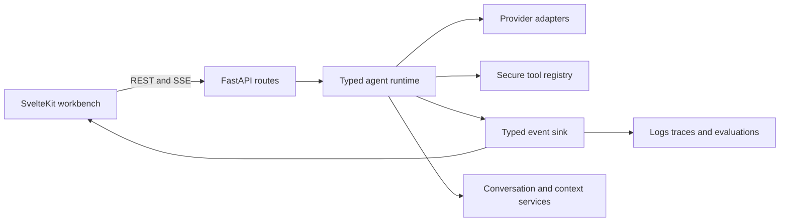

<div align="center">

# Archon

### Agent Reliability Workbench

**A local-first, inspectable AI-agent runtime for studying tool execution, context, evidence, and failure modes.**

[](https://github.com/levalencia/archon/actions)
[](https://www.python.org/downloads/)
[](LICENSE)

[Quick Start](#quick-start) · [Verified Today](#verified-today) · [Architecture](#architecture) · [Limitations](#current-limitations)

</div>

---

## Why this project exists

Archon is a portfolio and learning project for production-oriented agent engineering. Its differentiator is not the number of agent features. It is the ability to inspect and test:

- native structured tool calls;
- iteration, tool, token, and time budgets;
- typed runtime events and explicit stop reasons;
- conversation history and context composition;
- web evidence, citations, and evaluation;
- responsive run inspection on desktop and mobile;
- provider adapters without an orchestration framework dependency.

## Verified today

The repository includes a reproducible acceptance command:

```bash
./scripts/verify.sh
```

At the latest local verification, it exercised:

- Ruff lint and formatting;
- 294 backend tests with 69% measured coverage;
- Svelte and TypeScript checks with zero diagnostics;
- 5 Vitest tests;
- 2 Playwright workflows covering desktop and mobile;
- frontend production build;
- backend Docker image build and `/healthz` smoke test.

These numbers describe the current local branch and should be updated whenever the suite changes. CI executes the same core quality gates.

## Quick start

### Prerequisites

- Python 3.11
- [`uv`](https://docs.astral.sh/uv/)
- Node.js 22+
- Docker
- Optional: Ollama for a local model, or credentials for a configured hosted provider

```bash
git clone https://github.com/levalencia/archon.git
cd archon

# Backend
cd backend
uv sync --extra dev --extra llm
cp .env.example .env
uv run uvicorn app.main:app --reload --host 0.0.0.0 --port 8000

# Frontend, in another terminal
cd frontend
npm ci
npm run dev -- --host 0.0.0.0
```

Open `http://localhost:3000`.

The default example configuration targets Ollama. Hosted providers require their own credentials. Never commit `.env` files or runtime memory/database files.

## Architecture



### Live request path

1. The frontend creates or opens a conversation.
2. FastAPI builds system, skill, memory, history, and user messages.
3. The typed runtime invokes a provider with native tool schemas.
4. Tool calls are decoded into typed contracts rather than parsed from model prose.
5. Runtime events are sent to the SSE route without monkey-patching shared objects.
6. The UI renders the answer first and exposes Run, Evidence, Context, and Logs through an inspector.

## Implemented and wired

| Capability | Status | Evidence |
|---|---|---|
| Typed agent runtime and budgets | Wired and tested | `backend/app/runtime/`, runtime unit and SSE tests |
| Native Anthropic/Foundry tool-use normalization | Wired and tested | `backend/app/runtime/anthropic.py` |
| Provider-neutral adapters | Wired; provider depth varies | `backend/app/agents/` |
| Seven default tools | Wired; policies still being hardened | `backend/app/routes/chat.py` |
| SSE runtime events | Wired and tested | `backend/app/routes/stream.py` |
| Conversation UI and URL routing | Wired and browser-tested | `/chat/[id]` |
| Robust incremental SSE parser | Wired and unit-tested | `frontend/src/lib/sse.ts` |
| Markdown sanitization | Wired | `ChatMessages.svelte` with DOMPurify |
| Desktop/mobile workbench | Wired and Playwright-tested | `frontend/tests/workbench.spec.ts` |
| Docker backend smoke test | Wired | `scripts/verify.sh` |

## Implemented but not yet production-ready

| Capability | Current reality |
|---|---|
| Authentication | Components exist, but route ownership and persistent identity are still being consolidated. |
| Conversation persistence | Messages persist, but metadata and routes are being unified behind one repository. |
| RAG | The public route currently uses mock embeddings and an in-memory vector store. |
| Multi-agent orchestration | Coordinator modules exist, but the main chat path uses the typed single-agent runtime. |
| OpenTelemetry | Exporter modules exist; startup/export wiring is incomplete. |
| Security middleware | Implemented modules require full live-path integration and adversarial tests. |
| Redis/PostgreSQL | Optional infrastructure exists; local fallback paths remain the most exercised. |
| Image generation | Mock rendering is available; hosted generation is provider-dependent. |

## Current limitations

- This is not yet a multi-tenant production service.
- The remaining skipped backend tests must be replaced or justified.
- Authentication, ownership, artifacts, logs, and tool permissions still require end-to-end hardening.
- RAG quality cannot be claimed until real embeddings, durable vector storage, and retrieval evaluations replace the demo defaults.
- The legacy ReAct implementation remains in the codebase for compatibility but is not the preferred live runtime.
- Provider token streaming is not equally capable across every adapter.
- Kubernetes, Helm, and cloud manifests are examples until a deployment is performed and verified.

## API

OpenAPI is available at `http://localhost:8000/docs` while the backend is running. Important routes include:

| Method | Path | Purpose |
|---|---|---|
| POST | `/api/chat` | Execute a typed agent run |
| POST | `/api/chat/stream` | Stream runtime events over SSE |
| GET/POST | `/api/conversations` | Conversation lifecycle |
| GET | `/api/chat/history/{id}` | Conversation messages |
| GET | `/api/logs/stream` | Live logs; access control is being hardened |
| POST | `/api/documents/upload` | Demo document ingestion |
| POST | `/api/documents/query` | Demo RAG query |
| GET/POST | `/api/skills` | Skill registry operations |
| POST | `/api/auth/register` | Register a user |
| POST | `/api/auth/login` | Obtain a token |

## Testing

```bash
# Full local acceptance gate
./scripts/verify.sh

# Backend only
cd backend
uv run ruff check app tests
uv run ruff format --check app tests
uv run pytest

# Frontend only
cd frontend
npm run check
npm test -- --run
npx playwright test
npm run build
```

## Design principles

- Pure Python protocols and dependency injection; no LangChain, AutoGen, or CrewAI runtime dependency.
- Local-first development with optional hosted providers.
- Typed contracts at provider, tool, event, persistence, and evaluation boundaries.
- Deterministic tests for control flow; real-provider smoke tests are separate and credential-dependent.
- Progressive disclosure: answer first, execution details on demand.
- Claims in documentation must distinguish **implemented**, **wired**, **tested**, and **deployed**.

## Roadmap

1. Unified user-scoped persistence and route ownership.
2. Permission policy and approval UI for sensitive tools.
3. Grounded research workflow with citation and unsupported-claim evaluations.
4. Durable run-event replay and reconnectable SSE.
5. One governed MCP integration.
6. One bounded specialist delegation workflow.
7. Verified deployment and published benchmark results.

## License

MIT — see [LICENSE](LICENSE).

---

Built by [Luis Valencia](https://github.com/levalencia).
