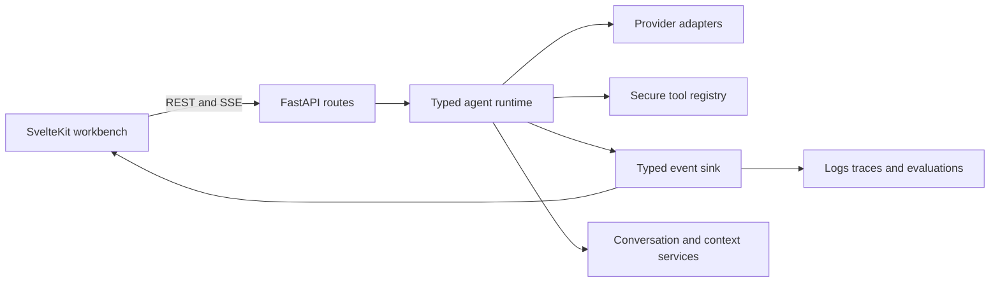

<div align="center">

# Archon

### Agent Reliability Workbench

**A local-first, inspectable AI-agent runtime for studying tool execution, context, evidence, and failure modes.**

[](https://github.com/levalencia/archon/actions)
[](https://www.python.org/downloads/)
[](LICENSE)

[Quick Start](#quick-start) · [Evidence Matrix](docs/IMPLEMENTATION-EVIDENCE.md) · [Architecture](#architecture) · [Limitations](#current-limitations)

</div>

---

## Why this project exists

Archon is a portfolio and learning project for production-oriented agent engineering. Its differentiator is not the number of agent features. It is the ability to inspect and test:

- native structured tool calls;
- iteration, tool, token, and time budgets;
- typed runtime events and explicit stop reasons;
- conversation history and context composition;
- web evidence, citations, and evaluation;
- visual run inspection on desktop, with mobile behavior still being hardened;
- provider adapters without an orchestration framework dependency.

## Verification status

The repository includes a local acceptance command:

```bash
./scripts/verify.sh
```

The audited repository has meaningful automated coverage and local runtime evidence, but the full quality and release gates are not green. Local build or container smoke results do not establish deployment.

See the [canonical implementation evidence matrix](docs/IMPLEMENTATION-EVIDENCE.md) for exact definitions, capability depth, and limitations. Do not infer production readiness from test count, source-file presence, or a local smoke test.

## Quick start

### Prerequisites

- Python 3.11
- [`uv`](https://docs.astral.sh/uv/)
- Node.js 22+
- Docker
- Optional: Ollama for a local model, or credentials for a configured hosted provider

```bash
git clone https://github.com/levalencia/archon.git

# Terminal 1, from the directory containing the clone
cd archon/backend
uv sync --extra dev --extra llm
cp .env.example .env
uv run uvicorn app.main:app --reload --host 0.0.0.0 --port 8000

# Terminal 2, from the directory containing the clone
cd archon/frontend
npm ci
npm run dev -- --host 0.0.0.0
```

Open `http://localhost:3000`.

The default example configuration targets Ollama. Hosted providers require their own credentials. Never commit `.env` files or runtime memory/database files.

## Architecture



### Live request path

1. The frontend creates or opens a conversation.
2. FastAPI builds system, skill, memory, history, and user messages.
3. The typed runtime invokes a provider with native tool schemas.
4. Tool calls are decoded into typed contracts rather than parsed from model prose.
5. Runtime events are sent to the SSE route without monkey-patching shared objects.
6. The UI renders the answer first and exposes Run, Evidence, Context, and Logs through an inspector.

## Evidence-based capability summary

The strongest demonstrated core is the typed budgeted runtime, native Anthropic/Foundry tool handling, live SSE evidence, authenticated conversations, and tool contracts. The desktop Workbench works for live run inspection, but the current global mobile shell has a known compressed-layout defect. Provider parity is partial. RAG durability, user-scoped memory, execution isolation, approvals, MCP, multi-agent security, evaluations, durable run replay, and cloud deployment are incomplete or unverified.

The [canonical evidence matrix](docs/IMPLEMENTATION-EVIDENCE.md) evaluates each capability independently as **Exists**, **Wired**, **Tested**, **Observed**, **UI**, and **Deployed**. It supersedes older feature-count and completion scorecards.

## Current limitations

- This is not yet a multi-tenant production service.
- Audited quality and release gates are not all green; see the canonical evidence matrix for current results.
- Authentication is meaningful for conversations and some resources, but memory, tasks, MCP, and approvals still have ownership gaps.
- Python and terminal tools execute host subprocesses; they are not secure sandboxes.
- Tool approval can be bypassed on the synchronous chat path and is not represented by durable owner-scoped receipts.
- RAG quality cannot be claimed until real embeddings, durable vector storage, and retrieval evaluations replace the demo defaults.
- The legacy ReAct implementation remains in the codebase for compatibility but is not the preferred live runtime.
- Provider token streaming is not equally capable across every adapter.
- Kubernetes, Helm, and cloud manifests are examples until a deployment is performed and verified.

## API

OpenAPI is available at `http://localhost:8000/docs` while the backend is running. Important routes include:

| Method | Path | Purpose |
|---|---|---|
| POST | `/api/chat` | Execute a typed agent run |
| POST | `/api/chat/stream` | Stream runtime events over SSE |
| GET/POST | `/api/conversations` | Conversation lifecycle |
| GET | `/api/chat/history/{id}` | Conversation messages |
| GET | `/api/logs/stream` | Live logs; access control is being hardened |
| POST | `/api/documents/upload` | Demo document ingestion |
| POST | `/api/documents/query` | Demo RAG query |
| GET/POST | `/api/skills` | Skill registry operations |
| POST | `/api/auth/register` | Register a user |
| POST | `/api/auth/login` | Obtain a token |

## Testing

```bash
# Full local acceptance gate
./scripts/verify.sh

# Backend only
cd backend
uv run ruff check app tests
uv run ruff format --check app tests
uv run pytest

# Frontend only
cd ../frontend
npm run check
npm test -- --run
npx playwright test
npm run build
```

## Design principles

- Pure Python protocols and dependency injection; no LangChain, AutoGen, or CrewAI runtime dependency.
- Local-first development with optional hosted providers.
- Typed contracts at provider, tool, event, persistence, and evaluation boundaries.
- Deterministic tests for control flow; real-provider smoke tests are separate and credential-dependent.
- Progressive disclosure: answer first, execution details on demand.
- Claims in documentation must use the six dimensions in the [canonical evidence matrix](docs/IMPLEMENTATION-EVIDENCE.md).

## Roadmap

1. Unified user-scoped persistence and route ownership.
2. Permission policy and approval UI for sensitive tools.
3. Grounded research workflow with citation and unsupported-claim evaluations.
4. Durable run-event replay and reconnectable SSE.
5. One governed MCP integration.
6. One bounded specialist delegation workflow.
7. Verified deployment and published benchmark results.

## License

MIT — see [LICENSE](LICENSE).

---

Built by [Luis Valencia](https://github.com/levalencia).
