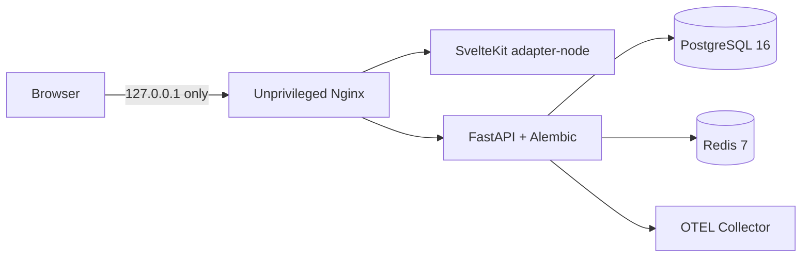
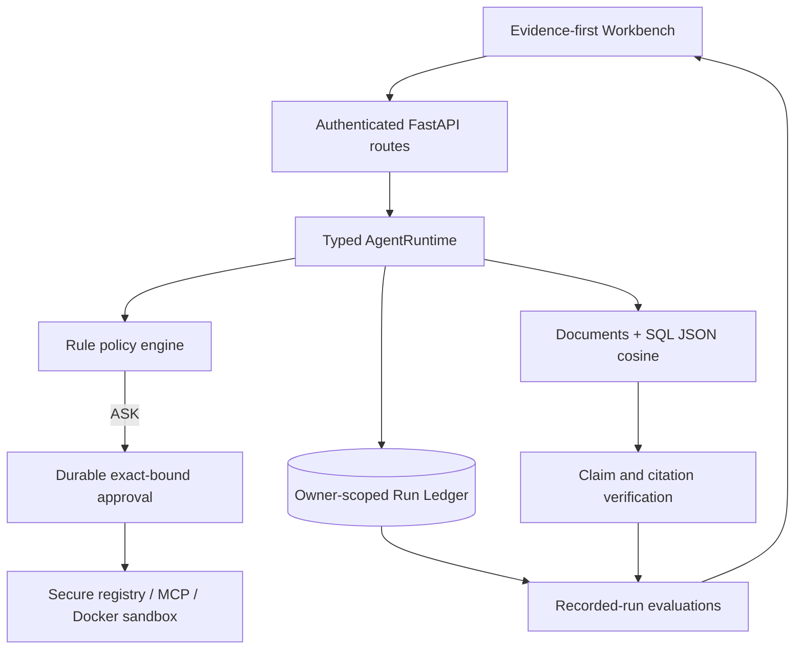

<div align="center">

# Archon

### Agent Reliability Workbench

**A local-first, inspectable agent runtime built around policy, approvals, durable evidence, evaluation, and failure recovery.**

[Implementation Evidence](docs/IMPLEMENTATION-EVIDENCE.md) · [Architecture](docs/ARCHITECTURE-DIAGRAMS.md) · [DR Runbook](docs/DR-RUNBOOK.md) · [Demo](docs/DEMO-SCRIPT.md)

</div>

---

## Status

Archon is a serious **local portfolio system**, not a public production service.

| Evidence | Current result |
|---|---|
| Verified target | Production-like local Docker Compose on macOS |
| Backend acceptance | 1,022 tests and 86.24% coverage at the S7.1 acceptance point; final S7.5 rerun pending |
| Frontend acceptance | Svelte 0/0, 17 Vitest, 21 Playwright |
| Local dependency smoke | PostgreSQL 16, Redis 7, OTEL collector, backend, frontend, and loopback gateway passed |
| DR | Backup 0.702 s; clean restore 21.597 s; 0 records lost at snapshot boundary |
| Portfolio benchmark | 30/30 deterministic control-plane iterations passed; external cost $0 |
| Public/cloud deployment | **No — explicitly deferred** |
| Remote CI | Not rerun; no push performed |

Exact definitions and limits live in the [canonical evidence matrix](docs/IMPLEMENTATION-EVIDENCE.md).

## Product thesis

Archon demonstrates one auditable path:

```text
Policy → Run → Approval → Tool → Evidence → Evaluation
```

The project emphasizes control-plane reliability rather than feature count:

- typed provider/tool/event contracts and explicit stop reasons;
- deterministic policy matching and fail-closed approvals;
- durable owner-scoped Run Ledger with replay, fork, and compare;
- encrypted owner/project memory and PII redaction before persistence;
- durable document ingestion, SQL JSON cosine retrieval, grounded claims, and citations;
- recorded-run evaluation and one bounded verifier child;
- official MCP 2.1.1 stdio discovery and governed execution;
- responsive evidence-first Workbench;
- reproducible local deployment, backup/restore, and benchmark evidence.

## Verified local target

The sole verified deployment target is `docker-compose.local.yml`:



PostgreSQL, Redis, and OTEL expose no host ports. Images are digest-pinned. Backend and frontend run non-root; the backend root filesystem is read-only. The verified target uses explicit mock model and embedding providers, keeps optional code execution disabled, and proves an exported `agent.run` span.

## Quick verification

### Prerequisites

- Docker Desktop
- Python 3.11
- [`uv`](https://docs.astral.sh/uv/)
- Node.js 22+

### Full repository acceptance

```bash
./scripts/verify.sh
```

### Production-like local deployment smoke

```bash
./scripts/local-deploy-smoke.sh
```

The script generates ephemeral credentials in a mode-`0600` temporary env file, builds the stack, verifies readiness/auth/migrations/metrics/OTEL export, and removes containers, volumes, and credentials by default.

### Disaster recovery proof

```bash
./scripts/local-dr-smoke.sh /tmp/archon-dr-report.json
```

This creates durable user/conversation/run/document/approval evidence, backs up PostgreSQL, destroys the source volume, restores into a fresh project, verifies exact records and hashes, records RTO/RPO, and cleans up.

### Deterministic portfolio benchmark

```bash
cd backend
uv run python scripts/portfolio_benchmark.py \
  --output /tmp/archon-portfolio-benchmark.json \
  --iterations 10
```

The benchmark uses actual production control-plane classes with scripted local adapters. It does **not** measure external model quality, load capacity, or production SLOs.

## Architecture



See [Architecture Diagrams](docs/ARCHITECTURE-DIAGRAMS.md) for boundaries and sequences.

## Evidence-backed capabilities

| Capability | What is demonstrated locally | Important limit |
|---|---|---|
| Policy and approvals | Sync/SSE parity, exact tool-call binding, durable owner-scoped decisions | No public production traffic evidence |
| Memory and privacy | AES-GCM owner/project memory, fail-closed key requirement, PII-before-storage | No online key rotation |
| Execution isolation | Optional Docker-only tools, no host fallback, network/mount/capability denial | Docker daemon remains trusted infrastructure |
| Run Ledger | Ordered durable events, replay, fork, compare, parent-child lineage | Replay is read-only, not executable resume |
| RAG and evaluation | Durable docs/chunks, SQL JSON cosine, grounded claims, recorded-run evals | No pgvector and no verified external embedding provider |
| Verifier child | Isolated evidence-only context, no tools, real budgets, benchmarked benefit | One bounded specialist, not a dynamic swarm |
| MCP | Official SDK stdio client, allowlisted profiles, inventory, policy/approval, UI | No Streamable HTTP/OAuth production deployment |
| Operations | Local Compose, OTEL span export, backup/restore, deterministic benchmark | Local-only; `Deployed` remains No |

## Key API surfaces

| Path | Purpose |
|---|---|
| `POST /api/chat`, `POST /api/chat/stream` | Typed agent run and SSE events |
| `/api/conversations` | Owner-scoped conversation lifecycle |
| `/api/runs`, `/api/runs/{id}/events` | Durable run evidence, replay, fork, compare |
| `/api/approvals` | Exact-bound durable approval decisions |
| `/api/documents` | Durable ingestion and grounded retrieval |
| `/api/evals/runs` | Evaluate recorded runs |
| `/api/mcp/servers` | Governed MCP server inventory and discovery |
| `/healthz`, `/readyz`, `/metrics` | Liveness, dependency readiness, metrics |

OpenAPI is available at `/docs` while the backend is running.

## Security and operations notes

- Secrets are required through environment substitution; no default database/JWT/encryption credentials exist in Compose.
- Persistent memory fails closed without one canonical 32-byte URL-safe key.
- Redis is required by the verified target; readiness fails when rate-limit storage is unavailable.
- Code/shell execution is absent unless explicitly enabled with an immutable sandbox image.
- The local gateway is published on loopback only.
- Production npm dependencies currently report 0 vulnerabilities; tooling/dev dependencies report 7 low findings and no moderate/high/critical findings.

## Current limitations

- No public/cloud deployment, remote CI rerun, or production SLO evidence.
- External model, search, and embedding behavior was not part of final local acceptance.
- Retrieval is `sql-json-cosine`, not pgvector or an indexed vector service.
- Broad repository Mypy debt remains; new/touched modules use scoped strict ratchets.
- Legacy experimental multi-agent and compatibility code is not a production claim.
- Local deterministic benchmark timings are development-machine observations, not capacity results.

## Documentation

- [Canonical implementation evidence](docs/IMPLEMENTATION-EVIDENCE.md)
- [Architecture diagrams](docs/ARCHITECTURE-DIAGRAMS.md)
- [Local deployment ADR](docs/adr/0001-local-production-like-deployment.md)
- [DR runbook](docs/DR-RUNBOOK.md)
- [Local deployment postmortem](docs/POSTMORTEM-LOCAL-DEPLOYMENT.md)
- [3–5 minute demo](docs/DEMO-SCRIPT.md)
- [Interview answer bank](docs/INTERVIEW-ANSWER-BANK.md)
- [DR report](docs/evidence/local-dr-report.json)
- [Benchmark report](docs/evidence/local-portfolio-benchmark.json)

## License

MIT — see [LICENSE](LICENSE).

Built by [Luis Valencia](https://github.com/levalencia).
