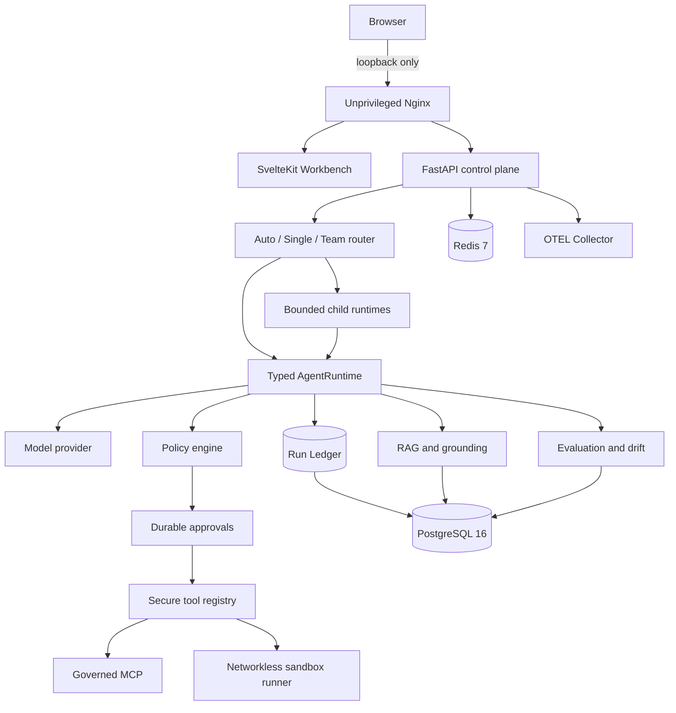

<div align="center">

# Archon

### Agent Reliability Workbench

A local-only system for building, governing, inspecting, and evaluating AI agent runs.

[Architecture](docs/ARCHITECTURE-DIAGRAMS.md) · [Evidence](docs/EVIDENCE.md) · [Documentation](docs/README.md) · [Course](docs/course/README.md) · [Visual Learning](docs/visual-learning/README.md)

</div>

---

## What Archon is

Archon is a working agent control plane — not a chat wrapper around an LLM.
It demonstrates one auditable lifecycle:

```
Policy → Run → Approval → Tool → Evidence → Evaluation
```

The runtime accepts native model tool calls, applies deterministic policy, pauses
sensitive operations for human approval, executes authorized tools, and records
ordered evidence. Runs can be inspected, replayed, forked, compared, grounded
against documents, and evaluated later.

**Archon is a local portfolio project. It is not a public production service.**

## Architecture

Application traffic enters through a loopback-only gateway.



The sandbox is non-root, networkless, read-only, capability-free, and
seccomp-constrained. Optional development tools may bind their UI to loopback.

## Quick start

Requires Docker Desktop, Python 3.11+, [`uv`](https://docs.astral.sh/uv/), and Node.js 22+.

### Run the full test suite

```bash
./scripts/verify.sh
```

Covers backend, frontend, browser, sandbox, container health, and benchmark
preflight. No live-provider calls.

### Start the local application

```bash
ARCHON_LOCAL_PORT=80 ./scripts/local-stack.sh start
./scripts/local-stack.sh status
./scripts/local-stack.sh url
```

`start` generates ephemeral credentials, builds the managed services, and prints
the loopback URL. The default is **deterministic mock mode** — the UI warns that
no live inference occurred.

Install the optional rich learning library before the first start. It adds the
decks, diagrams, audio, video, and study activities used by Present, Listen, and Study.

```bash
make media-install
ARCHON_LOCAL_PORT=80 ./scripts/local-stack.sh start
```

For a live-provider demo:

```bash
./scripts/local-stack.sh stop
ARCHON_LOCAL_PORT=80 ./scripts/local-stack.sh start --live-provider
```

Live mode imports only an allowlist of `ARCHON_LLM_*` settings from
`backend/.env`. Switching modes always requires an explicit `stop`.

Stop and clean up:

```bash
./scripts/local-stack.sh stop
```

> **Do not** invoke `docker compose` directly with `backend/.env` or dummy
> secrets. Use `local-stack.sh` so every command reuses the exact generated
> context.

## Documentation

| Audience | Entry point |
|---|---|
| Recruiter / engineering manager | Read this page, then the [Evidence Guide](docs/EVIDENCE.md) |
| Interviewer / candidate | [Interview route](docs/course/tracks/interview-preparation.md) |
| Engineer reviewing the system | [Architecture Diagrams](docs/ARCHITECTURE-DIAGRAMS.md) and [Code Bookmarks](docs/course/reference/code-bookmarks.md) |
| Learner | [Visual Learning Studio](docs/visual-learning/README.md) → [Course](docs/course/README.md) |
| Demo presenter | [Demo Script](docs/DEMO-SCRIPT.md) |

## Evidence and limitations

Start with the [human evidence summary](docs/EVIDENCE.md). Exact technical status lives in:

- **[Implementation Evidence](docs/IMPLEMENTATION-EVIDENCE.md)** — verified results, live-provider observations, and current scope.
- **[Capability Acceptance](docs/implementation/CAPABILITY-ACCEPTANCE.yaml)** — machine-readable status of each capability.

| Evidence | Location |
|---|---|
| Architecture and trust boundaries | [Architecture Diagrams](docs/ARCHITECTURE-DIAGRAMS.md) |
| Benchmark report | [Portfolio Benchmark](docs/evidence/local-portfolio-benchmark.json) |
| Recovery report | [DR Report](docs/evidence/local-dr-report.json) |
| Live-provider summary | [Live Provider Acceptance](docs/evidence/live-provider-acceptance-summary.json) |
| Deferred scope | [Remaining Deferred Gaps](docs/REMAINING-DEFERRED-GAPS.md) |

### Deliberate limits

Archon does **not** claim:

- public or cloud deployment
- production traffic, SLOs, or on-call operations
- GPU or high-throughput model serving
- fine-tuning or training
- pgvector-backed retrieval (Archon explicitly does not use pgvector)
- autonomous unapproved production optimization

These gaps are documented in [Remaining Deferred Gaps](docs/REMAINING-DEFERRED-GAPS.md).

## Security boundary

Archon treats the user, model, MCP output, documents, and tool arguments as
untrusted input. The local host, Docker daemon, and encryption master key remain
trusted boundaries. Local acceptance does not replace an independent security
audit.

## Project structure

```
backend/                 FastAPI runtime, services, persistence, and tests
frontend/                SvelteKit Workbench and browser tests
sandbox_runner/          Isolated execution service and seccomp profiles
deploy/                  Nginx and OpenTelemetry configuration
docs/                    Architecture, evidence, course, demo, and runbooks
scripts/                 Verification, deployment, backup, restore, and DR tools
docker-compose.local.yml Managed local stack definition
```

## License

MIT — see [LICENSE](LICENSE).

Built by [Luis Valencia](https://github.com/levalencia).
