# Archon — Architecture Diagrams

Visual documentation for understanding the system before writing code.
All diagrams use Mermaid for version control and GitHub rendering.

---

## 1. System Architecture (High-Level)

How all layers connect from user to infrastructure.

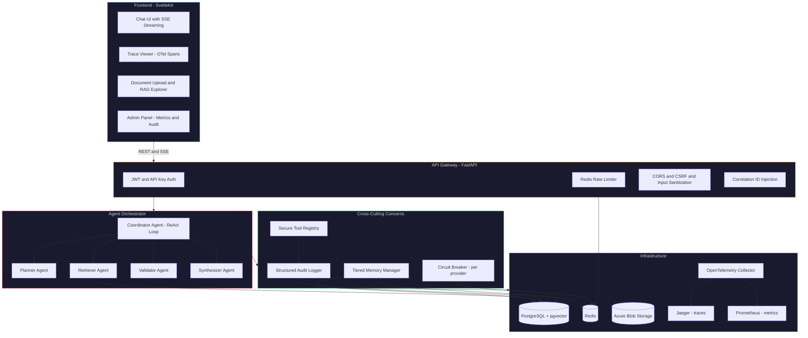

---

## 2. ReAct Reasoning Loop (Sequence Diagram)

How a single user message flows through the Coordinator agent.

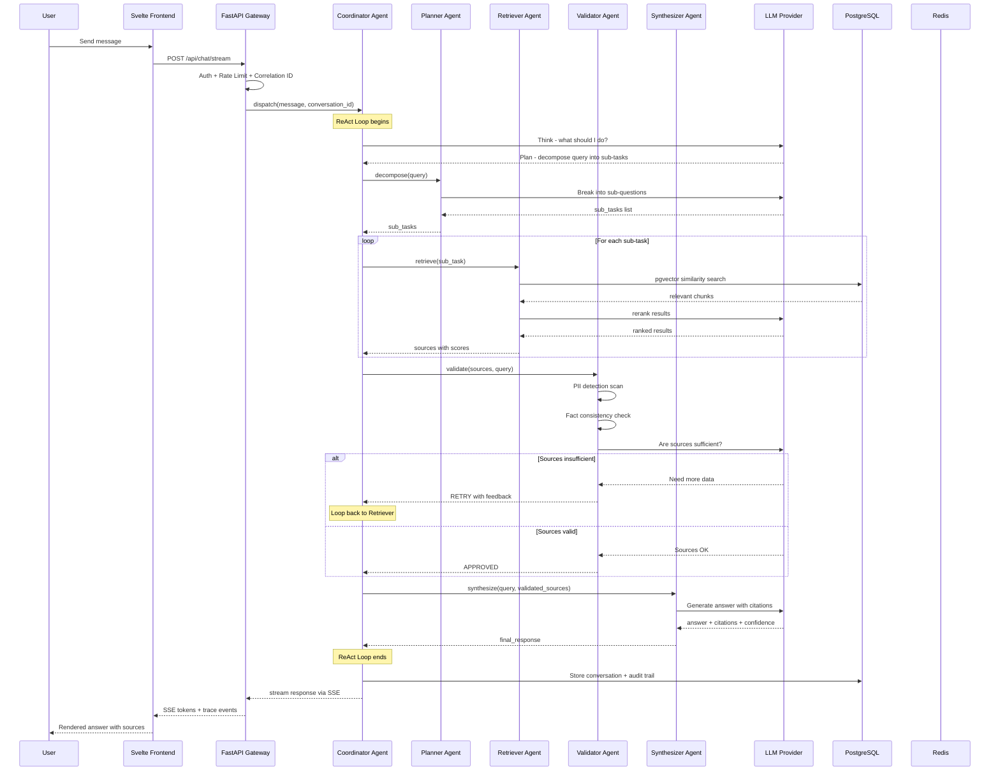

---

## 3. Class Diagram (Core Domain Model)

The Protocol-based architecture with dependency injection.

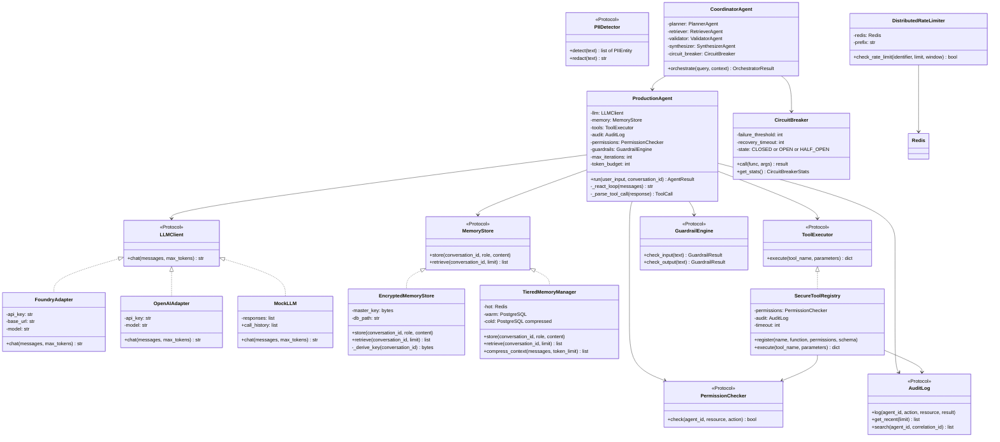

---

## 4. Request Flow (API to Response)

How a single HTTP request traverses all middleware layers.

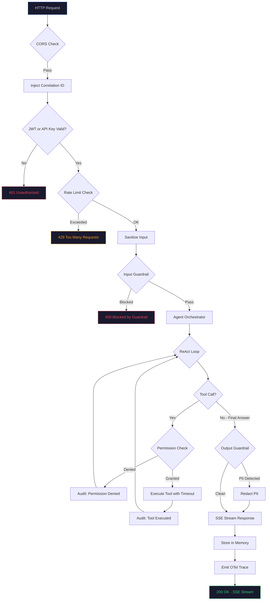

---

## 5. Multi-Agent Coordination

How the Coordinator delegates to specialist agents.

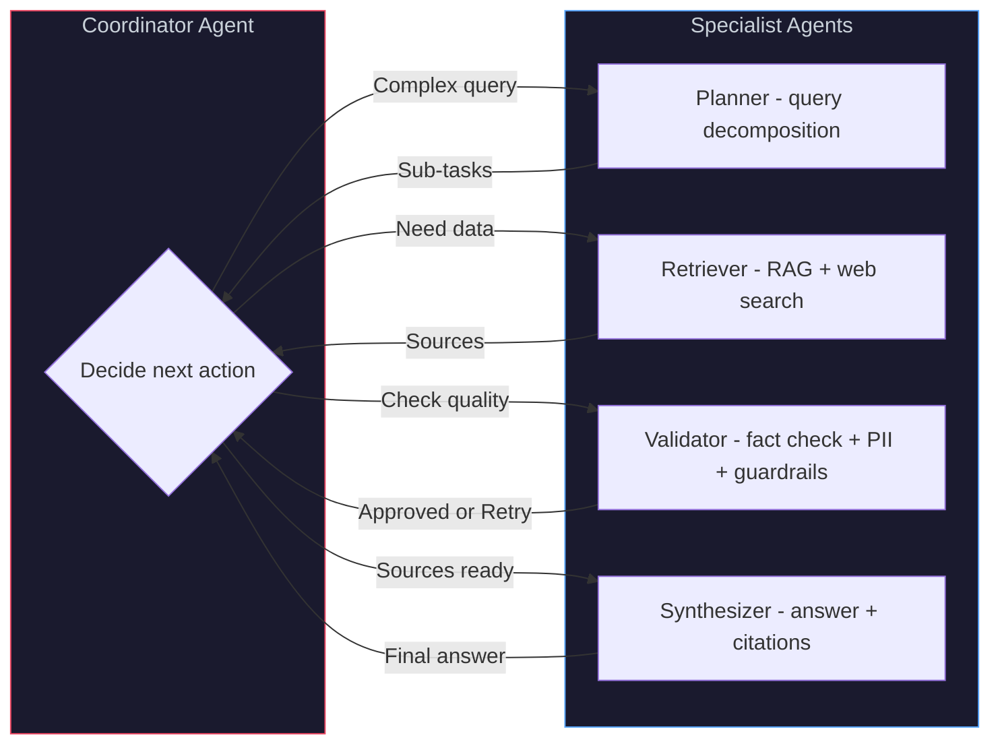

---

## 6. Memory Tiers

How conversation memory flows between hot, warm, and cold storage.

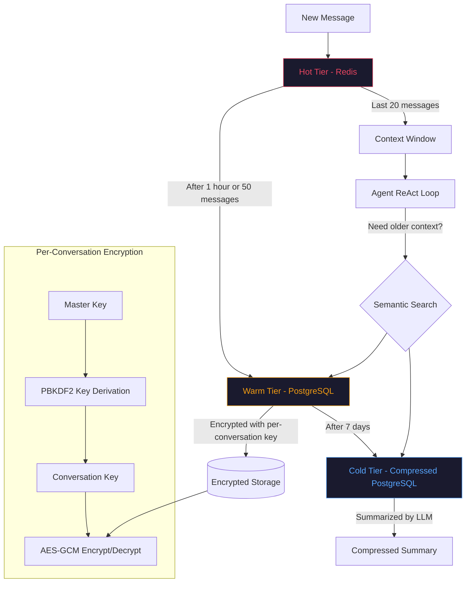

---

## 7. Security Layers

All security checks from input to output.

```mermaid
flowchart TB
    INPUT[User Input] --> S1[Rate Limiting - Redis sliding window]
    S1 --> S2[Authentication - JWT or API Key]
    S2 --> S3[Input Sanitization - XSS and SQL injection]
    S3 --> S4[Input Guardrail - prompt injection detection]
    S4 --> S5[PII Detection - regex + spaCy NER]
    
    S5 --> AGENT[Agent Processing]
    
    AGENT --> S6[Permission Check - Path.resolve + trailing slash]
    S6 --> S7[Tool Sandboxing - subprocess + timeout]
    S7 --> S8[Circuit Breaker - fail fast on dead service]
    
    S8 --> OUTPUT[Agent Output]
    
    OUTPUT --> S9[Output Guardrail - harmful content filter]
    S9 --> S10[PII Redaction - scrub before display]
    S10 --> S11[Audit Log - correlation ID + security level]
    S11 --> S12[OTel Trace - PII scrubbed before export]
    
    S12 --> RESPONSE[Clean Response to User]

    style S1 fill:#1a1a2e,stroke:#f39c12,color:#f39c12
    style S2 fill:#1a1a2e,stroke:#f39c12,color:#f39c12
    style S3 fill:#1a1a2e,stroke:#e94560,color:#e94560
    style S4 fill:#1a1a2e,stroke:#e94560,color:#e94560
    style S5 fill:#1a1a2e,stroke:#e94560,color:#e94560
    style S6 fill:#1a1a2e,stroke:#e94560,color:#e94560
    style S7 fill:#1a1a2e,stroke:#e94560,color:#e94560
    style S8 fill:#1a1a2e,stroke:#e94560,color:#e94560
    style S9 fill:#1a1a2e,stroke:#2ecc71,color:#2ecc71
    style S10 fill:#1a1a2e,stroke:#2ecc71,color:#2ecc71
    style S11 fill:#1a1a2e,stroke:#58a6ff,color:#58a6ff
    style S12 fill:#1a1a2e,stroke:#58a6ff,color:#58a6ff
```

---

## 8. RAG Pipeline

Document upload to grounded answer.

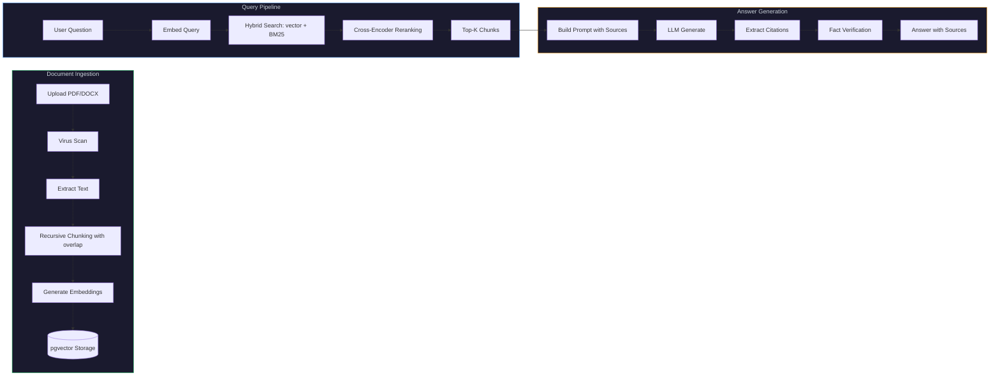

---

## 9. Circuit Breaker State Machine

Protection against dead LLM providers.

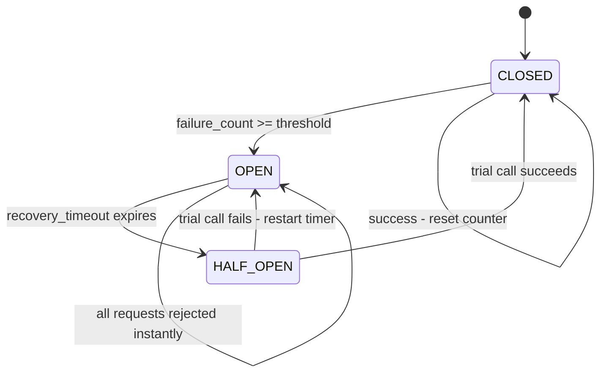

---

## 10. Deployment Architecture

From local development to production.

```mermaid
flowchart LR
    subgraph Local["Local Dev"]
        DC[docker-compose.yml]
        DC --> PG_L[(PostgreSQL)]
        DC --> RED_L[(Redis)]
        DC --> JAEGER_L[Jaeger]
        DC --> BE_L[FastAPI Backend]
        DC --> FE_L[SvelteKit Frontend]
    end

    subgraph CI["GitHub Actions CI"]
        LINT[Ruff Lint]
        TYPE[Mypy Type Check]
        TEST[Pytest - 100+ tests]
        SEC[pip-audit Security Scan]
        EVAL[Promptfoo Quality Gate]
        BUILD[Docker Build]
    end

    subgraph Azure["Azure Production"]
        ACA[Azure Container Apps]
        ACA --> PG_A[(Azure PostgreSQL Flex)]
        ACA --> RED_A[(Azure Cache for Redis)]
        ACA --> BLOB[(Azure Blob Storage)]
        ACA --> MON[Azure Monitor - traces + metrics]
        ACA --> ACR[Azure Container Registry]
    end

    Local -->|git push| CI
    CI -->|All green| Azure

    style Local fill:#1a1a2e,stroke:#2ecc71,color:#c9d1d9
    style CI fill:#1a1a2e,stroke:#f39c12,color:#c9d1d9
    style Azure fill:#1a1a2e,stroke:#58a6ff,color:#c9d1d9
```

---

## 11. Development Phases Timeline

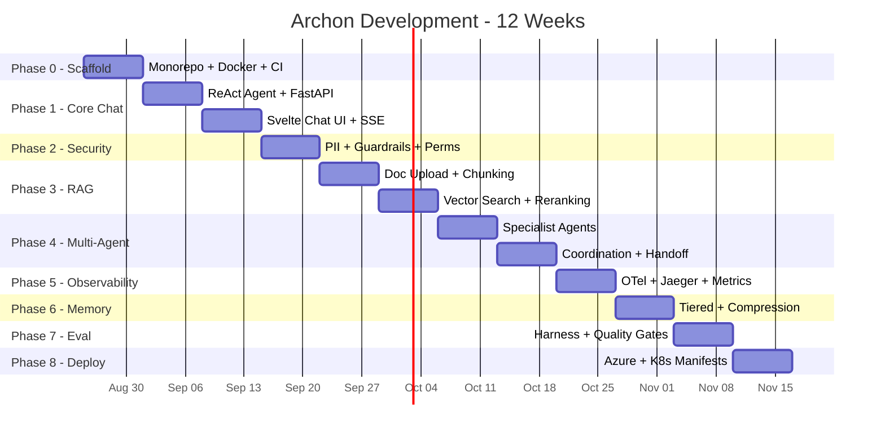

---

## Diagram Index

| # | Diagram | Type | What it explains |
|---|---------|------|-----------------|
| 1 | System Architecture | Component | How all layers connect |
| 2 | ReAct Reasoning Loop | Sequence | A single message through the agent system |
| 3 | Class Diagram | Class | Protocol-based DI, all interfaces and implementations |
| 4 | Request Flow | Flowchart | HTTP request through all middleware layers |
| 5 | Multi-Agent Coordination | Flowchart | How Coordinator delegates to specialists |
| 6 | Memory Tiers | Flowchart | Hot/warm/cold storage with encryption |
| 7 | Security Layers | Flowchart | All 12 security checks from input to output |
| 8 | RAG Pipeline | Flowchart | Document ingestion to grounded answer |
| 9 | Circuit Breaker | State | CLOSED/OPEN/HALF_OPEN state machine |
| 10 | Deployment | Flowchart | Local dev to Azure production |
| 11 | Timeline | Gantt | 12-week development phases |
