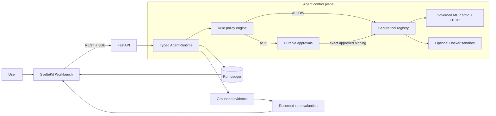
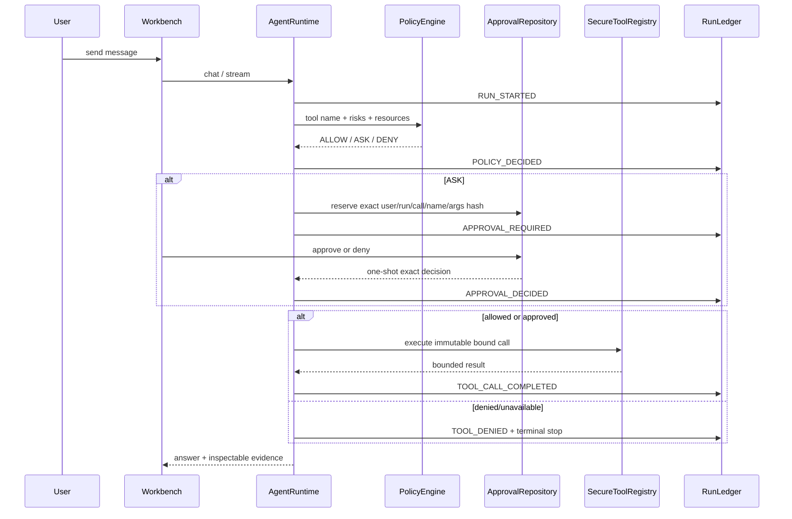
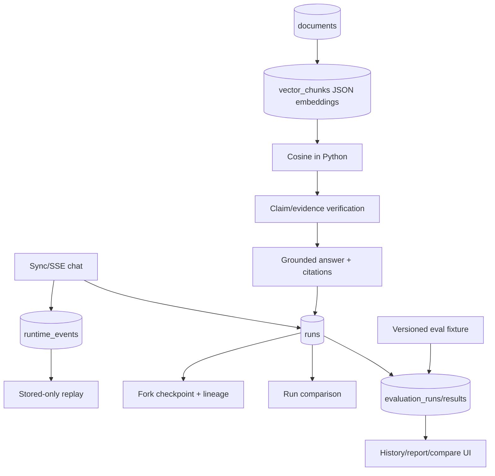
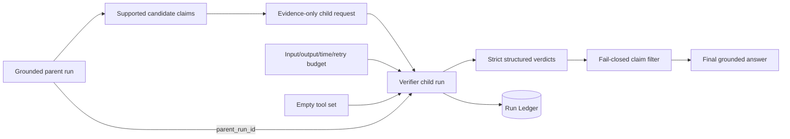
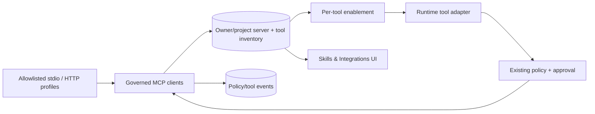
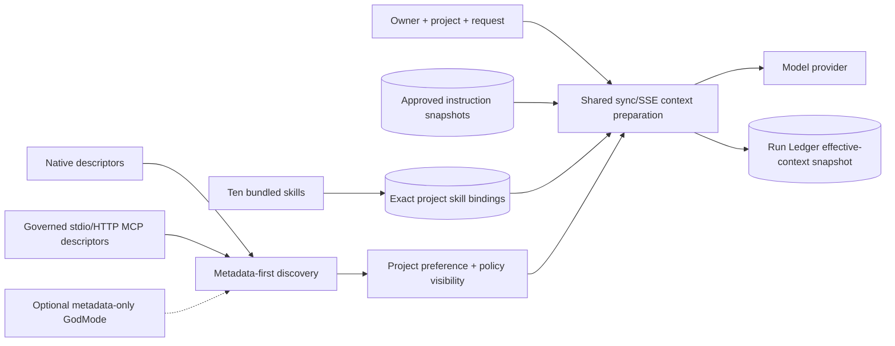
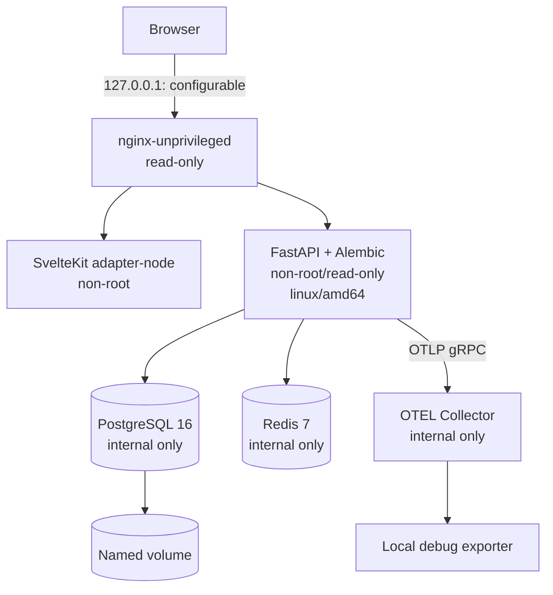
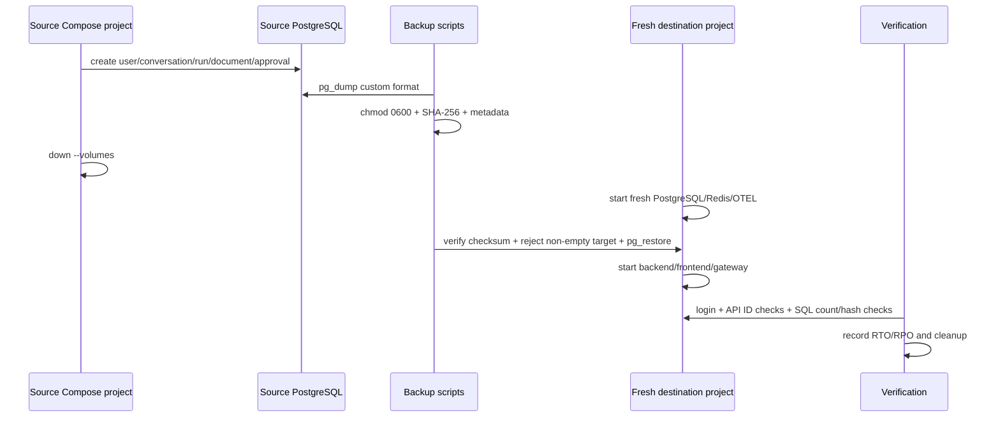
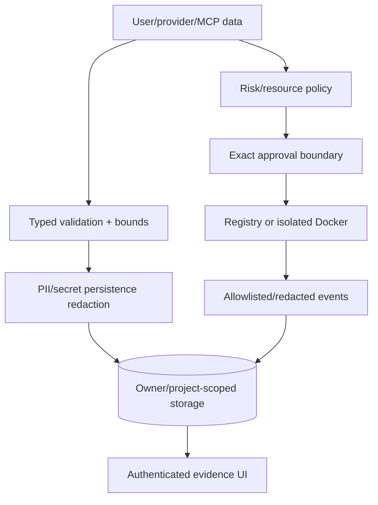

# Archon Architecture Diagrams

These diagrams describe the current evidence-backed system. Historical diagrams that implied pgvector, Azure Blob, Jaeger, dynamic swarms, or host-process sandboxing were removed because those paths were not the verified product.

Skills + Project Instructions and core-table reconciliation are merged to `main`
at `1f71f0e`. No public deployment is claimed.

## 1. Agent Reliability Workbench



The primary lifecycle is:

```text
Policy → Run → Approval → Tool → Evidence → Evaluation
```

## 2. Tool-call policy and approval sequence



Unknown metadata and unavailable authorizers fail closed. Approval does not authorize a different tool name, call ID, or argument hash.

## 3. Durable run and evaluation data



`vector_chunks` stores JSON embeddings. This is `sql-json-cosine`, not pgvector.

## 4. Bounded verifier child



The child receives selected claims/evidence only, has no tools, and cannot approve a claim when output is malformed, timed out, failed, or over budget.

## 5. Governed MCP



Commands, arguments, environment variables, and secrets are not user-controlled server records. Profile changes invalidate stale inventory; tool schema and enabled state are rechecked immediately before execution.

## 6. Skills, instructions, and exact context provenance



Instructions and skills provide context, never authority. Discovery returns
bounded metadata; execution still requires the normal policy/approval path.
The Run Ledger stores exact revision IDs, ordering, reasons, capability IDs and
schema hashes—not raw instruction/skill bodies or hidden reasoning.

## 7. Verified local deployment



The backend defaults to `linux/amd64` in this target because the ARM image reproduced a native `cryptography` SIGILL on the verified Mac. All referenced images are pinned by digest. Only the gateway publishes a loopback port.

## 8. Backup and clean restore



## 9. Trust boundaries



Local Docker, the host Docker daemon, the memory master key, and the env file remain trusted operational boundaries. A local smoke does not prove resistance to every container-runtime or host compromise.
