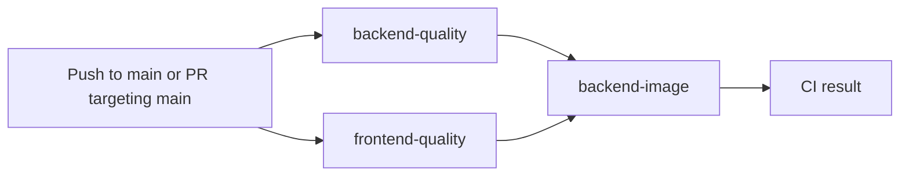
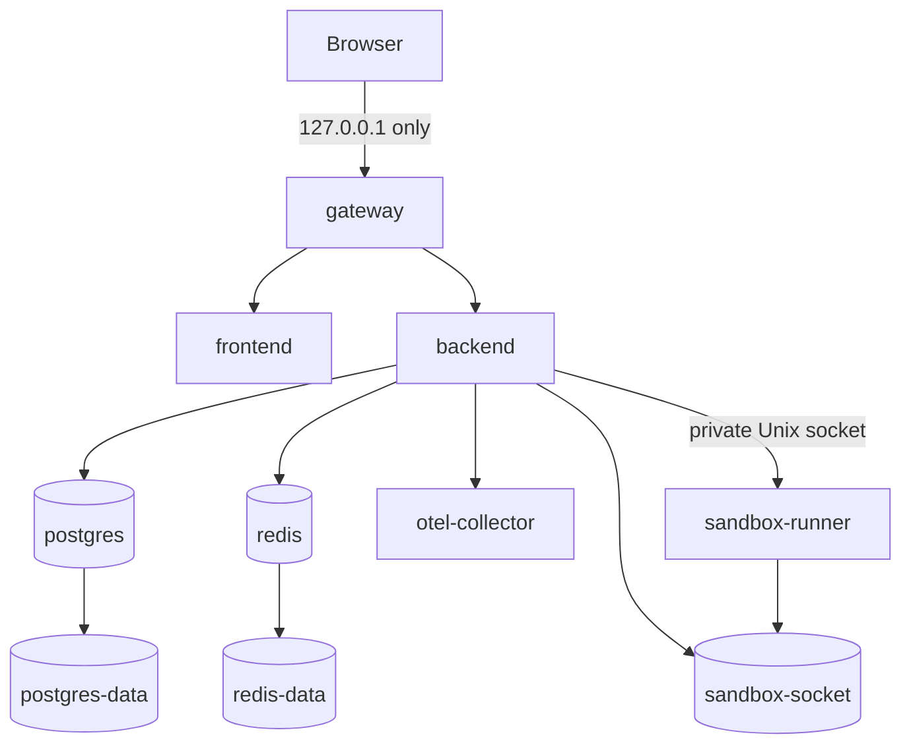

# CI, pipelines, Docker services, and local execution

This guide explains the repository's automated checks, the verified Docker Compose target, and the supported commands for running Archon locally.

The canonical GitHub Actions file is:

```text
.github/workflows/ci.yml
```

There is no `cip.yaml`. The filename is `ci.yml`.

## Terminology

- A **workflow** is one YAML file under `.github/workflows/`.
- A **job** is an independently scheduled unit inside a workflow.
- A **step** is one command or action inside a job.
- **CI** verifies a revision.
- **CD** publishes or deploys a revision.
- A local smoke script is an acceptance pipeline, but it is not GitHub Actions.

Archon currently has:

| Item | Count |
|---|---:|
| GitHub Actions workflow files | 1 |
| Active GitHub workflows | 1 |
| Jobs in the CI workflow | 3 |
| Deployment/CD workflows | 0 |
| Verified Compose services | 7 |

## GitHub Actions workflow

The workflow name is `CI`.



### Triggers

```yaml
on:
  push:
    branches: [main]
  pull_request:
    branches: [main]
```

A push to a feature branch does not run CI by itself. Opening a pull request from that branch into `main` triggers the workflow.

The workflow has no `workflow_dispatch` manual trigger.

### Concurrency

```yaml
concurrency:
  group: ci-${{ github.workflow }}-${{ github.ref }}
  cancel-in-progress: true
```

GitHub cancels an older run when a newer commit starts CI for the same ref.

### Job dependency graph

`backend-quality` and `frontend-quality` run in parallel. `backend-image` has:

```yaml
needs: [backend-quality, frontend-quality]
```

The image job does not start unless both quality jobs succeed.

## Job: `backend-quality`

Environment:

- runner: `ubuntu-latest`;
- Python: 3.11;
- package manager: `uv`;
- working directory: `backend/`.

| Step | Command or action | Purpose |
|---|---|---|
| Checkout | `actions/checkout@v4` | Fetch the tested revision |
| Python | `actions/setup-python@v5` | Install Python 3.11 |
| uv | `astral-sh/setup-uv@v3` | Install the Python package manager |
| Dependencies | `uv sync --extra dev` | Reproduce locked development dependencies |
| Ruff lint | `uv run ruff check app tests ../scripts/validate-course-docs.py` | Reject Python lint errors |
| Ruff format | `uv run ruff format --check ...` | Reject formatting drift |
| Documentation | `uv run python ../scripts/validate-course-docs.py` | Validate course/catalog contracts and paths |
| Bandit | `uv run bandit -r app -ll` | Scan backend code for relevant security findings |
| Tests | `uv run pytest ... --cov-fail-under=50` | Run the backend suite and enforce the CI coverage floor |

The final integrated suite exceeded the CI floor, but the workflow gate remains 50%.

This job does not call a live model provider.

## Job: `frontend-quality`

Environment:

- runner: `ubuntu-latest`;
- Node.js: 22;
- package manager: npm;
- working directory: `frontend/`.

| Step | Command or action | Purpose |
|---|---|---|
| Checkout | `actions/checkout@v4` | Fetch the tested revision |
| Node | `actions/setup-node@v4` | Install Node 22 and configure npm caching |
| Dependencies | `npm ci` | Install exact lockfile dependencies |
| Svelte/TypeScript | `npm run check` | Validate Svelte and TypeScript |
| Unit/component tests | `npm test -- --run` | Run Vitest |
| Build | `npm run build` | Produce the SvelteKit production build |
| Chromium | `npx playwright install --with-deps chromium` | Install the browser runtime |
| Browser tests | `npx playwright test` | Run Playwright end-to-end scenarios |

The explicit cache is keyed from `frontend/package-lock.json`.

## Job: `backend-image`

Environment:

- runner: `ubuntu-latest`;
- dependency: both quality jobs must pass.

The job:

1. builds the root `Dockerfile`;
2. tags the image with `${{ github.sha }}`;
3. generates temporary memory-encryption material;
4. starts the backend image with a temporary SQLite database;
5. polls `/healthz` up to 20 times;
6. prints container logs and fails if health never succeeds;
7. removes the smoke container through an exit trap.

This is an image startup smoke. It is not the seven-service Compose acceptance.

## What CI does not do

The workflow does not:

- publish an image to GHCR or another registry;
- deploy to Azure, Kubernetes, or a public environment;
- execute the full seven-container Compose target;
- run PostgreSQL/Redis/OTEL integration as a service matrix;
- run backup and clean restore;
- run the final 10-iteration portfolio benchmark;
- execute provider-live acceptance;
- upload coverage or Playwright reports as artifacts.

The repository therefore has CI, not CD.

A workflow check blocks merging only when GitHub branch protection or a ruleset requires it. The YAML file itself does not enforce branch protection.

## CI security notes

The current workflow contains no Claude, Gemini, Codex, or GitHub AI action. It does not process issue comments or use `pull_request_target`.

It also references no repository/provider secrets. The backend image smoke generates temporary encryption material during the job.

Reasonable future hardening includes:

- declare `permissions: contents: read`;
- pin third-party actions to immutable commit SHAs;
- add `timeout-minutes` to every job;
- upload coverage and Playwright reports;
- add a manual `workflow_dispatch` trigger;
- raise the CI coverage floor after measuring Linux stability.

## Local acceptance pipelines

GitHub CI is not the most complete repository gate.

### Full repository verification

```bash
./scripts/verify.sh
```

This runs:

- clean-worktree preflight;
- shell syntax checks;
- acceptance-script lint;
- provider harness tests without live calls;
- capability and documentation validators;
- backend tests and coverage;
- frontend dependency installation;
- Svelte/TypeScript checks;
- Vitest;
- production frontend build;
- Playwright;
- sandbox smoke;
- backend image health smoke;
- one-iteration benchmark preflight;
- clean-worktree post-check.

It requires a clean Git worktree. It intentionally does not enable provider-live acceptance.

### Final deterministic benchmark

```bash
cd backend
uv run python scripts/portfolio_benchmark.py \
  --output /tmp/archon-portfolio-benchmark.json \
  --iterations 10
```

This executes 12 scenarios for 120 total scenario iterations.

### Managed seven-service application

Use the managed wrapper for normal local operation:

```bash
./scripts/local-stack.sh start
```

`start` calls the acceptance smoke with retention enabled. It:

1. creates a mode-`0600` temporary env file;
2. generates valid ephemeral database, JWT, and encryption material;
3. builds and starts the seven services;
4. waits for health/readiness;
5. checks auth, migrations, metrics, OTEL, and sandbox behavior;
6. atomically stores only non-secret runtime metadata (project, env-file path, Compose file, and URL) in a mode-`0600` state file;
7. rejects concurrent starts and prints the loopback application URL.

If managed state already exists but health is failing or the protected env is unavailable, `start` preserves the existing state, containers, volumes, and pointers and exits nonzero. The kernel advisory start lock (`lockf` on macOS, `flock` on Linux) rejects concurrent starts and is released automatically on exit, signal, or crash. Diagnose with `status`/`logs`; when the protected env is missing, those commands use exact Compose project labels instead of invented values. Run `stop` explicitly before replacement; its missing-env recovery removes only containers, volumes, and networks carrying the recorded project label. The wrapper never destroys a possibly recoverable stack merely because one health probe failed.

The wrapper is the only supported day-to-day path for retained stacks. Do not use `backend/.env`, a nonexistent root `.env`, or dummy secret values to satisfy Compose interpolation.

Inspect health and Compose state:

```bash
./scripts/local-stack.sh status
```

Print the URL:

```bash
./scripts/local-stack.sh url
```

Read all logs or one service without reconstructing project/env arguments:

```bash
./scripts/local-stack.sh logs
./scripts/local-stack.sh logs otel-collector
./scripts/local-stack.sh logs backend
```

Stop the exact managed stack and remove volumes, protected env, and state:

```bash
./scripts/local-stack.sh stop
```

### One-shot seven-service acceptance

```bash
./scripts/local-deploy-smoke.sh
```

The one-shot form performs the same acceptance checks and removes containers, volumes, and its generated env on exit.

For low-level debugging only, direct retention remains available:

```bash
KEEP=1 ./scripts/local-deploy-smoke.sh
```

It prints `PROJECT`, `ENV_FILE`, and `ARCHON_URL`. Every later direct `docker compose` command must reuse that exact project and env file. Never substitute `backend/.env` or dummy values. A failed smoke cleans itself unless `KEEP_FAILED=1` is explicitly requested for debugging.

### Disaster recovery

```bash
./scripts/local-dr-smoke.sh /tmp/archon-dr-report.json
```

The DR pipeline creates durable fixture data, backs up PostgreSQL, destroys the source deployment, restores into a clean deployment, verifies IDs/counts/hashes, records RPO/RTO, and cleans its resources.

### Backup and restore primitives

```bash
./scripts/local-backup.sh ...
./scripts/local-restore.sh ...
```

Use the [DR Runbook](DR-RUNBOOK.md) for arguments, prerequisites, and safe target checks.

## Docker Compose target

The verified file is:

```text
docker-compose.local.yml
```

Only `gateway` publishes a host port, and it binds to `127.0.0.1`.



## Container inventory

### `gateway`

- image: digest-pinned `nginxinc/nginx-unprivileged`;
- publishes `127.0.0.1:${ARCHON_LOCAL_PORT:-8080}:8080`;
- listens on container port `8080`;
- waits for backend and frontend health;
- has no Compose healthcheck of its own;
- mounts `deploy/nginx.local.conf` read-only;
- read-only root filesystem;
- temporary `/tmp`;
- `no-new-privileges`;
- no persistent data.

### `frontend`

- built from `frontend/Dockerfile`;
- SvelteKit adapter-node server on internal port 3000;
- no host port;
- HTTP health probe on `/`;
- read-only root filesystem;
- temporary `/tmp`;
- `no-new-privileges`;
- no persistent volume.

### `backend`

- built from the root `Dockerfile`;
- FastAPI and Alembic;
- defaults to the verified application platform configured by Compose;
- listens on internal port `8000`;
- waits for healthy PostgreSQL, Redis, and sandbox services; OTEL requires only `service_started` because the collector has no Compose healthcheck;
- no host port;
- `/healthz` container health probe;
- read-only root filesystem;
- temporary `/tmp`;
- `no-new-privileges`;
- mounts only the private `sandbox-socket` volume for execution requests.

### `sandbox-runner`

- built from `sandbox_runner/Dockerfile`;
- runs as user/group `10001:10001`;
- `network_mode: none`;
- no host port;
- read-only root filesystem;
- drops all Linux capabilities;
- uses `no-new-privileges`;
- uses the vendored bootstrap seccomp profile and a stricter child filter;
- is limited to `0.5` CPU, `128m` memory, and `64` PIDs;
- mounts two `16m` tmpfs areas: `/tmp` is `noexec,nosuid,nodev`; `/work` is executable and uses `nosuid,nodev`;
- exposes only the private Unix socket volume;
- receives no Docker socket and no project source mount;
- has a protocol-level health probe over the Unix socket.

### `postgres`

- digest-pinned PostgreSQL 16 Alpine;
- listens on internal port `5432` only;
- database name: `archon`;
- persistent `postgres-data` named volume;
- health probe: `pg_isready`;
- `no-new-privileges`;
- receives its password through required environment substitution.

### `redis`

- digest-pinned Redis 7 Alpine;
- listens on internal port `6379` only;
- append-only persistence enabled;
- persistent `redis-data` named volume;
- health probe: `redis-cli ping`;
- `no-new-privileges`;
- used by the verified rate limiter.

### `otel-collector`

- digest-pinned OpenTelemetry Collector Contrib;
- internal OTLP receivers on `4317` (gRPC) and `4318` (HTTP);
- health extension on internal port `13133`, but no Compose healthcheck;
- mounts `deploy/otel-collector.local.yml` read-only;
- local debug trace exporter;
- read-only root filesystem;
- temporary `/tmp`;
- `no-new-privileges`;
- no persistent volume or public endpoint.

## Persistent volumes

| Volume | Used by | Purpose |
|---|---|---|
| `postgres-data` | PostgreSQL | Durable relational state |
| `redis-data` | Redis | Append-only rate-limit state |
| `sandbox-socket` | Backend and sandbox runner | Private Unix-socket transport |

The sandbox socket is transport, not business data.

## Developer mode without the full Compose target

Use this mode for code iteration, not deployment evidence.

### Backend

```bash
cd backend
uv sync --extra dev --extra llm
export ARCHON_ENCRYPTION_MASTER_KEY="$(python3 -c 'import base64,secrets; print(base64.urlsafe_b64encode(secrets.token_bytes(32)).decode().rstrip("="))')"
uv run uvicorn app.main:app --reload --host 127.0.0.1 --port 8000
```

With no `.env`, Settings defaults to SQLite, mock model, mock embeddings, and in-memory rate limiting. The generated memory key exists only in the current shell.

Do not commit a generated key or `.env` file.

### Frontend

In a second terminal:

```bash
cd frontend
npm ci
npm run dev
```

Vite listens on port 3000 and proxies `/api` and `/healthz` to `http://localhost:8000`.

Open:

```text
http://localhost:3000
```

### Provider configuration

`backend/.env.example` documents provider settings. Capability flags default off unless verified for the configured endpoint/model.

Never commit provider credentials. The deterministic local target works without them.

## Which file is authoritative?

| Question | Source |
|---|---|
| GitHub workflow | `.github/workflows/ci.yml` |
| Local deployment | `docker-compose.local.yml` |
| Full local verification | `scripts/verify.sh` |
| Deployment smoke | `scripts/local-deploy-smoke.sh` |
| Recovery | `scripts/local-dr-smoke.sh`, `docs/DR-RUNBOOK.md` |
| Current implementation claims | `docs/IMPLEMENTATION-EVIDENCE.md` |
| Architecture | `docs/ARCHITECTURE-DIAGRAMS.md` |

`docker-compose.prod.yml`, Helm, and Kubernetes files are not the verified deployment target. Public/cloud deployment remains deferred.
