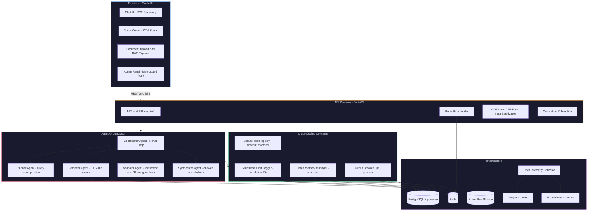
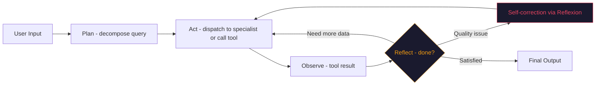

# WEBAPP-PLAN.md — Production AI Agent Webapp

## For Startup Interviews ($150K+ AI Agent Engineer Roles)

**Author:** Luis Valencia Munoz
**Created:** 2026-08-21
**Status:** Planning
**Repo:** `github.com/levalencia/production-ai-agents`

---

## 1. What We're Building

### The App: **Archon** — Enterprise AI Research & Operations Assistant

A production-grade, multi-agent AI assistant that helps knowledge workers research topics, analyze documents, manage tasks, and get answers — with **full enterprise security, observability, and compliance** visible in a professional UI.

Think: **Perplexity meets ChatGPT meets an enterprise audit dashboard** — a conversational AI that shows its reasoning, cites sources, uses tools, and exposes every production pattern under the hood via an observability panel.

### Why This Use Case

1. **Demonstrates breadth**: Research requires RAG, tool calling, multi-agent orchestration, memory, and planning — touching every course concept
2. **Visually impressive**: Chat UI + real-time trace visualization + security dashboard makes interviewers say "this is production-ready"
3. **Solves a real problem**: Every startup needs an AI assistant — showing you can build one end-to-end is the proof
4. **Shows the invisible work**: Most portfolios show chat UIs. This one shows the circuit breakers, PII detection, audit trails, and cost tracking that separate production from demos

### Core User Flows

| Flow | Description | Concepts Demonstrated |
|------|-------------|----------------------|
| **Research Query** | User asks a complex question → Planner decomposes → Retriever searches docs + web → Validator fact-checks → Synthesizer answers with citations | ReAct loop, Agentic RAG, multi-agent orchestration, tool calling |
| **Document Upload & Chat** | User uploads PDF/docs → chunked, embedded, stored → chat over documents with grounded answers | RAG pipeline, document processing, PII detection, vector DB |
| **Multi-Turn Conversation** | Extended conversation with memory → context optimization → encrypted persistence | Tiered memory, context window management, encrypted storage |
| **Admin Observability** | View traces, audit logs, cost metrics, circuit breaker states, agent health | OpenTelemetry, structured logging, correlation IDs, dashboards |
| **Security Probe Demo** | Interactive demo page showing PII detection, permission checks, path traversal prevention | Security probes, RED-GREEN tests, guardrails |

---

## 2. Complete Architecture

### 2.1 System Overview



### 2.2 The 5-Layer Architecture (from Course 1 Day 1)

| Layer | Components | Course Source |
|-------|-----------|---------------|
| **Presentation** | Svelte chat UI, trace viewer, admin panel | Day 8, Day 14 |
| **API Gateway** | FastAPI, auth, rate limiting, CORS/CSRF, input sanitization | Day 22, Day 4 |
| **Agent Orchestration** | Coordinator + specialist agents, ReAct loop, tool calling | Day 1, Day 16, Adv L31-L44 |
| **Domain Services** | RAG pipeline, memory tiers, PII detection, permission manager | Day 2-3, Adv L19-L30 |
| **Infrastructure** | PostgreSQL, Redis, Vector DB, Blob Storage, OTel | Day 23, Adv L61-L75 |

### 2.3 Agent Architecture Detail

#### Coordinator Agent (ReAct Loop)



The Coordinator implements:
- **ReAct reasoning** (Adv L31-L32): Thought/Action/Observation loop with reasoning traces
- **Planning loop controls** (Adv L34): Max iterations, token budget, cost limits
- **Self-correction** (Adv L33): Reflexion pattern when validator rejects output
- **Fallback logic** (Adv L40): Graceful degradation when sub-agents fail

#### Specialist Agents

| Agent | Role | Key Patterns |
|-------|------|-------------|
| **Planner** | Decomposes complex queries into sub-tasks | Query decomposition (Adv L36), CoT prompting (Adv L11) |
| **Retriever** | Searches vector DB + web, reranks results | RAG pipeline (Adv L19-L27), hybrid search (Adv L23), reranking (Adv L22) |
| **Validator** | Checks factual consistency, PII, compliance | Fact-checking (Adv L38), risk/compliance (Adv L39), PII detection (Day 2) |
| **Synthesizer** | Produces final answer with citations and XAI | Explainable synthesis (Adv L41), anti-hallucination prompting (Adv L25) |

#### Multi-Agent Coordination
- **Role Registry** (Adv L46): Each agent has typed capability contracts
- **Coordination Bus** (Adv L46): Pub-sub message passing between agents
- **Hierarchy** (Adv L51): Coordinator dispatches to specialists
- **Consensus** (Adv L52): Validator can veto Synthesizer output, triggering retry

---

## 3. Tech Stack Decisions

### 3.0 Architecture Principles (Non-Negotiable)

| Principle | What it means | How we enforce it |
|---|---|---|
| **Zero framework lock-in** | No LangChain, no AutoGen, no CrewAI. Pure Python + Protocols. | Code review rejects any langchain/autogen/crewai import |
| **100% local first** | Everything runs with `docker compose up`. No cloud dependencies until explicitly deploying. | CI tests run against Docker Compose, not cloud services |
| **Provider swappable** | User changes LLM provider via .env (Foundry, OpenAI, Anthropic, Ollama). Core never imports SDK. | LLMClient Protocol + adapter factory from env |
| **Skills and MCP native** | Agent can load skills from GitHub repos and connect to MCP tool servers | Skill registry + MCP client built into agent core |

### 3.0.1 Skills System

The agent can discover and use **skills** (structured knowledge files) at runtime:

- User can add skill repos (GitHub URLs) in settings
- Agent searches skills by relevance to the current query
- Skills provide domain expertise, tool configurations, and procedures
- Output shows which skills were used and why (transparency)
- Similar to god-mode search but integrated into the agent reasoning loop

### 3.0.2 MCP Tool Integration

The agent can connect to **MCP (Model Context Protocol) servers**:

- User configures MCP servers in settings (stdio or HTTP)
- Agent discovers available tools at startup
- Tools are registered in the SecureToolRegistry with permissions
- Any MCP-compatible tool server works (Foundry, custom, community)

### 3.0.3 Local-First Docker Compose

One command runs everything:

```yaml
# docker-compose.yml
services:
  backend:     # FastAPI on port 8000
  frontend:    # SvelteKit on port 3000
  postgres:    # PostgreSQL + pgvector on port 5432
  redis:       # Rate limiter, cache, circuit breaker on port 6379
  jaeger:      # Trace viewer UI on port 16686
  prometheus:  # Metrics on port 9090
```

No Azure, no AWS, no cloud accounts needed. Deploy to cloud is Phase 8 (optional).

### 3.1 Frontend

| Choice | Rationale |
|--------|-----------|
| **SvelteKit** | Lighter than React/Next, excellent SSE support for streaming, compiles to vanilla JS (fast), professional look achievable with Skeleton UI or shadcn-svelte |
| **Skeleton UI** (or shadcn-svelte) | Production component library, dark mode, responsive |
| **Server-Sent Events (SSE)** | Streaming agent responses token-by-token (like ChatGPT), also streams trace events |
| **D3.js / Mermaid** | Trace visualization (span waterfall), architecture diagrams |

### 3.2 Backend

| Choice | Rationale |
|--------|-----------|
| **FastAPI** | Async-native, automatic OpenAPI docs, dependency injection, SSE support via `sse-starlette` |
| **Python 3.11+** | Match existing codebase, async/await, typing, Protocols |
| **Pydantic v2** | Request/response validation, tool schemas, settings management |
| **structlog** | Already in codebase, JSON structured logging with correlation IDs |
| **httpx** | Already in codebase for Foundry adapter, async HTTP client |

### 3.3 LLM Providers (Vendor-Neutral)

| Choice | Rationale |
|--------|-----------|
| **Azure AI Foundry (primary)** | Existing adapter, MVP activity for Microsoft, enterprise-grade |
| **OpenAI (fallback)** | Existing adapter, widely understood |
| **Protocol-based adapters** | Already implemented — any LLMClient works via DI |
| **MockLLM for tests** | Already implemented — deterministic test execution |

### 3.4 Database

| Choice | Rationale |
|--------|-----------|
| **PostgreSQL** | Production-grade, pgvector for embeddings, row-level security for multi-tenant, pgcrypto for encryption (fixes Gap 2.1, 2.2, 2.6) |
| **Redis** | Rate limiting (already in course Day 4), circuit breaker state, session cache, hot memory tier |
| **pgvector** | Vector similarity search built into Postgres — no separate vector DB to manage, simplifies deployment |

### 3.5 Observability

| Choice | Rationale |
|--------|-----------|
| **OpenTelemetry SDK** | Industry standard, vendor-neutral, traces + metrics + logs (Day 26, Adv L69) |
| **Jaeger** (dev) / **Azure Monitor** (prod) | Trace visualization, distributed tracing |
| **Prometheus** (dev) / **Azure Monitor** (prod) | Metrics: token usage, latency, tool call rates, circuit breaker states |
| **structlog → OTel Logs** | Already in codebase, extend to OTel log exporter |

### 3.6 Deployment

| Choice | Rationale |
|--------|-----------|
| **Docker Compose** (local dev) | One command to run everything |
| **Azure App Service** (initial deploy) | Simple, Luis's Microsoft MVP context, quick to demo |
| **Azure Container Apps** (production) | Auto-scaling, managed containers, Dapr sidecar optional |
| **Kubernetes manifests** (K8s-ready) | Show readiness for AKS, proves enterprise deployment skills (Day 23) |

---

## 4. Phase-by-Phase Development Plan

### Phase 0: Foundation Scaffold (Week 1)
**Goal:** Project structure, CI/CD, dev environment

- [ ] Create monorepo structure: `webapp/backend/`, `webapp/frontend/`, shared `src/agent_core/`
- [ ] `docker-compose.yml` with PostgreSQL, Redis, Jaeger
- [ ] FastAPI skeleton with health check (`/healthz`, `/readyz`)
- [ ] SvelteKit skeleton with Skeleton UI, dark mode, basic layout
- [ ] GitHub Actions CI: lint (ruff), type check (mypy), test (pytest)
- [ ] `Makefile` targets: `make dev`, `make test`, `make lint`, `make docker-up`
- [ ] Environment config via Pydantic Settings (`.env` files)

**Existing code reused:** All of `src/agent_core/` — protocols, adapters, security, memory, tools, observability, testing mocks

### Phase 1: Core Agent + Chat (Weeks 2-3)
**Goal:** Working chat with ReAct agent, visible in Svelte UI

**Backend:**
- [ ] Migrate `ProductionAgent` ReAct loop to FastAPI endpoints
- [ ] SSE streaming endpoint (`/api/chat/stream`) — stream reasoning steps + final answer
- [ ] Conversation management endpoints (`/api/conversations/`)
- [ ] Wire up `FoundryAdapter` → `ProductionAgent` → `EncryptedMemoryStore`
- [ ] Add system prompt with ReAct instructions and tool descriptions
- [ ] Implement proper function calling (JSON mode) instead of string prefix parsing
- [ ] Planning loop controls: max iterations, token budget per turn (Adv L34)

**Frontend:**
- [ ] Chat page with message bubbles, markdown rendering, code highlighting
- [ ] Streaming response display (token-by-token via SSE)
- [ ] Conversation sidebar (list, create, delete)
- [ ] "Thinking" indicator showing ReAct steps in collapsible panel
- [ ] Responsive design: mobile + desktop

**Tests:**
- [ ] Unit: Agent ReAct loop with MockLLM (existing pattern)
- [ ] Unit: SSE streaming correctness
- [ ] Integration: FastAPI → Agent → MockLLM → Response
- [ ] E2E: Playwright test of chat flow

**Concepts covered:** ReAct loop (Adv L31-32), agent lifecycle (Day 1), encrypted memory (Day 2), function calling (Adv L16-18), DI/Protocols (series design principles), streaming

### Phase 2: Security Layer (Week 4)
**Goal:** Full security stack visible and testable

**Backend:**
- [ ] PII detection pipeline (regex + spaCy NER + contextual analysis) — fix Gap 2.5
- [ ] PII auto-redaction on stored messages (all PII types, not just SSN/CC)
- [ ] Runtime guardrails framework (Adv L71): input guardrails (block prompt injection attempts), output guardrails (block harmful content)
- [ ] Permission manager with PostgreSQL row-level security (fix Gap 2.1)
- [ ] CSRF tokens, JWT auth, API key support
- [ ] Input sanitization middleware (XSS, SQL injection prevention)
- [ ] Tool sandboxing: subprocess execution with resource limits (fix Gap 3.3, 3.9)

**Frontend:**
- [ ] Security demo page: paste text → see PII highlighted + redacted
- [ ] Permission test panel: try path traversal, see it blocked with audit trail
- [ ] Guardrail visualization: show blocked requests with reason

**Tests:**
- [ ] RED-GREEN security probes (from existing `tests/security/`):
  - Path traversal attack → blocked
  - PII in input → detected and redacted
  - Permission escalation → denied
  - Prompt injection attempt → guardrail triggered
- [ ] Security contract tests: prove the vulnerability, then prove the fix
- [ ] Fuzz testing: random inputs to tool executor

**Concepts covered:** PII detection (Day 2, Day 5), permission boundaries (Day 3), tool sandboxing (Day 3), guardrails (Adv L71), audit trails (Day 3, Day 26), CSRF/session security (Day 4), RED-GREEN testing (Day 27)

### Phase 3: RAG Pipeline (Weeks 5-6)
**Goal:** Upload documents, chat over them with grounded answers

**Backend:**
- [ ] Document upload endpoint with virus scanning check (Day 5)
- [ ] Chunking engine: recursive character splitting with overlap, semantic chunking
- [ ] Embedding generation (Azure OpenAI `text-embedding-3-small` or local)
- [ ] pgvector storage with HNSW index
- [ ] Naive RAG baseline: embed query → vector search → stuff into prompt
- [ ] Advanced RAG: reranking (cross-encoder), hybrid search (vector + keyword BM25)
- [ ] Anti-hallucination system prompt (Adv L25): "Only answer from provided context"
- [ ] Citation extraction: map answer spans to source chunks
- [ ] RAG evaluation endpoint: faithfulness, relevance, recall metrics (Adv L27, L44)

**Frontend:**
- [ ] Document upload panel with drag-and-drop
- [ ] Document list with chunk count, embedding status
- [ ] Chat answers with inline citations (clickable → source highlight)
- [ ] RAG evaluation dashboard: accuracy metrics per query

**Tests:**
- [ ] Unit: Chunking produces correct sizes/overlaps
- [ ] Unit: Embedding mock → vector search returns expected results
- [ ] Integration: Upload → chunk → embed → query → grounded answer
- [ ] Eval: Batch evaluation on golden question set (faithfulness > 0.8)

**Concepts covered:** Naive RAG (Adv L19), vector DB (Adv L20), embeddings/chunking (Adv L21), reranking (Adv L22), hybrid search (Adv L23), anti-hallucination (Adv L25), RAG evaluation (Adv L27, L44), document processing (Day 5), observability for RAG (Adv L30)

### Phase 4: Multi-Agent Orchestration (Weeks 7-8)
**Goal:** Specialist agents working together on complex queries

**Backend:**
- [ ] Agent Role Registry with typed capability contracts (Adv L46)
- [ ] Coordination Bus: async message passing between agents (Adv L46)
- [ ] Planner Agent: query decomposition into sub-tasks (Adv L36)
- [ ] Retriever Agent: RAG + web search tool (Adv L37)
- [ ] Validator Agent: factual consistency check + compliance check (Adv L38-39)
- [ ] Synthesizer Agent: answer generation with XAI explanations (Adv L41)
- [ ] Traceability layer: full audit trail of agent-to-agent communication (Adv L42)
- [ ] Fallback logic: if Retriever fails → degrade to web-only; if Validator rejects → retry with correction (Adv L40)
- [ ] Agent handoff protocol (sub-agent pattern, Adv L57)
- [ ] Resource economics: per-agent token budget, total cost limits (Adv L53)

**Frontend:**
- [ ] Agent orchestration visualization: show which agents are active, message flow between them
- [ ] Expandable reasoning trace: Planner thought → Retriever action → Validator check → Synthesizer output
- [ ] Cost breakdown per query: tokens used by each agent

**Tests:**
- [ ] Unit: Each specialist agent with MockLLM
- [ ] Integration: Full pipeline Planner → Retriever → Validator → Synthesizer
- [ ] Failure: Retriever timeout → fallback triggers → degraded answer
- [ ] Consensus: Validator rejects → retry loop → eventually passes or gives up

**Concepts covered:** MAS theory (Adv L46), role registry (Adv L46), coordination strategies (Adv L51-52), agentic RAG pipeline (Adv L35-44), sub-agent architectures (Adv L57), resource economics (Adv L53), XAI (Adv L41, L80), traceability (Adv L42), self-correction/Reflexion (Adv L33), fallback/self-healing (Adv L40, Day 17)

### Phase 5: Observability & Resilience (Week 9)
**Goal:** Full production observability and resilience patterns

**Backend:**
- [ ] OpenTelemetry integration: traces for every agent run, LLM call, tool execution
- [ ] Custom OTel attributes: `gen_ai.system`, `gen_ai.usage.input_tokens`, `gen_ai.usage.output_tokens`, `gen_ai.request.model`
- [ ] Metrics: Prometheus counters/histograms for token usage, latency, tool call rates, error rates
- [ ] Circuit breaker per LLM provider (Day 4, Day 17): Closed → Open → Half-Open
- [ ] Distributed rate limiter via Redis (Day 4): per-user, per-endpoint
- [ ] Graceful degradation: if primary LLM down → fallback to secondary (Day 4, Day 17)
- [ ] Health check endpoints: `/healthz` (liveness), `/readyz` (readiness — checks DB, Redis, LLM)
- [ ] Cost tracker: per-conversation, per-user, per-day token spend with alerting (Day 25, Adv L72)
- [ ] Drift detection stub: compare response distributions over time (Adv L68)

**Frontend:**
- [ ] Trace viewer page: waterfall visualization of OTel spans (like Jaeger but embedded)
- [ ] Metrics dashboard: token usage over time, latency percentiles, error rates
- [ ] Circuit breaker status panel: show state per provider with recent failure history
- [ ] Cost dashboard: spend by user, by conversation, by model
- [ ] Health status indicator in header

**Tests:**
- [ ] Unit: Circuit breaker state transitions (Closed → Open after N failures → Half-Open after timeout)
- [ ] Unit: Rate limiter allows/denies correctly (with fakeredis)
- [ ] Integration: OTel spans are created and exported correctly
- [ ] Load: Basic load test → circuit breaker and rate limiter activate correctly

**Concepts covered:** OpenTelemetry (Day 26, Adv L69), circuit breaker (Day 4, Day 17), rate limiting (Day 4), graceful degradation (Day 4), cost optimization (Day 25, Adv L72), health checks (Day 23), metrics (Day 26), structured logging (Day 26), drift detection (Adv L68), alerting (Adv L70)

### Phase 6: Memory Tiers & Context Engineering (Week 10)
**Goal:** Production memory system that scales

**Backend:**
- [ ] Three-tier memory (Day 2):
  - **Hot (Redis):** Current conversation context, last N messages
  - **Warm (PostgreSQL):** Summarized conversation history, searchable
  - **Cold (Blob Storage):** Full encrypted conversation archives
- [ ] Context window optimizer (Adv L13): token counting (tiktoken), multi-strategy summarization
- [ ] LLM-based summarization of old messages before archiving (fix Gap 2.3)
- [ ] Importance-weighted compression: recency, task relevance, engagement (Day 2)
- [ ] State versioning with checkpoints (Adv L14): restore conversation to any point
- [ ] Per-conversation encrypted key derivation (existing — PBKDF2 + AES-GCM)
- [ ] Conversation sharding: PostgreSQL schemas per user (fix Gap 2.1)
- [ ] Token counting with tiktoken (fix Gap 2.8)

**Frontend:**
- [ ] Memory inspector: show what the agent "remembers" at each tier
- [ ] Context window visualization: token budget usage, what got trimmed
- [ ] Conversation state timeline: checkpoints you can restore to

**Tests:**
- [ ] Unit: Context optimizer trims correctly within budget
- [ ] Unit: Summarization produces valid condensed output
- [ ] Integration: Message flow through hot → warm → cold tiers
- [ ] Performance: 1000-message conversation loads within 500ms

**Concepts covered:** Tiered memory (Day 2, Adv L9), context engineering (Adv L13), state management (Adv L14), encrypted storage (Day 2), token counting (Adv L13), conversation sharding (Day 2), checkpoints (Adv L14)

### Phase 7: Evaluation Harness (Week 11)
**Goal:** Automated quality measurement for agent outputs

**Backend:**
- [ ] Evaluation framework with pluggable evaluators (existing `eval/` scaffold)
- [ ] Built-in evaluators:
  - **Faithfulness:** Does the answer stick to provided context? (Adv L27)
  - **Relevance:** Does the answer address the question? (Adv L27)
  - **Security:** Does the output contain PII or blocked content? (Day 27)
  - **Cost:** Token efficiency per answer quality (Day 25)
  - **Latency:** Time-to-first-token, total response time
- [ ] Batch evaluation runner: run golden question set → aggregate metrics
- [ ] Evaluation gates for CI/CD: block deployment if quality drops (Adv L63, Adv L73)
- [ ] A/B testing framework: route % of traffic to new model/prompt (Adv L73)
- [ ] Red teaming endpoint: automated adversarial prompt testing (Adv L83)

**Frontend:**
- [ ] Evaluation dashboard: historical scores, trend charts
- [ ] Per-query evaluation breakdown: see why a specific answer scored low
- [ ] A/B test results page: compare model variants

**Tests:**
- [ ] Unit: Each evaluator scores correctly on known inputs
- [ ] Integration: Batch runner produces aggregate report
- [ ] Regression: Golden set scores don't drop below threshold

**Concepts covered:** RAG evaluation (Adv L27, L44), agent testing (Day 27, Adv L59), CI for agents (Adv L63), A/B testing (Adv L73), red teaming (Adv L83), cost evaluation (Day 25), security evaluation (Day 24)

### Phase 8: Deployment & Polish (Week 12)
**Goal:** Production-ready deployment with CI/CD

- [ ] Multi-stage Dockerfile: build → test → production image
- [ ] `docker-compose.prod.yml` with all services
- [ ] Azure App Service deployment via `az webapp up` (initial)
- [ ] Azure Container Apps deployment with auto-scaling rules
- [ ] Kubernetes manifests: Deployment, Service, Ingress, HPA, PDB (Day 23)
- [ ] Helm chart for parameterized deployment
- [ ] GitHub Actions pipeline: lint → test → security scan → build → deploy → smoke test
- [ ] Canary deployment configuration (Adv L73)
- [ ] Environment promotion: dev → staging → production
- [ ] Disaster recovery runbook (Day 28)
- [ ] API documentation: auto-generated OpenAPI spec + custom docs page
- [ ] Portfolio landing page: architecture diagrams, demo video, key metrics

**Concepts covered:** Kubernetes (Day 23), CI/CD (Adv L63-64), containerization (Adv L64), canary deployments (Adv L73), DR/BC (Day 28), API gateway (Day 22), production deployment (Day 30)

---

## 5. Course Concept Coverage Matrix

### Course 1: Hands-On AI Agent Mastery (30 Days)

| Day | Topic | Covered In Phase | How |
|-----|-------|-----------------|-----|
| 1 | Enterprise Agent Architecture | Phase 1 | ProductionAgent with lifecycle, DI |
| 2 | Secure Memory & Context | Phase 2, 6 | Encrypted memory, PII, tiered storage |
| 3 | Secure Tool Integration | Phase 2, 1 | SecureToolRegistry, permissions, sandboxing |
| 4 | Resilience (Rate Limiter, Circuit Breaker) | Phase 5 | Redis rate limiter, circuit breaker per provider |
| 5 | Document Processing | Phase 3 | Document upload with PII scan |
| 6 | Agent Communication Security | Phase 4 | Signed inter-agent messages |
| 7 | Security Assessment | Phase 2 | RED-GREEN security probe tests |
| 8 | Chat Agent Architecture | Phase 1 | Full chat UI + backend |
| 9 | Conversation Management | Phase 1, 6 | Multi-turn with memory |
| 10 | Code Analysis Agent | Phase 4 | Extensible specialist agent pattern |
| 11 | Multi-Modal Classification | — | **Partial**: Document type detection on upload |
| 12 | AI Agent Learning & Compliance | Phase 7 | Evaluation harness, compliance checks |
| 13 | Tool Orchestration & Monitoring | Phase 4, 5 | Multi-tool chains with OTel tracing |
| 14 | Multi-Modal Chat + Monitoring | Phase 1, 5 | Chat with observability |
| 15 | Multi-Agent Security | Phase 4 | Secured multi-agent communication |
| 16 | Production Orchestration | Phase 4 | Coordinator + specialists |
| 17 | Self-Healing Agents | Phase 4, 5 | Fallback logic, circuit breaker, auto-retry |
| 18 | Agent Specialization | Phase 4 | Typed specialist agents with contracts |
| 19 | Distributed Agent Networks | Phase 4 | Coordination bus, message passing |
| 20 | Production Learning & Optimization | Phase 7 | Evaluation-driven optimization |
| 21 | Enterprise MAS Integration | Phase 4 | Full multi-agent system |
| 22 | API Gateway & Security | Phase 0, 2 | FastAPI with auth, rate limiting, CSRF |
| 23 | Kubernetes Deployment | Phase 8 | K8s manifests, Helm chart |
| 24 | Security & Compliance Framework | Phase 2, 7 | Guardrails + compliance evaluator |
| 25 | Cost Optimization | Phase 5, 7 | Token tracking, cost dashboard, budget limits |
| 26 | Observability & Operations | Phase 5 | OpenTelemetry traces, metrics, structured logs |
| 27 | Testing & QA | All Phases | Unit, integration, security, eval tests |
| 28 | Disaster Recovery | Phase 8 | DR runbook, health checks |
| 29 | Legacy Integration | Phase 1 | Vendor-neutral adapters (Protocol-based) |
| 30 | Production Deployment | Phase 8 | Full CI/CD pipeline |

### Course 2: Advanced Architectures (90 Lessons)

| Module | Lessons | Covered In Phase | How |
|--------|---------|-----------------|-----|
| 1: Foundations (L1-L12) | Python, LLMs, Prompting | Phase 1 | Project structure, LLM adapters, CoT prompting |
| 2: Building Blocks (L13-L30) | Context, State, Tools, RAG | Phase 1, 3, 6 | Context optimizer, tool registry, full RAG pipeline |
| 3: Agentic Planning (L31-L45) | ReAct, Reflexion, Agentic RAG | Phase 1, 3, 4 | ReAct loop, self-correction, Agentic RAG with specialists |
| 4: Multi-Agent (L46-L60) | MAS, AutoGen, CrewAI, ADK, SK | Phase 4 | Custom MAS (not framework-dependent), shows understanding |
| 5: MLOps (L61-L75) | CI/CD, Monitoring, Serving | Phase 5, 7, 8 | CI pipeline, OTel, evaluation gates, canary |
| 6: Vertical/Governance (L76-L95) | Fine-tuning, Compliance, XAI | Phase 7 | XAI in Synthesizer, compliance Validator, red teaming |

### Gap Registry Fixes

| Gap | Severity | Fix in Webapp |
|-----|----------|--------------|
| 1.1 No graceful shutdown | Medium | FastAPI lifespan events + health probes |
| 1.2 Single encryption key | Medium | Per-conversation PBKDF2 (already in codebase) |
| 1.3 No user isolation | High | PostgreSQL RLS + user-scoped everything |
| 2.1 No real sharding | High | PostgreSQL schemas per user |
| 2.2 Not real AES-256 | High | AES-GCM via cryptography lib (already in codebase) |
| 2.3 No real summarization | Medium | LLM-based summarization in warm tier |
| 2.5 PII not fully redacted | High | Full PII pipeline: regex + spaCy + redact all types |
| 2.6 Single-process SQLite | High | PostgreSQL with connection pooling |
| 2.7 No physical memory tiers | Medium | Redis (hot) + PostgreSQL (warm) + Blob (cold) |
| 2.8 Bad token counting | Low | tiktoken integration |
| 3.1 Path traversal bug | Critical | Fixed in existing `SecurePermissionManager` |
| 3.2 Resource limits not enforced | High | `asyncio.wait_for()` + file size checks (already in SecureToolRegistry) |
| 3.3 No sandboxing | High | Subprocess execution with resource limits |
| 3.5 No input validation | Medium | Pydantic schemas on all tool inputs |
| 3.8 No real LLM tool selection | Medium | Real function calling with JSON mode |
| 3.9 No sandboxing anywhere | High | Subprocess sandbox in SecureToolRegistry |
| 4.1 Tests need Redis | High | fakeredis in tests, real Redis in production |
| X.4 No real LLM agent | High | Full ReAct loop with real LLM reasoning |

### Concepts NOT Covered (Honest Assessment)

| Concept | Course Source | Why Not | Mitigation |
|---------|-------------|---------|-----------|
| Multi-modal input (images, audio) | Day 11, Day 14, Adv L58 | Adds complexity without demonstrating core agent patterns | Document in README as future enhancement |
| Fine-tuning LLMs | Adv L77 | Requires training infrastructure, out of scope for webapp | Mention in architecture as "pluggable model layer" |
| Virus scanning | Day 5 | Requires ClamAV infrastructure | Add interface + mock, note as production TODO |
| Google ADK / AutoGen / CrewAI integration | Adv L47-L56 | Custom MAS is more impressive than framework wrappers | Document comparison in README |
| Emotional significance in memory | Day 2 (Gap 2.4) | Low severity, dubious value | Document honestly |
| Data versioning / feature stores | Adv L67 | MLOps infrastructure, not webapp scope | Architecture diagram shows where it fits |

---

## 6. Testing Strategy

### 6.1 Test Pyramid

```
          ┌──────────┐
          │  E2E (5) │  Playwright: full user flows
         ─┼──────────┼─
         │  Integ (20) │  FastAPI TestClient: API → Agent → Mock LLM
        ─┼────────────┼─
        │ Security (15) │  RED-GREEN probes: permission bypass, PII leak, injection
       ─┼──────────────┼─
       │   Unit (60+)    │  pytest: every component in isolation with mocks
      ─┴────────────────┴─
```

### 6.2 Test Categories

| Category | Count | What |
|----------|-------|------|
| **Unit** | 60+ | Each component tested with mocks: Agent, Memory, Tools, PII, Permissions, Circuit Breaker, Rate Limiter, Context Optimizer, Evaluators |
| **Security Probes** | 15+ | RED tests that prove vulnerability exists, GREEN tests that prove fix works. Path traversal, PII exposure, permission escalation, prompt injection, XSS in stored messages |
| **Integration** | 20+ | FastAPI → Agent → Tool → Memory round-trips. RAG pipeline end-to-end. Multi-agent coordination flow |
| **E2E** | 5+ | Playwright: chat flow, document upload, trace viewer, security demo page |
| **Evaluation** | 10+ | Golden question set: faithfulness > 0.8, relevance > 0.85, no PII in output |
| **Load** | 3+ | Concurrent users → rate limiter activates, circuit breaker triggers on LLM failure |

### 6.3 CI Pipeline

```yaml
# .github/workflows/ci.yml
jobs:
  lint:     ruff check + ruff format --check + mypy
  unit:     pytest tests/unit/ -x --cov=agent_core --cov-fail-under=85
  security: pytest tests/security/ -x  # RED-GREEN probes
  integration: pytest tests/integration/ -x  # needs docker-compose
  e2e:      playwright test  # needs full stack running
  eval:     python -m agent_core.eval.harness --golden-set  # quality gate
```

### 6.4 Security Testing Detail (from Gap Registry)

| Probe | What it tests | Expected |
|-------|--------------|----------|
| `test_path_traversal_blocked` | `../../etc/passwd` as tool path | Permission denied |
| `test_sibling_prefix_attack` | `/tmp/documents-evil/` vs `/tmp/documents/` | Permission denied (Gap 3.1 fix) |
| `test_pii_all_types_detected` | SSN, CC, email, phone, name in text | All detected and redacted |
| `test_pii_not_stored_in_memory` | Send PII → retrieve → verify redacted | No raw PII in stored messages |
| `test_prompt_injection_blocked` | "Ignore previous instructions" patterns | Guardrail blocks or sanitizes |
| `test_tool_timeout_enforced` | Tool that hangs → timeout fires | TimeoutError after configured seconds |
| `test_rate_limit_enforced` | N+1 requests in window | 429 after limit |
| `test_circuit_breaker_opens` | N consecutive LLM failures | Circuit opens, fast-fail on next call |
| `test_permission_escalation` | Agent tries action not in allowed set | Permission denied |
| `test_xss_in_stored_messages` | `<script>` in message → stored → retrieved | Sanitized on output |

---

## 7. Deployment Plan

### 7.1 Local Development

```bash
# One command to start everything
make dev
# Runs: docker-compose up (Postgres, Redis, Jaeger) + backend (uvicorn) + frontend (vite dev)
```

### 7.2 Azure App Service (MVP — Week 12)

```
GitHub push → GitHub Actions CI → Build Docker image → Push to ACR → Deploy to App Service
```

- **App Service Plan:** B2 (2 vCPU, 3.5 GB) — enough for demo
- **Azure Database for PostgreSQL Flexible Server:** Burstable B1ms
- **Azure Cache for Redis:** Basic C0
- **Azure Blob Storage:** For document uploads
- **Azure Monitor:** Application Insights for OTel data
- **Estimated cost:** ~$80/month for demo environment

### 7.3 Azure Container Apps (Production — Post-Launch)

- Auto-scaling: 0-5 replicas based on HTTP traffic
- Revision-based traffic splitting for canary deployments
- Managed identity for secrets (no API keys in config)
- Dapr sidecar for pub-sub between agents (optional)

### 7.4 Kubernetes-Ready (Manifests Only — Prove Readiness)

```
k8s/
  namespace.yaml
  deployment.yaml          # Backend + Frontend
  service.yaml             # ClusterIP
  ingress.yaml             # NGINX Ingress Controller
  hpa.yaml                 # Horizontal Pod Autoscaler (CPU + custom metrics)
  pdb.yaml                 # Pod Disruption Budget
  configmap.yaml           # Non-secret config
  secret.yaml              # Reference to Azure Key Vault
  networkpolicy.yaml       # Restrict inter-pod traffic
  otel-collector.yaml      # OTel Collector sidecar config
```

Not deployed to AKS (cost), but manifests are complete and correct — shows you understand K8s deployment for AI agents.

### 7.5 Environment Promotion

```
dev (local Docker) → staging (App Service) → production (Container Apps)
                         ↑                        ↑
                    auto-deploy on PR merge   manual promotion + eval gate
```

---

## 8. What Makes This Impressive for Interviews

### 8.1 The "Show, Don't Tell" Principle

| What Interviewers See | What It Proves |
|----------------------|----------------|
| Professional chat UI with streaming | You can build user-facing AI products |
| Trace viewer showing ReAct reasoning | You understand agent internals, not just API wrappers |
| Security demo with live PII detection | You think about production security, not just happy paths |
| Circuit breaker dashboard | You've built resilient systems that handle failure |
| Cost tracking per conversation | You understand the economics of running AI at scale |
| 78+ passing tests including security probes | You write tests that matter, not just for coverage |
| One-command local setup + deployed on Azure | You can ship, not just prototype |
| Architecture doc with Mermaid diagrams | You can communicate technical decisions |

### 8.2 Differentiation from Other Portfolios

| Typical Portfolio | This Portfolio |
|-------------------|---------------|
| Chat UI → OpenAI API → display response | Full ReAct loop with tool calling, memory, and multi-agent |
| No security at all | PII detection, guardrails, permission system, path traversal fix |
| `print()` debugging | OpenTelemetry traces with Jaeger visualization |
| SQLite in-memory | PostgreSQL + Redis + pgvector + encrypted storage |
| No tests | 100+ tests including RED-GREEN security probes |
| Works on localhost | Deployed on Azure with K8s manifests ready |
| "I used LangChain" | Custom agent framework with Protocol-based DI (like PydanticAI) |
| No cost awareness | Per-conversation token tracking with budget enforcement |

### 8.3 Interview Talking Points

1. **"I found 27 gaps between what courses teach and production reality"** — shows critical thinking
2. **"Every component uses Protocol-based DI — I can swap LLM providers in one line"** — shows SOLID understanding
3. **"I have RED tests that prove the path traversal bug exists, and GREEN tests that prove my fix works"** — shows security engineering
4. **"The circuit breaker opens after 5 failures and auto-recovers after 30 seconds"** — shows resilience patterns
5. **"Every agent run creates an OTel trace — I can see exactly which tools were called, how many tokens were used, and where latency came from"** — shows observability thinking
6. **"The multi-agent system has typed capability contracts and a coordination bus"** — shows distributed systems design
7. **"I wrote an evaluation harness that blocks deployment if answer quality drops below threshold"** — shows MLOps maturity

### 8.4 Resume Line

> Built a production AI agent webapp with ReAct reasoning, multi-agent orchestration, encrypted memory, RAG pipeline, PII detection, circuit breakers, OpenTelemetry observability, and 100+ tests including security probes. Deployed to Azure with CI/CD and Kubernetes manifests. Python/FastAPI backend, Svelte frontend, PostgreSQL + Redis + pgvector.

---

## 9. File Structure

```
production-ai-agents/
  WEBAPP-PLAN.md                  ← this document
  README.md                       overview + demo + badges
  ARCHITECTURE.md                 detailed architecture with Mermaid
  pyproject.toml                  uv workspace
  Makefile                        dev, test, lint, docker targets
  docker-compose.yml              local dev environment
  docker-compose.prod.yml         production compose
  .github/workflows/ci.yml        CI pipeline
  .env.example                    env template

  src/agent_core/                 ← EXISTING shared library
    core/protocols.py             Protocol definitions
    core/agent.py                 ProductionAgent (ReAct loop)
    adapters/foundry.py           Azure Foundry adapter
    adapters/openai_adapter.py    OpenAI adapter
    adapters/mock.py              Mock LLM for tests
    security/permission_manager.py Path validation, RBAC
    security/audit_logger.py      Structured audit logging
    security/pii_detector.py      PII detection pipeline  ← TO BUILD
    security/guardrails.py        Input/output guardrails  ← TO BUILD
    memory/encrypted_memory.py    Per-conversation encryption
    memory/in_memory.py           Simple in-memory store
    memory/tiered_memory.py       Hot/warm/cold tiers  ← TO BUILD
    memory/context_optimizer.py   Token-aware trimming  ← TO BUILD
    tools/registry.py             Secure tool registry
    tools/sandbox.py              Subprocess sandbox  ← TO BUILD
    tools/builtin.py              Built-in tools
    observability/logging.py      structlog configuration
    observability/tracing.py      OTel spans  ← TO BUILD
    observability/metrics.py      Prometheus metrics  ← TO BUILD
    eval/harness.py               Batch eval runner  ← TO BUILD
    eval/evaluators.py            Quality evaluators  ← TO BUILD
    testing/mock_llm.py           Deterministic LLM mock

  webapp/
    backend/
      app/
        main.py                   FastAPI app with lifespan
        config.py                 Pydantic Settings
        middleware/
          auth.py                 JWT + API key auth
          rate_limiter.py         Redis-backed rate limiter
          correlation.py          Correlation ID injection
        routes/
          chat.py                 SSE streaming chat endpoint
          conversations.py        CRUD for conversations
          documents.py            Upload, chunk, embed
          eval.py                 Evaluation endpoints
          admin.py                Health, metrics, audit
          security_demo.py        Interactive security demos
        agents/
          coordinator.py          Coordinator agent (ReAct)
          planner.py              Query decomposition
          retriever.py            RAG + search
          validator.py            Fact-check + compliance
          synthesizer.py          Answer + citations + XAI
        services/
          rag_pipeline.py         Chunking, embedding, search
          vector_store.py         pgvector operations
          circuit_breaker.py      Per-provider circuit breaker
      Dockerfile
      requirements.txt

    frontend/
      src/
        routes/
          +page.svelte            Landing / chat
          chat/+page.svelte       Main chat interface
          traces/+page.svelte     OTel trace viewer
          documents/+page.svelte  Document management
          admin/+page.svelte      Observability dashboard
          security/+page.svelte   Security demo page
          eval/+page.svelte       Evaluation dashboard
        lib/
          components/
            ChatMessage.svelte
            ReasoningTrace.svelte
            TraceWaterfall.svelte
            CircuitBreakerPanel.svelte
            PiiDetector.svelte
            CostTracker.svelte
          stores/
            chat.ts
            traces.ts
          api/
            client.ts             Typed API client
      Dockerfile
      package.json

  deploy/
    azure/
      app-service/               Azure App Service config
      container-apps/             Azure Container Apps config
    k8s/                          Kubernetes manifests
      deployment.yaml
      service.yaml
      ingress.yaml
      hpa.yaml
      pdb.yaml
      configmap.yaml
      otel-collector.yaml
    helm/
      Chart.yaml
      values.yaml
      templates/

  tests/
    unit/                         Component tests with mocks
    integration/                  API + agent round-trips
    security/                     RED-GREEN security probes
    e2e/                          Playwright browser tests
    eval/                         Golden set evaluation
    conftest.py                   Shared fixtures
```

---

## 10. Timeline Summary

| Week | Phase | Deliverable |
|------|-------|------------|
| 1 | 0: Foundation | Project scaffold, Docker Compose, CI, basic UI shell |
| 2-3 | 1: Core Agent + Chat | Working chat with ReAct loop, streaming, memory |
| 4 | 2: Security | PII detection, guardrails, permissions, security probes |
| 5-6 | 3: RAG Pipeline | Document upload, chunking, embedding, grounded answers |
| 7-8 | 4: Multi-Agent | Specialist agents, coordination bus, agentic RAG |
| 9 | 5: Observability | OTel traces, metrics, circuit breakers, cost tracking |
| 10 | 6: Memory Tiers | Hot/warm/cold storage, context optimization, tiktoken |
| 11 | 7: Evaluation | Eval harness, quality gates, A/B testing, red teaming |
| 12 | 8: Deployment | Azure deploy, K8s manifests, Helm, CI/CD pipeline, polish |

**Total: 12 weeks to production-ready portfolio webapp.**

---

## 11. Success Criteria

The webapp is "done" when:

- [ ] Chat works end-to-end with streaming responses via SSE
- [ ] ReAct reasoning is visible in the UI with thought/action/observation steps
- [ ] Documents can be uploaded, chunked, embedded, and queried via RAG
- [ ] Multi-agent pipeline (Planner → Retriever → Validator → Synthesizer) works
- [ ] PII detection catches SSN, CC, email, phone, names — and redacts before storage
- [ ] Circuit breaker opens/closes correctly under LLM failures
- [ ] Rate limiter prevents abuse (visible in UI)
- [ ] OpenTelemetry traces are viewable in embedded trace viewer
- [ ] Cost tracking shows per-conversation token spend
- [ ] 100+ tests pass including 15+ security probes
- [ ] Deployed to Azure App Service with CI/CD
- [ ] K8s manifests exist and are syntactically valid
- [ ] Architecture documentation with Mermaid diagrams
- [ ] Demo video showing full flow (< 5 minutes)
- [ ] README has badges: CI passing, coverage %, deployed link

---

# God Mode Skill Additions (from 2,404-skill vault analysis)

The following additions were extracted from 8 specialized skills in the agent-god-mode vault and cross-referenced with the Archon plan. Full details in GOD-MODE-ADDITIONS.md.

## Skills Analyzed

| Skill | Key Contribution |
|---|---|
| agent-creator | Uniform Tool Interface, DAG-based planning, evaluator registry |
| architecture-patterns | Hexagonal/Ports+Adapters, modular monolith, ADRs |
| tdd-guide | RED-GREEN-REFACTOR with pytest, mutation testing, coverage gates |
| senior-security | STRIDE threat model for Archon, OWASP+LLM Top 10 mapping |
| python-observability | structlog with OTel trace correlation, processor chains |
| opentelemetry | Full OTel Collector config, auto-instrumentation, PII scrubbing |
| promptfoo-evaluation | Quality gates in CI, golden test sets, echo provider |
| agent-native-architecture | Parity principle, atomic tools, capability gap flywheel |

## Key Additions to Each Phase

### Phase 0 additions:
- ADR folder (docs/decisions/) — document every architectural choice
- Hexagonal architecture: ports (protocols) + adapters (implementations)
- pytest config with coverage gates (--cov-fail-under=85)
- Security headers middleware from day 1

### Phase 1 additions:
- Uniform Tool Interface: every capability (agent, search, DB) exposed as a Tool
- DAG-based planning: Planner outputs dependency graph, executor runs parallel branches
- structlog with OTel trace_id/span_id correlation from first request

### Phase 2 additions:
- STRIDE threat model: Spoofing (JWT+MFA), Tampering (HMAC), Repudiation (audit), Info Disclosure (PII scrub), DoS (rate limit), Elevation (RBAC)
- OWASP LLM Top 10 mapping: prompt injection detection, output validation, supply chain audit
- Dependency scanning in CI (pip-audit, safety)

### Phase 3 additions:
- OTel auto-instrumentation for pgvector queries and embedding calls
- PII scrubbing in OTel Collector pipeline (before export to Jaeger)

### Phase 5 additions:
- Full OTel Collector config with processors, exporters, health check
- Prometheus metrics endpoint for Grafana dashboards

### Phase 7 additions:
- Promptfoo quality gate in GitHub Actions: block deploy if eval score drops
- Golden test set structure (50+ curated input/expected pairs)
- Echo provider for prompt development without LLM costs

### Phase 8 additions:
- Agent-native parity: every UI action has an equivalent API/tool action
- Capability gap flywheel: log what agents can't do → prioritize new tools

## Additional Interview Talking Points (from God Mode)

1. "I used Hexagonal Architecture with Protocol-based ports — my agent core has zero import dependencies on FastAPI, Redis, or any specific database"
2. "Every agent capability is exposed as a Tool, including other agents — it's tools all the way down"
3. "I have a STRIDE threat model specific to my AI agent — Spoofing maps to JWT auth, Info Disclosure maps to PII scrubbing in the OTel pipeline"
4. "My CI pipeline includes a Promptfoo quality gate — if answer quality drops below 0.85, the deploy is blocked"
5. "I use mutation testing to verify my security tests actually catch the bugs they claim to catch"
6. "The OTel Collector scrubs PII from traces before they reach Jaeger — compliance by default"
7. "I maintain ADRs for every architectural decision — you can read WHY I chose pgvector over Pinecone"

See GOD-MODE-ADDITIONS.md for full details, code patterns, and configurations.
