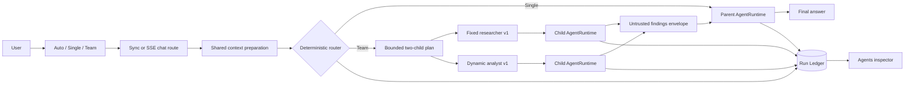
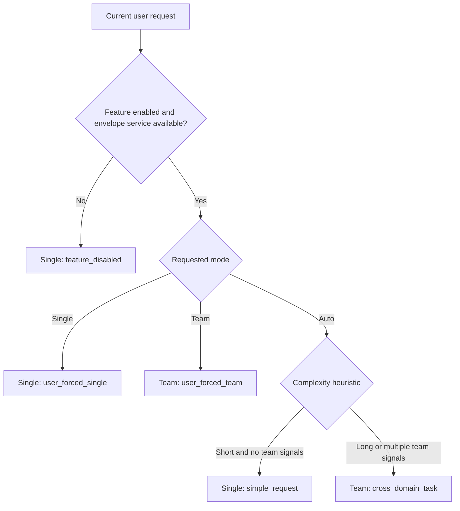
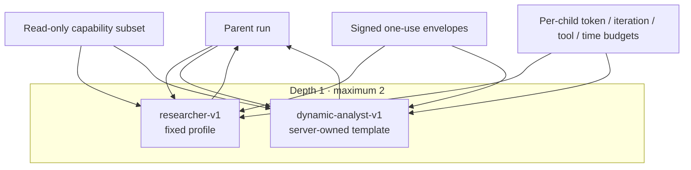
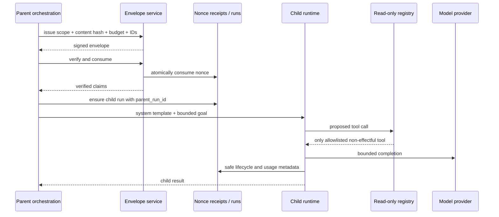
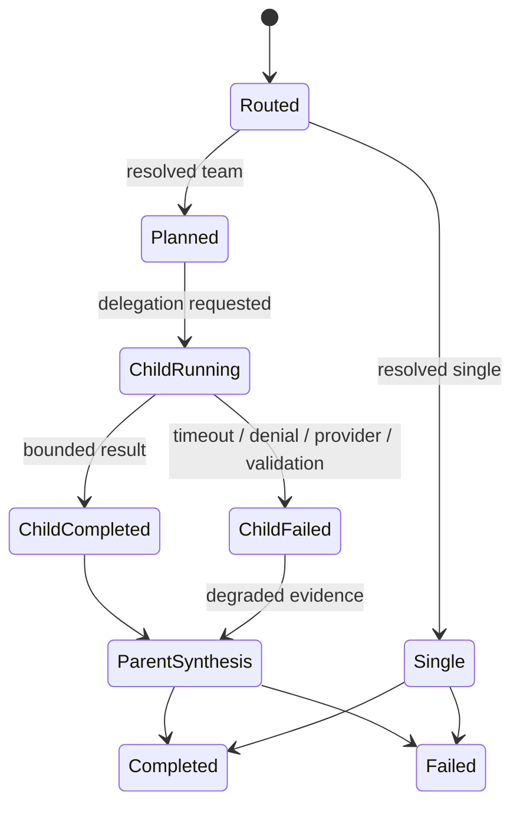
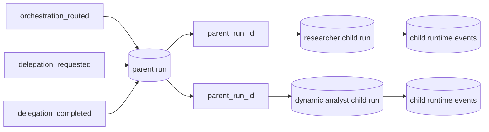
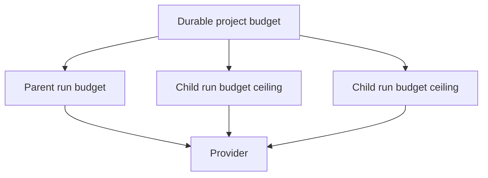

# Hybrid Agent Orchestration Pilot

Status: implemented behind `hybrid_orchestration_enabled`; deterministic and bounded local live-provider acceptance complete.

This document describes the first bounded hybrid orchestration pilot. Local Foundry evidence proves execution, lineage, accounting and conservative degradation behavior. The paired quality sample did **not** show a Team advantage and is not proof of production quality or public deployment.

## Purpose

Archon preserves the existing single-agent `AgentRuntime` path while adding a bounded team path:

- **Auto** applies a deterministic, inspectable routing policy.
- **Single** forces the existing canonical runtime.
- **Team** requests a parent plus at most two child runtimes.
- One child uses a fixed researcher profile.
- One child uses a versioned dynamic analyst template whose goal is derived from the current request.
- The parent receives child findings as explicitly untrusted supporting data and produces the final answer.

The pilot deliberately prefers a small, observable vertical slice over an open-ended agent swarm.

## Request path



The same `prepare_hybrid_messages` adapter is invoked by synchronous and SSE chat routes. Team orchestration does not call the legacy `AgentCoordinator` route.

## Auto routing policy



The pilot router is rule-based and versioned as `hybrid-router-v1`. It does not spend an additional model call and does not claim semantic optimality. This is intentional: routing is testable, cheap, and easy to roll back.

## Bounded plan



The dynamic worker is not a free-form system prompt. The server owns its prompt template, profile identifier, output expectation, allowed tool names, and budget ceilings. Only the bounded goal is request-specific.

## Security boundary



Controls in the first pilot:

1. Child depth is one; children cannot delegate.
2. Maximum children is two by default and configuration cannot exceed three.
3. The child registry copies only explicitly allowlisted tools whose definitions are not effectful and do not carry write, execute, or external-side-effect risk classes.
4. Each child receives a signed, fresh, one-use envelope bound to owner, project, parent/child IDs, task content hash, capability list, budget, and result schema.
5. Child runtimes use the canonical `AgentRuntime`, normal model-provider adapter, event sink, policy-aware tool execution, Run Ledger, and durable monetary budget wrapper.
6. Per-child runtime budgets override parent defaults, including a signed maximum tool-result size, and one aggregate orchestration deadline bounds the sequential team phase.
7. Cancellation propagates through the awaited child task; cancelled child runs receive an explicit terminal event before control returns.
8. Child output is inserted as **untrusted delegated findings** at user-data authority, while a trusted system guard tells the parent not to follow instructions in that text or treat failed children as validation.
9. Generic persisted events allowlist metadata only. They do not contain child prompts, findings, user text, secrets, or chain-of-thought.
10. A child failure degrades the team result; it never becomes an approval or successful verification.

## Runtime and evidence lifecycle





The Workbench receives `orchestration` and `agent_status` SSE events and renders a keyboard-accessible Agents view. The view shows routing, profile kind, status, token usage, tool count, failure reason, and parent/child shape. After reload it reconstructs this metadata from the parent events and child-run endpoint. It never renders internal prompts or hidden reasoning.

## Budget model



The pilot applies durable project accounting plus a lower per-child run ceiling. The response reports parent tokens, child tokens, and a combined token total separately. A single atomic aggregate parent reservation spanning all children is **not** implemented in this pilot; it is a phase-two hardening item.

Live tuning showed why the tool-result limit belongs inside the signed budget: individual web-search results reached roughly 25–34 KB and could exhaust a child context even when tool-count and wall-clock limits were respected. The accepted configuration clips each child tool result to 3,000 characters before it re-enters model context.

## Source map

| Responsibility | Source |
|---|---|
| contracts and result summaries | `backend/app/orchestration/models.py` |
| deterministic Auto/Single/Team router | `backend/app/orchestration/routing.py` |
| fixed and dynamic templates | `backend/app/orchestration/profiles.py` |
| read-only tool projection | `backend/app/orchestration/tools.py` |
| orchestration and safe parent context | `backend/app/orchestration/service.py` |
| signed child execution on canonical runtime | `backend/app/orchestration/runtime.py` |
| shared event/runtime construction | `backend/app/runtime/factory.py` |
| sync and SSE wiring | `backend/app/routes/chat.py`, `backend/app/routes/stream.py` |
| safe persisted fields | `backend/app/services/run_ledger.py` |
| execution-mode UI | `frontend/src/lib/components/ChatInput.svelte` |
| Agents evidence UI | `frontend/src/lib/components/AgentOrchestrationPanel.svelte` |

## Acceptance evidence

Deterministic tests currently establish:

- forced Team invokes one fixed and one dynamic canonical child runtime;
- signed envelopes are required and consumed;
- parent-child run records and routing/delegation events persist;
- effectful tools are absent from child registries;
- malformed or failed children produce degraded context, not approval;
- sync and SSE expose compatible routing and child summaries;
- Auto/Single/Team controls submit the selected mode;
- the Agents inspector renders fixed and dynamic children without chain-of-thought.

Local Foundry acceptance additionally established:

- three paired Single/Team cases completed with all six parent runs and all six Team children non-degraded;
- PostgreSQL preserved parent/child linkage, matching conversation/correlation IDs, routing/delegation events, usage, terminal reasons and reconciled model charges;
- the six-run comparison cost was USD 1.471680000;
- Team was slower in all three cases and independent review scored Single 27/30 versus Team 20/30;
- Team tied one case and lost two, including one answer that rendered inert tool-call-shaped JSON and cited two broken links.

The sanitized evidence packet is `docs/evidence/hybrid-agent-live-acceptance-summary.json`.

Primary tests:

- `backend/tests/unit/test_hybrid_orchestration.py`
- `backend/tests/unit/test_chat.py`
- `frontend/src/lib/components/ChatInput.test.ts`
- `frontend/src/lib/components/AgentOrchestrationPanel.test.ts`
- `frontend/tests/workbench.spec.ts`

## Activation and rollback

The feature is off by default:

```text
ARCHON_HYBRID_ORCHESTRATION_ENABLED=false
```

Enabling it also requires the existing delegation signing-key configuration. Rollback is configuration-only: disable the feature and all requests resolve to the established single-agent runtime. No schema migration or destructive data operation is required.

## Explicit limitations

This pilot does **not** prove:

- that Team improves answer quality; the first three-case paired sample found no Team wins;
- that Auto routing is semantically optimal;
- parallel fan-out, recursive delegation, dynamic tool grants, or distributed agents;
- one atomic parent-wide reservation covering parent and all child calls;
- live-provider cancellation propagation while a child provider call is in flight;
- public deployment, production SLOs, or multi-instance behavior.

Those boundaries define the next acceptance work rather than being hidden behind the word “multi-agent.”
