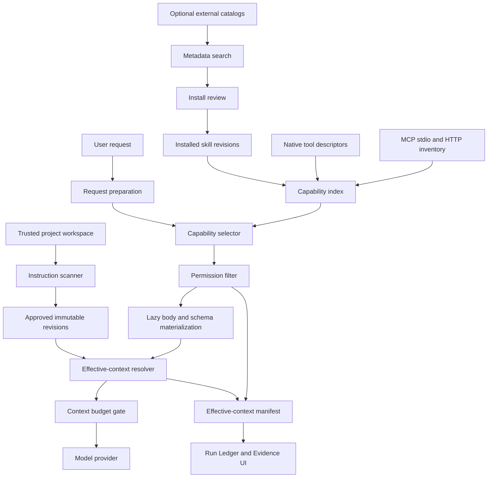
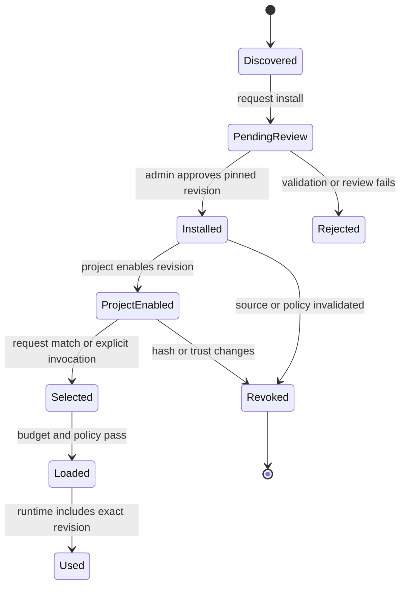

# Skills, Project Instructions, and Governed Capability Discovery

## Status

Implemented on the local `feature/spi-docscore` candidate based on `a642952`.
It is not pushed or deployed; deployed `main` remains `63215bf`. This document
describes the implemented core contract, while revision-scoped observations live
in `docs/evidence/skills-project-instructions-implementation.md`.

## Problem

Archon now keeps skills, project instructions, and executable capabilities as
separate contracts. Skills and instruction snapshots are durable and versioned;
native and MCP tools participate in metadata-first discovery but remain subject
to independent policy and approval.

The system answers four different questions without conflating them:

1. **Project instructions:** What durable repository rules apply here?
2. **Skills:** Which reusable workflow is relevant to this task?
3. **Tools:** Which executable native capabilities may the model see and call?
4. **MCP:** Which external capabilities are discovered, enabled, authorized, and healthy?

## Non-negotiable boundaries

- Prose never grants permissions.
- Discovery never implies authorization.
- A remote skill is never trusted because its name or URL looks familiar.
- The model never selects arbitrary host filesystem roots.
- Project files are snapshotted into immutable approved revisions before runtime use.
- Large catalogs remain metadata-only until selection.
- Tool schemas and skill bodies count against the request budget.
- Sync and SSE use one effective-context preparation path.
- Every selected instruction, skill, tool, and MCP schema has reproducible provenance.

## Architecture



## Instruction sources

Archon's canonical project format is:

```text
.archon/instructions.md
```

Compatibility families may be enabled per project:

- `AGENTS.override.md` / `AGENTS.md`;
- `CLAUDE.md`.

A project selects one family. Equivalent files from multiple ecosystems are not silently merged.

### Implemented source boundary

- Manual/UI content.
- Bounded instruction files beneath a configured trusted root.

A user or model cannot submit an arbitrary host path. Local files are opened only beneath the configured root with canonical containment and special-file rejection. The current acceptance proves approved snapshots; it does not claim a deployed GitHub ingestion service or trust arbitrary repository text.

### Resolution

Instructions resolve root-to-leaf toward the target path. A same-directory override replaces the normal file at that level. Resolution is bounded by file count, bytes, nesting and import depth.

The runtime consumes approved snapshots, not live mutable files. A changed hash creates a pending revision. Each snapshot durably owns an ordered source set; each source stores its body plus relative path, scope path, family, override flag, byte count, and SHA-256. Manual/UI content is represented as one source. The current pointer is protected by an owner/project-scoped database foreign key, and effective-context manifests expose source metadata and hashes without raw content.

## Precedence

```text
External policy and permissions
> stable system contract
> project instruction revisions, root to leaf
> project-pinned skills
> request-selected skills
> current user objective
```

This ordering is structural. Archon does not claim perfect semantic contradiction detection. If the user objective materially conflicts with an explicit project constraint, the agent stops and asks.

Tools, network, secrets, execution, deployment and external effects remain governed by code. No instruction or skill can grant them through prose.

## Skill lifecycle



Each installed revision records source, version/commit, hash, review state, triggers, negative triggers, required capability IDs and bounded references.

Scripts and assets are inert in the first release. Their presence does not grant execution.

## Progressive disclosure

1. **Catalog metadata:** always cheap and searchable.
2. **Skill body:** loaded after project pin or request selection.
3. **Reference:** loaded only through a governed operation.
4. **Tool schema:** exposed only after selection and permission filtering.

The optional Agent God Mode adapter searches metadata. It is not a runtime dependency and cannot install content implicitly.

## Capability selection

A normalized descriptor represents:

- installed skill revision;
- native tool;
- enabled MCP tool.

Selection inputs:

- owner and project;
- user intent;
- target path;
- project pins;
- permission state;
- context budget.

Selection outputs include selected and rejected IDs with stable reasons. Denied capabilities are filtered before their schemas enter provider context.

`discover_capabilities` supports a bounded second discovery round. Discovery does not authorize execution.

## MCP scope

The candidate supports:

- governed stdio profiles;
- governed remote Streamable HTTP profiles;
- protected credential references;
- HTTPS by default, loopback-only development exception;
- bounded connect/discovery/call limits;
- health and reconnect/backoff;
- project enablement;
- lazy schema materialization;
- approval, provenance and execution-time TOCTOU validation.

Outside the candidate claim:

- public marketplace;
- arbitrary package/server execution;
- generic OAuth platform;
- MCP sampling, elicitation, resources and prompts;
- Archon acting as an MCP server;
- shared multi-region MCP gateway.

## Initial skill inventory

Archon begins with ten owned skills:

1. API design;
2. code review;
3. database migrations;
4. debugging;
5. deployment safety;
6. technical documentation;
7. incident response;
8. performance analysis;
9. security review;
10. test engineering.

The goal is coverage and depth, not catalog size.

## Evidence contract

For every run, the effective-context record must identify:

- workspace and trust state;
- instruction revision IDs, paths, hashes and order;
- selected skill revision IDs and reasons;
- selected/rejected capability IDs;
- exposed native/MCP schema hashes;
- effective permission decisions;
- context cost by layer;
- omission/truncation reasons.

It must not expose secrets, raw hidden reasoning, raw instruction/skill bodies,
or unrestricted tool payloads. The implemented Run Ledger snapshot stores exact
instruction and skill revision references plus capability IDs and schema hashes.

## Acceptance boundary

- ORM metadata declares 41 tables; Alembic revisions 15–21 cover this slice.
- Ten bundled, repository-owned skills are bootstrapped.
- Sync and SSE call the same request-context preparation service.
- One real Foundry run with `claude-opus-4-6` recorded one skill revision, one
  approved instruction revision, and nine capability references.
- A disposable PostgreSQL round trip reached head 21, observed five integrity
  triggers, two owner-scope foreign keys and a false MCP enabled default, then
  completed 14 → 21 again.

No final integrated-suite count, public deployment, arbitrary external skill
trust, generic OAuth, or broad semantic-selection quality is claimed.

## Threat model

| Threat | Required control |
|---|---|
| Mutable remote skill becomes trusted code | commit pin, hash, immutable revision, review |
| Cross-project skill leakage | owner/project-scoped persistence and tests |
| Repository prompt grants dangerous tool | policy engine remains external to prose |
| Symlink/path escape | deployment mount allowlist and canonical containment |
| Context exhaustion | metadata-first search and per-layer budgets |
| MCP schema changes after approval | schema hash plus execution-time revalidation |
| Remote MCP credential leakage | protected credential references and redacted errors |
| Discovery reveals denied capability | permission filter before visibility |
| Sync/SSE behavior differs | shared preparation service |
| Runtime restart loses configuration | durable repository and restart tests |

## Interview proof

A successful demo must show:

1. a trusted project with root and path-scoped instructions;
2. immutable revisions and visible precedence;
3. a relevant skill selected while unrelated skills remain unloaded;
4. an allowed tool/MCP schema loaded lazily;
5. a denied capability hidden or blocked;
6. exact provenance and context cost in Run Ledger;
7. restart durability;
8. live Foundry execution without mock fallback.
