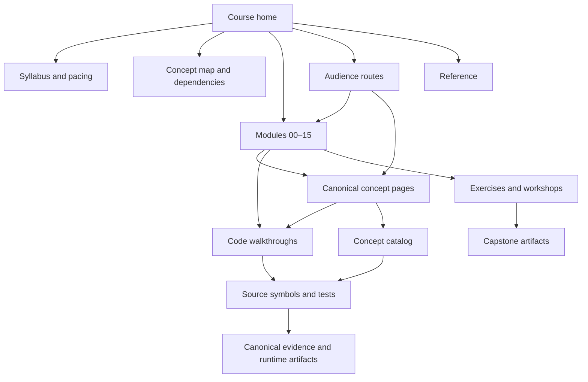

# Archon Course

The canonical learning home for Archon. This course teaches the system from agent fundamentals to an evidence-backed capstone while keeping one canonical page per concept. Modules sequence the learning; audience tracks link back to the same modules and concepts rather than copy explanations.

Archon is a local Agent Reliability Workbench, not a publicly deployed production service. For current implementation facts, use the [canonical evidence matrix](../IMPLEMENTATION-EVIDENCE.md); for system views, use the existing [architecture diagrams](../ARCHITECTURE-DIAGRAMS.md). This course does not replace either source.

> **Luis study note (optional):** Read the interview route before a screening, then use module self-checks to find gaps. The English pages remain canonical; add only short personal callouts like this one.

## Who this is for

- **Learn from zero:** coworkers who know basic programming but are new to agents.
- **Interview study:** Luis or any engineer preparing concise architecture and trade-off explanations.
- **Technical reference:** contributors tracing a concept to exact code, tests, and runtime evidence.

Start with the [syllabus](syllabus.md) for prerequisites, outcomes, pacing, and capstone artifacts. Use the [concept map](concept-map.md) when a module assumes unfamiliar vocabulary. Use the [AIAMastery Days 1–30 coverage map](course-concept-coverage.md) to see every course topic—including partial, not-implemented, and deferred concepts—and the generated [`concept-catalog.yaml`](concept-catalog.yaml) for machine-readable source/test/evidence mappings.

## Information architecture

The `modules`, `concepts`, and `code-walkthroughs` hold teaching content. The `tracks`, `reference`, and `workshops` areas are navigation and delivery aids; they do not create alternate concept explanations.

## Learning routes

| Route | Use it when | Path |
|---|---|---|
| Zero-to-capstone | You are new to agent systems | Follow [Learn from zero](tracks/learn-from-zero.md) and use the [glossary](reference/glossary.md). |
| Interview preparation | You need a defensible short or deep explanation | Use the [2/15/45-minute interview route](tracks/interview-preparation.md) and [exact code bookmarks](reference/code-bookmarks.md). |
| Coworker workshop | You need shared vocabulary and hands-on reliability practice | Run the [eight-workshop company route](tracks/company-workshops.md) with the [instructor](workshops/instructor-guide.md) and [student](workshops/student-guide.md) guides. |
| Operations and reference | You need to diagnose or inspect implementation detail | Start with [operations and reliability](tracks/operations-and-reliability.md), then use the [API](reference/api-map.md), [events](reference/event-catalog.md), [stop reasons](reference/stop-reasons.md), [schema](reference/database-schema.md), and [test map](reference/test-map.md). |

Tracks are navigation views, not alternate concept sources. Workshop exercises and solutions point back to the same modules, concepts, source, and tests.

## Modules

| # | Module | Primary artifact | Availability |
|---:|---|---|---|
| 00 | [Agent anatomy](modules/00-agent-anatomy/README.md) | Lifecycle map | **Draft** |
| 01 | [Python architecture: OOP, Protocols, DI, async](modules/01-python-architecture/README.md) | Dependency diagram | **Draft** |
| 02 | [Typed runtime and state machine](modules/02-typed-runtime/README.md) | Minimal runtime trace | **Draft** |
| 03 | [ReAct loop, budgets, and stop reasons](modules/03-react-loop/README.md) | Bounded-loop exercise | **Draft** |
| 04 | [Tool contracts and schemas](modules/04-tools-and-schemas/README.md) | Registered typed tool | **Draft** |
| 05 | [Policy and durable approvals](modules/05-policy-and-approvals/README.md) | Deny/ask/allow probe | **Draft** |
| 06 | [Context, conversation, and encrypted memory](modules/06-context-and-memory/README.md) | Context-boundary note | **Draft** |
| 07 | [Durable Run Ledger, replay, fork, and compare](modules/07-run-ledger/README.md) | Event timeline | **Draft** |
| 08 | [Documents, embeddings, RAG, grounding, and faithfulness](modules/08-rag-grounding/README.md) | Cited grounded answer | **Draft** |
| 09 | [Evaluation harness and regression](modules/09-evaluation-harness/README.md) | Recorded-run evaluation | **Draft** |
| 10 | [Reliability and resilience](modules/10-resilience/README.md) | Failure drill | **Draft** |
| 11 | [Bounded verifier delegation](modules/11-bounded-delegation/README.md) | Parent-child evidence graph | **Draft** |
| 12 | [Governed MCP](modules/12-governed-mcp/README.md) | Discovered and approved tool call | **Draft** |
| 13 | [Auth, UI, SSE, logs, metrics, and traces](modules/13-auth-ui-observability/README.md) | Observable request walkthrough | **Draft** |
| 14 | [Docker, CI, migrations, and recovery](modules/14-local-operations/README.md) | Recovery report | **Draft** |
| 15 | [Capstone demo and interviews](modules/15-capstone/README.md) | 2/15/45-minute walkthroughs | **Draft** |

## Canonical-source rule

1. A concept has one canonical explanation under the `concepts/` directory.
2. Modules teach a sequence and link to concepts; tracks curate modules and never fork their explanations.
3. Code walkthroughs explain source flow and link back to concepts.
4. Implementation claims defer to the [evidence matrix](../IMPLEMENTATION-EVIDENCE.md), rather than restating mutable test counts or deployment results.
5. Historical plans and audits are context, not the current learning or status source.

## Status vocabulary

### Course-content status

| Status | Meaning |
|---|---|
| **planned** | Named in the approved information architecture, but its canonical page is not yet available. |
| **draft** | Page exists and is usable for review, but links, exercises, or technical claims may still be incomplete. |
| **reviewed** | Required sections, links, terminology, and evidence references have been checked at the stated revision. |
| **current** | Reviewed and aligned with the current accepted evidence baseline. This does not mean production-ready. |

These labels describe documentation maturity only. They never imply that a runtime capability exists.

### Concept implementation status

Every concept catalog entry uses exactly one of these:

- **`implemented`** — meaningful behavior is wired into a current path and has source, tests, and evidence.
- **`partial`** — useful behavior exists, but wiring, coverage, evidence, safety, scale, UX, or provider support is incomplete.
- **`not-implemented`** — no meaningful current implementation exists; an interface, stub, historical experiment, or discussion is insufficient.
- **`deferred`** — deliberately outside the current scope; do not infer a delivery date.

Status is concept-specific and must include its boundary. In particular, ReAct, deterministic claim verification, bounded verifier delegation, post-run evaluation, and generic self-reflection are different concepts. Generic self-reflection is not implemented merely because tool errors return to the model.

## Authoring

Use the [module template](templates/module-template.md) and [concept template](templates/concept-template.md). Catalog fragment conventions are documented in [catalog-fragments/README.md](catalog-fragments/README.md).
