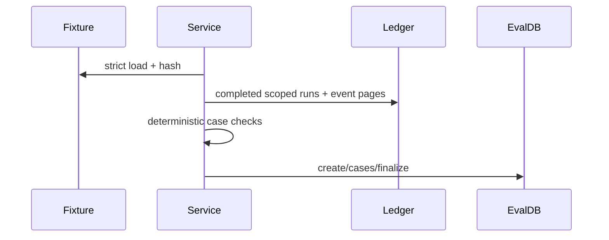

# Walkthrough — Recorded-run evaluation harness

## Goal
Reconstruct a durable evaluation from fixture identity to aggregate metrics without calling a model.

## Dataset path

`load_evaluation_fixture` parses JSON with duplicate-key rejection, requires exact top-level/case keys and bounds, builds immutable dataclasses, canonicalizes the body excluding `content_hash`, and verifies SHA-256. `EvaluationService._load_dataset` permits only configured IDs; the shipped default is `grounded-v1`.

## Evaluation path

1. `EvaluationService.evaluate` validates owner/project and finite threshold.
2. `_validate_mapping` requires every fixture case key exactly once and unique source run IDs, then restores fixture order.
3. Each run is fetched through owner scope, checked for matching project and successful terminal completion.
4. `_stored_events` pages the complete immutable safe trajectory.
5. `_evaluate_case` derives evidence/support/unsupported/citation counts, structural rates, grounded state, substring checks over bounded `answer_summary`, and operational metadata.
6. `EvaluationRepository.create`, `append_case`, and `finalize` persist the durable result; handled write failure attempts a terminal `failed` record.
7. `compare` computes numeric `b-a` aggregate deltas.



## Exercise

```bash
cd backend
uv run pytest -q \
  tests/unit/test_evaluation_fixtures.py \
  tests/unit/test_recorded_evaluations.py::test_scores_good_and_bad_recorded_runs_by_explicit_case_key \
  tests/unit/test_recorded_evaluations.py::test_results_survive_restart_compare_without_runtime_dependencies_and_store_no_raw_data
```

## Interpretation guardrails

A recorded-run evaluation is real: it evaluates durable run records and persists auditable results. A deterministic fixture is not model-quality proof. Current grounded cases mostly verify structural events and answer-summary substrings; they do not rerun retrieval or semantic entailment. Always report fixture ID/version/hash, source-run provenance, evaluator revision, and external-provider status.

## Production cautions
Expand beyond two representative cases, predeclare gates, add subgroup/adversarial/holdout data, validate annotations, and separately test real providers/embeddings. Avoid optimizing directly against the only test set.
