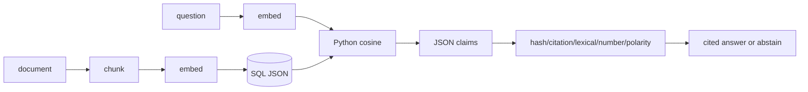

# Walkthrough — Grounded RAG

## Goal
Trace a document from chunking to a cited answer and identify exactly what each score proves.

## Ingestion

1. `RecursiveChunker.chunk` splits by preferred separators, adds overlap, indexes chunks, and copies metadata.
2. `EmbeddingService.embed` returns configured vectors; mock mode is deterministic plumbing only.
3. `SqlJsonVectorStore.add_chunks` validates finite exact dimensions and persists content, truncated SHA-256 hash, metadata JSON, and embedding JSON under owner/project.

## Query and verification

1. `DocumentEvidenceRetriever.retrieve` embeds the question and calls scoped `SqlJsonVectorStore.search`.
2. Search loads bounded SQL candidates, validates content/hash/vector/metadata, computes cosine in Python, ranks, then returns top-k. **No pgvector is involved.**
3. Duplicate document/content hashes are removed and results become run-local `DocumentEvidence(E1...)`.
4. `GroundedDocumentWorkflow` records safe evidence metadata and, if non-empty, makes one provider call with an evidence-only JSON-claims prompt.
5. `_parse_claims` bounds output/count/length/citations.
6. `_verify_document_claims` rechecks content hashes. `_supports_claim` requires known citation IDs, high substantive overlap, numeric containment, and polarity agreement.
7. Only accepted claims form the answer; ledger events record hashes/IDs/counts and terminal usage.



## Metric classification

- cosine score: retrieval ranking signal;
- `grounded`: at least one retained claim;
- support/unsupported counts: deterministic verifier output;
- citation ID/hash: evidence identity/integrity;
- answer relevance: not established merely by any above.

## Exercise

```bash
cd backend
uv run pytest -q \
  tests/unit/test_grounded_rag.py::test_supported_claim_is_answered_with_verified_citation \
  tests/unit/test_grounded_rag.py::test_claim_support_is_conservative_about_negation_numbers_and_partial_claims \
  tests/unit/test_grounded_rag.py::test_tampered_persisted_evidence_is_skipped_before_provider_call
```

## Evidence reading
`docs/evidence/local-portfolio-benchmark.json` records a supported claim and excluded overclaim over ten deterministic iterations, with `external_model: false` and `external_network: false`. It proves control behavior, not live provider, embedding, recall, or answer quality.

## Production cautions
Python scanning is bounded but unindexed; mock embeddings are not semantic; lexical support is not NLI; source truth and corpus governance remain external responsibilities.
