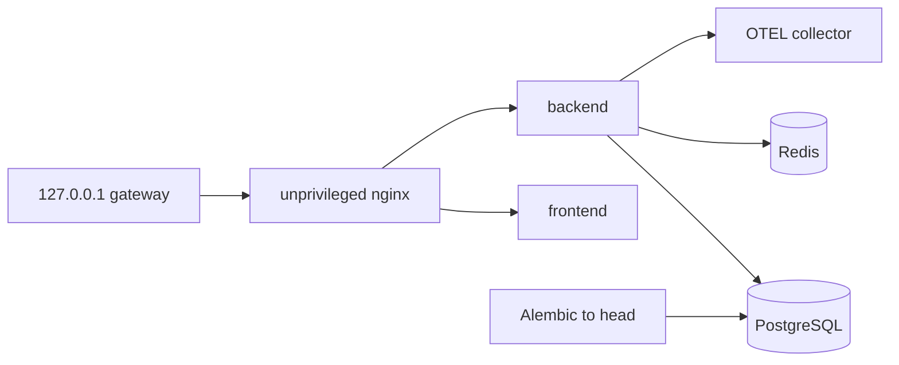

# Source walkthrough — Local deployment and clean recovery

## Honest status

The verified target is local, single-host, loopback-only Compose. Public deployment is deferred. Historical Kubernetes/Helm/production manifests are not acceptance evidence.

## Startup graph

[`docker-compose.local.yml`](../../../docker-compose.local.yml) defines digest-pinned nginx, PostgreSQL, Redis and OTEL images plus built frontend/backend images. Only nginx publishes `127.0.0.1:${ARCHON_LOCAL_PORT}:8080`; app dependencies stay internal. App containers use non-root/read-only/no-new-privileges boundaries where configured.



Compose dependency health orders the stack. [`lifespan`](../../../backend/app/main.py) validates embedding and encryption configuration before opening resources, initializes repositories, pings Redis when selected, constructs the breaker/provider/verifier and activates OTLP when configured.

`/healthz` is shallow liveness. `/readyz` queries PostgreSQL and rate-limit storage and requires configured OTLP to be active; it reports vector, embedding, breaker and verifier capability metadata. A provider completion is intentionally not a readiness dependency.

## Migration path

Alembic owns durable schema history. The recorded local smoke observed revision `20260826_08`; [`20260826_08_mcp_inventory.py`](../../../backend/alembic/versions/20260826_08_mcp_inventory.py) adds scoped MCP server/tool inventory constraints. Migration tests are stronger than ORM table creation because they exercise the versioned upgrade path. Rollback and zero-downtime mixed-version serving remain unverified.

## Backup path

[`local-backup.sh`](../../../scripts/local-backup.sh) rejects missing/world-readable env files and existing destinations, runs `pg_dump -Fc --no-owner --no-acl`, moves output atomically, enforces mode 0600, and writes SHA-256 plus metadata (UTC snapshot and Alembic revision, no credentials).

PostgreSQL is authoritative for durable evidence. Redis rate-limit state is deliberately excluded.

## Restore path

[`local-restore.sh`](../../../scripts/local-restore.sh) verifies checksum and refuses a non-empty target unless an explicit destructive override is set. Restore goes into a fresh project/volume before app startup. Encryption-key continuity is necessary for encrypted memory.

[`local-dr-smoke.sh`](../../../scripts/local-dr-smoke.sh) creates synthetic user, conversation, run/events, document/chunk and approval state; backs up; destroys source volumes; restores cleanly; starts the app; authenticates; compares exact IDs/counts/hashes; records RTO/RPO; and cleans resources by default.

```mermaid
sequenceDiagram
  participant Source
  participant Dump
  participant Target
  Source->>Dump: custom dump + checksum + metadata
  Source->>Source: destroy project/volumes
  Dump->>Target: verify checksum; require clean database
  Target->>Target: restore, start, readiness
  Target->>Target: authenticate and compare exact evidence
```

## Execute safely

Fast contract check:

```bash
cd backend
uv run pytest -q \
  tests/unit/test_health.py \
  tests/unit/test_local_deployment.py \
  tests/unit/test_local_dr.py \
  tests/integration/test_mcp_inventory_migration.py
cd ..
python3 -m json.tool docs/evidence/local-dr-report.json >/dev/null
```

The real smoke is expensive and destructive only to its isolated projects:

```bash
./scripts/local-dr-smoke.sh /tmp/archon-dr-report.json
```

Run it only with Docker/Compose capacity and review cleanup first. `KEEP=1` retains sensitive temporary material and is not the default.

## Evidence interpretation

The recorded development-Mac run measured backup 0.343 s, restore-to-ready RTO 21.586 s, and zero changed records at the snapshot boundary. These are measurements, not objectives or guarantees. CI run `33042890654` was green at `6e3e13f`; CI proves its listed gates at that revision, not deployment.

Missing production evidence includes scheduled/off-site encrypted backups, retention, PITR/WAL, key rotation, repeated load-sized recovery, public ingress, multi-host failover, SLO/on-call operations, and final external-provider acceptance.

## Interview answer

“I can prove a hardened production-like local target and clean recovery, not production deployment. Startup runs migrations and requires PostgreSQL, Redis and configured OTLP readiness. Recovery uses a checksummed custom dump, clean-target guard and exact authenticated evidence comparison. I quote RTO/RPO as one revision/environment observation and separately list the operational objectives still needed.”
