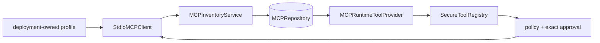

# Source walkthrough — Governed MCP stdio runtime

## Claim and boundary

Archon verifies local MCP 2.1.1 **stdio** discovery and invocation. Deployment code injects allowlisted `ServerProfile` objects; the API exposes only safe profile labels. Durable owner/project inventory does not contain commands, environment, call arguments, or results. HTTP/OAuth transports are not claimed.

## Four boundaries



1. **Transport:** [`StdioMCPClient`](../../../backend/app/mcp/client.py) starts only the injected command/args/cwd with a minimal environment plus explicit profile environment. `_with_session` bounds initialization and calls and maps SDK details to stable errors.
2. **Discovery:** `list_tools` follows cursor pagination but caps pages, tool count, schema bytes, total bytes and names. Duplicate names, cursor loops, oversized data, and malformed metadata fail.
3. **Inventory:** [`MCPInventoryService.discover`](../../../backend/app/mcp/inventory.py) resolves an owner/project server to an allowlisted profile, atomically replaces normalized tools, and records `healthy` or a stable error. Disabled or unknown profiles fail closed.
4. **Runtime:** [`MCPRuntimeToolProvider.for_scope`](../../../backend/app/mcp/runtime.py) selects only enabled healthy servers and enabled tools, normalizes a deliberately small JSON Schema subset, assigns conservative risk classes, creates immutable request-scoped closures, and resolves naming collisions safely.

## Invocation race defense

Before transport use, `_invoke` re-reads server and tool under owner/project scope. A changed profile, server name, enablement, health, tool metadata, risk hint, or schema raises `mcp_binding_changed`. The call then uses the deployment profile and returns bounded `MCPCallResult` data. This mitigates inventory/model-selection races; it cannot make a remote side effect reversible.

`routes/chat.py:get_tool_registry` converts each `MCPBoundToolSpec` into an ordinary tool definition. Therefore MCP tools traverse `SecureToolRegistry`, schema validation, deterministic policy, exact approval for ask-class actions, permission checks, timeout, audit and runtime events. Discovery is not authorization.

## Local protocol exercise

```bash
cd backend
uv run pytest -q \
  tests/integration/test_mcp_stdio.py \
  tests/integration/test_mcp_inventory.py \
  tests/integration/test_mcp_runtime.py \
  tests/integration/test_mcp_api.py
```

The fixture server in `backend/tests/fixtures/mcp_test_server.py` is a real local SDK server process. Inspect a pagination test, a stale-binding test, a destructive-tool approval test, and a cross-owner API test.

## Failure matrix

| Failure | Stable behavior | Evidence |
|---|---|---|
| Unknown profile | `unknown_profile`; no command launch | inventory health/API code |
| Cursor loop or oversized result | bounded client error | discovery error/health |
| Unsupported schema | tool disabled/not bound | inventory/runtime state |
| Write/destructive proposal | deny or exact approval | policy/approval and ledger events |
| Binding drift | `mcp_binding_changed` before call | sanitized runtime failure |
| Timeout/SDK exception | `timeout`/`transport_error` | no command/path/payload leak |

## Interview anchors

“Protocol compatibility is only the first layer. Archon separates deployment-owned stdio profiles, bounded discovery, durable scoped inventory, immutable runtime binding, and policy-governed invocation. Official local SDK tests prove stdio behavior; they do not prove HTTP/OAuth, arbitrary servers, or production multi-tenancy.”
