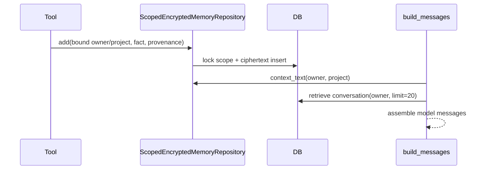

# Walkthrough — Context and encrypted memory

## Goal
Trace one durable project fact into a model request without confusing it with conversation history.

## Call path

1. Route/tool binding obtains `RunContext(user_id, project_id, conversation_id, ...)`.
2. `backend/app/tools/memory_tools.py::create_memory_tool` binds those identities; callers do not supply a different owner.
3. `ScopedEncryptedMemoryRepository.add` redacts content/provenance, locks `(user_id, project_id)`, checks the decrypted-character aggregate, calls `_encrypt`, and writes `MemoryFactRow`.
4. `_key` derives an owner/project/version key using HKDF-SHA256. `_aad` binds owner/project/fact/version; AES-GCM authenticates both.
5. On a later request, `context_text` decrypts facts in scope and formats bullets.
6. `backend/app/runtime/support.py::prepare_messages` delegates to `runtime.context.build_messages`.
7. `build_messages` creates the system/tool prompt, appends project facts, retrieves up to 20 owner-scoped conversation messages, then adds the current user message.



## Read in this order

- `backend/app/memory/scoped.py`: constants and envelope, then `add`, then mutations.
- `backend/app/services/db_store.py`: `MemoryFactRow`, `MemoryScopeRow`, message/conversation rows.
- `backend/app/tools/memory_tools.py`: identity binding.
- `backend/app/runtime/context.py`: final selection/order.

Do not use `EncryptedMemoryStore` as proof of durable production memory; it is in-memory Fernet. Do not use `CheckpointManager` as proof of durable fork checkpoints.

## Exercise

```bash
cd backend
uv run pytest -q \
  tests/unit/test_scoped_encrypted_memory.py::test_two_users_and_projects_are_isolated_and_raw_db_has_no_plaintext \
  tests/unit/test_scoped_encrypted_memory.py::test_restart_decrypts_and_wrong_key_and_tampering_fail_closed \
  tests/unit/test_scoped_encrypted_memory.py::test_bound_tools_and_conversation_search_are_owner_scoped
```

## Review questions

- Where is plaintext present, and for how long?
- Which operation prevents concurrent quota oversubscription?
- Why does AAD stop ciphertext swapping?
- Which facts/messages are omitted from a call?

## Production cautions
No online key rotation, expiry, external KMS, or complete effective-context inspector is established. Never emit decrypted facts/master keys as debugging evidence.
