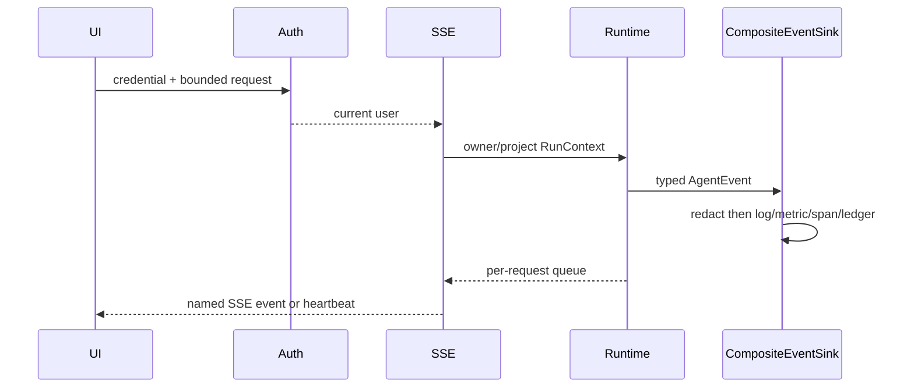

# Source walkthrough — One authenticated, observable SSE request

## Goal

Trace one request without treating UI events, logs, metrics, traces, or database events as interchangeable—and without exposing secrets or hidden reasoning.

## 1. Identity and middleware

[`AuthRepository`](../../../backend/app/security/auth.py) stores scrypt password hashes, hashes API keys before persistence, and signs/validates exact HS256 JWT headers, subjects, and expiry. `get_current_user` accepts API key, bearer, or `archon_token` cookie and re-loads the durable user. Invalid credentials return 401.

[`CSRFMiddleware`](../../../backend/app/middleware/security.py) protects mutating cookie-authenticated requests; bearer/API-key clients have a different CSRF boundary. [`CorrelationIdMiddleware`](../../../backend/app/middleware/correlation.py) sets a request `ContextVar` and echoes `X-Correlation-ID`.

## 2. Scope and stream

[`chat_stream_real`](../../../backend/app/routes/stream.py):

1. rate-limits the authenticated identity/direct peer;
2. gets or creates the conversation under `user_id`, returning 404 for a cross-owner ID;
3. creates `RunContext(user_id, conversation_id, correlation_id, project_id)`;
4. binds memory and MCP tools to owner/project;
5. creates a fresh tool registry and approval authorizer;
6. starts one runtime task with a per-request `QueueEventSink`.



`_sse` serializes named events. Tool completion projects names, IDs, status and hashes/sizes—not raw output. Policy/approval projections keep explicit safe fields. Heartbeats maintain idle connections. On disconnect/finally, the task is cancelled and `approval_broker.cancel_run` clears waits.

## 3. Fan-out from typed events

[`CompositeEventSink.emit`](../../../backend/app/observability/runtime_events.py) makes an independently redacted copy before operational or persistent use. It:

- starts/finishes `agent.run`, `gen_ai.chat`, and `tool.*` spans;
- increments process-local counters/latency samples;
- writes a structured `runtime_event` and owner-scoped buffer entry;
- appends a sanitized Run Ledger event;
- only then forwards the original typed event to the requesting downstream sink.

[`redact_event`](../../../backend/app/observability/logging.py) is last before rendering and recursively classifies credential-like keys and values. Exceptions become type plus stable reason via `safe_exception_metadata`.

## 4. Evidence types

| Signal | Best question | Important limitation |
|---|---|---|
| SSE | What should this connected UI render now? | Transient; no delivery acknowledgement. |
| Run Ledger | What durable ordered control events belong to this owner/run? | Not semantic truth or WORM audit. |
| Structured log | What happened operationally around a correlation ID? | Redaction is not complete privacy certification. |
| Metric | How many/how slow/how often? | Process-local and bounded labels; no durable aggregation. |
| Trace | Where did request time/failure occur? | Local OTLP observation; no hosted backend/SLO. |
| Evaluation | Did defined checks score persisted output? | Heuristic/fixture scope must be stated. |

## Execute

```bash
cd backend
uv run pytest -q \
  tests/integration/test_auth_persistence.py \
  tests/security/test_conversation_ownership.py \
  tests/unit/test_runtime_sse.py \
  tests/unit/test_operational_log_privacy.py \
  tests/unit/test_runtime_observability.py \
  tests/unit/test_otel_tracing_wire.py
```

## Observed boundary

The local container target observed an exported `agent.run` span at its OTEL collector and exposed metrics. That does not establish hosted retention, alerting, multi-replica aggregation, production sampling, or public deployment. The final external providers were not verified.

## Interview answer

“Identity is established once and bound into owner/project resource queries; policy separately authorizes side effects. SSE is a transient projection of typed events. The same events produce independently redacted durable ledger entries, logs, process metrics, and OTLP spans linked by run and correlation IDs. Each signal answers a different question and none exposes chain-of-thought.”
