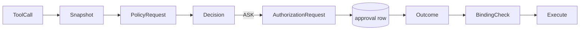
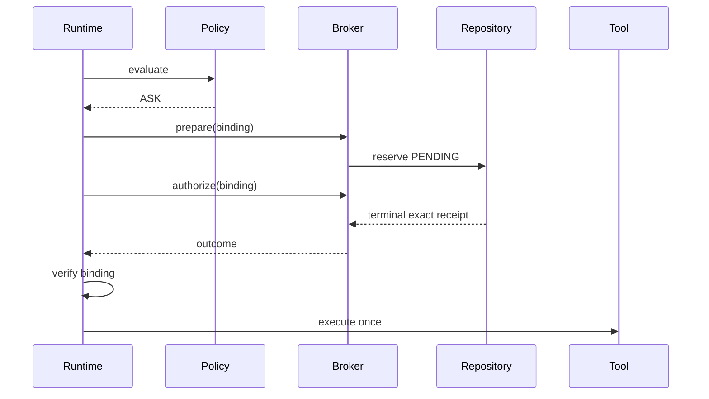

# Code walkthrough: policy and durable approval

Use this with [Module 05](../modules/05-policy-and-approvals/README.md).

## 1. Classify a call

[`SecureToolRegistry.policy_request`](../../../backend/app/tools/registry.py) turns frozen tool metadata and a detached call into `PolicyRequest(tool_name, resources, risk_classes, legacy_requires_approval)`. Missing or invalid metadata raises `PolicyMetadataError`; the runtime converts this to denial.

## 2. Evaluate deterministic rules

[`RulePolicyEngine.evaluate`](../../../backend/app/security/policy.py) canonicalizes through its value types, filters enabled matching rules, computes specificity, resolves a tied DENY conservatively, and applies fail-closed fallbacks. [`default_policy_rules`](../../../backend/app/security/default_policy.py) allows pure reads and exact web search, asks for side effects, and configures default DENY.

## 3. Freeze the authorization identity

The runtime captures native call ID, canonical name, canonical JSON snapshot, and [`canonical_arguments_hash`](../../../backend/app/security/policy.py). It creates [`AuthorizationRequest`](../../../backend/app/security/approvals.py). The SHA-256 digest binds consent without persisting raw arguments.



## 4. Reserve before publishing

For an authorizer supporting `PreparatoryToolAuthorizer`, the runtime calls `prepare` before emitting actionable approval evidence. [`DurableApprovalBroker.reserve`](../../../backend/app/security/live_approvals.py) delegates to [`ApprovalRepository.reserve`](../../../backend/app/security/approval_repository.py), which stores owner/conversation/run/call/name/hash, risks, rule, TTL, and pending state.

## 5. Decide atomically and rebind

The owner-facing path invokes `DurableApprovalBroker.decide_for_owner`; `ApprovalRepository.decide_exact_for_owner` conditionally transitions only a pending, unexpired exact row. A waiter polls `get_exact_binding`. `AuthorizationOutcome.binds` and runtime scalar comparisons reject changed identities. Denial, expiry, cancellation, timeout, absence, malformed outcome, or database failure cannot execute.



## 6. Tests and exercise

```bash
cd backend
uv run pytest -q tests/security/test_policy_engine.py tests/unit/test_approval_repository.py tests/unit/test_durable_live_approvals.py tests/unit/test_runtime_policy.py
```

Read, in order, specificity tests in [`test_policy_engine.py`](../../../backend/tests/security/test_policy_engine.py), atomic transition tests in [`test_approval_repository.py`](../../../backend/tests/unit/test_approval_repository.py), cross-process/restart tests in [`test_durable_live_approvals.py`](../../../backend/tests/unit/test_durable_live_approvals.py), and adversarial end-to-end binding tests in [`test_runtime_policy.py`](../../../backend/tests/unit/test_runtime_policy.py).

## Claim boundary

This proves one-shot authorization and guarded local invocation. It does not prove exactly-once completion in an external service after ambiguous timeout; downstream idempotency keys or reconciliation are still required.
