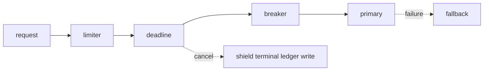

# Walkthrough — Resilience failure drill

## Goal
Exercise admission control, circuit transitions, fallback, timeout/cancellation, and idempotent terminal state while naming each boundary’s limitations.

## Layer-by-layer source tour

1. **Admission:** `RateLimiter.check` hashes an action/identity bucket. Redis Lua atomically prunes/counts/adds/expires; WATCH/MULTI is the compatibility fallback. Local mode locks one process.
2. **Deadline:** `SecureToolRegistry.execute` uses `asyncio.wait_for`; embedding DNS/HTTP and specialist calls have separate limits. There is no universal end-to-end deadline wrapper.
3. **Cancellation:** `GroundedDocumentWorkflow.run` catches `CancelledError`, shields `_stop(... reason="cancelled")`, then re-raises. `CircuitBreaker` releases a cancelled half-open probe.
4. **Breaker:** `CircuitBreaker.call` lock-protects admission and uses epoch/generation/probe tokens so one half-open probe runs and stale successes cannot close a newly opened circuit.
5. **Fallback:** `FallbackLLMChain.chat` tries legacy text adapters sequentially. Secondary success is observable; all-fail returns text, not a typed failure.
6. **Idempotency:** `RunRepository.ensure_run` conflict-safely creates stable run IDs; terminal status guards prevent overwrite/late append. This does not make tool side effects idempotent.



## Execute

```bash
cd backend
uv run pytest -q \
  tests/security/test_pii_circuit_breaker.py \
  tests/unit/test_rate_limiter.py \
  tests/unit/test_fallback_wire.py \
  tests/unit/test_run_ledger.py::test_finalize_is_idempotent_and_cannot_overwrite_terminal_run \
  tests/unit/test_grounded_rag.py::test_cancellation_finalizes_cancelled_run_and_reraises
```

## Expected invariants

- threshold failures open; open fails fast; only one recovery probe; cancellation does not wedge probe state;
- exactly the configured number of concurrent Redis requests are admitted;
- Redis errors do not silently weaken to local mode;
- primary success avoids fallback and primary failure selects secondary;
- a cancelled grounded run is durably `cancelled` and cancellation reaches the caller;
- a second terminal append cannot rewrite the first.

## Observability
Use breaker stats/state events, hashed limiter counters and `retry_after`, sanitized provider/fallback logs, timeout audit records, and terminal Run Ledger status. Never log raw exception/provider payloads to prove failure.

## Production cautions
Breaker/local limiter state is process-local; fallback loses typed capabilities; retries are path-specific and may lack backoff/jitter; all-fail fallback text is weak API semantics; deterministic injected failures do not prove real provider SLOs or multi-instance behavior.
