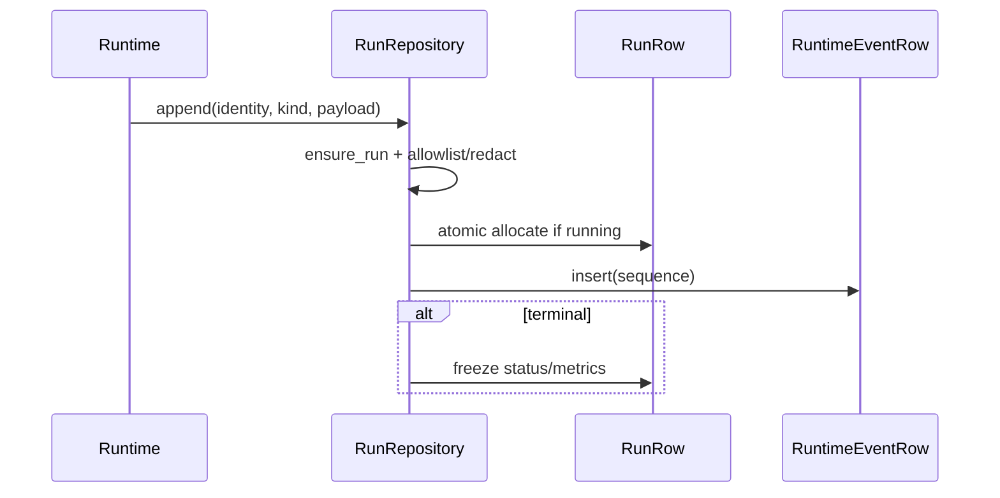

# Walkthrough — Durable Run Ledger

## Goal
Follow one event from runtime emission through durable sequence allocation, safe replay, fork, and comparison.

## Append path

1. Runtime sends an event to `ConversationRepository.append_runtime_event`.
2. It delegates to `RunRepository.append` with run/owner/project/conversation/correlation/provider/model identity.
3. `ensure_run` performs conflict-safe creation; a new run can atomically consume a matching fork draft for lineage.
4. `safe_event_payload` rejects unknown kinds and projects only `_SAFE_FIELDS`, redacts values, and converts error details to a boolean.
5. A guarded `UPDATE RunRow SET next_sequence = next_sequence + 1 RETURNING ...` allocates one sequence while status is `running`.
6. `RuntimeEventRow` is inserted in the same transaction. `run_stopped` also guardedly freezes terminal status, timing, iteration, and token totals.



## Read path

`RunRepository.get/list/events/list_children` apply owner predicates and bounded pagination. `_run_record`/`_event_record` reject unknown versions and malformed fields. `routes/runs.py::_trajectory` creates stored-only views. `compare_runs` never invokes model/tools.

## Fork path

`RunRepository.fork` validates the selected owned event, calculates its time cutoff, stores a deterministic durable checkpoint of bounded redacted messages, creates a new conversation and fork draft, and returns `workspace_restoration: none`. The first new run consumes the draft and records immutable parent/sequence lineage.

## Exercise

```bash
cd backend
uv run pytest -q \
  tests/unit/test_run_ledger.py::test_concurrent_append_is_unique_contiguous_and_restart_safe \
  tests/unit/test_run_ledger.py::test_concurrent_append_racing_finalize_is_linearizable \
  tests/integration/test_run_fork_compare.py
```

## Evidence checklist

Confirm contiguous sequences, terminal event last, foreign owner reads absent, no raw argument/result fields, persisted lineage, and deterministic comparison. Do not claim replay re-executes anything or fork restores a workspace.

## Production cautions
No WORM/signature guarantee or cross-region ordering is shown. Retention removes whole terminal runs; ensure operational policy preserves required audit periods.
