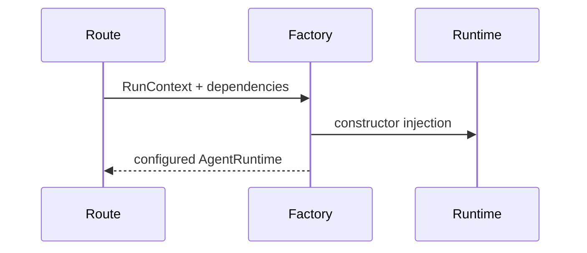
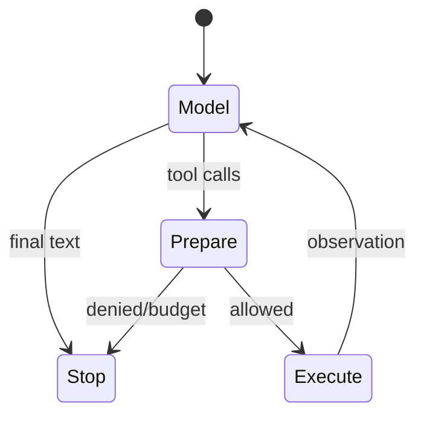

# Code walkthrough: typed agent runtime

Use this tour after [Module 02](../modules/02-typed-runtime/README.md). It follows symbols in execution order rather than reproducing source.

## 1. Boundary values

Open [`backend/app/runtime/models.py`](../../../backend/app/runtime/models.py). `Message` and `Role` type conversation history. `ToolCall` carries a provider-native ID, canonicalizable name, and read-only top-level argument mapping. `ModelResponse` carries content/calls/usage; `TokenUsage` composes usage.

## 2. Ports and construction

[`ModelProvider`, `ToolExecutor`, `ToolAuthorizer`, and `EventSink`](../../../backend/app/runtime/ports.py) isolate the loop from vendors and transports. [`create_chat_runtime`](../../../backend/app/runtime/factory.py) injects the live budget, default policy, authorizer, redacting composite sink, and optional result recorder.



## 3. Enter `AgentRuntime.run`

[`AgentRuntime.run`](../../../backend/app/runtime/engine.py) snapshots input history, initializes counters, emits `RUN_STARTED`, and enters the iteration guard. It computes remaining tokens and awaits `ModelProvider.complete` within the run deadline.

Immediately after provider return, `_snapshot_provider_tool_calls` captures scalar identity plus independent history/execution copies **before** event emission. This ordering prevents an event sink or provider-retained object from changing authorized work.

## 4. Branch and gate

No calls means `COMPLETED`. Calls enter duplicate/batch-budget checks. In policy mode `_prepare_policy_batch` obtains metadata, evaluates policy, and reserves ASK requests before execution. `_enforce_policy` checks authorization outcomes against exact IDs, names, and hashes. Only the detached `execution_call` reaches the tool port.

## 5. Observe and terminate

Tool output or bounded error is serialized as a `Role.TOOL` observation and added to history. The next iteration asks the model again. `_finalize` may request bounded final synthesis after budget exhaustion; `_stop` emits `RUN_STOPPED`, records a result if configured, and returns `AgentResult`.



## Tests to read in order

1. [`test_runtime_v2.py`](../../../backend/tests/unit/test_runtime_v2.py): basic loop and stop contracts.
2. [`test_runtime_budget_regressions.py`](../../../backend/tests/unit/test_runtime_budget_regressions.py): wall-clock and budget edges.
3. [`test_runtime_policy.py`](../../../backend/tests/unit/test_runtime_policy.py): event ordering, snapshots, malformed metadata, approval binding.
4. [`test_runtime_sse.py`](../../../backend/tests/unit/test_runtime_sse.py): transport/event behavior.

```bash
cd backend
uv run pytest -q tests/unit/test_runtime_v2.py tests/unit/test_runtime_budget_regressions.py tests/unit/test_runtime_policy.py
```

## Review prompts

- Find the first yield after a provider response and explain the preceding snapshot.
- Identify every return that carries a `StopReason`.
- Explain why the runtime, not a framework or model prompt, owns the safety invariants.

Generic self-reflection is not part of this walkthrough or implementation; tool-error feedback, verifier delegation, and evaluations are separate bounded mechanisms.
