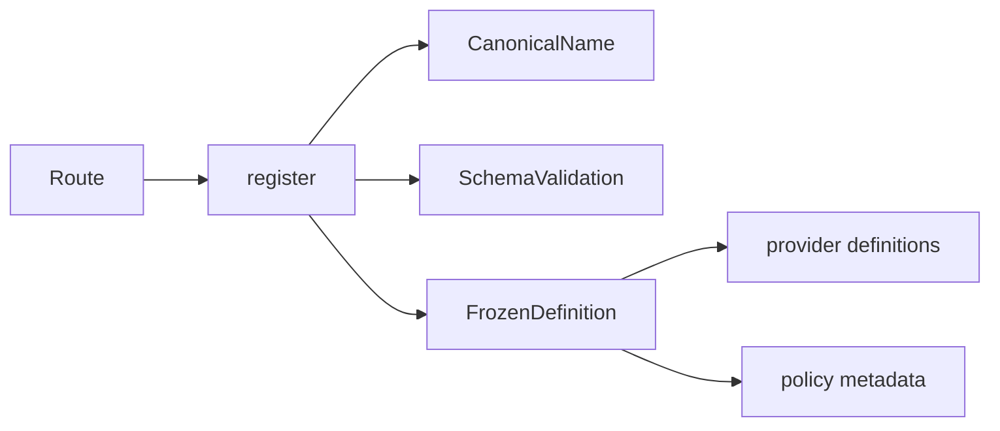
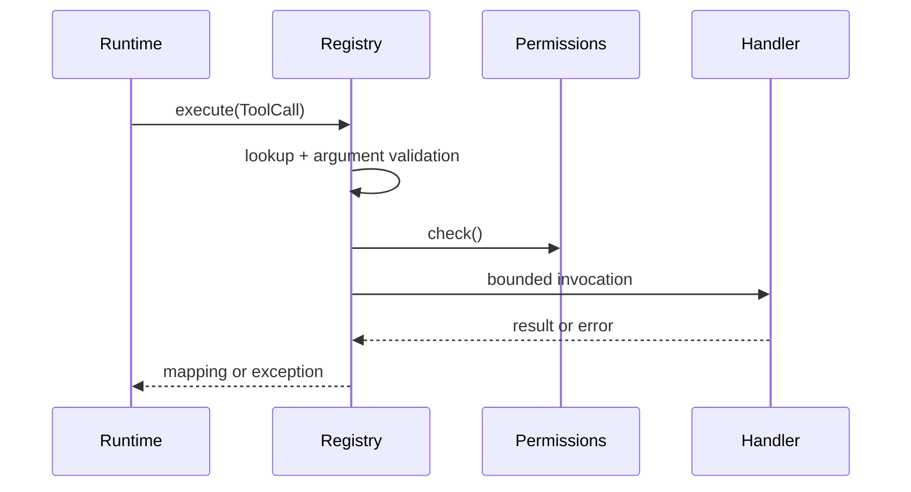

# Code walkthrough: secure tool registry

Use this with [Module 04](../modules/04-tools-and-schemas/README.md).

## 1. Two definitions, two audiences

[`app.tools.registry.ToolDefinition`](../../../backend/app/tools/registry.py) contains handler and security metadata. [`app.runtime.models.ToolDefinition`](../../../backend/app/runtime/models.py) is the provider-facing name/description/schema value. Keeping execution details out of the provider contract preserves the trust boundary.

## 2. Registration path

[`SecureToolRegistry.register`](../../../backend/app/tools/registry.py) canonicalizes the name, rejects duplicates, constructs a frozen definition, validates the supported schema subset, and deep-freezes nested metadata. [`_create_tool_registry`](../../../backend/app/routes/chat.py) creates a fresh live registry and registers built-ins with explicit risks, timeouts, and resource resolvers.



## 3. Policy metadata path

`SecureToolRegistry.policy_request` uses immutable risk classes and resolves concrete resources. `resolve_workspace_path` gives policy a canonical lexical path, but its docstring explicitly requires execution-time containment checks against TOCTOU changes.

## 4. Execution path

`SecureToolRegistry.execute` canonicalizes and looks up the tool, then `_validate_arguments` checks required/extra fields, primitive/container type, enum, and finite numbers. Validation precedes permission hooks. The registry checks each permission, invokes async handlers with `asyncio.wait_for` or sync handlers in an executor, logs sanitized failures, and audits success/denial/timeout.



## 5. Tests and exercise

Read [`test_tools.py`](../../../backend/tests/unit/test_tools.py): protocol satisfaction, sync/async execution, unknown tool, timeout, permissions, schemas, enums, finite numbers, and audit. Read registry/runtime integration in [`test_runtime_policy.py`](../../../backend/tests/unit/test_runtime_policy.py).

```bash
cd backend
uv run pytest -q tests/unit/test_tools.py
```

Trace a wrong-typed argument and prove the handler, permission checker, and audit success path are not reached. Then explain why passing schema validation still does not grant policy permission.

## Production caution

This is a compact JSON Schema subset, not full JSON Schema. A timeout does not roll back an external effect, and executor cancellation may not stop sync code. The handler must enforce semantic constraints and idempotency at the effect boundary.
