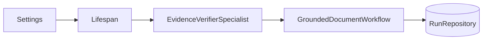
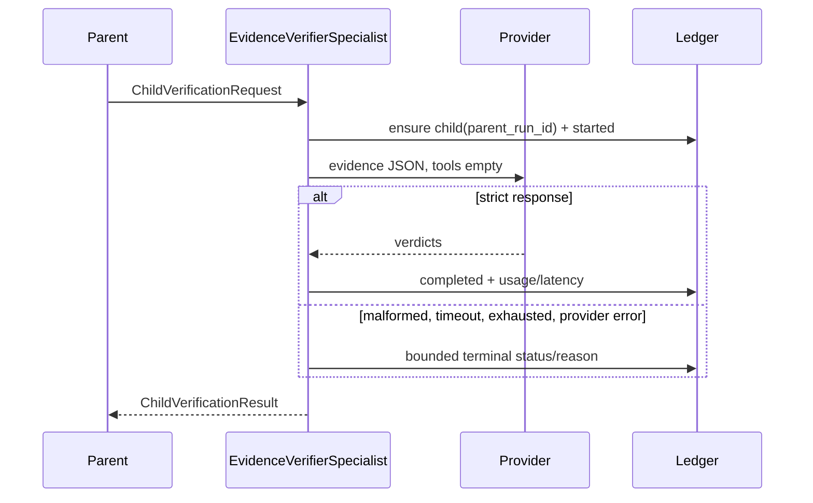

# Source walkthrough — One bounded verifier child

## Claim and boundary

Archon wires **one** evidence-only verifier specialist into the grounded-document workflow. It receives no tools and finite token, timeout, and retry budgets. This is not a dynamic swarm, recursive delegation, or generic self-reflection.

## Construction path

1. [`Settings.verifier_*`](../../../backend/app/config.py) validates model name and hard upper bounds; retries are at most one.
2. [`lifespan`](../../../backend/app/main.py) constructs `EvidenceVerifierSpecialist` only when `verifier_enabled`; otherwise the capability is visibly `None`/disabled.
3. [`answer_with_documents`](../../../backend/app/routes/documents.py) supplies `VerificationBudget` to `GroundedDocumentWorkflow`.



## Contract before model call

Read [`ChildVerificationRequest.__post_init__`](../../../backend/app/delegation/models.py). IDs must be valid and unique; claims can cite only delegated evidence; `tools` must be the empty tuple; and `VerificationBudget` is typed. The parent chooses the sealed packet before execution.

`EvidenceVerifierSpecialist.verify` then:

1. estimates and rejects over-budget input;
2. calls `RunRepository.ensure_child_run(child_id, parent_run_id, user_id, project_id, ...)`;
3. appends a safe started event;
4. invokes the typed provider with `tools=()` under a timeout;
5. retries only explicitly transient failure within the configured tiny budget;
6. parses exact JSON and verifies one verdict per claim and evidence subsets;
7. appends terminal usage, latency, status and safe reason evidence.

## Request and failure trace



Inspect `_parse_response` and `_finish`: unsupported evidence IDs, duplicate/missing claims, free-form reasons, empty content, or tool calls are malformed output. Prompt text is not the sole control.

## Parent integration and lineage

`GroundedDocumentWorkflow._verify_with_child` creates one child ID, maps grounded claims/evidence, and applies verdicts conservatively. The child row stores `parent_run_id`; owner/project scope is preserved. The link supports inspection, not a claim that the child caused a quality gain. `measure_verifier_benefit` compares a versioned deterministic fixture and reports false accepts/rejects, cost, latency, failures and escalations.

## Execute

```bash
cd backend
uv run pytest -q \
  tests/unit/test_delegation_contract.py \
  tests/unit/test_evidence_verifier.py \
  tests/integration/test_verifier_benefit.py \
  tests/integration/test_run_parent_migration.py
```

For each failure test, record: rejected input/output, terminal child status, parent behavior, and what was persisted.

## Evidence and interview anchors

- **Source:** `ChildVerificationRequest`, `EvidenceVerifierSpecialist.verify`, `RunRepository.ensure_child_run`, `GroundedDocumentWorkflow._verify_with_child`.
- **Tests:** the four files above.
- **Observed scope:** local deterministic benefit fixture and product wiring in [implementation evidence](../../IMPLEMENTATION-EVIDENCE.md).
- **Limitation:** final external providers were not verified; the model can misjudge supplied evidence; no swarm/reflection claim.

**Interview version:** “The trust improvement is bounded authority and auditable disagreement, not a magical second opinion. Exact context, empty tools, strict output validation, budgets, and durable lineage are the controls.”
