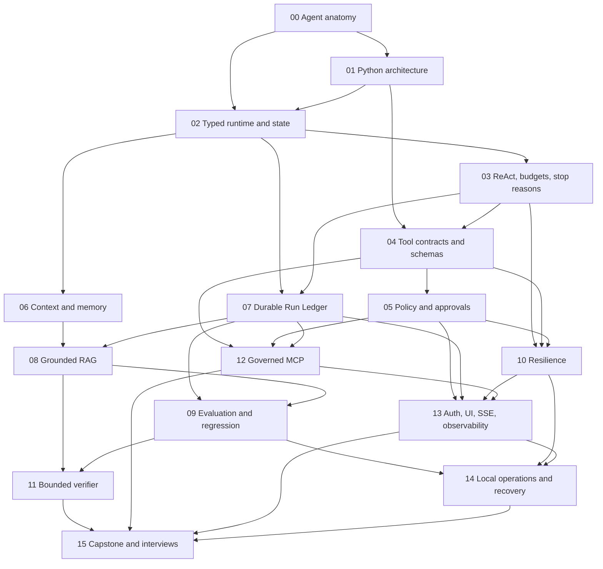
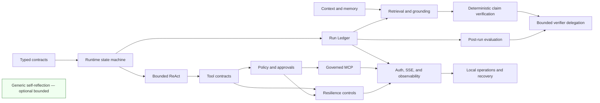

# Archon Course Concept Map

This map shows learning dependencies, not runtime call order. Follow the [course home](README.md) for routes and the [syllabus](syllabus.md) for pacing. Canonical explanations live in one `concepts/` page each; modules and tracks link to them.

## Status semantics

Concept status describes current implementation depth, not documentation maturity:

| Status | Required interpretation |
|---|---|
| `implemented` | Meaningful behavior is wired into a current path and backed by exact source, behavior-focused tests, and evidence. The entry must still state scope and production limits. |
| `partial` | Useful behavior exists, but wiring, coverage, evidence, safety, scale, UX, or provider support is incomplete. The missing boundary must be explicit. |
| `not-implemented` | No meaningful current implementation exists. Types, routes, stubs, mocks, historical experiments, or documentation alone do not qualify. |
| `deferred` | Deliberately excluded from current scope. It is neither promised nor assigned a delivery date. |

Only those four values belong in the [concept catalog](concept-catalog.yaml). Evidence dimensions such as Exists, Wired, Tested, Observed, UI, and Deployed remain separate in the [implementation evidence matrix](../IMPLEMENTATION-EVIDENCE.md).

## Terms that must not be collapsed

| Term | What it means here | Relationship |
|---|---|---|
| **ReAct** | A bounded request-time control loop in which model output can select an action, receive a tool result, and continue until a typed stop condition or budget ends the run. | Runtime orchestration; tool-result feedback does not by itself constitute generic self-reflection. |
| **Deterministic claim verification** | Rule-based comparison of candidate claims with retrieved evidence, conservatively rejecting unsupported, unknown, negated, numeric, or partial claims. | A grounded-workflow control, not another agent and not introspection. |
| **Verifier delegation** | One bounded child run receives selected claims and evidence only, has no tools, returns a strict verdict contract, and is linked to its parent. | A constrained specialist; not a dynamic swarm and not generic self-reflection. |
| **Post-run evaluation** | A versioned evaluation process scores or checks an already persisted run for regression evidence. | Measurement after execution; it does not alter the run or prove continuous learning. |
| **Generic self-reflection** | A general mechanism that critiques its own reasoning/output against explicit criteria and deliberately revises it, potentially across a broader workflow. | **Implemented** as optional bounded final-answer reflection through `BoundedReflectionService`: one tool-free critique and at most one bounded revision, disabled by default. Not recursive, not a learned memory, and not inferred from ReAct, retries, tool-error feedback, verification, delegation, or evaluation alone. |

## Module dependency graph

Solid arrows mean “learn before.” The graph is curriculum architecture; it does not assert that every named concept is fully implemented.

## Dependencies by module

| Module | Learn first | Core concepts introduced or consolidated |
|---:|---|---|
| 00 Agent anatomy | Basic Python and HTTP vocabulary | agent, model, message, context, tool, evidence, evaluation, lifecycle, trust boundary |
| 01 Python architecture | 00 | object and class, composition, Protocol, adapter, dependency injection, async/await, cancellation |
| 02 Typed runtime and state machine | 00–01 | typed contracts, runtime state, transition, event, terminal state, stop reason |
| 03 ReAct, budgets, stop reasons | 02 | observation/action loop, iteration/tool/token/time budget, bounded execution |
| 04 Tool contracts and schemas | 01, 03 | tool definition, JSON Schema, validation, registry, immutable call binding, bounded result |
| 05 Policy and durable approvals | 04 | risk/resource metadata, allow/ask/deny, fail-closed, approval receipt, expiry, one-shot decision |
| 06 Context, conversation, encrypted memory | 02 | effective context, conversation persistence, memory scope/provenance, AES-GCM, PII redaction, ownership |
| 07 Durable Run Ledger | 02–03 | run identity, ordered event, correlation, replay, checkpoint, fork, compare, lineage |
| 08 Grounded RAG | 06–07 | document, chunk, embedding, SQL JSON cosine, retrieval, claim, evidence, grounding, faithfulness, citation |
| 09 Evaluation and regression | 07–08 | recorded run, fixture/dataset version, evaluator, metric, baseline, regression, promotion evidence |
| 10 Reliability and resilience | 03–05 | idempotency, retry, timeout, cancellation, circuit breaker, fallback, rate limit |
| 11 Bounded verifier delegation | 08–09 | parent/child run, evidence-only context, strict verdict, child budget, fail-closed filtering |
| 12 Governed MCP | 04–05, 07 | MCP profile, stdio transport, discovery, inventory, enablement, adapter, governed invocation |
| 13 Auth, UI, SSE, observability | 05, 07, 10, 12 | authentication, authorization/ownership, SSE, structured log, metric, trace/span, health/readiness |
| 14 Docker, CI, migrations, recovery | 09–10, 13 | container boundary, Compose, migration, CI gate, backup, restore, RTO, RPO, trusted infrastructure |
| 15 Capstone and interviews | 00–14 | synthesis, evidence-backed claim, trade-off, limitation, 2/15/45-minute explanation |

## Concept clusters and cross-links

The **Generic self-reflection** node is now `implemented` as an optional, bounded, disabled-by-default final-answer reflection mechanism. It is not recursive, not learned, and its scope remains vocabulary needed for honest comparison alongside ReAct, verification, and evaluation.

## Reading rules

1. If a term is new, read its canonical concept page once, then return to the module exercise.
2. Treat module arrows as prerequisites, not proof of implementation.
3. Resolve status from the catalog entry and current evidence matrix, never from a diagram alone.
4. Treat architecture, startup, request, class, and state diagrams as different views; do not substitute one for another.
5. When old audits disagree with current evidence, current evidence wins and the historical revision remains labeled.
