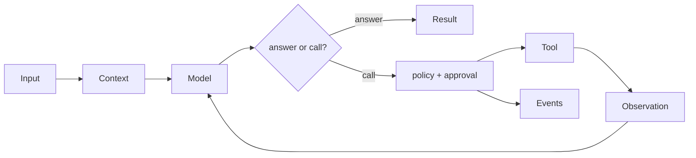

# Agent anatomy

## Definition

An agent is a bounded program that repeatedly asks a model for either an answer or a native tool call, observes permitted results, and terminates explicitly. Its deterministic runtime—not the model—owns authority, budgets, execution, and evidence.

## Vocabulary and invariants

- **Model/provider:** proposes text and typed calls.
- **Runtime:** sequences work and enforces budgets.
- **Tool:** bounded capability with a contract.
- **Policy/approval:** machine rule and, when required, exact human consent.
- **Event/result:** incremental evidence and terminal summary.

The provider must not bypass policy, and all paths must terminate. Archon is a custom runtime with Protocol-based adapters, not LangChain, LangGraph, or another agent framework.

## Archon anchors

[`AgentRuntime`](../../../backend/app/runtime/engine.py), [`ModelProvider` and `ToolExecutor`](../../../backend/app/runtime/ports.py), [`create_chat_runtime`](../../../backend/app/runtime/factory.py), and [`AgentEventKind`](../../../backend/app/runtime/events.py). Verify with [`test_runtime_v2.py`](../../../backend/tests/unit/test_runtime_v2.py) and the [capability matrix](../../IMPLEMENTATION-EVIDENCE.md#capability-matrix).

## Boundaries and common confusion

A chatbot need not act; an agent can. ReAct is the action/observation loop. Generic self-reflection would require a distinct critique/revision contract and is **not implemented**. Deterministic claim verification, one evidence-only verifier child, and post-run evaluation are different mechanisms.

> **Luis study note:** *El modelo propone; el runtime controla, autoriza, ejecuta y registra.*
