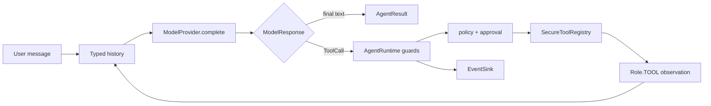
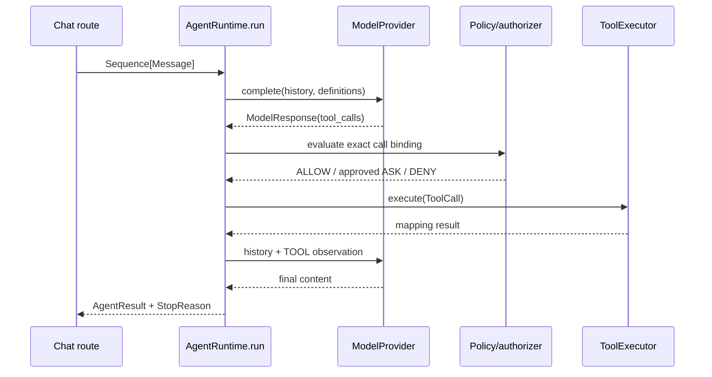

# Agent anatomy

## Beginner explanation

An agent is a program that lets a language model propose the next step, including a typed tool call, while ordinary code decides what is permitted and when the run must stop.
A chatbot can return text only; an agent may affect files, networks, or databases, so its control plane matters as much as its prompt.
In Archon, the model is an untrusted planner. The custom runtime—not a framework such as LangChain or LangGraph—owns authority, execution, budgets, and evidence.

## Prerequisites and vocabulary

- **Model/provider:** adapter that converts typed history into `ModelResponse`.
- **Runtime:** deterministic loop that sequences model and tool work.
- **Tool:** named capability with an input contract and security metadata.
- **Observation:** a `Role.TOOL` message containing a bounded result or error.
- **Policy:** deterministic `ALLOW`, `ASK`, or `DENY` classification.
- **Approval:** one human decision bound to one exact proposed call.
- **Budget:** upper bound on iterations, calls, tokens, time, or result size.
- **Event:** typed evidence emitted while the run progresses.

## Problem and mental model

Treat the system as a guarded interpreter: the model emits proposals; the runtime interprets only native, typed proposals that pass every guard.
The key invariant is *proposal is not permission*. A convincing model response cannot call a handler directly.





## Code-grounded Archon tour

- [`AgentRuntime.__init__` and `AgentRuntime.run`](../../../backend/app/runtime/engine.py) inject collaborators and implement the bounded loop.
- [`RuntimeBudget`](../../../backend/app/runtime/engine.py) validates limits; [`StopReason`](../../../backend/app/runtime/engine.py) makes terminal outcomes explicit.
- [`ModelProvider`, `ToolExecutor`, and `ToolAuthorizer`](../../../backend/app/runtime/ports.py) are behavioral ports.
- [`Message`, `ToolCall`, and `ModelResponse`](../../../backend/app/runtime/models.py) are provider-boundary values.
- [`SecureToolRegistry.execute`](../../../backend/app/tools/registry.py) validates, permission-checks, times out, executes, and audits.
- [`create_chat_runtime`](../../../backend/app/runtime/factory.py) is the supported live composition root and installs `default_policy_engine()`.
- [`AgentEventKind`](../../../backend/app/runtime/events.py) names observable milestones; [`AgentResult`](../../../backend/app/runtime/engine.py) is the terminal summary.

## Behavior-focused tests—and their limits

- [`test_typed_tool_round_trip_and_events`](../../../backend/tests/unit/test_runtime_v2.py) proves one scripted native call becomes an observation and emits expected event kinds. It does not prove a real provider or external tool is reliable.
- [`test_explicit_budget_stop_reasons`](../../../backend/tests/unit/test_runtime_v2.py) proves selected budgets produce explicit reasons. It does not prove configured limits fit every production workload.
- [`test_policy_deny_is_terminal_and_never_executes`](../../../backend/tests/unit/test_runtime_policy.py) proves denial blocks its fake executor. It does not prove every live tool has correct risk/resource metadata.
- [`test_concurrent_runs_are_isolated`](../../../backend/tests/unit/test_runtime_v2.py) checks in-process run history isolation. It does not establish distributed tenancy or database authorization.

## Bounded read-and-run exercise

Timebox: 15 minutes. Read `AgentRuntime.run` from initialization through the first `ModelProvider.complete` call, then run:

```bash
cd backend
pytest -q tests/unit/test_runtime_v2.py::test_typed_tool_round_trip_and_events
```

Write down which component proposes, authorizes, executes, records, and stops. Stop after one test; the goal is tracing responsibility, not running the suite.

## Security and failure modes

- Provider output may be malformed or mutable; snapshots and canonical bindings fail closed before policy work.
- Missing policy metadata, a policy exception, or an absent authorizer for `ASK` stops execution.
- Timeouts bound waiting but cannot undo an already-started external side effect.
- Duplicate semantic calls are blocked within a run, but this is not universal cross-run idempotency.
- Tool output can contain secrets or prompt injection; result bounds, persistence allowlists, and handler-specific controls remain necessary.
- A final model answer can still be false. Agent control safety is not factual correctness.

## Observability and evidence

`AgentEventKind` distinguishes run, model, policy, approval, tool, and stop milestones.
`CompositeEventSink` is wired by `create_chat_runtime`; the run ledger persists allowlisted metadata rather than raw arguments/results.
Useful evidence includes `run_id`, iteration, tool name, argument digest, policy action, matched rule ID, stop reason, token usage, and tool status.
A log line alone is not proof of non-execution; pair an ordered denial event with a test executor whose call count remains zero.

## Alternatives and tradeoffs

A fixed workflow is easier to reason about when steps are known; an agent loop offers flexibility at the cost of a larger state space.
Text-parsed “tool calls” are portable but ambiguous; provider-native `ToolCall` values preserve IDs and structure.
A third-party orchestration framework may add integrations and visual graphs; Archon's custom typed runtime keeps control semantics explicit but must maintain adapters and scheduling itself.

## Lab versus production

In a lab, `MockLLM`, `RecordingEventSink`, and in-memory collaborators make paths reproducible.
Production needs authenticated owner context, durable records, explicit policy, cancellation handling, provider timeouts, resource containment, privacy-safe evidence, and capacity limits.
A demo that successfully calls one tool does not establish safe multi-user operation.

## 30-second interview answer

“An agent is a bounded interpreter around a probabilistic planner. In Archon, `ModelProvider` proposes native `ToolCall`s, while `AgentRuntime` snapshots them, enforces budgets and policy/approval, dispatches through `SecureToolRegistry`, feeds bounded observations back, emits typed events, and returns an explicit `StopReason`. The model never owns authority. This is a custom typed runtime, and generic critique/revision self-reflection is not implemented.”

## Self-check questions

1. **Who has authority to execute?** The deterministic runtime and registry after controls, never the model.
2. **What makes an agent different from a text chatbot?** It can iteratively invoke governed capabilities and observe results.
3. **Why preserve native call IDs?** They bind observations and approvals to the exact provider proposal.
4. **What terminates a run?** Final content, a budget, policy/approval outcome, timeout, or error represented by `StopReason`.
5. **Does a tool schema authorize a call?** No; schema validation and authorization are separate layers.
6. **Is generic self-reflection present?** No; error feedback, claim verification, and post-run evaluation are narrower mechanisms.

## Related modules and concepts

- Modules: [Agent anatomy](../modules/00-agent-anatomy/README.md), [Typed runtime](../modules/02-typed-runtime/README.md), and [ReAct loop](../modules/03-react-loop/README.md).
- Concepts: [typed runtime](typed-runtime.md), [ReAct](react.md), [tool contracts](tool-contracts.md), [policy engine](policy-engine.md), and [state machines](state-machines.md).
