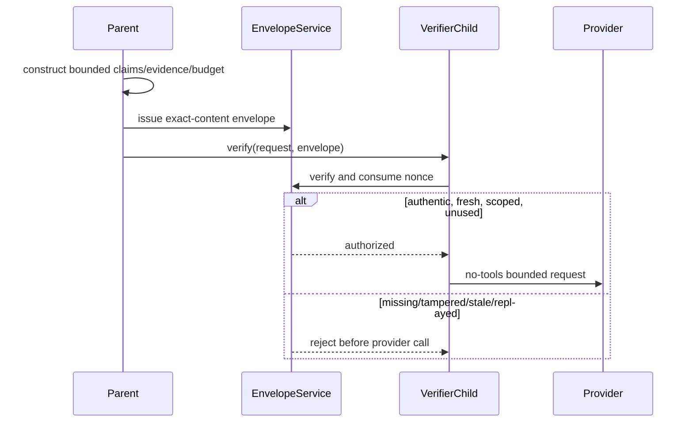

# Agent communication security

> **Implementation status:** `implemented` for the local verifier boundary
> **Status boundary:** The active evidence-verifier child requires a parent-issued HMAC envelope bound to exact bounded content, scope, budget, freshness, nonce, schema, and key version.
> **Reviewed candidate:** S8.6 combined candidate
> **Used by module:** [Module 11-bounded-delegation](../modules/11-bounded-delegation/README.md)
> **Catalog ID:** `agent-communication-security`

## Beginner explanation

When a parent agent delegates work, the child must know exactly what was authorized. A signed envelope proves integrity and scope: changing the owner, project, run IDs, claims, evidence, budget, timestamp, nonce, schema, or key version invalidates the signature.

HMAC authenticates data under a shared secret. It does **not** encrypt the content and is not a remote PKI.

## Architecture

## Sequence

## Signed fields

- parent and child run IDs;
- owner and project IDs;
- canonical bounded claim text, evidence quote, identifiers, and declared hashes through `context_hash`;
- input/output token limits, timeout, and retry count;
- schema version;
- issuance timestamp;
- cryptographically random nonce;
- key version.

The child cannot mint its own authorization. `EvidenceVerifierSpecialist.verify()` requires an envelope whenever the service is configured. `GroundedDocumentWorkflow`, acting as the parent boundary, explicitly issues it before calling the child.

## Implementation map

| Source | Responsibility |
|---|---|
| [`backend/app/delegation/envelope.py`](../../../backend/app/delegation/envelope.py) | Immutable envelope, domain-separated HMAC, constant-time verification, freshness, key versions, nonce consumption, and stale-receipt pruning. |
| [`backend/app/delegation/service.py`](../../../backend/app/delegation/service.py) | Canonical request content, parent issuer helper, and mandatory child verification. |
| [`backend/app/services/grounded_rag.py`](../../../backend/app/services/grounded_rag.py) | Active parent/orchestrator issuance before evidence-verifier execution. |
| [`backend/alembic/versions/20260828_13_durable_jobs_and_nonces.py`](../../../backend/alembic/versions/20260828_13_durable_jobs_and_nonces.py) | Durable unique nonce receipts and indexed retention support. |

## Tests

| Test | Contract proved |
|---|---|
| [`backend/tests/security/test_delegation_envelope.py`](../../../backend/tests/security/test_delegation_envelope.py) | Tamper, wrong scope, stale/future envelope, unknown key version, replay, URL-safe nonce, and receipt pruning. |
| [`backend/tests/unit/test_evidence_verifier.py`](../../../backend/tests/unit/test_evidence_verifier.py) | Missing envelope rejection and original-envelope rejection after claim/evidence mutation. |
| [`backend/tests/unit/test_grounded_rag.py`](../../../backend/tests/unit/test_grounded_rag.py) | Parent issuance is wired into the real bounded verifier path. |

## Limits

- Shared-secret compromise compromises all envelopes signed by that key version.
- Current startup wiring derives one active version from a dedicated secret; external KMS/HSM-backed rotation is not implemented.
- Envelope content is authenticated, not encrypted.
- This is a local in-process trust boundary; remote service identity, mTLS, federation, and multi-host PKI are not claimed.
- Durable nonce receipts prevent replay within the acceptance target. Receipts older than the freshness window are safely pruned because those envelopes are already invalid.

## Interview answer

> Archon treats delegation as an authorization boundary, not a normal function call. The parent canonicalizes the exact bounded request and issues a versioned HMAC envelope. The child requires that envelope, verifies it in constant time, checks exact owner/project/run/content/budget scope and freshness, then atomically consumes a durable nonce before calling the provider. Replays and content mutations fail before execution. The design authenticates local metadata but does not claim encryption or remote PKI.

## Self-check

1. Why must the parent issue the envelope rather than the child?
2. Which mutation tests prove the actual claim and evidence content is bound?
3. Why can old nonce receipts be pruned safely?
4. What security property does HMAC provide, and what does it not provide?
5. What changes would be needed for a multi-host trust boundary?
