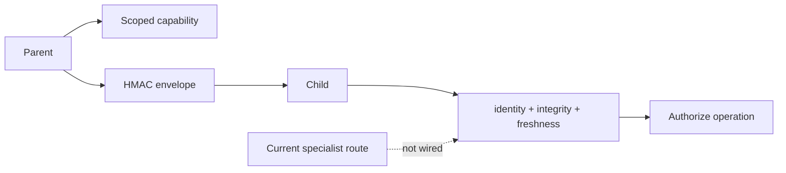
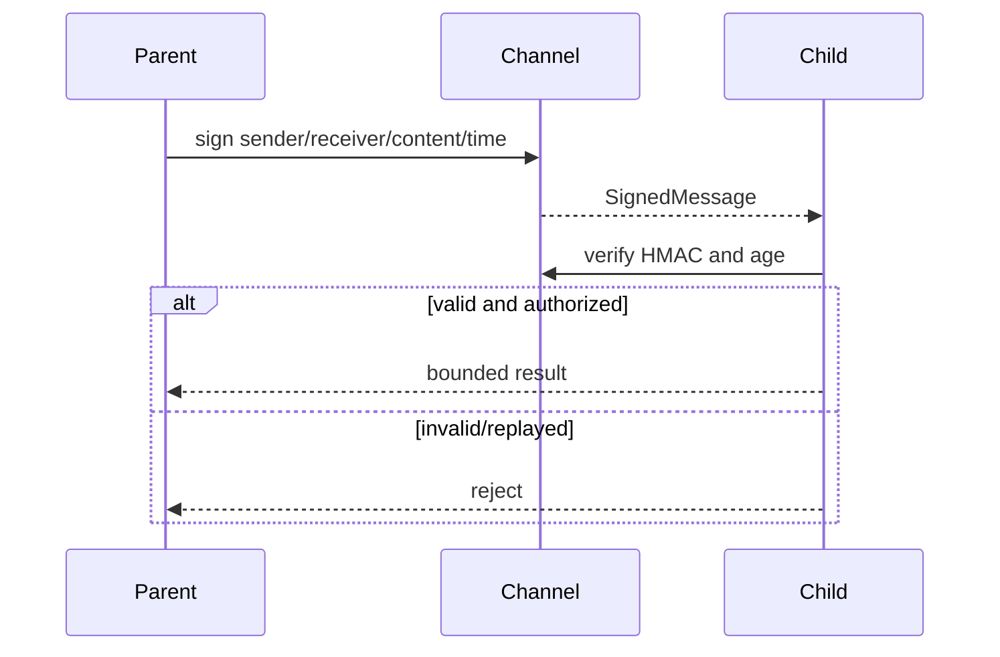

# Agent communication security

> **Implementation status:** `partial`
> **Status boundary:** HMAC freshness and scoped-agent-token primitives have isolated tests, but the live specialist/delegation routes do not use them as a mandatory transport or authorization boundary.
> **Reviewed revision:** `c115d62`
> **Used by module:** [Module 11-bounded-delegation](../modules/11-bounded-delegation/README.md)
> **Catalog ID:** `agent-communication-security`

## Beginner explanation

When one agent sends work to another, the receiver should know who sent it, what scope was granted, whether the message changed, and whether it is a replay. HMAC can prove integrity under a shared secret, but it does not encrypt content or define authorization.

## Problem and mental model

Treat the boundary as a contract with explicit inputs, outputs, state, failure behavior, and evidence. The important question is not whether a similarly named class or file exists, but whether the behavior is wired into a real path and whether a test or observation proves it.

## Architecture and components

## Startup and request sequence

## Archon implementation and source walkthrough

At revision `c115d62`, the mapped symbols implement the bounded behavior below. Not injected into the active bounded verifier or legacy multi-agent route; no nonce store, key rotation, encryption, or durable receipt.

### Source symbols

| Source symbol | Role and boundary |
|---|---|
| [`backend/app/agents/secure_channel.py:SecureChannel`](../../../backend/app/agents/secure_channel.py) | Signs and verifies HMAC messages with a max age. |
| [`backend/app/agents/agent_auth.py:create_agent_token`](../../../backend/app/agents/agent_auth.py) | Creates expiring role/permission records; these are plain in-process records, not signed bearer credentials. |

### Tests

| Test | Contract proved and limit |
|---|---|
| [`backend/tests/unit/test_secure_channel.py::TestSecureChannel`](../../../backend/tests/unit/test_secure_channel.py) | Proves tamper, wrong-secret, and expiry rejection. |
| [`backend/tests/unit/test_agent_auth.py::test_create_token_default_permissions`](../../../backend/tests/unit/test_agent_auth.py) | Exercises scoped token behavior. |

### Evidence boundary

Current implementation dimensions are centralized in [Implementation Evidence](../../IMPLEMENTATION-EVIDENCE.md). Source/tests below are repository evidence; they are not public-deployment or production-certification evidence.

## Try it: bounded study exercise

From the repository root, inspect the mapped source and test, then run the named focused test with the project test environment if available. Confirm both the passing contract and this gap: Not injected into the active bounded verifier or legacy multi-agent route; no nonce store, key rotation, encryption, or durable receipt.

**Done criteria:** identify the trust boundary, one proved behavior, and one unproved behavior without changing repository state.

## Risks, failures, and trade-offs

| Topic | Assessment |
|---|---|
| Principal risk | Shared-secret compromise affects all peers; freshness without nonce persistence permits replay inside the window. |
| Current gap/failure | Not injected into the active bounded verifier or legacy multi-agent route; no nonce store, key rotation, encryption, or durable receipt. |
| Trade-off | In-process typed calls avoid unnecessary crypto; distributed peers need authenticated transport and scoped authorization. |
| Evidence hygiene | Do not log secrets or hidden chain-of-thought; record revision, environment, command, and only redacted outcomes. |

## Lab vs production

The status remains **partial** at `c115d62`. HMAC freshness and scoped-agent-token primitives have isolated tests, but the live specialist/delegation routes do not use them as a mandatory transport or authorization boundary. Unit tests, manifests, or local observations do not prove external-provider parity, sustained load, public deployment, legal compliance, or a production SLO.

## Interview answer

> When one agent sends work to another, the receiver should know who sent it, what scope was granted, whether the message changed, and whether it is a replay. HMAC can prove integrity under a shared secret, but it does not encrypt content or define authorization. In Archon the honest status is **partial**: HMAC freshness and scoped-agent-token primitives have isolated tests, but the live specialist/delegation routes do not use them as a mandatory transport or authorization boundary.

## Self-check

1. What problem does this concept solve, and what nearby concept is it not?
2. Trace the diagram’s trust boundary and failure path.
3. Which mapped symbol/test proves current behavior, or why are the lists empty?
4. What exact gap prevents a stronger status?
5. Which risk would you test first before production use?

Answer guide

A good answer names the contract in the beginner explanation, follows the sequence, cites the exact table entry (or the explicit absence), repeats the status boundary, and chooses a risk from the table rather than claiming unrecorded behavior.

## Related concepts and modules

- **Module:** [Module 11-bounded-delegation](../modules/11-bounded-delegation/README.md)
- **Course-day map:** [AIAMastery Days 1–30 coverage](../course-concept-coverage.md)
- **Evidence:** [Implementation Evidence](../../IMPLEMENTATION-EVIDENCE.md)
- **Historical context only:** [Feature and Course Audit v2](../../FEATURE-AND-COURSE-AUDIT-V2.md)
