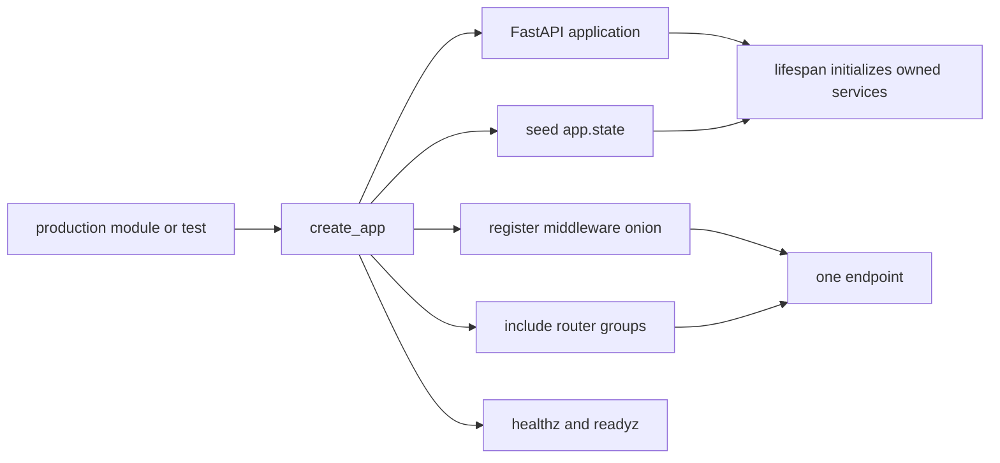
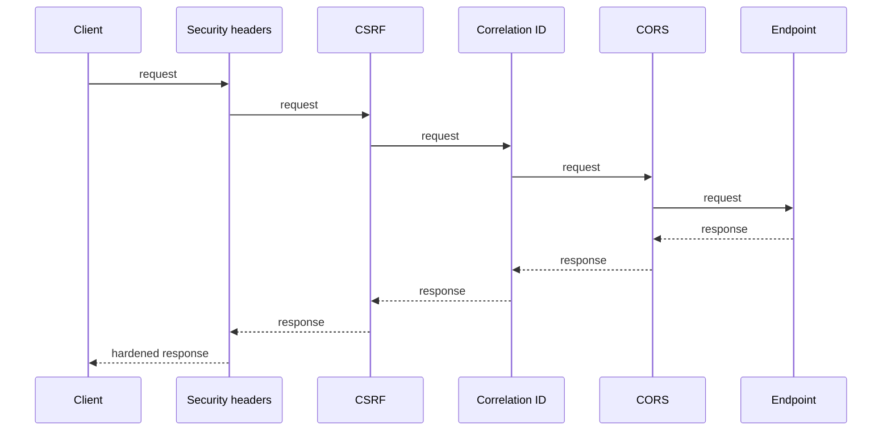

# Application factory, middleware, routers, and application state

> **Implementation status:** `implemented`
>
> **Status boundary:** Cogentrex constructs one FastAPI application with explicit process-owned state, ordered middleware, grouped routers, and separate liveness/readiness probes; this does not prove public deployment or every downstream workflow.
>
> **Reviewed revision:** rebrand working tree based on `33c56af5d33e74f83e5b0caef2cb766f492b1023`
>
> **Used by modules:** [Agent anatomy](../modules/00-agent-anatomy/README.md), [Python architecture](../modules/01-python-architecture/README.md), [Local operations](../modules/14-local-operations/README.md)
>
> **Catalog ID:** `application-composition`

## Beginner explanation

Before FastAPI can receive a useful request, the application must be assembled. Cogentrex centralizes that assembly in `create_app()`.

A **factory** is a function responsible for constructing and configuring another object. `create_app()` returns one consistently wired FastAPI application. Production calls it with default collaborators; tests may inject controlled settings or replacement constructors.

**Middleware** forms an onion around each endpoint. A request travels inward through the registered layers, the endpoint runs, and the response travels outward through the same layers in reverse.

A **router** is a group of related endpoints. An endpoint is one HTTP method and path, such as `POST /api/chat`. `include_router(chat_router)` attaches every endpoint declared by that router.

`app.state` is application-owned storage shared by requests handled by one running backend process. It is not user session state, conversation memory, or model memory.

## Visual walkthroughs

In a running Cogentrex application, open `/learn?view=present`, choose **Cogentrex From the Code**, then use:

- **Video 1 — `main.py`, Lifespan, and Application State** for startup, serving, shutdown, and ownership;
- **Video 2 — Building the FastAPI Application** for the application factory, state categories, middleware, routers, and health probes;
- **Video 3 — From Browser Request to Runtime Construction** for the transition from application-owned services to request-scoped runtime construction.

The videos are derived learning media. This page, linked source, tests, and the canonical evidence matrix remain authoritative when a video becomes stale.

## Prerequisites and vocabulary

### Learn first

- [OOP, Protocols, and dependency injection](oop-protocols-dependency-injection.md) — explains collaborators, factories, and composition roots.
- [Async Python](async-python.md) — explains the lifespan boundary that initializes and closes services.

### Vocabulary

| Term | Plain-English meaning | Not the same as |
|---|---|---|
| application factory | Function that constructs and returns the configured application | a request handler |
| dependency factory | Callable stored or passed so a dependency can be created later | the created dependency instance |
| middleware | Wrapper applied around requests and responses | a router or endpoint |
| router | Group of related endpoints, usually with shared prefix/tags/dependencies | one endpoint |
| endpoint | One HTTP method/path operation | an entire domain module |
| application state | Process-owned shared objects reachable through `request.app.state` | user/session/model memory |
| liveness | Whether the process should normally be restarted | whether dependencies can serve traffic |
| readiness | Whether this instance should receive traffic now | end-to-end user success or historical uptime |

## Problem and mental model

Without one composition boundary, route modules could construct their own providers, repositories, security components, and clients. That creates inconsistent configuration, duplicated resources, hidden ownership, and tests that require real infrastructure.

Use this mental model:



The factory controls assembly order. Lifespan controls the live resources' start and stop. Routes consume those resources; they do not own them.

## Architecture and components

| Component | Responsibility | Out of scope |
|---|---|---|
| `create_app()` | Construct FastAPI and establish application composition | executing agent requests |
| `app.state` | Hold configuration, deferred constructors, and application-owned services | per-user conversation state |
| middleware stack | Apply cross-cutting HTTP behavior to routes | endpoint business logic |
| routers | Group and register endpoint families | proving authorization of each endpoint |
| `/healthz` | Shallow process-liveness signal | dependency health |
| `/readyz` | Required active checks plus safe reported state | synthetic user transaction or SLA |

## Startup sequence

```mermaid
sequenceDiagram
    participant M as Python module
    participant F as create_app
    participant A as FastAPI
    participant L as lifespan
    participant R as request routes
    M->>F: app = create_app()
    F->>F: resolve or receive Settings
    F->>A: construct with lifespan reference
    F->>A: seed configuration and factories in app.state
    F->>A: register middleware and routers
    F-->>M: configured application
    A->>L: enter startup when server starts
    L->>A: replace service slots with validated live services
    L-->>R: yield; serving may begin
```

The module-level `app = create_app()` runs during import. Registering `lifespan` does not execute startup immediately; the server invokes it later.

## Application-state ownership

`create_app()` seeds four categories:

| Category | Examples | Ownership meaning |
|---|---|---|
| configuration/descriptors | `settings`, MCP credential provider, MCP profiles | values startup and routes may read |
| deferred constructors | redactor, model-provider, sandbox-executor factories | callables lifespan invokes later |
| service slots | `sandbox_executor = None`, `evidence_verifier = None` | explicit not-yet-initialized state filled conditionally by lifespan |
| immediate optional service | learning-media catalog | constructed in `create_app()` when enabled |

The factories improve testability but do not guarantee safe wiring. The canonical production path and behavior-focused tests still matter.

## Middleware request and response order

Cogentrex registers middleware in this source order:

```text
CORS → Correlation ID → CSRF → Security Headers
```

Starlette's stack makes the last registered layer outermost:



- Security Headers adds CSP, framing, content-type, referrer, and permissions policies.
- CSRF validates cookie-authenticated mutations using a double-submit token; safe methods, bearer tokens, and API keys follow separate rules.
- Correlation ID accepts or creates one identifier for logs/traces and echoes it in the response.
- CORS applies the configured browser-origin, method, header, credential, and preflight policy.

The order is security behavior, not formatting. “First” must always specify inbound request or outbound response.

## Routers and endpoints

`create_app()` registers 25 router groups. A router can contain multiple endpoint functions. Separate routers keep domains such as chat, documents, authentication, memory, MCP, runs, evaluations, and administration independently navigable and testable.

Two router groups are feature-gated:

- learning media requires `learning_media_enabled`;
- encrypted memory requires `memory_encryption_enabled`.

When a router is not registered, its endpoints are absent and normally return `404`. That differs from a registered endpoint rejecting unauthenticated or unauthorized access with `401` or `403`.

Use the [API map](../reference/api-map.md) for the current endpoint families. Runtime OpenAPI from the checked-out application remains authoritative for exact schemas.

## Liveness and readiness boundary

`/healthz` calls no downstream dependency. It answers whether the process is alive enough that restart is not immediately justified.

`/readyz` asks whether traffic should reach this instance. It:

- actively awaits conversation-repository and rate-limiter health;
- evaluates worker-task state and configured OTLP exporter activity;
- reports descriptive state for the provider circuit, vector backend, evidence verifier, skill catalog, runtime controls, and embedding capability.

Reported metadata is not an active dependency call. In particular, `model_provider_circuit` reports the breaker's cached `closed`, `open`, or `half_open` state; readiness does not call the model provider. The verifier field reports enabled/disabled; readiness does not execute a verification job.

For deeper operational treatment, use [Liveness and readiness](liveness-readiness.md). For breaker behavior, use [Circuit breaker](circuit-breaker.md).

## Cogentrex implementation and source walkthrough

### Source symbols

| Source symbol | Role | Status boundary |
|---|---|---|
| [`main.py:create_app`](../../../backend/app/main.py) | application factory, state seeding, middleware, routers, probes | application composition only |
| [`main.py:lifespan`](../../../backend/app/main.py) | validates and constructs application-owned services | one process; local target |
| [`middleware/security.py`](../../../backend/app/middleware/security.py) | security headers and CSRF behavior | not a complete WAF or browser-security proof |
| [`middleware/correlation.py`](../../../backend/app/middleware/correlation.py) | request correlation context and response header | client IDs are not inherently trustworthy identity |
| [`routes/chat.py`](../../../backend/app/routes/chat.py) | example router/endpoint family | does not represent every router |

### Tests

| Test | Contract proved | Not proved |
|---|---|---|
| [`test_health.py`](../../../backend/tests/unit/test_health.py) | liveness/readiness response and selected failure semantics | public availability or provider uptime |
| [`test_memory_startup.py`](../../../backend/tests/unit/test_memory_startup.py) | startup rejects invalid required memory configuration | every external dependency |
| [`test_chat.py`](../../../backend/tests/unit/test_chat.py) | selected route composition and request behavior | all 25 router families |

## Try it: bounded code-reading exercise

1. Read `main.py:391-443`.
2. Classify each `app.state` assignment as configuration, deferred constructor, service slot, or immediate service.
3. Draw the inbound and outbound middleware order.
4. Pick one `include_router` call and find two endpoint decorators in that route module.
5. Explain why a database outage should fail readiness rather than liveness.

Done means you can explain the ownership and request path without reading the source line by line.

## Security and failure modes

- A factory can still assemble the wrong implementation; tests must assert behavior, not only object types.
- Application state is shared across requests, so request/user mutable data must not be stored there.
- Middleware order can change which failures receive headers or correlation context.
- A missing feature-gated router returns structural absence, not an authorization decision.
- Readiness can pass just before a dependency fails and does not call every reported capability.
- A process-local circuit state is not a cluster-wide provider-health oracle.

## Observability and evidence

Correlation IDs connect request logs and traces. Health failures emit safe dependency names and redacted reason metadata. Probe responses intentionally avoid credentials, connection strings, raw exceptions, or prompts.

The implementation is locally verified within its stated configuration. It is not a public-deployment or availability-SLO claim.

## Alternatives and trade-offs

- Constructing dependencies inside route functions is simple initially but hides ownership and recreates expensive clients.
- Global module singletons reduce parameter passing but make tests, cleanup, and tenant boundaries harder to audit.
- A DI container can automate a large graph but may obscure the exact composition path.
- One giant router is easy to start but becomes difficult to navigate, secure, and test by domain.
- One deep health endpoint is simple but can trigger restart storms and confuse process health with dependency health.

## Interview answer

> Cogentrex uses `create_app()` as its application factory. It resolves or receives configuration, constructs FastAPI with a lifespan reference, seeds application-owned state, registers an ordered middleware onion and domain routers, defines separate liveness/readiness probes, and returns the application. Lifespan later turns deferred factories and service slots into live resources. Liveness answers restart; readiness answers traffic and distinguishes active checks from reported capability state.

## Self-check

1. Why is `create_app()` a factory rather than merely a helper function?
2. What is the difference between a dependency factory and the dependency instance it creates?
3. Why must request/user state not live in `app.state`?
4. Which middleware runs first inbound, and which runs last outbound?
5. How does a router differ from one endpoint?
6. Which readiness fields are actively checked, and which are descriptive metadata?
