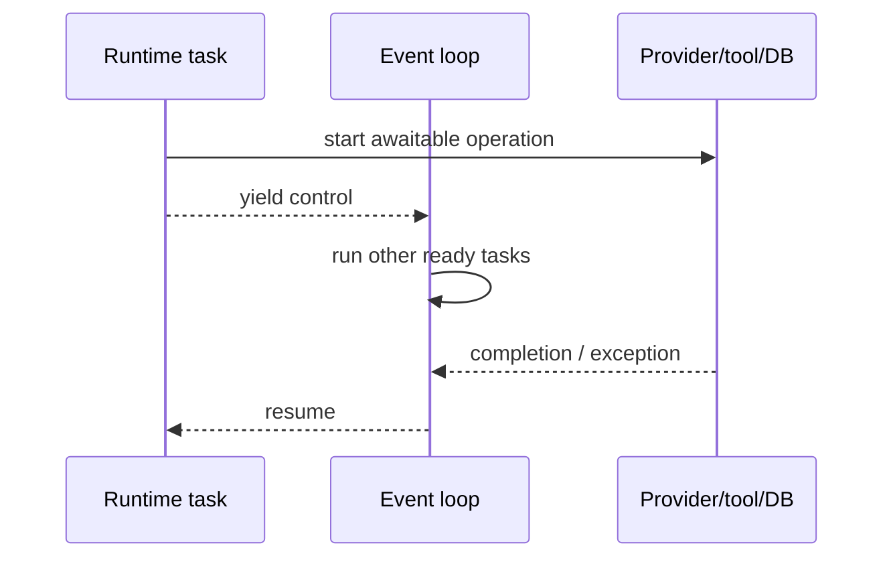
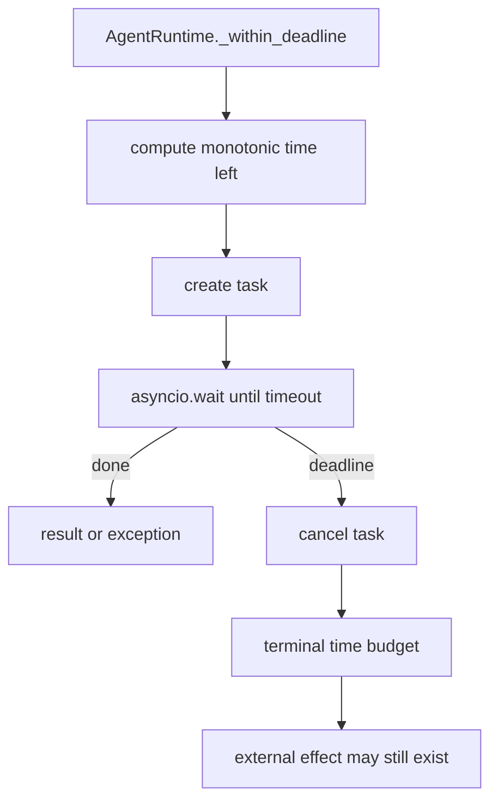

# Async Python

## Beginner explanation

`async def` creates a coroutine: work that can pause at `await` so the event loop can run other ready work.
This is especially useful for model, database, approval, and network waits.
Async concurrency does not make CPU-heavy Python execute in parallel, and cancellation does not roll back effects that already escaped the process.

## Prerequisites and vocabulary

- **Coroutine:** resumable computation returned by calling an `async def` function.
- **Event loop:** scheduler that resumes ready tasks.
- **Task:** scheduled coroutine with completion, exception, and cancellation state.
- **Await:** suspension point at which another task may run.
- **Timeout/deadline:** local bound on waiting; a deadline shares one budget across operations.
- **Cancellation:** cooperative request that normally raises `asyncio.CancelledError` at an await point.
- **Executor:** thread/process bridge for synchronous work; it does not automatically stop work on timeout.
- **Monotonic clock:** duration clock unaffected by wall-clock corrections.

## Problem and mental model

Picture one cashier who starts several remote orders and serves whoever is ready rather than staring at one oven.
Between two lines with no `await`, coroutine code is synchronous; at every `await`, assume shared state or collaborator-owned data may change.





## Code-grounded Archon tour

- [`ModelProvider.complete`, `ToolExecutor.execute`, and `ToolAuthorizer.authorize`](../../../backend/app/runtime/ports.py) are async ports.
- [`EventSink.emit`](../../../backend/app/runtime/events.py) is async, so observability is also a collaborator and failure boundary.
- [`AgentRuntime.run`](../../../backend/app/runtime/engine.py) awaits provider, event, authorization, and tool operations.
- [`AgentRuntime._within_deadline`](../../../backend/app/runtime/engine.py) applies one monotonic runtime deadline and handles cancellation-resistant awaitables.
- [`SecureToolRegistry.execute`](../../../backend/app/tools/registry.py) uses `asyncio.wait_for`; synchronous handlers go through `run_in_executor`.
- [`DurableApprovalBroker.wait_for_decision`](../../../backend/app/security/live_approvals.py) polls with `asyncio.sleep` and persists cancellation via `cancel`.
- [`ApprovalBroker`](../../../backend/app/security/live_approvals.py) protects its in-memory map with `asyncio.Lock`.

## Behavior-focused tests—and their limits

- [`test_timeout_stop_reason`](../../../backend/tests/unit/test_runtime_v2.py) proves a slow scripted provider yields `TIME_BUDGET_EXHAUSTED`. It does not prove a remote provider stopped processing.
- [`test_runtime_deadline_detaches_cancellation_resistant_tool_and_stops_batch`](../../../backend/tests/unit/test_runtime_budget_regressions.py) proves the runtime returns without dispatching the next call. It does not undo the detached tool's earlier side effects.
- [`test_cancelled_waiter_persists_cancelled_receipt`](../../../backend/tests/unit/test_durable_live_approvals.py) proves cancellation reaches durable approval state. It does not prove every caller propagates cancellation correctly.
- [`test_concurrent_runs_are_isolated`](../../../backend/tests/unit/test_runtime_v2.py) exercises concurrent tasks. It is not a throughput benchmark or process-level race test.

## Bounded executable exercise

Timebox: 10 minutes. Run only the cancellation-resistant regression:

```bash
cd backend
pytest -q tests/unit/test_runtime_budget_regressions.py::test_runtime_deadline_detaches_cancellation_resistant_tool_and_stops_batch
```

Then read `AgentRuntime._within_deadline` and identify: deadline calculation, task cancellation, and the point where the runtime chooses not to await forever.

## Security and failure modes

- Holding an `asyncio.Lock` across slow I/O can serialize unrelated callers and create denial of service.
- Swallowing `CancelledError` can leave reservations, tasks, or resources alive; clean up and re-raise.
- A timeout can race with completion. External writes require idempotency and reconciliation, not confidence in local cancellation.
- Mutable provider arguments can change while awaiting; Archon deep-snapshots policy-bound calls before yielding to collaborators.
- Unbounded task creation exhausts memory, sockets, pools, or provider quotas; async is not backpressure.
- Blocking CPU or synchronous I/O on the event-loop thread stalls all coroutines.

## Observability and evidence

Measure elapsed durations with a monotonic clock and record timeout/cancellation as distinct outcomes.
Correlate `run_id`, `tool_call_id`, deadline, operation type, and stop reason; avoid raw argument/result logging.
Evidence of healthy async behavior includes bounded latency, cancellation counters, pending approval count, pool wait time, and absence of orphaned tasks.
A passing timeout test proves the caller returned in time, not that the downstream system did no work.

## Alternatives and tradeoffs

Threads fit blocking libraries but add locking and still cannot forcibly stop a running Python function safely.
Processes provide CPU parallelism and stronger isolation at serialization/startup cost.
A job queue makes long work durable and decoupled, but changes request/response semantics.
Structured-concurrency libraries can make task lifetime clearer; Archon currently uses `asyncio` primitives directly.

## Lab versus production

Lab coroutines can use short sleeps, fake clocks, and in-memory futures to make races deterministic.
Production needs connection-pool bounds, upstream timeouts, graceful shutdown, task ownership, retry policy, idempotent effects, and metrics for queueing versus execution time.
Never convert a synchronous effectful handler to “safe async” merely by placing it in an executor.

## 30-second interview answer

“Async Python provides cooperative concurrency: an Archon runtime task yields while waiting on providers, tools, events, approvals, or the database. `AgentRuntime._within_deadline` bounds the whole run with a monotonic deadline, and `SecureToolRegistry.execute` bounds each handler. Cancellation is a control signal, not rollback—especially for executor threads or remote side effects—so production correctness also needs idempotency, cleanup, and observability.”

## Self-check questions

1. **Does `await` create CPU parallelism?** No; it lets the event loop schedule other ready work.
2. **When can shared state change?** At any suspension point, including awaited callbacks.
3. **Why use a monotonic clock?** Wall-clock adjustments must not change elapsed-time budgets.
4. **Does `wait_for` undo a tool write?** No; it only bounds the caller's wait and requests cancellation.
5. **What should code do with `CancelledError`?** Clean up exact owned resources, then propagate it.
6. **Why snapshot before awaiting?** To prevent collaborator mutation from changing authorization or execution identity.

## Related modules and concepts

- Module: [Python architecture](../modules/01-python-architecture/README.md).
- Concepts: [retries, timeouts, and cancellation](retries-timeouts-cancellation.md), [idempotency](idempotency.md), [durable approvals](durable-approvals.md), and [state machines](state-machines.md).
