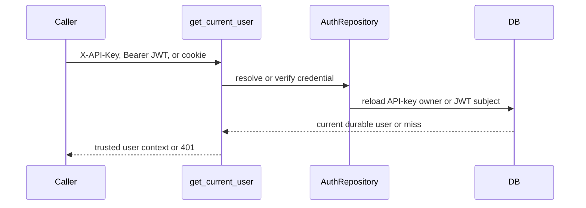
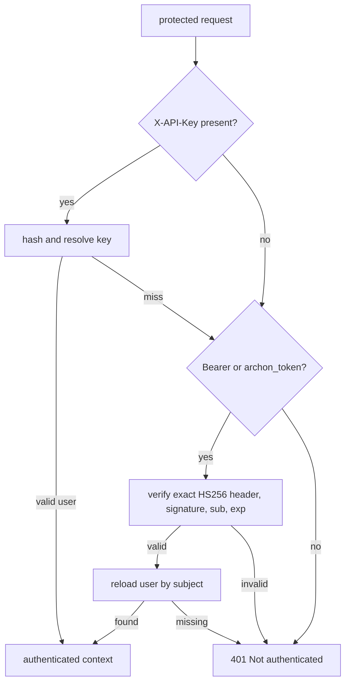

# Authentication

> **Documentation status:** Draft
> **Concept status:** `implemented`
> **Status boundary:** Persistent local users authenticate with scrypt password hashes and HS256 JWT/cookie or hashed API keys. No external IdP, refresh-token service, automated signing-key rotation, or production certification is claimed.
> **Used by:** [Module 13](../modules/13-auth-ui-observability/README.md)

## Identity boundary

Authentication answers one narrow question: **which account presented a valid current credential?**
It does not decide whether that account owns a conversation, may read a project, or may run a tool.
Those later decisions belong to [authorization and ownership](authorization-ownership.md) and the [policy engine](policy-engine.md).
Keeping the questions separate prevents “logged in” from accidentally meaning “allowed to do everything.”

## Credential paths

A password is used to establish a session, not sent on every protected request.
`hash_password` generates a 16-byte random salt and derives a 32-byte value with scrypt.
The stored form is `scrypt$<salt>$<digest>`; plaintext is not intentionally persisted.
`verify_password` checks the algorithm marker and uses `hmac.compare_digest` for the derived bytes.
Malformed encodings return `False` rather than escaping as parser errors.

`AuthRepository.create_jwt` issues an HS256 token with `sub`, `username`, `is_admin`, `iat`, and `exp`.
`AuthRepository.verify_jwt` requires the exact header `{"alg":"HS256","typ":"JWT"}`.
It checks the HMAC signature, a non-empty subject, and an expiry later than current time.
`get_current_user` then reloads `payload["sub"]` from the database.
That reload means a signed username or admin bit is not the final source of current user state.
The default JWT lifetime in this implementation is 24 hours.

`AuthRepository.register_api_key` returns one random `archon_...` secret to the caller.
The database receives only its SHA-256 digest plus key name and user ID.
`resolve_api_key` hashes the presented key, finds its record, and reloads its user.
The API-key path is tried before Bearer/cookie JWT resolution.
The returned context states `auth_method` as `api_key` or `jwt` for downstream interpretation.

## Resolution decision view

This view is credential-specific: it shows precedence and database reloads, not a generic request pipeline.
A bad API key does not prevent a valid JWT on the same request from being considered.
A valid signature whose subject no longer resolves still fails authentication.
`require_admin` is a separate dependency that returns 403 unless the reloaded context has `is_admin is True`.

## Exact implementation landmarks

- [`hash_password`](../../../backend/app/security/auth.py) owns scrypt encoding.
- [`verify_password`](../../../backend/app/security/auth.py) owns password comparison and malformed-input failure.
- [`AuthRepository.register_user`](../../../backend/app/security/auth.py) persists a password hash.
- [`AuthRepository.authenticate_user`](../../../backend/app/security/auth.py) verifies a login attempt.
- [`AuthRepository.register_api_key`](../../../backend/app/security/auth.py) creates and hashes an API key.
- [`AuthRepository.resolve_api_key`](../../../backend/app/security/auth.py) resolves key hash to current user.
- [`AuthRepository.create_jwt`](../../../backend/app/security/auth.py) creates the local HS256 token.
- [`AuthRepository.verify_jwt`](../../../backend/app/security/auth.py) verifies header, signature, subject, and expiry.
- [`get_current_user`](../../../backend/app/security/auth.py) is the canonical protected-route dependency.
- [`require_admin`](../../../backend/app/security/auth.py) adds the distinct administrator check.

## Tests and what they prove

- [`test_register_login_and_api_key_survive_app_rebuild`](../../../backend/tests/integration/test_auth_persistence.py) proves users, login, and API-key resolution survive application reconstruction against the test database.
- [`test_duplicate_user_and_invalid_token`](../../../backend/tests/integration/test_auth_persistence.py) checks duplicate registration and invalid-token rejection.
- [`test_expired_token_is_rejected`](../../../backend/tests/integration/test_auth_persistence.py) checks the expiry boundary.
- [`test_database_stores_only_api_key_hash`](../../../backend/tests/integration/test_auth_persistence.py) checks that the raw key is absent from its database row.
- [`test_profiles_are_authenticated_and_never_expose_process_configuration`](../../../backend/tests/integration/test_mcp_profiles_api.py) demonstrates authentication on a sensitive route family.
- Revision-scoped implementation claims are collected in [implementation evidence](../../IMPLEMENTATION-EVIDENCE.md).

These tests establish behavior under repository fixtures.
They do not certify scrypt parameters for every deployment, prove secret rotation, or audit every log sink.

## Security and failure analysis

HS256 places signing and verification power in the same secret.
Disclosure of that secret permits forged tokens until the secret changes and old tokens stop verifying.
There is no implemented refresh-token family or per-JWT revocation list on this page's claim.
A 24-hour expiry limits lifetime but is not immediate revocation.
API-key hashing protects the stored value from direct reuse, but weak operational handling can still leak the presented key.
Password hashing slows guessing; it does not rescue weak passwords or a compromised authenticated session.
Cookie-authenticated mutation routes must also enforce their CSRF boundary; authentication alone is not CSRF defense.
Responses and logs must not include passwords, JWTs, cookies, API keys, salts plus guesses, or signing secrets.
Use 401 when no credential establishes identity; use 403 only after identity exists but a separate permission fails.

## Observability without credential leakage

Useful fields are `auth_method`, route, outcome, correlation ID, and a non-secret user identifier where policy permits it.
Count 401 outcomes by route and method without recording the presented credential.
Alert on sharp failure-rate changes, but avoid treating repeated failure as proof of one attacker.
Track API-key creation and administrative changes as security events without logging the returned secret.
A successful authentication metric is not evidence that ownership or policy checks ran.

## Lab versus production

The lab deliberately uses a local database, local accounts, one HS256 secret, and short direct code paths.
That makes the trust boundary visible and testable.
A production design may use an external identity provider, asymmetric signing, key identifiers, rotation, MFA, session revocation, and audited account recovery.
Those are alternatives or extensions, not claims made by this implementation.
Before production, threat-model secret storage, cookie flags, TLS termination, password policy, user lifecycle, clock behavior, and incident response.

## Alternatives and trade-offs

Server-side opaque sessions make revocation easier but require a session lookup and durable session store.
Asymmetric JWTs separate signing from verification but still need issuer, audience, key-rotation, and revocation decisions.
An external IdP can centralize MFA and lifecycle controls but adds network and configuration dependencies.
Mutual TLS can authenticate machines strongly but does not replace end-user authorization.
Whichever method is chosen, downstream code should consume one trusted identity context rather than caller-supplied user fields.

## Exercise: trace one protected request

1. Open [`get_current_user`](../../../backend/app/security/auth.py) and list credential precedence.
2. Follow a valid JWT through `verify_jwt` and the database reload.
3. Change the token expiry in the existing integration fixture to the past.
4. Run `pytest backend/tests/integration/test_auth_persistence.py -q` from the repository root.
5. Explain why changing the JWT `is_admin` claim alone must not grant current admin status.
6. For a follow-up, identify where a cookie mutation route applies CSRF protection.

Expected reasoning: signature and expiry establish token validity, while the durable user reload supplies current account and admin state.

## 30-second answer

“Archon authenticates local users through one `get_current_user` dependency. Passwords use salted scrypt hashes, API keys are stored as SHA-256 hashes, and JWTs require the exact HS256 header, signature, subject, and expiry. JWT and API-key paths reload the current durable user. That proves identity on tested local paths; ownership, policy, CSRF, rotation, and production IdP concerns remain separate.”

## Self-check

1. **What question does authentication answer?** Which account presented a valid current credential.
2. **Does a valid login prove conversation ownership?** No; ownership is a later scoped data decision.
3. **Why reload the JWT subject?** To use current durable user state rather than trusting mutable request fields or stale claims.
4. **What is stored for an API key?** Its SHA-256 digest, user ID, and metadata—not the raw key.
5. **What JWT algorithm is implemented?** Exactly HS256 in this local implementation.
6. **Does expiry provide immediate revocation?** No; it only limits token lifetime.
7. **What does `require_admin` add?** A distinct 403 permission check after authentication.
8. **Should credentials appear in traces?** No; record safe outcome metadata instead.

## Related concepts

- [Authorization and ownership](authorization-ownership.md)
- [Policy engine](policy-engine.md)
- [Rate limiting](rate-limiting.md)
- [Structured logging](structured-logging.md)
- [Server-Sent Events](sse.md)
