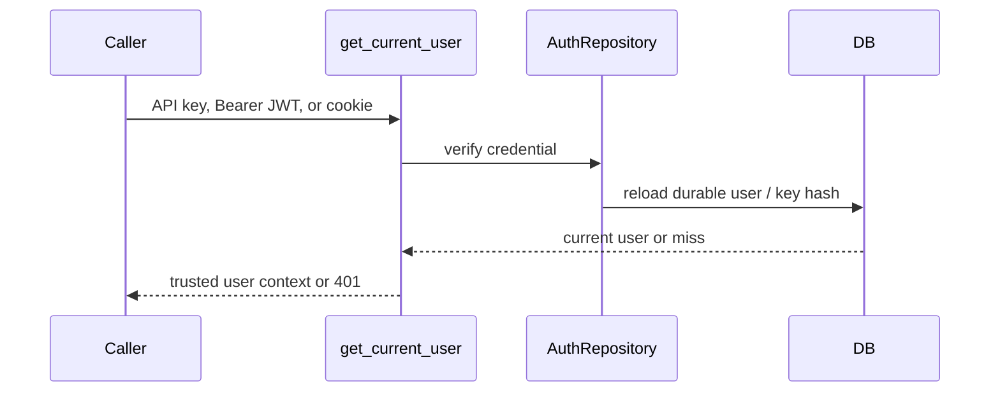

# Authentication

> **Documentation status:** Draft
> **Concept status:** `implemented`
> **Status boundary:** Persistent local users authenticate with scrypt password hashes and HS256 JWT/cookie or hashed API keys. No external IdP, automated signing-key rotation, or production certification is claimed.
> **Used by:** [Module 13](../modules/13-auth-ui-observability/README.md)

## Identity boundary

Authentication answers “who presented a valid current credential?” It does not answer whether that user owns a run or may execute a side effect; those are [authorization and ownership](authorization-ownership.md) and [policy](policy-engine.md).

Passwords use scrypt hashes. API keys are hashed before storage. JWT verification requires the exact configured algorithm, expiry, and subject, then the user is reloaded rather than trusting identity from request fields alone. Cookie-authenticated mutations additionally cross the CSRF boundary.

## Source and tests

- [`AuthRepository`](../../../backend/app/security/auth.py) implements password, API-key, and JWT operations.
- [`get_current_user`](../../../backend/app/security/auth.py) is the canonical protected-route dependency.
- [`test_register_login_and_api_key_survive_app_rebuild`](../../../backend/tests/integration/test_auth_persistence.py) proves persistence across app reconstruction.
- [`test_expired_token_is_rejected`](../../../backend/tests/integration/test_auth_persistence.py) checks expiry.
- [`test_database_stores_only_api_key_hash`](../../../backend/tests/integration/test_auth_persistence.py) checks at-rest API-key handling.
- Status/evidence: [implementation evidence](../../IMPLEMENTATION-EVIDENCE.md).

## Risks and interview answer

HS256 concentrates trust in one signing secret. There is no external IdP, refresh/revocation system, automated rotation, or independent audit. Logs must never contain credentials.

“Archon centralizes credential resolution in `security/auth.py:get_current_user`, then reloads the durable user. That establishes identity for tested local paths; ownership and action policy remain separate checks.”
