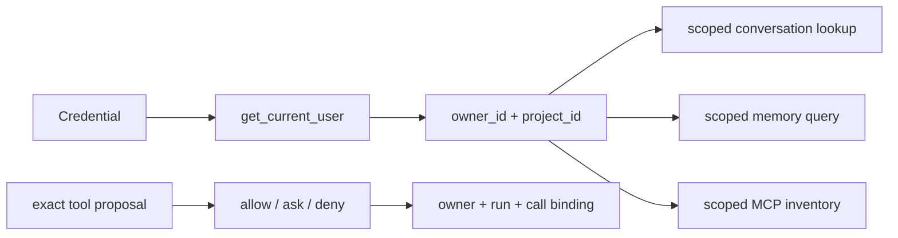
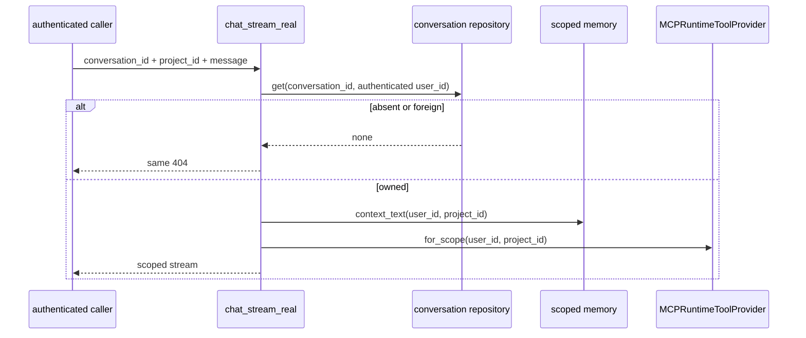

# Authorization and ownership

> **Documentation status:** Draft
> **Concept status:** `implemented`
> **Status boundary:** Tested routes bind resource access to authenticated owner/project scope; this does not prove every future query or side effect is correctly scoped.
> **Used by:** [Module 13](../modules/13-auth-ui-observability/README.md)

## Three different decisions

1. [Authentication](authentication.md) resolves a credential to a server-trusted user.
2. Ownership includes that user and, where applicable, project in repository lookups.
3. [Policy](policy-engine.md) decides whether a proposed tool action is allowed, denied, or requires approval.

These decisions answer different questions.
Authentication asks “who are you?”
Ownership asks “is this resource in your scope?”
Policy asks “may this particular action execute now?”
A visible button, a caller-supplied UUID, or a model request answers none of them.

## Ownership in the chat path

`chat_stream_real` receives `user` from FastAPI's `Depends(get_current_user)`.
The route does not accept a user ID in `StreamRequest` as authority.
For an existing conversation, `memory.get(conv_id, user["user_id"])` must find the owner-scoped record.
A foreign conversation ID and an absent conversation ID both produce `404 Conversation not found`.
That avoids confirming that another user's object exists.

The route creates `RunContext` with the authenticated user and conversation.
It then adds the requested `project_id` to that trusted context.
The same user/project scope selects persistent memory through `scoped_memory`.
The same scope is passed to `MCPRuntimeToolProvider.for_scope`.
Native and MCP tools are then built around the request's trusted `RunContext`.
Scope propagation matters because checking only the first query leaves later services exposed.

## Scoped lookup view

This is not an authentication diagram: it starts after identity resolution and follows resource scope.
The project ID still requires consistent repository enforcement; attaching it to context is not sufficient by itself.
Every repository method must put trusted scope in its database predicate.

## Approval ownership

Approval is narrower than ordinary resource ownership.
`approve_tool_call` takes an authenticated user, a path `tool_call_id`, and a body `run_id` plus decision.
It calls `ApprovalBroker.decide_for_owner` with authenticated `user_id`, exact run ID, and exact tool-call ID.
The pending decision also binds tool identity and argument hash in the policy workflow.
A decision is consumed once, so replay does not grant a second execution.
A miss returns a uniform 404 instead of disclosing another owner's pending call.
Approval does not mean the user owns every resource the tool might name; the tool and repository must still enforce scope.

## Exact implementation landmarks

- [`get_current_user`](../../../backend/app/security/auth.py) establishes trusted identity before ownership checks.
- [`chat_stream_real`](../../../backend/app/routes/stream.py) checks conversation ownership and propagates user/project scope.
- [`approve_tool_call`](../../../backend/app/routes/stream.py) submits an owner-bound approval decision.
- [`RunContext.create`](../../../backend/app/runtime/factory.py) constructs trusted run identity.
- [`MCPRuntimeToolProvider.for_scope`](../../../backend/app/mcp/runtime.py) selects only owner/project MCP records.
- [`MCPRepository.get`](../../../backend/app/mcp/repository.py) performs a scoped server lookup.
- [`RunRepository.get`](../../../backend/app/services/run_ledger.py) includes user identity when reading a run.
- [`RunRepository.list_children`](../../../backend/app/services/run_ledger.py) lists direct children under owner scope.

## Tests and evidence

- [`test_cross_user_conversation_ids_are_indistinguishable_from_missing`](../../../backend/tests/security/test_conversation_ownership.py) checks object isolation and non-disclosure.
- [`test_list_export_and_delete_are_bound_to_authenticated_owner_and_requested_project`](../../../backend/tests/integration/test_memory_api_scoping.py) checks multiple memory operations and both scope dimensions.
- [`test_approval_endpoint_enforces_owner_and_consumes_decision_once`](../../../backend/tests/integration/test_live_policy_wiring.py) checks approval ownership and one-time consumption.
- [`test_scope_filter_risks_disable_toctou_and_schema_rejection`](../../../backend/tests/integration/test_mcp_runtime.py) checks MCP scope filtering and stale-state rejection.
- [`test_child_requires_exact_parent_project_and_creates_nothing_on_rejection`](../../../backend/tests/unit/test_run_lineage.py) checks lineage owner/project scope.
- The revision-scoped evidence matrix is [implementation evidence](../../IMPLEMENTATION-EVIDENCE.md).

Tests cover named paths, not all future endpoints.
A new unscoped repository helper can reintroduce insecure direct object reference even if the UI hides the object.

## Security and failure analysis

Never use `body.user_id`, query-string owner IDs, model text, or browser state as trusted ownership facts.
Do not fetch by object ID and check the owner only after returning or mutating data.
Prefer a single query whose predicate contains object ID and trusted scope.
Return the same external miss for absent and foreign objects unless a product requirement has been threat-modeled otherwise.
Do not mistake project membership for object ownership unless the data model defines that relationship.
Do not mistake administrator status for automatic policy approval.
Avoid “check then act” gaps: revalidate mutable policy and tool binding at execution time.
Bulk list, export, delete, fork, and child-list routes need the same scope discipline as single-object reads.

## Observability

Log a safe route name, operation, correlation ID, decision category, and internal resource type.
Use an internal denial reason for operators while keeping foreign-versus-missing responses indistinguishable to callers.
Count scoped misses and policy denials separately; they represent different controls.
Trace user/project identifiers only under the system's redaction and retention rules.
Audit approval create, decide, consume, expire, and cancel transitions without raw tool arguments.
A successful 200 metric cannot prove that the underlying query contained every needed scope field.
Code review and tests provide that evidence.

## Lab versus production

The lab demonstrates owner and project predicates on concrete tested routes.
It does not implement a general relationship-based authorization service or prove organization-wide tenancy rules.
Production systems may need roles, groups, organization membership, delegated administration, row-level security, or a dedicated policy decision point.
Database row-level security can add defense in depth but still requires correct session identity and migration discipline.
A centralized authorization service improves consistency but adds availability, caching, and policy-version concerns.
The simplest safe lab rule remains useful: derive identity on the server and scope every operation at its data boundary.

## Alternatives and trade-offs

Role-based access control is compact but can become too coarse for per-object ownership.
Attribute-based access control handles richer context but is harder to inspect and test.
Relationship-based access control models shared resources well but adds graph semantics and operational machinery.
Capability tokens can carry narrow rights but require careful audience, expiry, replay, and delegation rules.
Archon's tested owner/project predicates are intentionally direct; policy handles action risk separately.

## Exercise: audit a resource path

1. Start at [`chat_stream_real`](../../../backend/app/routes/stream.py).
2. Mark every value originating from the authenticated dependency.
3. Follow `conversation_id` to its repository lookup and confirm user scope is in the call.
4. Follow `project_id` into scoped memory and MCP selection.
5. Run `pytest backend/tests/security/test_conversation_ownership.py backend/tests/integration/test_memory_api_scoping.py -q`.
6. Add a review note for any new list, export, delete, or approval operation that lacks an owner/project predicate.

Expected reasoning: an untrusted object ID is safe only when resolved inside a query constrained by trusted scope.

## 30-second answer

“Archon separates identity, data scope, and action policy. `get_current_user` supplies server-resolved identity; routes and repositories include owner and project in resource operations; policy and exact one-time approval govern side effects. Foreign objects look missing on tested paths. That is route-specific evidence, not a claim that every future query is automatically safe.”

## Self-check

1. **Does authentication grant access to every object?** No; ownership is checked separately.
2. **Where should owner scope be enforced?** In the repository query or mutation at the data boundary.
3. **Why return the same 404 for foreign and absent IDs?** To avoid leaking another owner's object existence.
4. **Is `project_id` from a request automatically trusted authority?** No; repositories must validate it together with authenticated ownership and product rules.
5. **What binds an approval?** Owner, run, tool call, tool identity, argument hash, and a one-time decision lifecycle.
6. **Can UI visibility enforce authorization?** No; the server must enforce it.
7. **Why revalidate before a tool call?** Mutable enablement, schema, risk, or profile state can change after selection.
8. **What must happen for every new route?** A fresh scope review and tests for foreign-resource behavior.

## Related concepts

- [Authentication](authentication.md)
- [Policy engine](policy-engine.md)
- [Durable approvals](durable-approvals.md)
- [Parent-child lineage](parent-child-lineage.md)
- [MCP](mcp.md)
