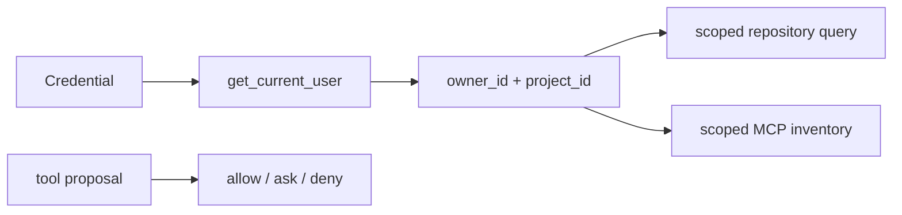

# Authorization and ownership

> **Documentation status:** Draft
> **Concept status:** `implemented`
> **Status boundary:** Tested routes bind resource access to authenticated owner/project scope; this does not prove every future query or side effect is correctly scoped.
> **Used by:** [Module 13](../modules/13-auth-ui-observability/README.md)

## Three different decisions

1. [Authentication](authentication.md) resolves a credential to a trusted user.
2. Ownership includes that user and project in repository lookups; a foreign ID should look missing.
3. [Policy](policy-engine.md) decides whether a proposed tool action is allowed, denied, or needs approval.

Conflating these lets UI visibility or caller-supplied IDs become authority.

## Request behavior

`chat_stream_real` obtains `user` from the FastAPI dependency, verifies an existing conversation under that owner, builds `RunContext` with user/project, and uses the same scope for memory and MCP tools. Cross-owner misses are intentionally indistinguishable from absent resources. Approval decisions bind owner, run, call, tool, and argument hash.

## Source and tests

- [`get_current_user`](../../../backend/app/security/auth.py) establishes trusted identity.
- [`chat_stream_real`](../../../backend/app/routes/stream.py) propagates owner/project scope.
- [`test_cross_user_conversation_ids_are_indistinguishable_from_missing`](../../../backend/tests/security/test_conversation_ownership.py) checks object isolation.
- [`test_list_export_and_delete_are_bound_to_authenticated_owner_and_requested_project`](../../../backend/tests/integration/test_memory_api_scoping.py) checks memory scope.
- [`test_approval_endpoint_enforces_owner_and_consumes_decision_once`](../../../backend/tests/integration/test_live_policy_wiring.py) checks decision ownership.
- Evidence matrix: [implementation evidence](../../IMPLEMENTATION-EVIDENCE.md).

## Interview answer

“Authentication gives me a server-resolved user; ownership puts that identity into each data query; policy governs actions. The tested paths fail closed and hide foreign resources, but every new query and side effect still requires scope review.”
