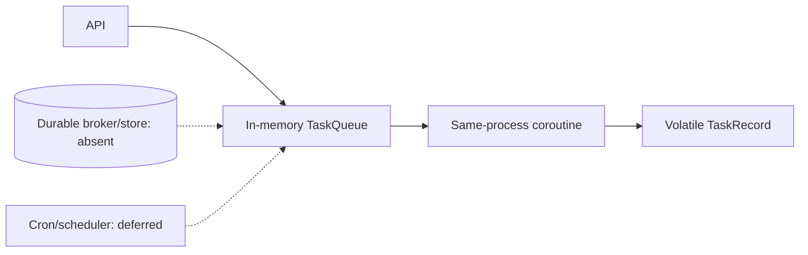
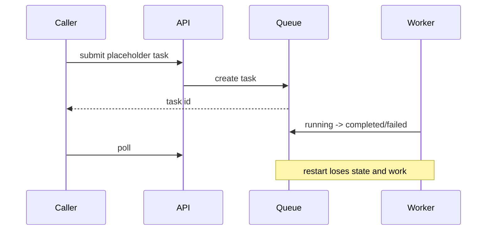

# Background jobs and scheduling

> **Implementation status:** `partial`
> **Status boundary:** An authenticated, rate-limited in-process task lifecycle exists, but the public submit route runs placeholder work; records vanish on restart, are not owner-scoped, and scheduled automation is deliberately deferred.
> **Reviewed revision:** `c115d62`
> **Used by module:** [Module 10-resilience](../modules/10-resilience/README.md)
> **Catalog ID:** `background-jobs-scheduling`

## Beginner explanation

A background job continues outside the request that created it. Scheduling decides when a job should start. Reliable systems persist jobs, claim them idempotently, retry safely, and enforce the creator’s policy at execution time. `asyncio.create_task` alone is not a durable queue.

## Problem and mental model

Treat the boundary as a contract with explicit inputs, outputs, state, failure behavior, and evidence. The important question is not whether a similarly named class or file exists, but whether the behavior is wired into a real path and whether a test or observation proves it.

## Architecture and components

## Startup and request sequence

## Archon implementation and source walkthrough

At revision `c115d62`, the mapped symbols implement the bounded behavior below. No ownership in records, durable broker, leases, retry/idempotency policy, restart recovery, real agent payload, or scheduler.

### Source symbols

| Source symbol | Role and boundary |
|---|---|
| [`backend/app/services/task_queue.py:TaskQueue`](../../../backend/app/services/task_queue.py) | Implements volatile submit/status/list/cancel lifecycle. |
| [`backend/app/routes/tasks.py:submit_task`](../../../backend/app/routes/tasks.py) | Authenticated route submits only simulated placeholder work. |

### Tests

| Test | Contract proved and limit |
|---|---|
| [`backend/tests/unit/test_streaming_and_tasks.py::TestTaskQueue`](../../../backend/tests/unit/test_streaming_and_tasks.py) | Proves in-process completion, failure, listing, and cancellation. |

### Evidence boundary

Current implementation dimensions are centralized in [Implementation Evidence](../../IMPLEMENTATION-EVIDENCE.md). Source/tests below are repository evidence; they are not public-deployment or production-certification evidence.

## Try it: bounded study exercise

From the repository root, inspect the mapped source and test, then run the named focused test with the project test environment if available. Confirm both the passing contract and this gap: No ownership in records, durable broker, leases, retry/idempotency policy, restart recovery, real agent payload, or scheduler.

**Done criteria:** identify the trust boundary, one proved behavior, and one unproved behavior without changing repository state.

## Risks, failures, and trade-offs

| Topic | Assessment |
|---|---|
| Principal risk | Tasks leak across users through global listing and disappear on process failure. |
| Current gap/failure | No ownership in records, durable broker, leases, retry/idempotency policy, restart recovery, real agent payload, or scheduler. |
| Trade-off | In-process tasks are educational and low overhead; durable queues add operational dependencies but provide recovery and scale. |
| Evidence hygiene | Do not log secrets or hidden chain-of-thought; record revision, environment, command, and only redacted outcomes. |

## Lab vs production

The status remains **partial** at `c115d62`. An authenticated, rate-limited in-process task lifecycle exists, but the public submit route runs placeholder work; records vanish on restart, are not owner-scoped, and scheduled automation is deliberately deferred. Unit tests, manifests, or local observations do not prove external-provider parity, sustained load, public deployment, legal compliance, or a production SLO.

## Interview answer

> A background job continues outside the request that created it. Scheduling decides when a job should start. Reliable systems persist jobs, claim them idempotently, retry safely, and enforce the creator’s policy at execution time. `asyncio.create_task` alone is not a durable queue. In Archon the honest status is **partial**: An authenticated, rate-limited in-process task lifecycle exists, but the public submit route runs placeholder work; records vanish on restart, are not owner-scoped, and scheduled automation is deliberately deferred.

## Self-check

1. What problem does this concept solve, and what nearby concept is it not?
2. Trace the diagram’s trust boundary and failure path.
3. Which mapped symbol/test proves current behavior, or why are the lists empty?
4. What exact gap prevents a stronger status?
5. Which risk would you test first before production use?

Answer guide

A good answer names the contract in the beginner explanation, follows the sequence, cites the exact table entry (or the explicit absence), repeats the status boundary, and chooses a risk from the table rather than claiming unrecorded behavior.

## Related concepts and modules

- **Module:** [Module 10-resilience](../modules/10-resilience/README.md)
- **Course-day map:** [AIAMastery Days 1–30 coverage](../course-concept-coverage.md)
- **Evidence:** [Implementation Evidence](../../IMPLEMENTATION-EVIDENCE.md)
- **Historical context only:** [Feature and Course Audit v2](../../FEATURE-AND-COURSE-AUDIT-V2.md)
