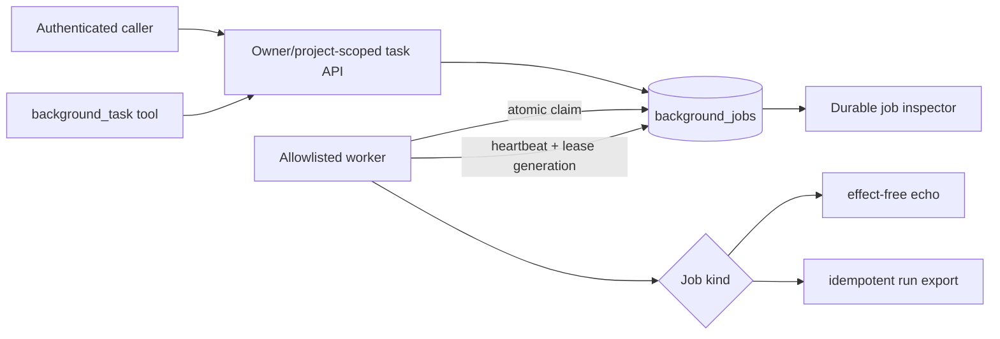
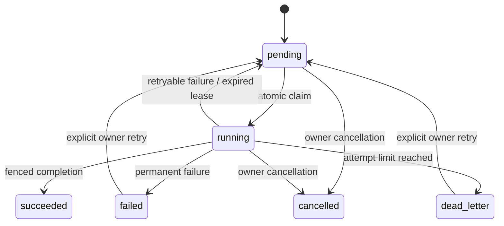

# Background jobs and scheduling

> **Implementation status:** `implemented` for the verified local target
> **Status boundary:** Durable SQL-backed jobs are owner/project scoped, restart-safe, allowlisted, retry-bounded, lease-fenced, observable, and exposed through authenticated APIs and UI. Execution is at-least-once, not exactly-once.
> **Reviewed candidate:** S8.6 combined candidate
> **Used by module:** [Module 10-resilience](../modules/10-resilience/README.md)
> **Catalog ID:** `background-jobs-scheduling`

## Beginner explanation

A background job continues after the HTTP request that created it. A reliable queue must persist the job, let only one worker claim a particular lease, recover abandoned work, limit retries, and prevent stale workers from committing results.

`asyncio.create_task()` alone is not a durable queue: process restart loses both work and status.

## Architecture

## State machine

Each claim increments two values:

- `attempts`, which implements bounded retry policy and may reset after explicit manual retry;
- `lease_generation`, which is monotonic and never resets.

Worker heartbeat, success, and failure updates bind `job_id + worker_id + attempts + lease_generation + unexpired lease`. The monotonic generation prevents an ABA collision when the same worker ID later reclaims a manually retried job.

## Implementation map

| Source | Responsibility |
|---|---|
| [`backend/app/services/task_queue.py:DurableJobQueue`](../../../backend/app/services/task_queue.py) | Create, list, project-scoped lookup, atomic claim, heartbeat, recovery, retry, cancellation, and fenced completion. |
| [`backend/app/workers/jobs.py:JobWorker`](../../../backend/app/workers/jobs.py) | Allowlisted dispatch, heartbeat loop, hard handler deadline, safe failure metadata, and restart-safe acknowledgement. |
| [`backend/app/routes/tasks.py`](../../../backend/app/routes/tasks.py) | Authenticated and rate-limited create/list/get/cancel/retry APIs. Individual operations require project scope. |
| [`backend/alembic/versions/20260828_13_durable_jobs_and_nonces.py`](../../../backend/alembic/versions/20260828_13_durable_jobs_and_nonces.py) | Durable job/lease constraints and delegation nonce receipts. |
| [`frontend/src/lib/components/JobInspector.svelte`](../../../frontend/src/lib/components/JobInspector.svelte) | Owner-visible lifecycle, attempts, safe result metadata, cancellation, and retry controls. |

## Runtime contract

- Job kinds are closed to `echo` and `run_export` in this slice.
- `run_export` verifies owner/project/run scope and relies on the export repository's content idempotency.
- Payloads are bounded JSON. Callables, unsupported objects, excessive depth/size, PII, and secret-like values are rejected.
- Persisted result metadata passes disclosure redaction.
- Idempotency keys are owner/project scoped. Reusing a key with a different kind, payload, or attempt policy is rejected.
- Atomic SQL claim supports SQLite acceptance and PostgreSQL's conditional-update semantics.
- Worker liveness and safe last-error state participate in `/readyz`.

## Tests and observed evidence

| Test | Contract exercised |
|---|---|
| [`backend/tests/integration/test_durable_jobs.py`](../../../backend/tests/integration/test_durable_jobs.py) | Restart persistence, concurrent create/claim, owner/project isolation, lease recovery, monotonic fencing, retries, dead-letter, cancellation, hard timeout, redaction, API access, and real `run_export` execution. |
| [`backend/tests/security/test_delegation_envelope.py`](../../../backend/tests/security/test_delegation_envelope.py) | Signature tamper, freshness, scope, replay, key versions, URL-safe nonces, and receipt pruning. |
| [`frontend/src/lib/jobs.test.ts`](../../../frontend/src/lib/jobs.test.ts) | Typed project-scoped API calls and safe errors. |
| [`frontend/src/lib/components/JobInspector.test.ts`](../../../frontend/src/lib/components/JobInspector.test.ts) | Lifecycle/result rendering without raw payload disclosure and retry controls. |

The integrated Mac candidate passed the full backend suite, Svelte diagnostics, frontend unit tests, production build, and browser suite. See [Implementation Evidence](../../IMPLEMENTATION-EVIDENCE.md) for exact counts and revision.

## Limits and failure semantics

- Execution is **at-least-once**, not exactly-once. A worker may execute a job again after an indeterminate crash or lost acknowledgement.
- An in-process Python coroutine that suppresses cancellation cannot be forcibly terminated. Therefore production job kinds in this slice are limited to effect-free or database-idempotent handlers. Non-idempotent external-effect jobs are prohibited.
- Hard process termination and stronger workload isolation belong to the S8.7 sandbox runner.
- SQLite validates local semantics. Live PostgreSQL multi-worker contention and multi-host operation remain unobserved.
- Scheduling by wall-clock/cron is outside this slice; jobs support immediate availability and retry backoff.
- Startup failure cleanup after partially initialized application resources remains a hardening item; normal shutdown cancels and awaits the worker before closing stores.

## Interview answer

> Archon replaced its volatile task placeholder with a SQL-backed queue. Claims are conditional and leased; heartbeats retain ownership; a monotonic lease generation prevents stale-worker ABA commits even after manual retry resets the attempt counter. Jobs are owner/project scoped, payloads reject secrets, results are redacted, and retries terminate in dead-letter. The honest semantic is at-least-once. Because an in-process coroutine cannot be forcibly killed, only effect-free or repository-idempotent handlers are enabled until the isolated S8.7 runner provides a process boundary.

## Self-check

1. Why are `attempts` and `lease_generation` separate?
2. Why must get/cancel/retry include both owner and project scope?
3. What happens when a worker dies after performing work but before acknowledging success?
4. Why is `run_export` allowed while arbitrary external-effect jobs are prohibited?
5. What additional guarantee does the S8.7 process boundary provide?
