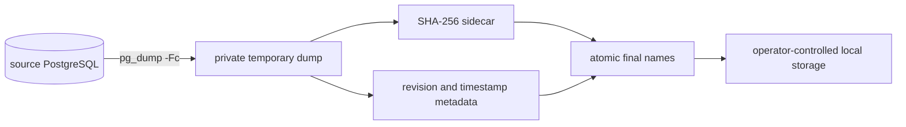
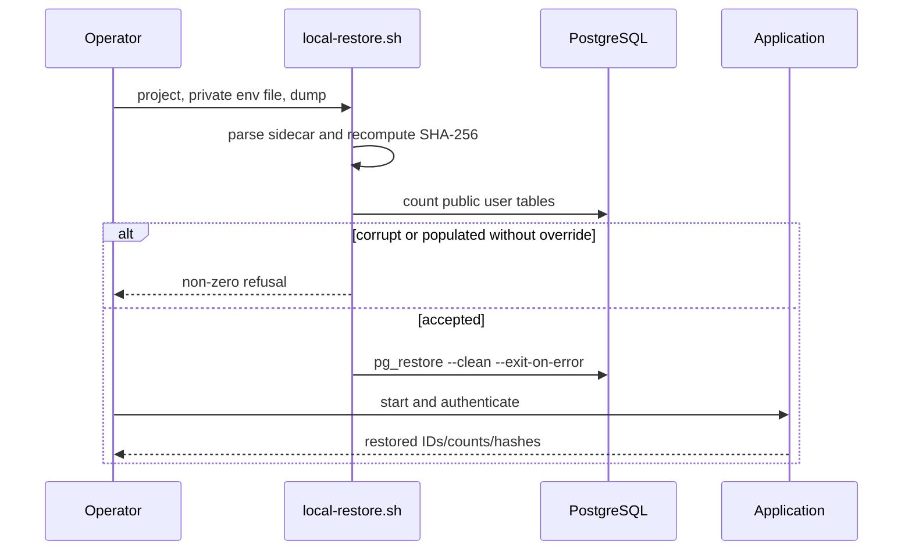

# Backup and restore

> **Documentation status:** Draft
> **Concept status:** `implemented`
> **Status boundary:** A checksummed PostgreSQL custom dump and a clean-target restore were exercised locally; scheduling, off-site encrypted storage, retention, PITR, and cloud failover are absent.
> **Used by:** [Module 14](../modules/14-local-operations/README.md)

## Beginner explanation

A backup is a protected copy of durable data.
A restore is the act of rebuilding usable data from that copy.
Creating a file is therefore only half of the job: the copy is credible only after a restore can read it and the application can use the recovered records.
For Archon, PostgreSQL is the durable authority covered by this procedure.
Redis carries live rate-limit state and is intentionally not part of the durable restore.
The same encryption master key must remain available after recovery or restored encrypted memory cannot be decrypted.
This procedure is not continuous replication, point-in-time recovery, or automatic failover.

## Vocabulary and invariants

| Term | Plain-English meaning |
|---|---|
| custom dump | PostgreSQL archive produced by `pg_dump -Fc` and consumed by `pg_restore` |
| checksum | SHA-256 digest used to detect accidental changes to the dump |
| clean target | Database with no Archon user tables before restore |
| snapshot boundary | Time represented by the dump; later writes are outside it |
| recovery verification | Checks that restored records and application access are useful |

Important invariants are simple.
The script must not overwrite an existing artifact silently.
The environment file and artifacts must not be group- or world-readable.
Restore must verify the dump digest before changing the target.
A populated target must be refused unless the operator explicitly sets `ALLOW_REPLACE=1`.
A checksum detects corruption but does not prove who created the backup.

## Architecture and trust boundaries



The scripts run outside the authenticated Core API.
They are operational programs with direct Docker and database authority.
They do not create a `Core.jobs` object, a Run Ledger run, or an agent metric.
The host, Docker daemon, environment file, destination directory, and encryption key are trusted operator boundaries.



## Lifecycle and implementation

[`scripts/local-backup.sh`](../../../scripts/local-backup.sh) validates three arguments and refuses existing dump, checksum, or metadata paths.
It checks the env-file mode, creates temporary files with `mktemp`, applies mode `0600`, and installs cleanup traps.
It reads `alembic_version`, runs `pg_dump -Fc --no-owner --no-acl`, and refuses an empty dump.
It computes SHA-256 in bounded blocks and writes `format_version`, database, format, revision, timestamp, and digest metadata.
Only completed temporary files are moved to final names.

[`scripts/local-restore.sh`](../../../scripts/local-restore.sh) requires a readable dump and sidecar.
It accepts only a 64-hex-character digest and recomputes the dump checksum.
It counts public tables other than `alembic_version` before restore.
It refuses a non-empty target unless `ALLOW_REPLACE=1` is explicitly present.
It invokes `pg_restore --clean --if-exists --no-owner --no-acl --exit-on-error`.
The script reports completion only after `pg_restore` exits successfully.

[`scripts/local-dr-smoke.sh`](../../../scripts/local-dr-smoke.sh) supplies the recovery proof.
It creates isolated source and destination Compose projects and ephemeral secrets.
It seeds an authenticated user, conversation, run events, document chunks, and one approved terminal approval.
It fingerprints document count, chunk count and hashes, approval status and argument hash, and runtime-event count.
It destroys the source volume, restores a fresh destination, waits for `/readyz`, authenticates again, and compares exact evidence.
Cleanup removes projects, volumes, env file, dump, and sidecars unless `KEEP=1` is deliberately set.

## Exact source, tests, and evidence

| Source or test | Exact contract | Important limit |
|---|---|---|
| [`local-backup.sh`](../../../scripts/local-backup.sh) | private temporary files, no overwrite, custom dump, digest and metadata | local PostgreSQL through Compose |
| [`local-restore.sh`](../../../scripts/local-restore.sh) | checksum verification and clean-target guard | explicit override is destructive |
| [`local-dr-smoke.sh`](../../../scripts/local-dr-smoke.sh) | destroy, restore, authenticate, compare selected durable evidence | bounded synthetic dataset |
| [`test_backup_is_private_atomic_and_refuses_overwrite`](../../../backend/tests/unit/test_local_dr.py) | static guard contract | does not execute a real dump |
| [`test_restore_verifies_checksum_and_guards_clean_target`](../../../backend/tests/unit/test_local_dr.py) | static restore safety contract | does not prove media durability |
| [`test_dr_smoke_covers_required_persisted_categories_without_fixed_secrets`](../../../backend/tests/unit/test_local_dr.py) | drill structure and secret handling | does not measure production recovery |

The canonical interpretation is [Implementation Evidence](../../IMPLEMENTATION-EVIDENCE.md).
The machine-readable observation is [`docs/evidence/local-dr-report.json`](../../evidence/local-dr-report.json).
Read its revision, environment, snapshot, result, counts, digest, and timing fields together.
Do not copy a measured timing into an objective or guarantee.

## Try it: bounded exercise

### Goal

Inspect the safety contracts without destroying a local database.

### Setup and steps

Run from the repository root with backend development dependencies installed.
The test reads scripts; it does not execute the destructive DR flow.
Never substitute a real secret into test fixtures.

```bash
cd backend
uv run pytest -q tests/unit/test_local_dr.py
cd ..
python3 -m json.tool docs/evidence/local-dr-report.json >/dev/null
```

### Done criteria

- [ ] The focused tests pass or the real blocker is recorded.
- [ ] You can point to the overwrite refusal and `0600` controls.
- [ ] You can explain why matching SHA-256 is integrity, not authenticity.
- [ ] You can name every record category compared by the drill.
- [ ] No Compose project, volume, secret file, or dump was created by this exercise.

## Security and failure modes

| Failure or threat | Control and visible behavior | Residual risk |
|---|---|---|
| loose env-file permissions | script exits before database access | compromised host can still read process data |
| existing output path | backup exits with refusal | operator must manage retention separately |
| interrupted dump | traps delete temporary files; final move never occurs | filesystem or disk failure still needs monitoring |
| corrupted dump | checksum mismatch exits before restore | SHA-256 is not a signature |
| wrong populated target | restore refuses without `ALLOW_REPLACE=1` | override can intentionally destroy data |
| schema or restore error | `--exit-on-error` returns non-zero | partial database effects require inspection |
| missing encryption key | application cannot read encrypted memory | key backup and rotation are not implemented here |
| stolen backup | mode `0600` limits local readers | off-site encryption and access audit are deferred |
| concurrent writes | dump captures its PostgreSQL snapshot | writes after the boundary are not recovered |
| insufficient disk | dump or restore fails | no capacity alert is supplied by these scripts |

## Observability and evidence path

```text
operator command → private dump + sidecars → checksum gate → clean restore → readiness/authentication → exact comparison → local report
```

Script exit status and stage-specific stderr are immediate evidence.
Metadata records creation time, schema revision, format, and digest.
The DR report records selected restored counts, identifiers, schema revision, and measured observations.
These artifacts live outside runtime metrics and authenticated application jobs.
Store them with restricted access because identifiers and topology details can still be sensitive.
A production process would add signed manifests, backup inventory, alerting, restore drill history, and independent review.

## Alternatives and trade-offs

| Alternative | Benefit | Cost or boundary |
|---|---|---|
| plain SQL dump | human-readable and portable | slower, larger, less flexible restore |
| filesystem copy | potentially fast | consistency and PostgreSQL-version constraints |
| WAL archiving/PITR | finer recovery points | more storage, monitoring, and operational complexity |
| managed snapshots | provider automation | provider coupling and restore validation still required |
| logical replication | low recovery lag | not a substitute for historical backup |

The custom dump is suitable for a bounded local drill because it is portable and supports `pg_restore` controls.
It is not a production backup strategy by itself.

## Lab vs production

| Dimension | Demonstrated | Missing or unverified |
|---|---|---|
| creation | one local PostgreSQL custom dump path | schedule, retention, inventory, legal policy |
| integrity | SHA-256 sidecar and comparison | signatures and independent authenticity |
| confidentiality | local mode `0600` | encrypted off-site storage and key operations |
| restore | fresh local Compose target | managed service, large dataset, regional failure |
| verification | auth plus selected exact IDs/counts/hashes | full semantic and load validation |
| recovery | one measured local observation | approved objectives and repeated representative drills |

The concept is `implemented` only for the stated local clean-restore boundary.

## Interview answer

### 30-second answer

> Archon treats recovery, not dump creation, as the proof. Its local scripts create a private PostgreSQL custom dump, revision metadata, and SHA-256 sidecar; restore verifies integrity and refuses a populated target by default. A destructive local drill then authenticates and compares exact durable evidence. That supports a bounded local observation, not scheduling, off-site encryption, PITR, or guaranteed recovery objectives.

## Self-check

1. Why is a created dump not yet a proven backup?
2. Which store is authoritative, and why is Redis omitted?
3. What happens before `pg_restore` changes the target?
4. What does `ALLOW_REPLACE=1` mean?
5. Which exact test checks backup privacy and overwrite behavior?
6. Why is the checksum insufficient against a malicious replacement?
7. What production capabilities remain absent?

<details>
<summary>Answer guide</summary>

1. Recovery is unproved until the dump restores and useful records are verified.
2. PostgreSQL holds durable authority; Redis rate-limit state is disposable operational state.
3. The env mode and sidecar are validated, SHA-256 is recomputed, and the target is inspected for user tables.
4. It is an explicit destructive override allowing replacement of a populated target.
5. `test_backup_is_private_atomic_and_refuses_overwrite` in `backend/tests/unit/test_local_dr.py`.
6. An attacker able to replace both dump and sidecar can create a matching digest; signatures require a trusted key.
7. Scheduling, retention, encrypted off-site copies, key operations, PITR, scale drills, and failover.

</details>

## Related concepts

- [Docker and Compose](docker-compose.md)
- [Database migrations](migrations.md)
- [Recovery time and recovery point](rto-rpo.md)
- [Liveness and readiness](liveness-readiness.md)
- [Module 14](../modules/14-local-operations/README.md)
