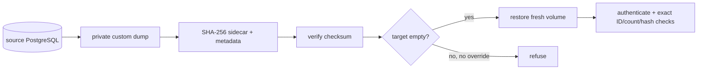

# Backup and restore

> **Documentation status:** Draft
> **Concept status:** `implemented`
> **Status boundary:** A checksummed PostgreSQL custom dump and clean-target restore were exercised locally. Scheduling, off-site encrypted storage, retention, PITR, and cloud failover are absent.
> **Used by:** [Module 14](../modules/14-local-operations/README.md)

## Recovery, not file creation

A backup is credible only after a restore verifies useful state. PostgreSQL is the durable authority; Redis rate-limit state is intentionally not recovered. Encryption-key continuity is required to read encrypted memory after restore.

The backup script refuses overwrite and uses atomic/private output. Restore validates the checksum and refuses a non-empty target unless an explicit destructive override is supplied. A checksum detects accidental corruption; it is not an authenticity signature.

## Source and tests

- [`scripts/local-backup.sh`](../../../scripts/local-backup.sh) creates the dump, metadata, and checksum.
- [`scripts/local-restore.sh`](../../../scripts/local-restore.sh) checks integrity and target state.
- [`scripts/local-dr-smoke.sh`](../../../scripts/local-dr-smoke.sh) destroys, restores, starts, authenticates, and compares evidence.
- [`test_backup_is_private_atomic_and_refuses_overwrite`](../../../backend/tests/unit/test_local_dr.py) and [`test_restore_verifies_checksum_and_guards_clean_target`](../../../backend/tests/unit/test_local_dr.py) check guards.
- Recorded observation and scope: [implementation evidence](../../IMPLEMENTATION-EVIDENCE.md) and [`local-dr-report.json`](../../evidence/local-dr-report.json).

## Interview answer

“Archon proves a local clean restore, not merely dump creation. Integrity and overwrite guards plus exact post-restore checks reduce risk. It still needs scheduled off-site encrypted copies, retention, key operations, PITR, and repeated load-sized drills.”
