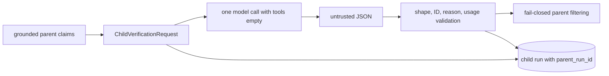
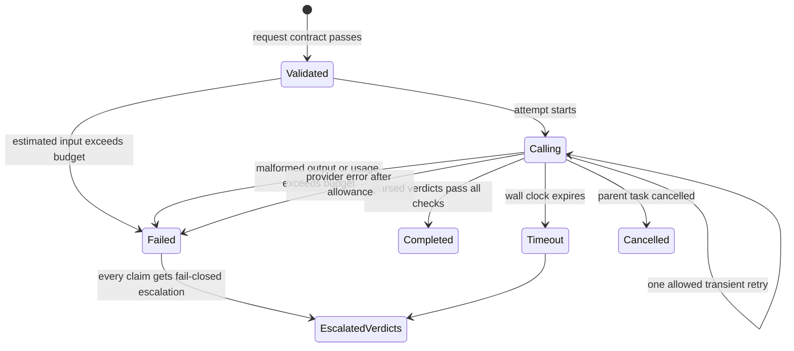

# Bounded delegation

> **Documentation status:** Draft
> **Concept status:** `implemented`
> **Status boundary:** One model-generated evidence review runs inside a deterministic, schema-validated, no-tools boundary. The judgment itself is not deterministic, and this is neither a swarm nor generic self-reflection.
> **Used by:** [Module 11](../modules/11-bounded-delegation/README.md)

## Idea

Delegation is useful only when the child receives less authority than the parent.
Archon delegates one narrow task: review already-formed claims against selected evidence.
The parent sends a sealed packet rather than its whole conversation, runtime context, credentials, or tools.
The child returns structured verdicts; it does not edit storage or invoke another system.
Learn [Run Ledger](run-ledger.md) and [Groundedness](groundedness.md) first.

The key distinction is between two layers:

- The **control envelope** is deterministic code: schema, ID sets, budgets, timeout, retries, `tools=()`, parsing, and parent filtering.
- The **judgment** is generated by a model and can still be wrong, inconsistent, or poorly calibrated.

## What makes the packet bounded

`ChildVerificationRequest` is a frozen, slotted dataclass.
It allows 1 to 32 claims and 1 to 32 evidence slices.
Claim text and evidence quotes are each limited to 1,000 characters.
IDs must match the safe identifier pattern and hashes must be lowercase SHA-256 text.
Claim and evidence IDs must be unique.
Each claim may reference only evidence included in the request.
`tools` must be an empty tuple.
No arbitrary context, prompt history, environment map, secret, or callback field exists.

`VerificationBudget` requires positive bounded input and output tokens.
The hard model bounds are 32,768 input tokens and 8,192 output tokens.
Timeout must be finite and between 0.1 and 60 seconds.
Retries must be exactly zero or one.
These are enforceable limits, not prose suggestions to the model.

## Budget and failure state view

The state labels distinguish child lifecycle from claim verdict status.
A failed child returns `escalate` verdicts; failure never becomes `supported` by default.
Cancellation is durably finalized and then re-raised to preserve task semantics.

## Execution path

`EvidenceVerifierSpecialist.verify` creates the child run before calling the provider.
It appends `DELEGATION_REQUESTED` using safe IDs, hashes, counts, and budget data.
`estimate_input_tokens` performs a pre-call guard.
The provider is called as `complete(messages, tools=(), max_tokens=remaining_output)`.
Provider-reported usage is accumulated across all responses, including a retry.
Only `TransientVerifierError`, `ConnectionError`, and `OSError` use the configured retry allowance.
Malformed output is not retried as if it were a transport blip.
`asyncio.wait_for` enforces the wall-clock budget.

`_parse_response` treats model JSON as untrusted input.
It requires the exact result shape, one verdict per delegated claim, compatible status/reason pairs, finite confidence, and delegated evidence subsets.
Foreign, duplicate, or missing claim IDs fail parsing.
A model cannot create a new claim or cite evidence it was not given.
After return, the parent keeps only results accepted by its conservative integration.

## Exact implementation landmarks

- [`EvidenceSlice`](../../../backend/app/delegation/models.py) defines provenance-bearing bounded quotes.
- [`ClaimInput`](../../../backend/app/delegation/models.py) binds claim text/hash to evidence IDs.
- [`VerificationBudget`](../../../backend/app/delegation/models.py) enforces token, timeout, and retry limits.
- [`ChildVerificationRequest`](../../../backend/app/delegation/models.py) defines the sealed no-tools contract.
- [`ClaimVerdict`](../../../backend/app/delegation/models.py) defines status, reason, confidence, and evidence IDs.
- [`validate_verdict_evidence_subset`](../../../backend/app/delegation/models.py) rejects foreign citations.
- [`EvidenceVerifierSpecialist.verify`](../../../backend/app/delegation/service.py) runs the bounded lifecycle.
- [`_fail_closed`](../../../backend/app/delegation/service.py) converts failures to escalation verdicts.
- [`GroundedDocumentWorkflow._verify_with_child`](../../../backend/app/services/grounded_rag.py) is the parent integration.

## Tests and evidence

- [`test_models_are_frozen_slotted_and_exclude_context_and_secrets`](../../../backend/tests/unit/test_delegation_contract.py) checks authority exclusion.
- [`test_budget_and_request_bounds`](../../../backend/tests/unit/test_delegation_contract.py) checks packet and budget limits.
- [`test_verdict_confidence_enum_and_separate_evidence_subset_validation`](../../../backend/tests/unit/test_delegation_contract.py) checks verdict structure and evidence scope.
- [`test_valid_call_is_isolated_bounded_and_durable`](../../../backend/tests/unit/test_evidence_verifier.py) checks the integrated no-tools call and ledger lifecycle.
- [`test_malformed_and_foreign_evidence_fail_closed`](../../../backend/tests/unit/test_evidence_verifier.py) checks hostile or invalid output.
- [`test_verifier_failure_fails_closed_and_no_evidence_never_delegates`](../../../backend/tests/unit/test_grounded_rag.py) checks parent behavior.
- Revision-scoped claims live in [implementation evidence](../../IMPLEMENTATION-EVIDENCE.md).

Tests prove deterministic controls under fixtures.
They do not prove semantic truth, provider parity, or a consistent quality gain.

## Security and failure analysis

`tools=()` removes tool authority but is not a process sandbox.
The provider still receives claim and quote text, so that packet must be suitable for the configured provider.
Evidence can contain prompt-like text; schema enforcement limits outputs but cannot stop model misreading.
A low confidence value is not a security boundary.
A `supported` verdict is model opinion constrained to known IDs, not cryptographic proof.
Retrying only transient faults avoids silently multiplying cost on malformed content.
Timeout and token limits cap some resource use but do not establish provider-side deletion or isolation.
Lineage enables inspection; it does not prove the child caused an improvement.

## Observability

Persist child ID, parent ID, policy ID, claim/evidence IDs and hashes, counts, attempt count, status, reason codes, token totals, and latency.
Do not persist raw claim text or quotes in delegation lifecycle events.
Compare requested, completed, failed, timeout, and cancelled counts.
Track supported, rejected, and escalated counts separately from child status.
Alert on malformed-response and budget-exceeded changes by model/version.
Measure benefit with versioned fixtures rather than interpreting completion rate as quality.

## Lab versus production

The lab demonstrates one in-process orchestration path and one provider interface.
Production needs provider data-handling review, concurrency limits, cost controls, model/version pinning, retention policy, and incident procedures.
A production rollout should shadow the child first and measure false support and false rejection.
Do not turn on parent filtering merely because the child returns valid JSON.
The deterministic envelope is reusable; quality thresholds must come from representative evaluation data.

## Alternatives and trade-offs

A deterministic-only verifier is cheaper and repeatable but misses semantic nuance.
A human reviewer offers stronger judgment for high-impact cases but adds queue time and cost.
A larger parent prompt avoids another call but gives no authority separation and can dilute attention.
Multiple debating agents increase cost and attack surface; Archon does not claim that design here.
The implemented choice is one narrow child whose failures become escalation.

## Exercise: break the envelope safely

1. Read [`ChildVerificationRequest`](../../../backend/app/delegation/models.py).
2. Try adding a context field, a 33rd claim, or a non-empty tools tuple in a unit fixture.
3. Change a fake provider response to cite a foreign evidence ID.
4. Run `pytest backend/tests/unit/test_delegation_contract.py backend/tests/unit/test_evidence_verifier.py -q`.
5. Confirm each invalid case fails or escalates rather than returning support.
6. Explain which outcome came from deterministic code and which would still depend on the model.

Expected conclusion: code can bound authority and accepted shape, but it cannot make semantic judgment deterministic.

## 30-second answer

“Archon delegates one evidence-review task to one model child. Frozen contracts limit claims, evidence, text, IDs, tokens, time, and retries; the provider gets `tools=()`, and strict parsing rejects foreign or malformed verdicts. Failures escalate and lineage is durable. Those controls are deterministic, but the supported/rejected judgment remains model-generated—this is bounded review, not a swarm or proof of truth.”

## Self-check

1. **What is deterministic?** Request validation, budgets, no-tools enforcement, parsing, and fail-closed filtering.
2. **What is not deterministic?** The model's semantic verdict.
3. **How many retries are possible?** Zero or one, and only configured transient failures consume it.
4. **Can the child cite new evidence?** No; evidence IDs must be a delegated subset.
5. **Does no-tools mean sandboxed?** No; it removes tool invocation from this provider call but is not process isolation.
6. **What happens on malformed output?** The child fails and each claim escalates.
7. **Does lineage prove benefit?** No; benefit needs separate versioned measurement.
8. **Is this a multi-agent swarm?** No; it is one bounded specialist call.

## Related concepts

- [Evidence-only verifier child](verifier-child.md)
- [Parent-child run lineage](parent-child-lineage.md)
- [Groundedness](groundedness.md)
- [Run ledger](run-ledger.md)
- [Evaluation harness](evaluation-harness.md)
