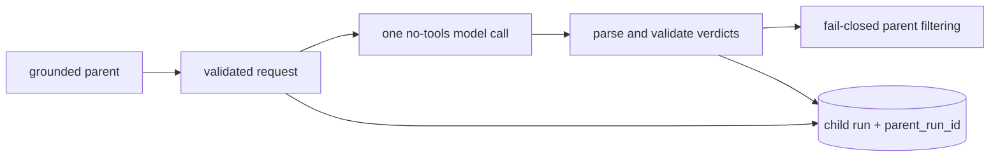

# Bounded delegation

> **Documentation status:** Draft
> **Concept status:** `implemented`
> **Status boundary:** One model-generated evidence review runs inside a deterministic, schema-validated, no-tools boundary. The judgment itself is not deterministic, and this is neither a swarm nor generic self-reflection.
> **Used by:** [Module 11](../modules/11-bounded-delegation/README.md)

## Idea

Delegation is useful only when the child receives less authority than the parent. Archon sends one child a sealed packet of claim IDs, claim text, and selected evidence. `VerificationBudget` limits tokens, wall time, and retries; the provider receives `tools=()`.

Learn [Run Ledger](run-ledger.md) and [Groundedness](groundedness.md) first. Then distinguish the deterministic **control envelope** from the model-generated **verdict** inside it.

## Implemented boundary

The request and result models reject extra fields, unbounded text, duplicate/missing claim IDs, foreign evidence IDs, and inconsistent status/reason pairs. Only configured transient provider errors can consume the tiny retry allowance. Malformed output, timeout, cancellation, or exceeded usage cannot become a supported verdict.

## Source and evidence

- [`ChildVerificationRequest` and `VerificationBudget`](../../../backend/app/delegation/models.py) define the sealed contract.
- [`EvidenceVerifierSpecialist.verify`](../../../backend/app/delegation/service.py) enforces no tools, budgets, strict parsing, and lifecycle recording.
- [`GroundedDocumentWorkflow._verify_with_child`](../../../backend/app/services/grounded_rag.py) is the live parent integration.
- [`test_models_are_frozen_slotted_and_exclude_context_and_secrets`](../../../backend/tests/unit/test_delegation_contract.py) checks authority exclusion.
- [`test_valid_call_is_isolated_bounded_and_durable`](../../../backend/tests/unit/test_evidence_verifier.py) checks the integrated boundary.
- Current evidence dimensions: [implementation evidence](../../IMPLEMENTATION-EVIDENCE.md).

Tests prove deterministic validation and wiring under fixtures. They do not prove that a model's semantic judgment is true, external-provider parity, or production operation.

## Failure reasoning

A no-tools prompt is not a process sandbox. A model can still misread supplied evidence. The parent therefore treats `rejected` and `escalate` conservatively, and accepts `supported` only after structural and evidence-subset checks. Lineage supports inspection; it does not prove quality improvement.

## Interview answer

“Archon delegates one narrow evidence-review task. The review is model-generated, but it executes inside a deterministic schema-validated, no-tools envelope with finite budgets and fail-closed parsing. Child lifecycle and lineage are durable. That bounds authority and creates evidence; it does not make the judgment deterministic or establish a swarm.”
