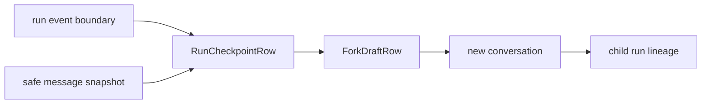

# Checkpoints

**Status:** partial

## Definition
A checkpoint is a stable snapshot at a known boundary that can seed inspection or a branch. It is not automatically an executable resume of external side effects.

## Archon implementation
There are two distinct paths. `backend/app/memory/checkpoints.py::CheckpointManager` deep-copies messages into an in-memory bounded list. The durable fork path is `backend/app/services/run_ledger.py::RunRepository.fork`: it creates/reuses a deterministic `RunCheckpointRow` for owner/run/sequence, stores redacted conversation messages through the event cutoff, then creates a new conversation and `ForkDraftRow`.

## Invariants and limits
The selected sequence must exist and be owner-visible. Checkpoint identity is idempotent for the same source boundary. `workspace_restoration` is `none`; tools, provider calls, network state, unpersisted context, and arbitrary files are not restored. Selected memory IDs are metadata, not demonstrated memory replay.

## Evidence
`backend/tests/integration/test_run_fork_compare.py`, `backend/tests/unit/test_run_lineage.py`, and migration `backend/alembic/versions/20260826_04_run_checkpoints.py`.

## Interview prompt
“Archon checkpoints safe conversation state for branching, not an entire process or workspace.”
