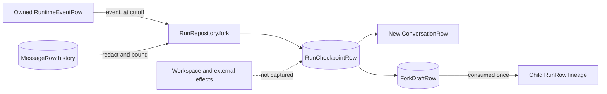

# Checkpoints

> **Implementation status:** `implemented`
> **Boundary:** Archon durably snapshots safe conversation/run state for inspection, replay, and fork. Restoring arbitrary workspace files, process memory, tool state, or external side effects is explicitly outside this server-product checkpoint contract.

## Beginner explanation

A checkpoint names a stable boundary and saves the state that Archon explicitly knows how to persist at that boundary.
Think of it as a photograph of selected application data, not a virtual-machine image.
Archon has two different implementations: a small in-memory teaching utility and the durable checkpoint created by the Run Ledger fork path.
The durable path copies redacted conversation rows through a selected run-event time and records lineage metadata.
It does **not** turn time backward, undo an email, reopen a network connection, or restore arbitrary files.

## Vocabulary and distinctions

| Term | Meaning in Archon | Not the same as |
|---|---|---|
| checkpoint | Selected state captured at a known run-event boundary | Full machine snapshot |
| conversation snapshot | Ordered redacted role/content items | Effective model context |
| fork draft | One-time durable link from checkpoint to a new conversation | A child run itself |
| lineage | `parent_run_id` plus `fork_source_sequence` on a later run | Causal proof |
| restore | Return copied messages in the teaching manager | Re-execute or undo effects |

Conversation rows are durable dialogue, encrypted facts are a separate owner/project store, and effective context is assembled per model call.
A checkpoint may mention selected memory IDs, but the current fork path does not demonstrate that those facts are replayed into a child call.

## Architecture



The checkpoint ID is UUIDv5 over owner, source run, and source sequence.
The database uniqueness boundary is the same tuple, so repeated or concurrent forks reuse one checkpoint while creating distinct target conversations and drafts.

## Durable fork sequence

```mermaid
sequenceDiagram
  participant Caller
  participant Repo as RunRepository
  participant DB
  Caller->>Repo: fork(user_id, run_id, source_sequence)
  Repo->>DB: find owned run and exact event
  Repo->>DB: read owned messages through cutoff
  Repo->>Repo: redact content; build deterministic checkpoint ID
  Repo->>DB: insert checkpoint on conflict do nothing
  Repo->>DB: create conversation, copied messages, fork draft
  Repo-->>Caller: checkpoint ID, target conversation, restoration=none
  Note over Caller,DB: No model, tool, network, or workspace restoration
```

For a nonterminal event, the cutoff is `RuntimeEventRow.event_at`.
For `run_stopped`, the cutoff is `RunRow.completed_at`, allowing the final assistant message persisted before terminal completion to be included.
Messages are ordered by `created_at` and ID; each copied content value is redacted and capped at 10,000 characters.

## Two implementations, two guarantees

`backend/app/memory/checkpoints.py::Checkpoint` deep-copies a caller-provided message list.
`CheckpointManager.save` keeps at most `max_checkpoints_per_conv` entries in process memory and drops the oldest.
`CheckpointManager.restore` returns another deep copy, preventing caller mutation from changing the saved object.
It is lost on restart and is not the durable fork API.

`backend/app/services/run_ledger.py::RunRepository.fork` is database-backed and owner-scoped.
It persists `RunCheckpointRow`, creates a new `ConversationRow`, copies `MessageRow` items, and creates `ForkDraftRow` atomically.
`RunRepository.ensure_run` consumes a matching draft with `DELETE ... RETURNING` and stamps one newly created run with lineage.
A fork can therefore exist before any child run begins.

## Invariants

- The source run must be visible to the authenticated owner.
- The selected sequence must identify an event in that owned run.
- The source conversation must also belong to the owner.
- One owner/run/sequence boundary maps to one durable checkpoint.
- Every fork request creates a fresh target conversation even when it reuses a checkpoint.
- A fork draft is consumed at most once by competing child runs.
- Stored message content passes through `PersistenceRedactor`.
- `workspace_restoration` is explicitly `"none"`.
- `policy_profile` and `selected_memory_ids` are checkpoint metadata, not proof of enforcement or memory hydration.

## Source symbols and evidence

| Symbol | What to inspect |
|---|---|
| `backend/app/memory/checkpoints.py::Checkpoint` | Deep copy, metadata, and in-memory lifetime |
| `backend/app/memory/checkpoints.py::CheckpointManager` | Bounded save/restore/list/delete behavior |
| `backend/app/services/run_ledger.py::RunRepository.fork` | Durable cutoff, redaction, checkpoint, conversation, and draft transaction |
| `backend/app/services/run_ledger.py::RunRepository.ensure_run` | One-time draft consumption and lineage assignment |
| `backend/app/services/db_store.py::RunCheckpointRow` | Durable checkpoint schema |
| `backend/app/services/db_store.py::ForkDraftRow` | Pending fork-to-child handoff |
| `backend/alembic/versions/20260826_04_run_checkpoints.py` | Migration and uniqueness constraints |

Exact tests include `backend/tests/unit/test_remaining.py` for `CheckpointManager` and `backend/tests/integration/test_run_fork_compare.py` for durable behavior.
The latter proves owner scoping, invalid-sequence rejection, restart durability, cutoff semantics, checkpoint reuse under concurrency, and one-winner draft consumption.
`backend/tests/unit/test_run_lineage.py` proves explicit child lineage ownership and idempotency.

## Security and failure modes

| Failure or threat | Behavior/control | Residual concern |
|---|---|---|
| Foreign run ID | Owner-scoped lookup returns no fork | Every future query must retain owner predicates |
| Missing sequence | Stable `ValueError`, mapped to a 404 route response | 404 intentionally hides ownership details |
| PII in copied messages | Redaction before snapshot and copy | Redaction is lossy and cannot promise perfect classification |
| Concurrent duplicate forks | Unique checkpoint plus conflict-safe insert | Distinct target conversations are intentional |
| Concurrent child starts | Draft deletion gives one lineage winner | A losing run can still exist, but without that fork lineage |
| Crash before commit | Transaction rolls back checkpoint/fork unit | External actions are outside this transaction |
| Key/tool/provider state expected | Never captured; response says `none` | Callers must recreate required environment explicitly |

Never advertise “resume from checkpoint” without qualifying exactly which state is resumed.
A safe product label is “branch from stored conversation state.”

## Observability

Useful fields are checkpoint ID, source run ID, source sequence, target conversation ID, owner-safe correlation, copied-message count, and outcome code.
Do not log copied message text, selected fact contents, tool arguments/results, or credentials.
Track fork latency, invalid-boundary count, checkpoint conflict/reuse count, and unconsumed draft age.
An old draft may indicate that a user created a branch but never started a child run; it does not mean restoration failed.
The Run Ledger records later child lineage, but it is evidence of stored control flow rather than semantic truth.

## Trade-offs

Deterministic checkpoint identity gives idempotency and deduplication, but means mutable checkpoint contents would be dangerous; Archon reuses the first persisted snapshot.
Copying conversation rows makes branches understandable, but duplicates storage and preserves only dialogue selected by time.
Event timestamps provide a practical boundary, but conversation writes and run events are separate records; tests define the intended ordering semantics.
Capturing less state reduces secret and side-effect risk, but shifts setup work to the child run.
Full workspace snapshots would improve reproducibility while greatly increasing storage, isolation, malware, and credential-handling risk.

## Lab versus production

The in-memory `CheckpointManager` is appropriate for teaching deep-copy and bounded-retention behavior.
It is not restart-safe, multi-process safe, owner-scoped, or suitable as a disaster-recovery mechanism.
The durable database path has stronger transaction and concurrency evidence on SQLite tests and PostgreSQL-aware SQL.
Production still needs retention policy, migration rehearsal, capacity monitoring, backup/restore testing, and explicit workspace provisioning.
No evidence here establishes cross-region consistency, WORM audit storage, or restoration of external systems.

## Exercise

From the repository root, run the focused contract tests without real credentials:

```bash
cd backend
uv run pytest -q \
  tests/unit/test_remaining.py \
  tests/integration/test_run_fork_compare.py \
  tests/unit/test_run_lineage.py
```

Then inspect `RunRepository.fork` and write down three lists: captured fields, deliberately excluded state, and the exact owner predicates.
Done means you can explain why four concurrent fork calls produce one checkpoint but four target conversations.

## 30-second interview answer

“An Archon checkpoint is a bounded snapshot at an owned Run Ledger event. The durable fork path redacts conversation messages through the event cutoff, idempotently stores one `RunCheckpointRow`, then creates a new conversation and one-time fork draft. The first child run can consume that draft to record parent and source-sequence lineage. It does not restore arbitrary workspace files, process memory, tools, network state, external side effects, or proven memory hydration; `workspace_restoration` is explicitly `none`.”

## Self-check

1. **Does a checkpoint contain the effective model context?** No. It contains selected conversation messages and metadata; effective context is assembled later.
2. **Do `selected_memory_ids` prove facts were loaded?** No. They are currently metadata in this path.
3. **Why use UUIDv5?** To derive stable checkpoint identity for the same owner/run/sequence boundary.
4. **What happens to repeated forks?** They reuse the checkpoint but create distinct conversations and drafts.
5. **Can a fork undo a tool side effect?** No; external effects are neither captured nor reversed.
6. **Why deep-copy in `CheckpointManager`?** To isolate the saved snapshot from later caller mutation.
7. **What proves the cutoff behavior?** `test_fork_snapshot_uses_selected_event_cutoff_and_terminal_completion`.

## Related concepts

- [Context windows](context-windows.md)
- [Conversation lifecycle](conversation-lifecycle.md)
- [Encrypted memory](encrypted-memory.md)
- [Replay, fork, and compare](replay-fork-compare.md)
- [Run Ledger](run-ledger.md)
- [Parent-child lineage](parent-child-lineage.md)
- [Idempotency](idempotency.md)
- [Backup and restore](backup-restore.md)
