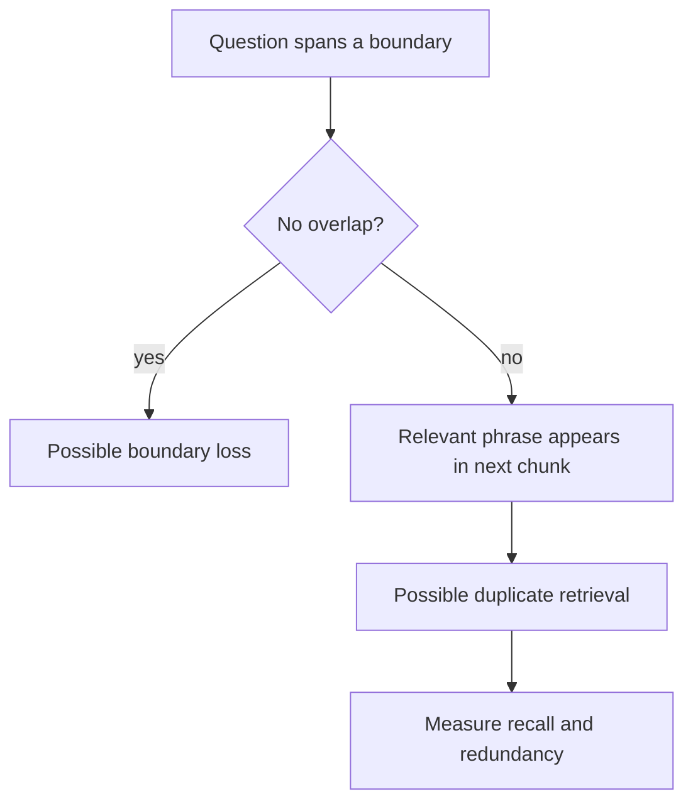

# Chunking

**Status:** implemented

## Beginner definition

Chunking turns one long document into smaller units that a retriever can store and return.
A chunk should be small enough to match a focused question and large enough to preserve the answer's context.
The retriever ranks chunks, not whole ideas, so chunk boundaries directly shape what the model can see.
Overlap copies the end of one chunk into the next to reduce facts being split at a boundary.
More overlap is not automatically better: it increases storage, prompt duplication, and correlated results.

## Vocabulary

- **Chunk:** one retrieval unit containing text and metadata.
- **Boundary:** the location where one chunk ends and another begins.
- **Chunk size:** the target maximum measured here in Python characters, not model tokens.
- **Overlap:** text copied from the previous raw chunk into the next chunk.
- **Separator:** a preferred split marker such as a paragraph break or space.
- **Metadata:** attributes such as title, source, and chunk index carried with the text.
- **Content hash:** a digest used to detect changed persisted text.
- **Boundary loss:** loss of meaning when related words land in separate chunks.

## Mental model

Think of a document as a map and chunks as map tiles.
Tiny tiles are precise but may omit landmarks needed for orientation.
Huge tiles preserve context but make every match broad and expensive.
Overlap is the strip printed on two adjacent tiles; it helps continuity but does not create new information.

## Archon implementation

The source of truth is `backend/app/services/chunker.py`.
`Document` represents an input document.
`DocumentChunk` represents a retrieval unit and exposes `content_hash`.
`canonical_content_hash` computes the first 16 hexadecimal characters of SHA-256 over UTF-8 content.
`RecursiveChunker.SEPARATORS` is `['\n\n', '\n', '. ', ' ', '']`.
`RecursiveChunker.chunk` strips outer whitespace and returns an empty list for empty text.
`RecursiveChunker._split_text` selects the first available preferred separator.
It recursively tries lower-priority separators when a part is still too long.
It falls back to character slices when no non-empty separator works.
`RecursiveChunker._merge_with_overlap` prepends characters from the preceding raw chunk.
Generated IDs are UUID strings and `chunk_index` values are sequential.
Metadata includes `title`, `source`, and the resulting character `chunk_size`.
Caller-supplied document metadata is also copied into each chunk.
`RAGPipeline.ingest_document` currently constructs `RecursiveChunker(chunk_size=500, chunk_overlap=50)`.
`SqlJsonVectorStore.max_chunks_per_document` defaults to 4,096 and bounds persistence batches.

## What the implementation does not imply

The 500/50 defaults are not universally optimal.
A character count is not a tokenizer-aware context budget.
The splitter does not understand headings, tables, code syntax, PDF layout, or semantic topics.
Overlap does not guarantee that every multi-paragraph claim stays together.
A valid content hash proves byte-level consistency, not source truth.

## Quality and metric boundaries

Chunking quality is normally evaluated through downstream retrieval.
**Retrieval relevance** asks whether returned chunks help answer the question.
**Groundedness** asks whether answer claims are supported by supplied evidence.
**Faithfulness** asks whether the answer stays within that supplied context.
**Citation correctness** asks whether a claim's cited evidence exists and supports it.
**Answer relevance** asks whether the final answer addresses the user's question.
A good chunking strategy can improve retrieval relevance without guaranteeing any of the other four.

## Security and failure modes

Apply ownership and project scope during retrieval; metadata labels are not authorization controls.
Treat document text as untrusted data, because it can contain prompt-injection instructions.
Redaction and upload limits belong before chunking so secrets are not multiplied across overlaps.
Excessive overlap can amplify sensitive text and increase deletion work.
Malformed extraction can concatenate columns or headers and create misleading chunks.
Very long separator-free text forces character splits and can cut words or identifiers.
Duplicate chunks can crowd out diverse evidence in top-k results.
Never log raw chunk text merely to diagnose sizes; log bounded safe metadata instead.

## Observability

`RecursiveChunker.chunk` emits the `document_chunked` event.
The event includes `document_id`, safe title metadata, `original_length`, chunk count, and average chunk size.
Track chunk-count distributions by parser and document type.
Track average and high-percentile chunk lengths, overlap ratio, and empty-document rate.
Track duplicate-content-hash rate and top-k source diversity.
Join ingestion measurements to retrieval recall on a labeled question set.
A sudden chunk-count increase can indicate extraction or separator regressions.
Do not treat the event's average size as proof of retrieval quality.

## Alternatives and trade-offs

Fixed token windows align better with model budgets but ignore document structure.
Heading-aware splitting preserves sections but depends on reliable parsing.
Sentence or paragraph splitting is readable but can produce highly variable sizes.
Semantic splitting can follow topic changes but adds model cost and nondeterminism.
Parent-child retrieval searches small chunks and supplies a larger parent context.
Late chunking embeds richer document context before deriving retrieval units.
Table- and code-aware parsers are preferable when layout or syntax carries meaning.

## Lab versus production

In the lab, deterministic character splitting is easy to inspect and test.
The in-repository unit tests establish mechanics, metadata, IDs, and empty-input behavior.
In production, select boundaries with corpus-specific labeled queries and token-cost constraints.
Version the parser, splitter settings, and embedding model together.
Re-index when those versions change, and support rollback to the previous index.
Test multilingual text, OCR noise, tables, huge documents, and deletion behavior.
Monitor whether overlap causes repeated citations or monopolizes the context window.

## Evidence in this repository

- `backend/app/services/chunker.py::RecursiveChunker`
- `backend/app/services/chunker.py::RecursiveChunker.chunk`
- `backend/app/services/chunker.py::RecursiveChunker._split_text`
- `backend/app/services/chunker.py::RecursiveChunker._merge_with_overlap`
- `backend/app/services/chunker.py::canonical_content_hash`
- `backend/app/services/rag_pipeline.py::RAGPipeline.ingest_document`
- `backend/tests/unit/test_rag.py::TestRecursiveChunker.test_short_document_single_chunk`
- `backend/tests/unit/test_rag.py::TestRecursiveChunker.test_long_document_multiple_chunks`
- `backend/tests/unit/test_rag.py::TestRecursiveChunker.test_chunks_have_metadata`
- `backend/tests/unit/test_rag.py::TestRecursiveChunker.test_chunks_have_unique_ids`
- `backend/tests/unit/test_rag.py::TestRecursiveChunker.test_empty_document_no_chunks`
- `backend/tests/unit/test_rag.py::TestRecursiveChunker.test_chunk_index_sequential`

## Exercise

Take a policy document with a heading, two paragraphs, and one sentence whose subject and number are separated by a likely boundary.
Run `RecursiveChunker` with sizes 100, 300, and 500 and overlaps 0 and 50.
For each setting, record chunk count, duplicated characters, and whether the complete sentence is retrievable.
Create five realistic questions and label which chunks are relevant before looking at cosine scores.
Choose a configuration from measured recall and redundancy rather than from chunk count alone.
Then explain why this experiment says nothing by itself about groundedness or answer relevance.

## 30-second interview answer

“Chunking defines the units a RAG system can retrieve. Archon recursively prefers paragraph, newline, sentence, word, and finally character boundaries, then prepends configurable character overlap. Its defaults are inspectable lab choices, not universal optima. I would tune size and overlap against labeled retrieval recall, redundancy, token cost, and document structure, while preserving scope, redaction, hashes, and versioned re-indexing.”

## Self-checks

1. **Does overlap increase the amount of source information?** No; it duplicates existing boundary text.
2. **Is `chunk_size` a token limit in Archon?** No; `RecursiveChunker` measures Python string characters.
3. **What happens to whitespace-only documents?** `RecursiveChunker.chunk` returns no chunks.
4. **Which boundary is preferred first?** A double newline, representing a paragraph boundary.
5. **Does a valid chunk hash prove the claim is true?** No; it only helps verify content integrity.
6. **Can good chunks guarantee faithful answers?** No; retrieval and generation must be evaluated separately.
7. **Why can too much overlap hurt retrieval?** Near-duplicates can consume candidate and prompt slots.
8. **What production evidence is still required?** Corpus-specific retrieval evaluations with real parsers and embeddings.
